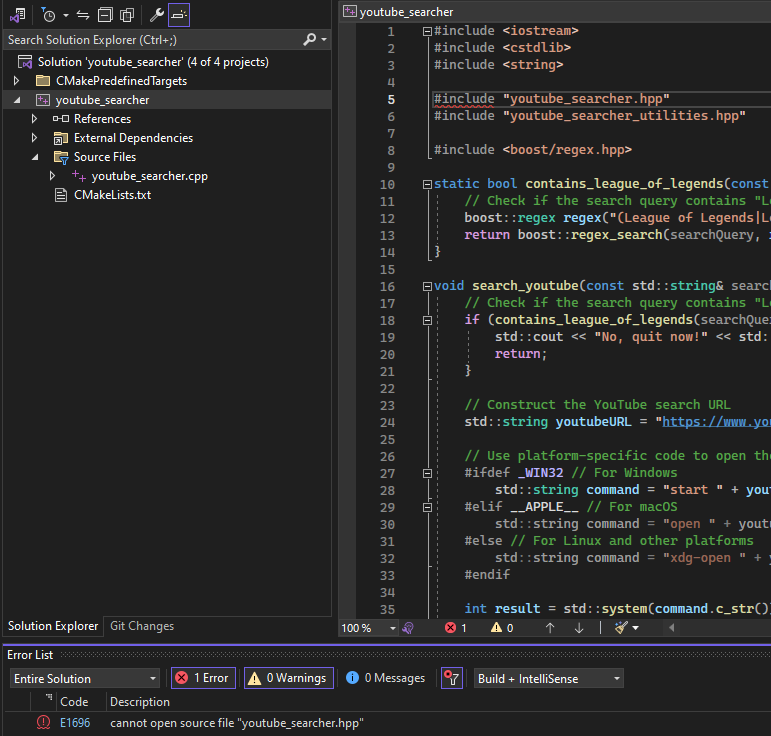
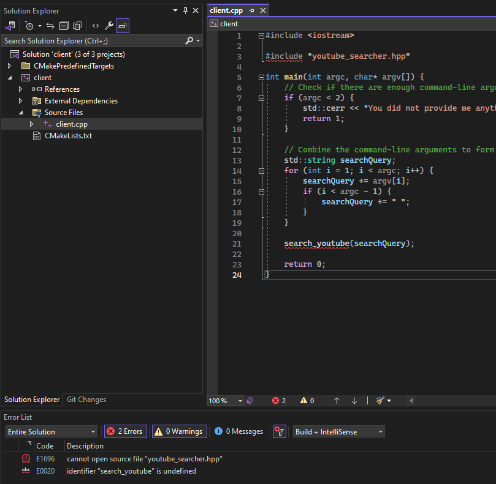

# Creating a Library

In this example I will be creating a library to which a client will be able to find and use it using the CMake command `find_package` using modern CMake approaches. The library is called `youtube_searcher`, which will open youtube and search for the provided text. The library intentionally depends on `boost` just to add an additional dependency, in this case I will be using the regular expression component. The first component of this walkthrough will be creating the library and installing it.

#### Prerequisites

Our library will depend on `boost`, for now I have downloaded the source code and placed it into `C:\local\cmake`. Alongside this I have set the variable `CMAKE_PREFIX_PATH` to `C:\local\cmake` so that it will find the source code inside of `C:\local\cmake\boost`. In this example to utilize `boost`, we need to utilize `FindBoost.cmake`, which is provided inside the installation directory. As of now it is located at `C:\Program Files\CMake\share\cmake-3.27\Modules\FindBoost.cmake`. This is required for `find_package` to create all of the necessary targets which is not provided when downloading the `boost` source code.

Additionally, the targets created for `Boost::regex`, created via `add_library(Boost::regex ALIAS boost_regex)` can be found inside of `C:\...\boost_1_83_0\libs\regex`.

#### Creating A Library 

The `CMakeLists.txt` for our library will be located inside of `youtube_searcher_library\CMakeLists.txt` and here I will analyze and explain each line for creating the library. With modern CMake approaches and the goal of creating a library is to create the ability for any user wanting to use our library to simply use the command `find_package(youtube_searcher REQUIRED)`. The configuration file will be responsible for creating all of the targets which that later be linked to via `target_link_libraries`.

The three files we need when creating a library are,

1. A config file, `youtube_searcherConfig.cmake` which `find_package` will look for.
2. A targets file, `youtube_searcherTargets.cmake` which the config file will utilize and define our targets.
3. A version file, `youtube_searcherConfigVersion.cmake` which defines the library version.

--- 

```cmake
add_library(youtube_searcher STATIC src/youtube_searcher.cpp)
```

The argument `STATIC` configures the output file type of the library target. In this example it will result in the  of a `.lib` file being created.

---

```cmake
target_link_libraries(youtube_searcher
    PRIVATE                                # WE use BOOST, any USERS DO NOT need to `#include` it, therefore, make it PRIVATE.
        Boost::boost)
```

The target previous created via `add_library(youtube_searcher STATIC src/youtube_searcher.cpp)` utilizes the `boost` library, which is found inside `youtube_searcher.cpp`.

```C++
#include <boost/regex.hpp>

...
static bool contains_league_of_legends(const std::string& searchQuery) {
    // Check if the search query contains "League of Legends" or "LoL"
    boost::regex regex("(League of Legends|LoL)", boost::regex::icase); // Case-insensitive search
    return boost::regex_search(searchQuery, regex);
}
```

Therefore, this line of code is necessary to correctly link to the library functions and utilize the `boost` library. Without this, we could not link and utilize the `boost` library.

---

```cmake
target_include_directories(youtube_searcher
    PUBLIC
        $<INSTALL_INTERFACE:include>                            # When installing, look inside the `<prefix>/include` directory for header files.
        $<BUILD_INTERFACE:${CMAKE_CURRENT_SOURCE_DIR}/include>  # When building, look inside `${CMAKE_CURRENT_SOURCE_DIR}/include`
    PRIVATE
        ${CMAKE_CURRENT_SOURCE_DIR}/src                         # We use `youtube_searcher_utilities.hpp`, any users do not, hence, use PRIVATE.
)
```


Include directories usage requirements commonly differ between the **build-tree** and the **install-tree**. The [BUILD_INTERFACE](https://cmake.org/cmake/help/latest/manual/cmake-generator-expressions.7.html#genex:BUILD_INTERFACE) and [INSTALL_INTERFACE](https://cmake.org/cmake/help/latest/manual/cmake-generator-expressions.7.html#genex:INSTALL_INTERFACE) generator expressions can be used to describe seperate usage requirements based on the usage location. Relative paths are allowed within the `INSTALL_INTERFACE` expression and are interpreted as relative to the installation prefix. Relative paths should not be used in `BUILD_INTERFACE` expressions because they will not be converted to absolute.

Here, `$<INSTALL_INTERFACE:include>` tells us to look inside the `${CMAKE_INSTALL_PREFIX}/include` for the include files. This is called for when the property is exported using `install(EXPORT)`. Installing is only done **after building**. Remember that `target_include_directories` is where it will search for locations when performing `#include ...`.

Here, `$<BUILD_INTERFACE:${CMAKE_CURRENT_SOURCE_DIR}/include> ` tells us to look inside `${CMAKE_CURRENT_SOURCE_DIR}/include` **when building**.

The final include statement outside will **always include directories** inside of `${CMAKE_CURRENT_SOURCE_DIR}/src`. This will search for `youtube_searcher_utilities.hpp`

Now, let's go through where problems occur if these were missing.

Now, let's remove `$<BUILD_INTERFACE:${CMAKE_CURRENT_SOURCE_DIR}/include>`.



By removing this line, the target `youtube_searcher` does not include the directory `include` which contains the file `youtube_searcher.hpp`, later leading to the problem of not being able to `#include "youtube_searcher.hpp"`.

Now, if I add this line back so that it builds and instead remove `$<INSTALL_INTERFACE:include>` let's see what happens. Firstly, it builds fine and can be installed. I will use the command `cmake --install . --config Debug --prefix C:/local/cmake/youtube_searcher/` to install it. From there, the user can search for it. Previously, this worked fine. However, with this line missing the following problems will occur.



Instead, we receive problems when users of our library cannot find the header files. Inside the client code we have,

```cmake
target_link_libraries(client
    youtube_searcher
)
```

This means our target `client` is linking towards the target `youtube_searcher`. However, because we no longer have the target `youtube_searcher` with `$<INSTALL_INTERFACE:include>`, therefore the target `youtube_searcher` no longer includes the directory to find `youtube_searcher.hpp` which is found inside `C:\local\cmake\youtube_searcher\include\`. This is because performing `target_link_libraries` will propogate the include directories inside of `youtube_searcher` and allow `client` to use it because of the `PUBLIC` flag previously set. However, because this was no longer set, this will no longer be able to find `youtube_searcher.hpp` and give errors.

---

```cmake
install(TARGETS youtube_searcher
    EXPORT youtube_searcherTargets         # This will generate the file `youtube_searcher.lib` from the target `add_library(youtube_searcher ...)`.
    DESTINATION lib                        # When installed, will go to ${CMAKE_INSTALL_PREFIX}/lib.
)
```

`install(TARGETS ...)` is only relevant when installing. What this line is doing is specifying that we are exporting the target `youtube_searcher`. `EXPORT youtube_searcherTargets` is specifying a name `youtube_searcherTargets` so that it can be used in other `install` commands. `DESTINATION lib` is specifying the installation location. This line is responsible for creating the file `youtube_searcher.lib`.

---

```cmake
install(EXPORT youtube_searcherTargets
    FILE youtube_searcherTargets.cmake      # Generates, youtube_searchersTargets.cmake.
    DESTINATION lib/cmake/youtube_searcher  # When installed, will go to ${CMAKE_INSTALL_PREFIX}/lib/cmake/youtube_searcher.
)
```

Creating `.cmake` files are necessary for `find_package` to utilize our library. This `install(EXPORT)` command is that exports our targets to the file `youtube_searcherTargets.cmake`. In this example, after performing an installiation ` youtube_searcherTargets.cmake` can be found inside the location `C:\local\cmake\youtube_searcher_working\lib\cmake\youtube_searcher`. This file is responsible for creating our `youtube_searcher` targets. Analyzing the file we can see small examples of this such as,

```cmake
add_library(youtube_searcher STATIC IMPORTED)
```

---

`include(CMakePackageConfigHelpers)` is necessary to utilize the future functions `configure_package_config_file` and `write_basic_package_version_file`.

---

```cmake
export(EXPORT youtube_searcherTargets
  FILE ${CMAKE_CURRENT_BINARY_DIR}/cmake/youtube_searcher/youtube_searcherTargets.cmake
)
```

`export(EXPORT)` is done when **building**. This will export the previously defined targets from `EXPORT youtube_searcherTargets` when building. The purpose of this is the use case for wanting to build the library and use it by a client, but not want to install it. I often utilized this when creating my client example, but did not want to install it.

---

```cmake
configure_package_config_file(
    ${CMAKE_CURRENT_SOURCE_DIR}/cmake/youtube_searcherConfig.cmake.in                # Input file.
    ${CMAKE_CURRENT_BINARY_DIR}/cmake/youtube_searcher/youtube_searcherConfig.cmake  # Output file.
    INSTALL_DESTINATION ${CMAKE_INSTALL_LIBDIR}/cmake/youtube_searcher               # When installing, place into `lib/cmake/youtube_searcher`.
)
```

This is the command which allow for the creation of the `youtube_searcherConfig.cmake`. However, I need to make an additional configuration step here. Anyone who uses our library has to also have `boost`, therefore we need to alter our configuration file so that anyone who uses our library will automatically find `boost` too. The `configure_package_config_file` command takes an input file and specifies an output file. Here, I have created my own file `youtube_searcherConfig.cmake.in` which contains commands to find `boost`,

```
find_dependency(Boost)
```

Here, we first need to **build** and **then install**. When building, we create the configuration file and place it inside the build directory. Then, when installing, we that the generated configuration file into `INSTALL_DESTINATION`. `configure_package_config_file` is not responsible for installing the file into `INSTALL_DESTINATION`, this is later done by the `install(FILES ...)` command, but the value set here must be the correct directory where the file will be installed to. This function neither installs the generated file nor affects on its installation.

---

```cmake
write_basic_package_version_file(
    ${CMAKE_CURRENT_BINARY_DIR}/cmake/youtube_searcher/youtube_searcherConfigVersion.cmake
    VERSION ${PROJECT_VERSION}
    COMPATIBILITY AnyNewerVersion
)
```

This command creates the version file.

---

```cmake
install(
    FILES
        ${CMAKE_CURRENT_BINARY_DIR}/cmake/youtube_searcher/youtube_searcherConfig.cmake
        ${CMAKE_CURRENT_BINARY_DIR}/cmake/youtube_searcher/youtube_searcherConfigVersion.cmake
    DESTINATION lib/cmake/youtube_searcher     # Place the FILES into `${CMAKE_INSTALL_PREFIX}/lib/cmake/youtube_searcher`.
  )
```

This is the command which actually installs the files when performing an installation after building. When installing, it will grab the config and version cmake files from the build and place them into the destination specified by `DESTINATION`.

---

```cmake
install(
    FILES include/youtube_searcher.hpp
    DESTINATION include
)
```

Finally, we need to export our header file which any user of our library needs to `#include`. This is done with the same command as above by specifying which file and the destination.

---

When installing the following command is used,

`cmake --install . --config Debug --prefix C:/local/cmake/youtube_searcher/`

This has to be done inside the build directory location as `--install .` specifies the build directory location. `--config Debug` will search for the Debug folder inside the build directory. `--prefix` defines the install prefix location. After running this command, inside of `C:\local\cmake\youtube_searcher` the following will be present,

```
📁 youtube_searcher
    📁 include
        youtube_searcher.hpp
    📁 lib
        📁 cmake
            📁 youtube_searcher
                youtube_searcherConfig.cmake
                youtube_searcherConfigVersion.cmake
                youtube_searcherTargets.cmake
        youtube_searcher.lib
```

#### How To Use the Library

With everything correctly setup and the configuration files generated, we move onto utilizing our library. The `CMAKE_PREFIX_PATH` is set to `C:/local/cmake`. This is the location where we previously installed our library, it is also the location of `boost`. Our configuration files already set up the targets, therefore all we need to do is use `find_package(youtube_searcher REQUIRED)` to find it and

```cmake
target_link_libraries(client
    youtube_searcher
)
```

to link our target towards it. The `youtube_searcher` target already had `target_include_directories` to find `#include "youtube_searcher.hpp"`, therefore we can utilize it and link towards `youtube_searcher.lib` and utilize the library function `search_youtube(searchQuery);`. Building this will produce a `client.exe` that can be ran such as `client.exe funny video 123`, which will open up youtube and perform the search.

The key point of this modern cmake approach is that if the library was created correctly, the only thing any user needs to do is run `find_package` and the configuration file will setup all of the targets, dependencies, variables etc...
