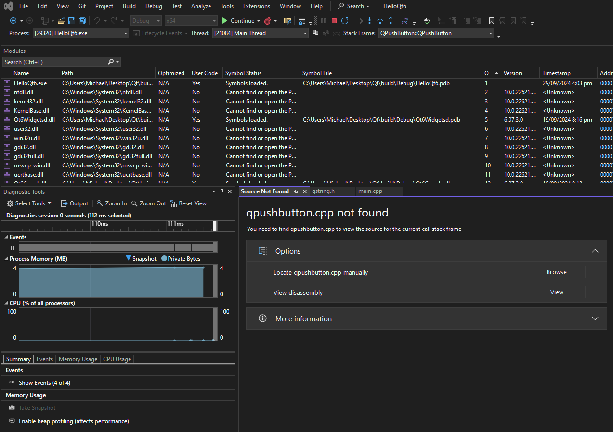

# Qt with CMake

This exercise has several primary goals,

1. Setup an environment that allows to develope in Qt C++ using CMake
2. Create an executable using CMake to link towards Qt `.dll` files
3. Debug into the Qt `.dll` files by using the debug symbols (`.pdb` files) files and Qt source code.


# Qt Setup using CMake

This example will reference the `CMakeLists.txt` and `main.cpp` located inside the `./example` directory.

The first thing we need to do is setup and install Qt, so that CMake can search for it. To do this, we need to use the Qt online installer and have a Qt account.


After running the installer, we can observe the default installation location is `C:\Qt`.


Each different directory are the different binaries of the compiled Qt source code. In this example I will be using `Visual Studio 17 2022` as the CMake generator, therefore the binaries we're after after the Qt binaries that were compiled using MSVC2022. MSVC2022 is binary compatible with MSVC2019, therefore, we will be linking towards the binaries within the `msvc2019_64` directory.

Now, in this example I will be using CMake. For `find_package` to be successful, CMake must find the Qt binaries and targets. There are different ways to tell CMake about Qt, but the most common and recommended approach is to set the CMake cache variable `CMAKE_PREFIX_PATH` to include the Qt6 installation prefix. Note that Qt Creator will handle this transparently for you. Therefore, because our example we are only using CMake we will need to set this.


This is configured to allow `find_package` to find the CMake configurations. The `find_package` search pattern searches for the CMake files inside of `C:\Qt\6.7.3\msvc2019_64\lib\cmake\...`. After execution, it should successfully run and set other necessary CMake variables.


Now, let's disect the `CMakeLists.txt` to understand how this comes together.

```CMake
cmake_minimum_required(VERSION 3.16)

project(HelloQt6 VERSION 1.0.0 LANGUAGES CXX)

set(CMAKE_CXX_STANDARD 17)
set(CMAKE_CXX_STANDARD_REQUIRED ON)

find_package(Qt6 REQUIRED COMPONENTS Widgets)

qt_standard_project_setup()

qt_add_executable(HelloQt6 src/main.cpp)

target_link_libraries(HelloQt6 PRIVATE Qt6::Widgets)

add_custom_command(TARGET HelloQt6 POST_BUILD
    COMMAND "${WINDEPLOYQT_EXECUTABLE}"
            --verbose 1
            \"$<TARGET_FILE:HelloQt6>\"
    COMMENT "Deploying Qt libraries using windeployqt for HelloQt6 ..."
)
```


---

```CMake
cmake_minimum_required(VERSION 3.16)
```

`cmake_minimum_required()` specifies the minimum CMake version that is required to successfully configure the project.

---

```CMake
project(HelloQt6 VERSION 1.0.0 LANGUAGES CXX)
```

`project()` sets a project name and the default project version. The `LANGUAGES` argument tells CMake that the program is written in C++.

---

```CMake
set(CMAKE_CXX_STANDARD 17)
set(CMAKE_CXX_STANDARD_REQUIRED ON)
```

Qt 6 requires a compiler supporting C++ version 17 or newer. Enforcing this by setting the `CMAKE_CXX_STANDARD` and `CMAKE_CXX_STANDARD_REQUIRED` variables will let CMake print an error if the compiler is too old.

---

```CMake
find_package(Qt6 REQUIRED COMPONENTS Widgets)
```

This tells CMake to look up Qt 6 and import the Widgets module. There is no point in continuing if CMake cannot locate the module, so we set the `REQUIRED` flag to let CMake abort in this case.

If successful, the module will set some CMake variables documented in [Module variables](https://doc.qt.io/qt-6/cmake-variable-reference.html#module-variables). It furthermore imports the `Qt::Widgets` target that we will use below.

For `find_package` to be successful, CMake must find the Qt installation. There are different ways you can tell CMake about Qt, but the most common and recommended approach is to set the CMake cache variable `CMAKE_PREFIX_PATH` to include the Qt 6 installation prefix, this was set in our CMake GUI. Note that Qt Creator will handle this transparently for you.

---

```CMake
qt_standard_project_setup()
```

The `qt_standard_project_setup()` command sets project-wide defaults for a typical Qt application.

Among other things, this command sets the `CMAKE_AUTOMOC` variable to `ON`, which instructs CMake to automatically set up rules so that Qt's Meta-Object Compiler (moc) is called transparently, when required.

---

```CMake
qt_add_executable(HelloQt6 src/main.cpp)
```

`qt_add_executable` tells CMake that we want to build an executable (so not a library) called `HelloQt6` as a target. It is a wrapper around the built-in `add_executable` command and provides additional logic to automatically handle things like linking of Qt plugins in static Qt builds, platform-specific customization of library names and so on.

The target should be build from the C++ source fike `main.cpp`.

Typically, you do not list header files here. This is different from `qmake`, where header files need to be explicitly listed so that they are processed by the Mega-Object Compiler (moc).

---

```CMake
target_link_libraries(HelloQt6 PRIVATE Qt6::Widgets)
```

`target_link_libraries` tells CMake that the `HelloQt6` executable makes use of `Qt Widgets` by referencing the `Qt6::Widgets` target imported by the `find_package` call above. This will not only add the right arguments to the linker, but also make sure that the right include directories, compiler definitions are passed to the C++ compiler. The `PRIVATE` keyword is not strictly necessary for an executable target, but it is good practice to specify it. If the target was a library rather than an executable, then either `PRIVATE` or `PUBLIC` should be specified (`PUBLIC` if the library mentions anything from `Qt6::Widgets` in its headers, `PRIVATE` otherwise.)

---

```CMake
add_custom_command(TARGET HelloQt6 POST_BUILD
    COMMAND "${WINDEPLOYQT_EXECUTABLE}"
            --verbose 1
            \"$<TARGET_FILE:HelloQt6>\"
    COMMENT "Deploying Qt libraries using windeployqt for HelloQt6 ..."
)
```

Because we're using CMake instead of Qt Creator, we have additional problems. One of them is that Visual Studio will compile and create our executable, however, we do not by default package the Qt `.dll` files near our produced executable. Therefore, when attempting to execute the `HelloQt6.exe` directly when the Qt `.dll` files are not added to our environment `PATH`, the `.dll` files are not found and thus, we cannot run out executable.

Qt supplies us with `windeployqt.exe`. When running this executable against our produced executable (`windeployqt.exe HelloQt6.exe`), Qt will populate the directory with the essential `.dll` files to run our `HelloQt6.exe`. To automatically run this executable after the build, we utilize `add_custom_command(TARGET HelloQt6 POST_BUILD ...)`.

Thankfully, `find_package` for Qt6 will configure a variable for us to locate and run the executable easily.


Now, what we need to do it run this command after building our project on our executable. This is what `POST_BUILD` means, within `add_custom_command`.

Here is the breakdown,

- **add_custom_command** - This function adds a custom command to a target, which allows CMake to execute additional commands during specific parts of the build process. It uses the [second signature](https://cmake.org/cmake/help/latest/command/add_custom_command.html#build-events) which is tied to the `TARGET`.

- **TARGET HelloQt6** - This specifies that the custom command is tied to the `HelloQt6` target.

- **POST_BUILD** - This indicates that the custom command should be executed after the `HelloQt6` target is successfully built. This is one of the options for specifying when the custom command should run, (e.g., `PRE_BUILD`, `PRE_LINK`, etc...)

Altogether this means we will run a command after the build, the specified command is, `COMMAND "${WINDEPLOYQT_EXECUTABLE} ...`. This means it will run `windeployqt.exe --verbose1 HelloqQt6.exe`.

The way it finds our generated executable is by `\"$<TARGET_FILE:HelloQt6>\"`. This is a [informational generator expression](https://cmake.org/cmake/help/v3.0/manual/cmake-generator-expressions.7.html#informational-expressions) in CMake that evaluates to the full path of the output file.

Finally, this will place the command into Visual Studio to perform after the build step. Remember, CMake is a build generator tool, it is not the responsibility of CMake to do the building. This is visible in Visual Studio under the `Post-Build Event` section of the project properties,


This will place the required Qt6 library `.dll` files into the same directory as our `HelloQt6.exe`, allowing for execution.


# Debugging into Qt

The next goal is to successfully debug into Qt, meaning, we want to add breakpoints into our code that allows us to enter the Qt source code and see the behaviour. 

To do this we need several requirements,

1. The debug symbols (`.pdb` files) for binaries we are using.
2. The Qt source code for the exact version we're using.

The Qt version I am using here is `6.7.3`.

We can observe that during our installation, the `.pdb` files are available for us.


This means, we now need the source code. This was also installed and placed into the `C:\Qt\6.7.3\Src` folder for us. Alternatively, it's always available publically on the Qt5 GitHub repository.

From here, execute Visual Studio in debug mode while also having a breakpoint on the line to create the `QPushButton`. The goal here is to step inside and observe the `QPushButton` constructor.


Now, as of now we can observe that clicking "step into" does not enter the `QPushButton` constructor as we would want. The most common reason for not stepping into library code is that the debug symbols (`.pdb` files) for the library have not been loaded correctly. To verify this, run in debug mode by clicking `Local Windows Debugger` and then click `Debug -> Windows -> Modules.`


Unfortunately for us, we can observe that the debug symbols have not been correctly loaded.


This means, we need to retrieve and place the `.pdb` files alongside our `.dll` files. Observing the `windeployqt.exe` help, we can see that their exists a flag to do this for us.


Therefore, we can modify our `CMakeLists.txt` to include that flag and become.

```CMake
add_custom_command(TARGET HelloQt6 POST_BUILD
    COMMAND "${WINDEPLOYQT_EXECUTABLE}"
            --verbose 1
            --pdb
            \"$<TARGET_FILE:HelloQt6>\"
    COMMENT "Deploying Qt libraries using windeployqt for HelloQt6 ..."
)
```

Now, rerunning our build we can now observe that their are the essential debug symbols alongside our `.dll` files.


From here, let's rerun and debug mode and verify that the debug symbols have been loaded.


Finally, this should be sufficient enough to attempt to now `Step Into` the `QPushButton` constructor.



Unfortunately, one more step! We need the debug symbols and the source code files! Now, Visual Studio will prompt and ask us where the `.cpp` files are located. The source code was provided during installation at the top level directory, `C:\Qt\6.7.3\Src`. In this example, the `qpushbutton.cpp` was located at `C:\Qt\6.7.3\Src\qtbase\src\widgets\widgets`.

After selecting the file, we can now enter the Qt source code.


To recap, when debugging we need to,

1. Get the debug symbols (`.pdb` files) for our `.dll` files and make sure they're loaded and found by Visual Studio. In this example I added `--pdb` to the `windeployqt.exe` in the `POST_BUILD` event to provide them near our executable.
2. Get the source code and point Visual Studio towards it. This needs to be the source code matching the version of Qt which was provided when installed.
