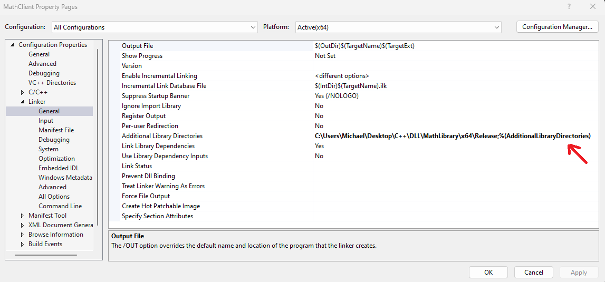

<div align="center">
    <h1> How CMake target_link_libraries Changes Visual Studio</h1>
</div>

CMake is a build generation tool. It does not compile code itself. It is therefore interesting to see an example of how a CMake function translates these to a generation tool. In this example I will be analysing how the CMake function `target_link_libraries` affects the configurations of Visual Studio to accomplish the task of linking.

Now, when using a library their are three main steps to remember. [Taking from my previous notes](https://github.com/Michael-Cowie/Notes/blob/main/Build/DLL_libraries.md#using-the-library), these are

1. Find the header files. This is done from the Visual Studio `Additional Include Directories`


2. Specify that we use the `.lib` file and specify which directory it is located in.




In the previous example, we listed `MathLibrary.lib` in the `Additional Dependencies` field and to tell Visual Studio to search for it by the directory listed in `Additional Library Directories.

Now, the CMake example I will be using is inside the `example` directory. Here, I have a simple project and utilize `target_link_libraries` via the following line,

```CMake
target_link_libraries(main simplelib)
```

The library target was `simplelib` was created from.

```CMake
add_library(simplelib simplelib.cpp)

target_include_directories(simplelib PUBLIC ${CMAKE_CURRENT_SOURCE_DIR})
```

The call `target_include_directories` will configure where to search for include files. Opening the generated solution file we will analyze the same properties that we did manually and instead see how CMake populated the properties.

Firstly, we can see that the field `Additional Include Directories` is populated to the directory set by `target_include_directories`. This is where we have told it to search for the header file `simplelib.h`. This means, when we have `#include "simplelib.h"` within our code, it will search this directory for a `simplelib.h` file.


Secondly, we will analyze the property `Additional Dependencies`. Within this example we can see the value is set to `..\lib\Debug\simplelib.lib`. Unlike the previous example where it simply listed the file name within this field and specified the location using the additional field `Additional Library Directories`, it is specifying the file directly using a relative path.

In Visual Studio, when specifying a path to a library file in the `Additional Dependencies` setting, the relative path is typically relative to the project file (`.vcxproj`) that contains the setting.


Looking inside the build directory for the `main` target, within the `lib` we can find the `main.vcxproj` file. Now, using the path `..\lib\Debug\simplelib.lib` relative to `main.vcxproj` we can find the linking to the library file.


Here, inside the `build` directory. The `lib` folder corresponds to the `lib` folder from our source code. Likewise for the `src` folder. The structure of the folders are `build/<source code folder name>/<Build Type (e.g. Release, Debug)/...>`. Inside of the `<Build Type>` folder contains the respective build result, i.e. `build\lib\Debug` contains `simplelib.lib` alongside `simplelib.pdb`. Additionally, `build\src\Debug` will contain `main.exe` and `main.pdb`.

Because CMake is a build generator tool, it's important to understand that is configures the tools. It does not do any building itself. In this example, I built the resulting `.lib` and `.exe` files to illustrate the locations. Here, the goal was to understand that all `target_link_libraries` will accomplish is to configure Visual Studio with the correct configurations to allow building of the project. Here, Visual Studio is one example, their are many generators that CMake can allow for.