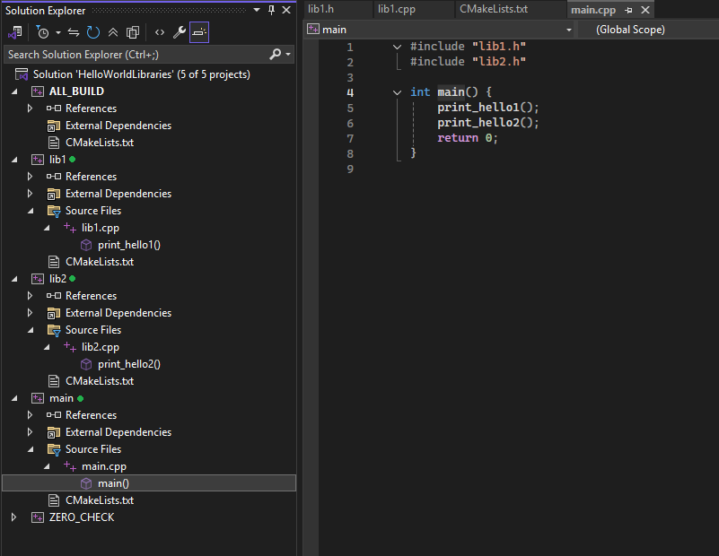
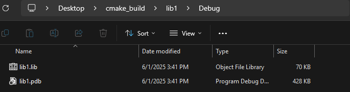
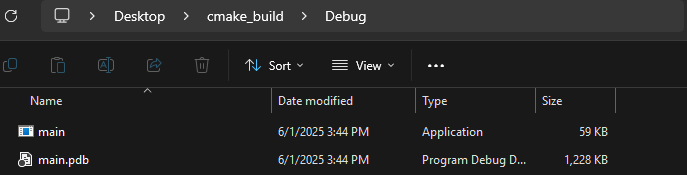
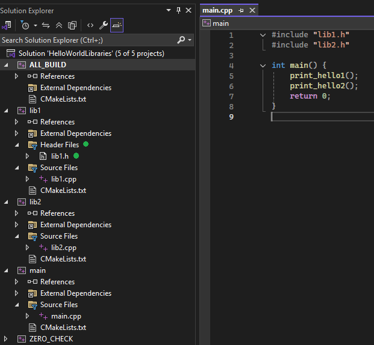

<div align="center">
    <h1> How CMake Targets Changes Visual Studio</h1>
</div>

CMake is a build generation tool. It does not compile code itself. It is therefore interesting to see an example of how CMake translates its targets for use in Visual Studio. In this example I will be analysing how the CMake targets affects the configurations inside Visual Studio. This example will be using the setup in the `example` directory.

<div align="center">
    <h1> Solution Explorer </h1>
</div>

What we're seeing in Visual Studio are **CMake targets represented as Solution Projects** in the Visual Studio Solution Explorer.

<div align="center">
    
</div>

The CMake script will generate 3 "sections" from our targets. What we're seeing in Visual Studio are **CMake targets represented as Solution Projects** in the Visual Studio Solution Explorer.

- `add_library(lib1 ...)` → Creates a project for `lib1`
- `add_library(lib2 ...)` → Creates a project for `lib2`
- `add_executable(main ...)` → Creates the project for `main`

Each of these shows up as a **logical project** in the Solution Explorer, just like a traditional Visual Studio `.vcxproj`, but they're generated dynamically from your CMake setup.

#### Solution Project Interaction

The project in the tree can achieve multiple things,

1. `Right Click > Build/Rebuild/Clean` - Targets the specific CMake target (project).

2. `Set as Startup Project` - For `main`, so you can run it via F5. This is the default "build" when click "run" or the green arrow icon in Visual Studio.

3. `Properties (Read-only)` - Let you inspect how CMake configured things, though you can't directly edit them like traditional Visual Studio projects.

Other Visual Studio specific events includes,

1. `ALL_BUILD` - A meta-target that builds everything in your CMake project. Similar to `make all`.

2. `ZERO_CHECK` - A CMake-generated utility target that checks if `CMakeLists.txt` changed and triggers regeneration if needed.

<div align="center">
    <h1> Visual Studio Structure Terminology </h1>
</div>

#### Solution - `.sln`

A **solution is a container**  for one or more **projects**. It doesn't contain code itself, but organizes projects and manages their build configuration collectively. The solution is like a workspace. It lets Visual Studio open and manage multiple projects as a single unit.

The `.sln` file doesn't contain code, it just defines

1. Which projects are included.
2. The build order.
3. Project dependencies.
4. Some configuration settings (Debug/Release, x64/x86, etc...).

It's what allows you to "Build Solution" and compile all targets in dependency order.

#### Projects - `.vcxproj`

Every time you declare a **target** in CMake,

```CMake
add_library(lib1 lib1.cpp)

add_executable(main main.cpp)
```
Each `add_library` or `add_executable` in CMake creates a target and Visual Studio represents each of these targets as a project in the Solution Explorer. So in this example, `lib1`, `lib2` and `main` are CMake targets, represented as Visual Studio projects.

CMake will generate a corresponding **Visual Studio project**, which gets a `vcxproj` file. These are standard MSBuild projects. They,

1. Know how to compile your source files.
2. Know which include directories and libraries to use.
3. Know what the output files (e.g., `.exe` and `.lib`) should be.
4. Know the target name, type (exeuctable or static/shared lib), dependencies and settings.

So in Visual Studio,

- `lib1` is a static or dynamic library.
- `main` is an application project.
- Each of these can be built, rebuilt or cleaned independently.

Each project can be built with `Right Click > Build`. For libraries, this will generate the `.lib` file. We can build `lib1` indepndent of `lib2` and `main` because its an isolated library. Here rebuilding `lib1`, will not rebuild anything that uses it.

<div align="center">
    
</div>

However, when we `Right Click > Build` the `main`, it has `lib1` and `lib2` as dependencies. It will therefore build them and then build the `main.exe`.

<div align="center">
    
</div>

<div align="center">
    <h1> Header Files </h1>
</div>

When CMake generates a Visual Studio solution, it **only includes files that are explicitly listed in `add_executable` or `add_library`** commands. These typically include `.cpp` files (sources) and **do not include header files unless you manually list them**.

So this,

```CMake
add_library(lib1 lib1.cpp)
```

Does **not include** `lib1.h`, even if its in the same directory. This is intentional because,

- CMakes philosophy is that only **build relevant files** (compiled source files) should be listed.
- Header files are often included using `#include` but not compiled directly, so they're optional from the build systems perspective.
- Visual Studio only shows file that CMake explicitly tells it about when using generated `.vcxproj` files.

From CMake’s point of view, headers are not compiled directly, so CMake does not require them to be explicitly listed in `add_library()` or `add_executable()` unless you want them to show up in Visual Studio. They’re “optional” in the build script, **not in the language or actual build process**. Headers are still required for compilation, but CMake doesn't compiler headers.

#### How To Make Header Files Visible

In your `CMakeLists.txt` for each library or executable, add the headers explicitly.

```CMake
add_library(lib1 lib1.cpp lib1.h)
```

<div align="center">
    
</div>

This tells CMake, `These headers are part of the project and should show up in Visual Studio`. This changes make the headers visible under "Header Files" in Solution Explorer.
