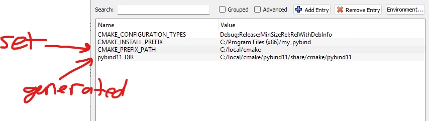

# `find_package`

Many software projects provide tools and libraries that are meant as building blocks for other projects and applications. CMake projects that depend on outside packages locate their dependencies using the `find_package `command. A typical invocation is of the form,

```CMake
find_package(<Package> [version])
```

The command works in two modes, **Module mode** and **Config mode**. 

[Module mode](https://cmake.org/cmake/help/latest/command/find_package.html#search-modes) searches for a file called `Find<PackageName>.cmake`.  It will first search in `CMAKE_MODULE_PATH`.

[Config mode](https://cmake.org/cmake/help/latest/command/find_package.html#search-modes) searches for a file called `<lowercasePackageName>-config.cmake` or `<PackageName>Config.cmake`.

A more detailed search path is desired in the [official documentation](https://cmake.org/cmake/help/latest/command/find_package.html#config-mode-search-procedure).

With newer versions of CMake `find_package` will search in Module Mode and then attempt to search in Config Mode if it does not find the desired file.

We need to tell CMake where to look for each package, unless they're installed in the "standard location", which probably depends on your specific OS, package manager, studio environment, etc...

CMake comes with a bunch of built-in "Find Modules" for many common build dependencies. They are infact just CMake scripts and you can find them inside the installation directory.

Using an example of trying to find `pybind11` the CMake code could appear as,

```CMake
find_package(pybind11 REQUIRED)
```

Now, where will CMake look? Well, it will look in some default locations but if we fetched this using `pip`, how would it know? One easy way to get around this when developing locally could be to all place them inside a directory such as `C:\local\cmake\...` and set that as `CMAKE_PREFIX_PATH`. When using the command line this could be ran as,

```bash
cmake .. <blah blah> -DCMAKE_PREFIX_PATH=C:/local/cmake
```

However, using the CMake GUI this could be achieved as,



In this example, `pybind11_DIR` is generated. However, a different approach with the same outcome could be to set `pybind11_DIR` to the directory where our `pybind11` resides. This will allow CMake to find our configuration files when calling `find_package.` The search variables and search locations are better desired in the [official documentation](https://cmake.org/cmake/help/latest/command/find_package.html#config-mode-search-procedure), but what needs to be understood is that non-standard locations need to be specified for CMake to find the configuration file.