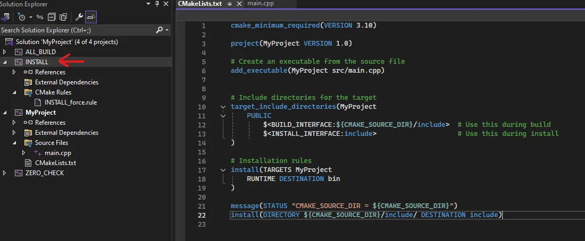
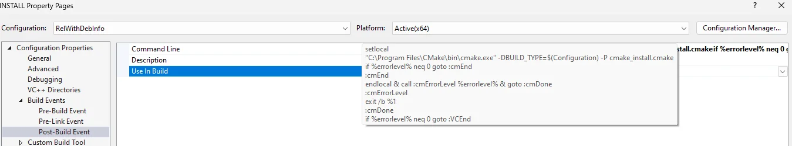

# CMake Lifecycle Overview

1. **Configuration** - CMake processes the `CMakeLists.txt` file and generates the build system (e.g., Makefiles or Visual Studio projects).

2. **Building** - The build system generated in the configuration phase is used to compile the source code into binaries (executables, libraries, etc...)

3. **Installation** - The build system, based on instructions from CMake, installs the binaries, libraries, headers, and other necessary files to the designated installation directories.

# Installation

The terminology around the "installation" phase of a CMake project can be a bit tricky because, technically, **CMake itself doesn't directly perform the installation** - it's the underlying build system (such as Make, Ninja or Visual Studio) that invokes CMake in script mode (`cmake -P`). The point is its being launched by the build system, not by the CMake instance that performed the configuration. 

During installation, the build system will invoke CMake in script mode on `cmake_install.cmake`. Essentially executing, `cmake -P -DBUILD_TYPE=Debug cmake_install.cmake`. When CMake is run in "script" mode, it processes a CMake script file using the `-P` option. This mode is different from the usual build system generation mode. Instead of generating a build system, CMake executes the commands in the specified script file directly. This allows you to use CMake as a general-purpose scripting language for tasks like file manipulation, running commands, or setting up environments.

CMake generates the installation information at configuration time, but the actual copying or relocation of files happens during the **installation** phase when `make install` or `cmake --install` is executed. The installation logic is defined in `CMakeLists.txt` using commands like `install(TARGETS ...)`, `install(FILES ...)`, etc. These commands define what files will be copied and where.

`cmake_install.cmake` is a script generated by CMake when you run the CMake configuration step. It contains instructions on how to install your project, but it doesn't contain all the detailed target-specific configuration. The file contains a list of install commands, such as copying binaries, headers and libraries, but it doesn't directly contain detailed target information (like include paths). Instead, it relies on install commands defined in `CMakeLists.txt`.

# Installation Example

Prior to installation we need to perform,

1. **Configuration** - This is done using the command `cmake -S . -B build` where the flag `-S` specifies the location to `CMakeLists.txt` (`.` is the current directly). Finally, `-B` specifies the output directory name.

2. **Build** - Building is done using the command `cmake --build build`, where `--build` is provided a directory. In this case, it's `build` from the previous command. If you're using a multi-configuration generator (e.g. Visual Studio) then you will need to also use `--config` to specify the configuration type (default is `Release`).

3. **Installation** - Finally, installation is done using the command `cmake --install build`. This will invoke the underlying build system to install the build.

Let's explain first by observing the example located in the `example` directory. The key components of the installation are the lines,

```CMake
target_include_directories(MyProject
    PUBLIC
        $<BUILD_INTERFACE:${PROJECT_SOURCE_DIR}/include>  # Use this location during local build
        $<INSTALL_INTERFACE:include>                      # Use this location after installation 
)

install(TARGETS MyProject
    RUNTIME DESTINATION bin
)

install(DIRECTORY ${PROJECT_SOURCE_DIR}/include/ DESTINATION include)
```

By including these install statements, CMake will generate the `cmake_install.cmake` file. Some important lines within the file to understand the underlying goals in this file are,


```CMake
if(NOT DEFINED CMAKE_INSTALL_PREFIX)
  set(CMAKE_INSTALL_PREFIX "C:/Program Files (x86)/MyProject")
endif()
```

```CMake
if(CMAKE_INSTALL_COMPONENT STREQUAL "Unspecified" OR NOT CMAKE_INSTALL_COMPONENT)
  file(INSTALL DESTINATION "${CMAKE_INSTALL_PREFIX}/include" TYPE DIRECTORY FILES "C:/Users/Michael/Desktop/Playground/Build_Install/include/")
endif()
```

Additionally, we need to understand that the command `cmake --install build` will invoke the underlying build system. For example, Make is a general purpose workflow program, usually used for compilation. But it can be used for anything. When you do something like `make all`, the Make program executes a rule named `all` from a file in the current directory called `Makefile`. When you do `make install`, the make program takes the binaries from the previous step and copies them into some appropiate locations so that they can be assessed by invoking `cmake -P`.

Additionally, within Visual Studio it creates an `INSTALL` project with a `Post-Build Event`.




Here, we can see that Visual Studio invokes `cmake -P` when installing.

## Installation Destination

CMake knows where to install files based on the `install()` commands provided in the `CMakeLists.txt` file. The behaviour of these commands is influenced by variables that control the installation directories.

The `install()` command is used to specify what files, targets, or directories to install and where to install them.

```CMake
install(TARGETS my_executable DESTINATION bin)

install(FILES my_config.h DESTINATION include)
```

- `TARGETS my_executable` tells CMake that you're installing a target (like an executable or a library).

- `FILES my_config.h` tells CMake you're installing a file (in this case, a header file).

- `DESTINATION bin` or `DESTINATION include` specifies where the files or target should be installed **relative to the installation prefix**.

CMake installs files relative to the installation prefix, which is a directory that acts as the base for all installation destinations. The default installation prefix is usually `/usr/local` on UNIX systems and `C:/Program Files` on Windows. 

The `DESTINATION` argument in the `install(TARGETS)` command specifies the directory relative to `CMAKE_INSTALL_PREFIX`. If the installation prefix is `C:/Program Files` and you specify `DESTINATION bin`, CMake installs the file in `C:/Program Files/bin`. You can set absolute paths in `DESTINATION` if you don't want them relative to `CMAKE_INSTALL_PREFIX`.

You can override the default by settings the `CMAKE_INSTALL_PREFIX` variable.

Several default installation directories are influenced by standard variables,

- `CMAKE_INSTALL_PREFIX` - The root directory where everything is installed.

- `CMAKE_INSTALL_BINDIR` - Directory for executables (default is `bin`).

- `CMAKE_INSTALL_LIBDIR` - Directory for libraries (default is `lib`).

- `CMAKE_INSTALL_INCLUDEDIR` - Directory for headers (default is `include`).

Remember in CMake that the first argument determines the functionality of `install`, `install(TARGETS)` specifies the [command that CMake](https://cmake.org/cmake/help/latest/command/install.html#targets) will run. Therefore, if we had an example such as,

```CMake
install(TARGETS MyProject
    EXPORT MyProjectTargets
    LIBRARY DESTINATION lib
    ARCHIVE DESTINATION lib
    RUNTIME DESTINATION bin
)
```
From the documentation it tells us the format,

```CMake
install(TARGETS <target>... [EXPORT <export-name>]
        [RUNTIME_DEPENDENCIES <arg>...|RUNTIME_DEPENDENCY_SET <set-name>]
        [<artifact-option>...]
        [<artifact-kind> <artifact-option>...]...
        [INCLUDES DESTINATION [<dir> ...]]
        )
```

where `<artifact-option>...` group may contain,

```
[DESTINATION <dir>]
[PERMISSIONS <permission>...]
[CONFIGURATIONS <config>...]
[COMPONENT <component>]
[NAMELINK_COMPONENT <component>]
[OPTIONAL] [EXCLUDE_FROM_ALL]
[NAMELINK_ONLY|NAMELINK_SKIP]
```

Each `<artifact-kind> <artifact-option>...` group applies to Output Artifacts of the specified artifact kind.

Here, `<artifact-kind>` are the specified `EXPORT`, `LIBRARY`, `ARCHIVE` and `RUNTIME`. The series of matching expressions we are matching with is `[<artifact-kind> <artifact-option>...]...`. Here, the triple dot indicates that the preceding argument can be repeated multiple times.

## Installation of Header files

Let's walk through and understand an example where header file locations are conditionally included,

```CMake
target_include_directories(MyProject
    PUBLIC
        $<BUILD_INTERFACE:${PROJECT_SOURCE_DIR}/include>  # Use this location during local build
        $<INSTALL_INTERFACE:include>                      # Use this location after installation 
)
```

When we see this conditional it means the following,

- If we're building, the directory we want our target to include is located at `${PROJECT_SOURCE_DIR}/include`.

- If we're an installed version of the project, the include directory is `${CMAKE_INSTALL_PREFIX}/include`.

When the project is built, the final product is ready for execution. The executable that was generated can be ran within the installed directory, so what purpose does `$<INSTALL_INTERFACE:include>` serve and when is it used?

The installed header files are not needed to run the final build, however, they are critical if you plan to allow **other developers or projects** to use your libraries. The installed headers provide the necessary interface for other projects to compile and link against your libraries.

During the **build phase**, the `target_include_directories` command ensures that your project finds the header files needed to compiler the source code. During the **installation phase**, the installed headers are **needed by downstream consumers** of your library, not by the original project itself. Now, consumers of the library need to utilize and our `CMakeLists.txt` and will now direct the intended location for the directory where the `include` files are located. The library should be setup to be utilized by `find_package`, which is not done in this example.

## Installation Summary

Installation in CMake starts when the build system invokes the command `cmake -P` on the `cmake_install.cmake` file. Installation in our example is **doing nothing than moving files to the destination prefixed by the `CMAKE_INSTALL_PREFIX` location**. 

The evaluated `include` directory location using the generators `BUILD_INTERFACE` and `INSTALL_INTERFACE` such as in the example,

```CMake
target_include_directories(MyProject
    PUBLIC
        $<BUILD_INTERFACE:${PROJECT_SOURCE_DIR}/include>  # Use this location during local build
        $<INSTALL_INTERFACE:include>                      # Use this location after installation 
)
```

is used to correctly identify the location of the directory where we want to set the `target_include_directories` on the provided target. The `${PROJECT_SOURCE_DIR}/include` will be used when building, primarily used by developers when building locally. Whereas the `include` directory will be evaluated as `${CMAKE_INSTALL_PREFIX}/include`, primarily used by downstream users of the library.
