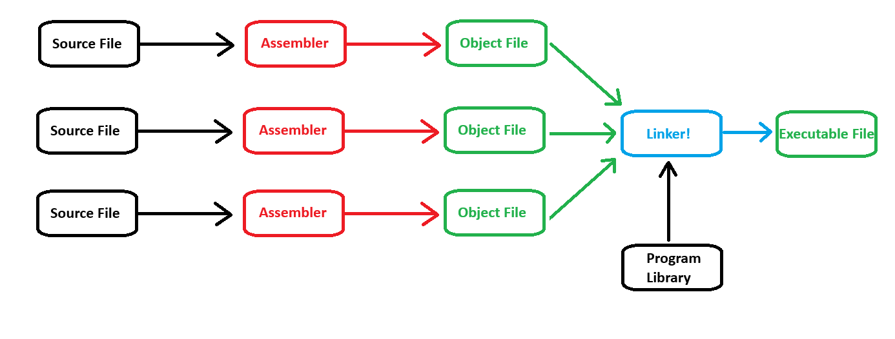

# Compilation Process

We write our Code as simple text, but we need some way to transform this text into an application that our computer can actually understand and run. When going from text form to an actual executeable binary we basically have two main operations that need to happen. 

The compilation of a C++ program involves three steps.

1. **Preprocessing:** The preprocessor takes a C++ source code file and deals with the `#include`s, `#define`s and other preprocessor directives. The output of this step is a *pure* C++ file without pre-processor directives.
2. **Compilation:** The compiler takes the pre-processor's output and produces an object file from it. What the compiler actually needs to do is take our text file and convert them into an intermediate format called an **object file**.
3. **Linking:** The linker takes the object files produced by the compiler and produces either a library or an executeable.

# Preprocessing

The preprocessor handles the *preprocessor directives*, like `#include` and `#define`. It is agnostic of the syntax of C++, which is why it must be used with care.

It works on one C++ source file at a time by replacing `#include` directives with the content of the respective files (which is usually just declarations), doing replacement of macros (`#define`), and selecting different portions of text depending of `#if`, `#ifdef` and `ifndef` dirctives. When we have something like `#define <iostream>` the contents of `iostream.h` are **literally** being copied from `iostream.h` and being placed directly into your file, which is why the file size of the file increases considerably after the preprocessing stage, it is being the contents inside of `iostream.h` are so large.

For example, if we have a `EndBrace.h` with the only contents being
```
}
```
and use it as,

```C++
int Multiply(int a, int b){
    return a * b
#include "EndBrace.h"
```
This would compile successfully, because all the compiler did it take the `}` from `EndBrace.h` and place it directly where we had `#include "EndBrace.h"`

The preprocessor works on a stream of preprocessing tokens. Macro substitution is defined as replacing tokens with other tokens (the operator `##` enables merging two tokens when it makes sense).

After all this, the preprocessor produces a single output that is a stream of tokens resulting from the transformations described above. It also adds some special markers that tell the compiler where each line came from so that it can use those to produce sensible error messages.

Some errors can be produced at this stage with clever use of `#if` and `#error` directives.

If you wish to see the preprocessed files, they can be viewed using `cpp hello.c > hello.i`

# Compilation

The compilation step is performed on each output of the preprocessor. The compiler parses the pure C++ source code (now without any preprocessor directives) and converts it into **assembly code**. Then invokes underlying back-end (assembler in toolchain) that assembles that code into **machine code** producing actual binary file in some format (ELF, COFF, a.out, ...). This object file contains the compiled code (in binary form) of the symbols defined in the input. Symbols in object files are referred to by name.

Object files can refer to symbols that are not defined. This is the case when you use a declaration, and don't provide a definition for it. The compiler doesn't mind this and will happily produce the object file as long as the source code is well-formed.

Compilers usually let you stop compilation at this point. This is very useful because with it you can compile each source code file separately. The advantage this provides is that you don't need to recompile *everything* if you only change a single file.

The produced object files can be put in special archives called static libraries, for easier reusing later on.

It's at this stage that *regular* compiler errors occur, like syntax errors or failed resolution errors are reported.

If you wish to see the assembly code, this can be done using the previous output of the preprocessed files via `gcc -S hello.i`. The contents of `hello.s` **contain assembly code**.

The assembler (`as.exe`) converts the **assembly code into machine code**. The machine code will be inside of `hello.o`. This can be come from the command `as -o hello.o hello.s`. Therefore an object file is a computer file containing object code, that is, machine code output of an assembler or compiler.

Because object files are machine code, they have therefore been targeted for a specific CPU and a specific Operating System, but are **not a complete executeable**.

-----
## Linking

Linking is an essential phase in the software development process, where various components like object files and libraries are combined to create functional software artifacts. The linking process differs between creating executables and libraries, each serving distinct purposes in software development.

### Linking for Executables

When creating executables, the linker's primary objective is to merge different components to produce a standalone program capable of execution. This involves several steps:

#### Source Code Only:

- In this scenario, each source file (`.cpp`) is compiled into an object file (`.o` or `.obj`) by the compiler. These object files contain machine code specific to the functions and data defined in each source file.
- The linker combines these object files into a single executable binary, resolving any references to external symbols (functions, variables) by searching for their definitions in other object files or libraries.
- Finally, the linker generates the formatted executable file, ready for deployment and execution.

#### Static Linking with Libraries:

- If the program depends on external libraries, whether provided as source code or precompiled static libraries (`.lib` in Windows, `.a` in Unix-like systems), the linker includes the necessary library code directly into the final executable.
- During the linking process, the linker searches for references to functions or symbols defined in the external libraries and incorporates the corresponding object code into the executable binary.
- This static linking ensures that all required functionality is contained within the executable itself, resulting in a self-contained binary.

#### Dynamic Linking with Libraries:

- Alternatively, the program can be linked dynamically with external libraries, where the required functionality is provided by shared object files (`.dll` in Windows, `.so` in Unix-like systems) at runtime.
- In this scenario, the linker embeds references to the external symbols in the executable, indicating that these symbols will be resolved dynamically during program execution.
- The executable is linked against the dynamic library's import library (e.g., `.lib` files in Windows), containing information about the shared object file's symbols and their locations.
  When linking an executable against a dynamic library, you include the import library (`.lib`) during the linking process. This import library doesn't contain the actual code of the dynamic library; instead, it serves as a reference for the linker, informing it about the symbols exported by the dynamic library and their locations.
  When creating a dynamic/shared library (`.dll`) on Windows, you often also generate an import library (`.lib`) alongside it.
- When the program is executed, the operating system's dynamic linker loads the necessary shared object files into memory and resolves the symbol references, allowing the program to access the required functionality.

### Linking for Creating Libraries

Creating libraries involves preparing reusable components that can be linked with other programs during their compilation. This process varies depending on whether the library is static or dynamic.

#### Static Library Creation:

- For static libraries, the linker archives compiled object files (`.o` or `.obj`) into a single library file (`.lib` in Windows, `.a` in Unix-like systems).
- These libraries serve as collections of object files and their associated symbols, providing a bundled set of functionality that can be linked directly into executables at compile time.

#### Dynamic Library Creation:

When creating dynamic/shared libraries, the process involves generating both the dynamic library file (`.dll` in Windows, `.so` in Unix-like systems) and an associated import library file (`.lib` in Windows). Here's a breakdown of the process:

1. **Compilation**: First, the source code of the dynamic library is compiled into object files (`.obj`).

2. **Linking**: Then, these object files are linked together to produce the dynamic library file (`.dll`). During this linking process, the linker generates a shared object file containing position-independent code (PIC) and symbols. This shared object file is designed to be loaded into memory by multiple processes (executables) at runtime.

3. **Import Library Generation**: Alongside the dynamic library file, an import library file (`.lib`) is generated. This import library contains stubs or placeholders for the functions and symbols exported by the dynamic library.

4. **Usage in Executables**: When linking an executable against the dynamic library on Windows, you include the import library (`.lib`) during the linking process. The import library provides information needed by the linker to locate and link against the corresponding dynamic library (`.dll`) at runtime.

When creating dynamic/shared libraries on Windows, it's essential to generate both the dynamic library file (`.dll`) and the associated import library file (`.lib`). The import library facilitates linking executables against the dynamic library, enabling runtime loading and symbol resolution.


### Linking for Executables Using Libraries

When linking executables with libraries, whether static or dynamic, the process involves integrating the executable code with the library code to produce a functional program.

#### Static Linking:

- In static linking, the necessary library code is included directly into the final executable binary during the linking process, resulting in a self-contained executable.
  The exception to this is when embedding a `.lib` as an import file which references a `.dll`.

#### Dynamic Linking:

- In dynamic linking, the linker embeds references to the external symbols in the executable, indicating that these symbols will be resolved dynamically at runtime. On Windows systems, this process involves linking against the import library (`.lib`) associated with the dynamic library (`.dll`). The import library contains information about the symbols exported by the dynamic library and their locations. This allows the operating system's dynamic linker to load the necessary shared object files into memory when the program is executed, enabling runtime resolution of the symbols referenced by the executable.


