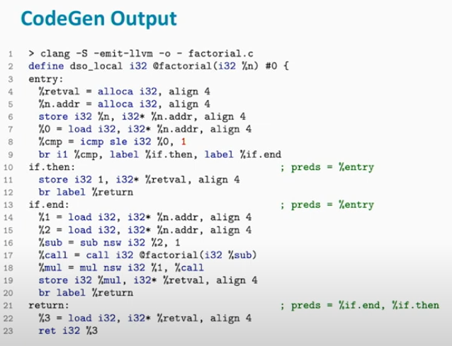

Clang is a **compiler front-end** for a varying range of programming languages such as C and C++. It's part of the LLVM project and is designed to work as a drop-in replacement for the GNU Compiler Collection (GCC). The Clang project source code is available [on GitHub](https://github.com/llvm/llvm-project)

 Here, "drop-in replacement" refers to a software component that is designed to be a direct subsitute for another, with little or no modification required to the existing system. It implies that the replacement can be used as an equivalent to the original, matching its interface and behaviours. In the context of Clang, it means that Clang is designed to understand GCC's command-line options and compile most programs written for GCC without changes to the code or the build environment. This allows developers to switch from using GCC to Clang without having to alter their source code or build scripts significantly.

 Clang is both a **compiler drive** and a **FrontEnd**. For this reason, Clang often gets credit/blame for work actually done by LLVM.

# Clang as a Compiler Driver

The compiler driver (the `clang` executable) then takes over and uses this IR to manage the subsequent stages of compilation, including optimization (done by the MiddleEnd) and code generation (done by the BackEnd), eventually producing an executable file.

LLVM, which includes Clang as its FrontEnd, is responsible for the entire compilation process. This process involves not just generating IR, but also optimizing that IR (MiddleEnd) and translating it into machine code (BackEnd).

The term “compiler driver” refers to the tool that invokes the different stages of the compilation process. When you run Clang, it acts as a driver by calling the necessary LLVM components to handle each stage. So, after Clang generates the IR, the LLVM MiddleEnd takes over to optimize it, and then the LLVM BackEnd generates the final machine code.

While Clang’s job as a FrontEnd is done after it generates the IR, the Clang executable also serves as a driver that manages the rest of the compilation process using the other components of LLVM. This is why it might seem like Clang is doing more than just generating IR—it’s orchestrating the entire compilation pipeline.

The textbook compilation pipline for how to compile a C file to binary is as follows,


Running `clang` on any input file will actually print out the different phases it will go through,

```
> clang -ccc-print-phases factorial.c
0: input, "factorial.c", c
1: preprocessor, {0}, cpp-output
2: compiler, {1}, ir
3: backend, {2}, assembler
4: assembler, {3}, object
5: linker, {4}, image
```

Doing all of these seperate steps, saving the file, reading it back in etc... is inefficient. The next thing it does is combine all of these different steps into fewer than two executions, meaning, we do not need to write out the IR state and read it back in repeatedly.


This has combined the entire pipline to two steps.

# Clang as a FrontEnd

Clang’s primary role as a FrontEnd is to generate LLVM Intermediate Representation (IR) from source code. It handles parsing, syntax checking, and semantic analysis.

Clang itself does not perform the tasks in the MiddleEnd and BackEnd. Its primary role is in the FrontEnd, where it processes the source code and generates LLVM Intermediate Representation (IR). The MiddleEnd and BackEnd run seperately from Clang.

So, while Clang is responsible for the initial stages of the compilation process, the MiddleEnd and BackEnd tasks are handled by other components within the LLVM framework. Clang’s job is considered complete once it has produced the IR.

Clang does a lot more, such as trying to emit helpful diagnostics. Compiling C-like code to LLVM IR and...

1. Emit helpful diagnostics
2. Support various standards and dialects
3. Record source locations for debug information
4. Provide foundation for many other tools (syntax highlighting, code completion, code refactoring, static analysis, ...)

### Core Components

To understand the core components, I will run through with the following code example,

```C
int factorial(int n) {
    if (n <= 1)
        return 1;
    return n * factorial(n - 1);
}
```

```shell
clang -c factorial.c
```


1. The preprocessor and lexical analysis are combined into a single step, afterwards will result in a stream of tokens.
2. The Parser will interpret these tokens and build up an AST. The Sema component will perform semantical analysis, meaning, when something is parsed it's also semantically correct.
3. The CodeGen component will take the AST, traverse it and produce the LLVM IR.

At this point, Clang is basically done and it is up to the rest of LLVM to do the rest.

### Lexer

The main job of the lexer is to take the C file and convert it into a sequence of tokens. The lexer also handles preprocessing.

The lexer step is performance critical. If we can imagine a large project with the preprocessing expanding all of the include statements. It attempts to be smart by expanding the include statements as it does the lexing.


### Parser

The Clang parser is a handwritten recursive-descent parser. The parser will look at the sequence of tokens that is received by the lexer. The parser will look through them, left to right and apply grammar rules from top to bottom.

The parser attempts to recover from errors to parse as much as possible in order to suggest fix-it hints.


In this call stack example, the first few calls from the `cc1_main` are the compiler driver components of Clang. From there, the actual parser function calls begin from `clang::ParseAST`. From here it begins to match the tokens to the grammar rules, applying them top to bottom.

In the following example, we have the function definition rule being applied.


This will then lead to the inside grammar rule of a compound-statement,


This continues throughout the entire function definition.

### Sema

Once the program is parsed, we know that it is syntactically correct. The next step is to check the validity of the program, semantically. The component of Clang that does this is called Sema. The Sema and parser are tightly coupled together.


Sema is the biggest client of the diagnostics subsystem. Most of the errors and complicated diagnostics, specifically are handled by Sema.


For example, if could be syntactically correct to create an `int` and a `str*` in C and attempt to concatenate them with the `+` sign as far as the lexer is concerned, however, the Sema will perform the check and throw an exception as it attempts to add two variables when both are not mathematical operands. It is not always as the diagram shows, their could be situations where the AST is created first and then the checks are performed. This is because it's simpler to create the AST and then perform queries on the AST about the program, then provide diagnostics. For example, in C++ their exists templates. When using templates, you need to wait until the template is instantiated to perform the diagnostics.

The final output of the Sema is an AST (Abstract Syntax Tree).

### Abstract Syntax Tree (AST)

Once we have parsed and program and know that it is semantically correct, the next step is to create the AST. This is meant to be very close to the source representation, we only lose comments and formatting. The Clang AST is mostly immutable, meaning, it's very difficult to modify and should not really be touched.


### CodeGen

 CodeGen is the final step in the FrontEnd, which traverses the AST and produce the LLVM IR. This should not be confused with the LLVM CodeGen, which generates machine code.


In this example, the produced IR will be,



Now that the IR is generated, Clang as a FrontEnd is now complete.