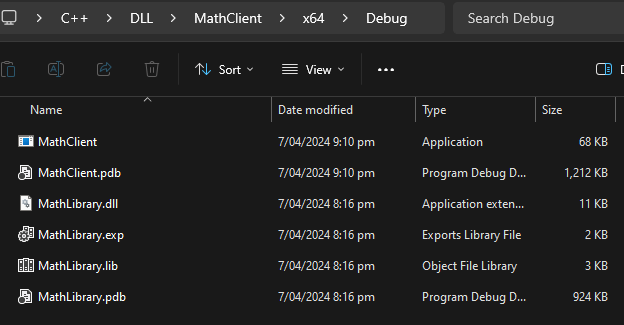

 # Creating a DLL Library

Like a statically linked library, a DLL exports variables, functions, and resources by name. A client app imports the names to use those variables, functions, and resources. Unlike a statically linked library, Windows connects the imports in your app to the exports in a DLL at load time or at run time, instead of connecting them at link time. Windows requires extra information that isn't part of the standard C++ compilation model to make these connections.

In this example I will be creating a MathLibrary that will be used by a client.
 
# Creating the Library

Within Visual Studio, choose the configurations to create a "Dynamic-Link Library (DLL)"


From here, we will call our example "MathLibrary".


From here we need to do the following steps,

## Create a Header File

Firstly, we need to create a header file for our functions. This will be used by the users of our library.

Inside the "Header Files" component, I will create a `MathLibrary.h` with the following contents.

```cpp
// MathLibrary.h - Contains declarations of math functions
#pragma once

#ifdef MATHLIBRARY_EXPORTS
    #define MATHLIBRARY_API __declspec(dllexport)
#else
    #define MATHLIBRARY_API __declspec(dllimport)
#endif

// The Fibonacci recurrence relation describes a sequence F
// where F(n) is { n = 0, a
//               { n = 1, b
//               { n > 1, F(n-2) + F(n-1)
// for some initial integral values a and b.
// If the sequence is initialized F(0) = 1, F(1) = 1,
// then this relation produces the well-known Fibonacci
// sequence: 1, 1, 2, 3, 5, 8, 13, 21, 34, ...

// Initialize a Fibonacci relation sequence
// such that F(0) = a, F(1) = b.
// This function must be called before any other function.
extern "C" MATHLIBRARY_API void fibonacci_init(
    const unsigned long long a, const unsigned long long b);

// Produce the next value in the sequence.
// Returns true on success and updates current value and index;
// false on overflow, leaves current value and index unchanged.
extern "C" MATHLIBRARY_API bool fibonacci_next();

// Get the current value in the sequence.
extern "C" MATHLIBRARY_API unsigned long long fibonacci_current();

// Get the position of the current value in the sequence.
extern "C" MATHLIBRARY_API unsigned fibonacci_index();
```

The crucial component of this header file is the preprocessor statements at the top of the file. The new project template
for a DLL project adds `<PROJECTNAME>_EXPORTS` to the defined preprocessor macros.

When the `MATHLIBRARY_EXPORTS` macro is defined, the `MATHLIBRARY_API` macro sets the `__declspec(dllexport)` modifier
on the function declarations. This modifier tells the compiler and linker to export a function or variable from the DLL 
use by other applications. When `MATHLIBRARY_EXPORTS` is undefined, for example, when the header file is included by a
client application, `MATHLIBRARY_API` applies the `__declspec(dllimport)` modifier to the declarations. This modifier
optimizes the import of the function or variable in an application,

**In this example, Visual Studio defines `MATHLIBRARY_EXPORTS` when your MathLibrary DLL project is built.**

## Adding the Implementation

The source file used for the implementation is `MathLibrary.cpp`,

```cpp
// MathLibrary.cpp : Defines the exported functions for the DLL.
#include "pch.h" // use stdafx.h in Visual Studio 2017 and earlier
#include <utility>
#include <limits.h>
#include "MathLibrary.h"

// DLL internal state variables:
static unsigned long long previous_;  // Previous value, if any
static unsigned long long current_;   // Current sequence value
static unsigned index_;               // Current seq. position

// Initialize a Fibonacci relation sequence
// such that F(0) = a, F(1) = b.
// This function must be called before any other function.
void fibonacci_init(
    const unsigned long long a,
    const unsigned long long b)
{
    index_ = 0;
    current_ = a;
    previous_ = b; // see special case when initialized
}

// Produce the next value in the sequence.
// Returns true on success, false on overflow.
bool fibonacci_next()
{
    // check to see if we'd overflow result or position
    if ((ULLONG_MAX - previous_ < current_) ||
        (UINT_MAX == index_))
    {
        return false;
    }

    // Special case when index == 0, just return b value
    if (index_ > 0)
    {
        // otherwise, calculate next sequence value
        previous_ += current_;
    }
    std::swap(current_, previous_);
    ++index_;
    return true;
}

// Get the current value in the sequence.
unsigned long long fibonacci_current()
{
    return current_;
}

// Get the current index position in the sequence.
unsigned fibonacci_index()
{
    return index_;
}
```

To compile this, we will choose `Build > Build Solution`


In this example I have set my build type to `Release`.


After building, we will now have the following files.


# Using the Library

When you create a DLL, think about how client apps may use it. To call the functions or access the data exported by a DLL, client source code must have the declarations available at compile time. At link time, the linker requires information to resolve the function calls or data accesses. **A DLL supplies this information in an import library, a file that contains information about how to find the functions and data, instead of the actual code. And at run time, the DLL must be available to the client, in a location that the operating system can find.**

Whether it's your own or from a third-party, your client app project needs several pieces of information to use a DLL. It needs to,

1. Find the headers that declare the DLL exports
2. Find the import libraries for the linker (The `.lib`)
3. Find the DLL


In this example I will be creating a `MathClient` which will use our DLL library.

Instead of choosing a DLL library for our new project, we will be choosing a `Console App`.


## 1. Find the Header Files

1. Right-click on the `MathClient` node in the **Solution Explorer** to open the Property Pages dialog.

Under `C/C++`, we will use the `Additional Include Directories` field to add a directory. The directory we will be
adding will be where we previously created the `MathLibrary.h`.


This will tell Visual Studio to search inside `C:\Users\Michael\Desktop\C++\DLL\MathLibrary\MathLibrary` when looking for 
files when a `#include` is used within the application, in this case it will soon be `#include "MathLibrary.h"`.

Now that we can include `MathLibrary.h`, we can proceed to use the header files.

```cpp
// MathClient.cpp : Client app for MathLibrary DLL.
// #include "pch.h" Uncomment for Visual Studio 2017 and earlier
#include <iostream>
#include "MathLibrary.h"

int main()
{
    // Initialize a Fibonacci relation sequence.
    fibonacci_init(1, 1);
    // Write out the sequence values until overflow.
    do {
        std::cout << fibonacci_index() << ": "
            << fibonacci_current() << std::endl;
    } while (fibonacci_next());
    // Report count of values written before overflow.
    std::cout << fibonacci_index() + 1 <<
        " Fibonacci sequence values fit in an " <<
        "unsigned 64-bit integer." << std::endl;
}
```

Now, compiling this, we will receive a linking error. This is because we are missing information. **We have not specified
that our project has a dependency on `MathLibrary.lib` yet. We have also not told the linker how to find the `MathLibrary.lib` file.**

# 2. Resolving Linking Errors

We will firstly tell Visual Studio that we depend on `MathLibrary.lib` and then tell Visual Studio where to search for it.

Inside of `Properties > Linker > Input` we need to add `MathLibrary.lib` inside of `Additional Dependencies` as follows,


Now that we have told Visual Studio that we depend on this file, we now need to tell it where to find it.

This is done under `Linker > General` and inside the `Additional Library Directories` field.


This means Visual Studio will search `C:\Users\Michael\Desktop\C++\DLL\MathLibrary\x64\Release` for our `.lib` file.

Finally, running this we will receive the following error.


Compiling and creating our `MathClient` will not generate magically place the dependency `.dll` into our project.

So far we have utilized the `MathLibrary.h` during our compilation stage and statically linked `MathLibrary.lib`
into our executable. However, `MathLibrary.lib` tells us information about `MathLibrary.dll`, we still need
to place this into our project.

# 3. Including `MathLibrary.dll`

In this example, I will be using `Build Events > Post-Build Event`. I will be editing the `Command Line` field,
meaning, the command will be executed after the build is complete. The following command will be executed,

```sh
xcopy /y /d "C:\Users\Michael\Desktop\C++\DLL\MathLibrary\x64\Release" "$(OutDir)"
```

This will copy every file inside the `MathLibrary` release build directory into our build directory. 



Now, after rebuilding, we can see that we now have `MathLibrary.dll`, including the other files. Finally,
running `MathLibrary.exe` in the command line will work correctly :)

# Key Points

#### When creating the library

Despite it being a DLL library, a `.lib` file is also generated. This `.lib` file is statically linked by the user of the library. The `.lib` is an import file that contains information about the `.dll` that the linker will use such as memory address locations. A `.lib` file is used whether you're statically linking or dynamically linking, as it's a file used at build time.

Not all `.lib` are equivalent, if you want to statically link to a library they need to be statically compiled so that all required information is within the `.lib` file. If the library is distributed as a dynamic linked library, you cannot statically linked the `.lib` file as it would only contain information to reference the `.dll`. For example, Qt are distributed as a dynamic linked library. If you really want to have a statically linkable Qt libs, you would need to compile Qt statically, before you can link them.

#### When using the library

As of a user of a DLL library you still must,

1. Tell Visual Studio where to search for the header files (`.h`). This is used during the preprocessor stage.
2. Tell Visual Studio that you depend on the import files (`.lib`). This is used during the linking stage.
3. Include the `.dll` file inside your project. This is used during runtime.
