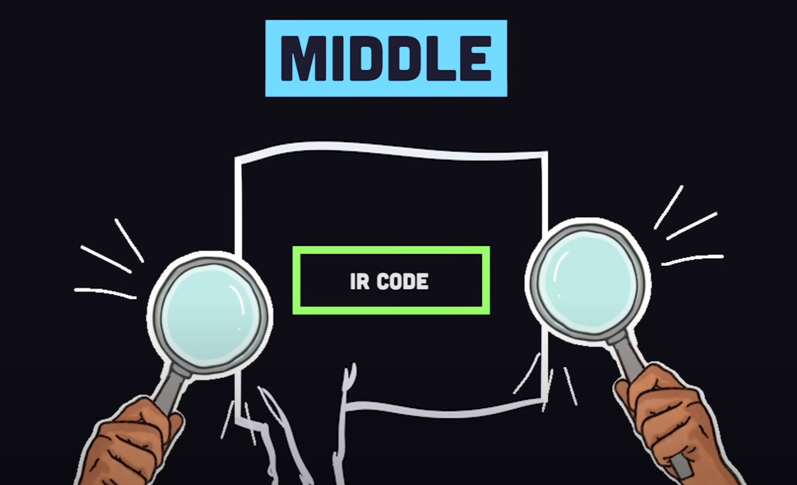

  <h1> LLVM </h1>

LLVM is a set of compiler and toolchain technologies that can be used to **develop a frontend for any programming language and a backend for any instruction set architecture**. LLVM is designed around a language-independent intermediate representation (IR) that serves as a portable, high-level assembly language that can be optimized with a variety of transformations over multiple passes. The name LLVM originally stood for Low Level Virtual Machine, though the project has expanded and the name is no longer officially an initialism.

LLVM standardize the process from turning source code to machine code. LLVM is responsible for the magic behind Clang and languages like Rust, Swift and Julia. LLVM will represent high-level language code in a language agnostic code called Intermediate Representation (IR).

This is extremely useful as it means that vastly different languages will produce the same IR, allowing them to share tools for analysis and optimization before they're converted to machine code for a specific chip architecture.

#### Compiler Steps

In the broadest sense, a compiler is a program that translates source code written in a high-level programming language into another form, usually machine code for a computer’s processor. The compiler step for a LLVM is not the exact pre-processing, compilation and linking for a traditional C++ program and can be broken down into three componenets called the FrontEnd, MiddleEnd and BackEnd.

LLVM’s modular design allows for different FrontEnds to generate IR, which can then be optimized by the MiddleEnd and converted into machine code by the BackEnd, making it highly flexible and reusable across different languages and target architectures.

##### FrontEnd

The FrontEnd in LLVM is responsible for **language-specific** analysis. This includes parsing the source code, type checking and other syntax-related tasks. It converts the source code into LLVM's intermediate Representation.

LLVM's FrontEnd is similar to the traditional preprocessing and compilation steps as both involve analyzing and processing the source code.

##### MiddleEnd

The MiddleEnd performs optimizations that are independent of the input language and the output target. It works on the LLVM IR to improve performance and eliminate unnecessary code

##### BackEnd

Finally, BackEnd converts the IR into native machine code. The BackEnd is target-specific; it performs optimizations based on the target architecture and generates the final machine code from the optimized IR. 

The majority of the optimization is done during the MiddleEnd, but this is target- independent, meaning they don't rely on the specifics of the architecture for which the code is being generated. 

After the MiddleEnd has optimized the IR, the BackEnd performs additional optimizations that are target-specific. These optimizations take advantage of the particular features and capabilities of the target architecture to further enhance performance. While the MiddleEnd performs the bulk of the optimization, the BackEnd also plays a crucial role in fine-tuning the machine code for the specific hardware it will run on.

LLVM has multiple BackEnds. Each BackEnd in LLVM is designed to target a specific machine architecture or instruction set. This means that LLVM can generate machine code for a veriety of hardware platforms, from common ones like x86 and ARM to more specialized architectures. Each of these BackEnds can handle the specific details of generating machine code for its respective architecture.

Even with a single architecture, there might be multiple instruction sets. For instance, the ARM BackEnd in LLVM can emit code for different versionf of the ARM architecture, like ARMv6 and ARMv7.

##### Why LLVM

LLVM was designed and created to address several challenges in compiler design and to provide a modern approach to compilation such as,

#### Modularity and Reusability

LLVM is a collection of modular and reusable compiler components. Each library within LLVM supports a particular aspect of the compiler pipeline, such as lexing, parsing, optimization, or machine code generation for specific architectures. This modularity allows developers to use only the components they need and to easily extend the compiler’s capabilities.

#### Language and Platform Independence

One of the primary goals of LLVM was to create a compiler infrastructure that is independent of both programming languages and machine architectures. LLVM’s Intermediate Representation (IR) is a language-agnostic form of code that can be generated from any programming language and then optimized and translated into machine code for any target platform.

#### Optimization Capabilities

LLVM provides a framework for a wide range of compile-time, link-time, and runtime optimizations. The IR is designed to be easily transformed and optimized, allowing for sophisticated analyses and optimizations that can be applied at different stages of the compilation process.

#### Better Tooling

The design of LLVM facilitates the development of a variety of tools beyond traditional compilers. These include static analyzers, debuggers, and code transformation tools. LLVM’s libraries can be used to build tools that work with code at different levels of abstraction, from high-level source code to low-level machine instructions.

#### Improved Performance and Diagnostics

LLVM aims to produce highly optimized machine code, leading to better performance of the final programs. Additionally, LLVM’s Clang frontend is known for providing expressive diagnostics, which help developers by giving clear and detailed error messages and warnings.