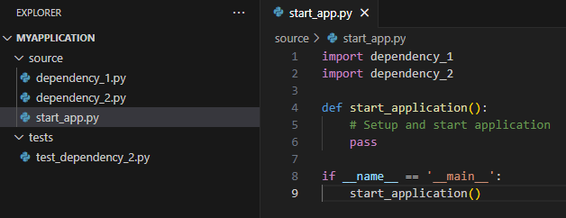
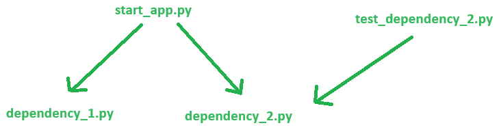

<div align="center">
  <h1> Lazy Loading </h1>
</div>
Lazy loading is a technique to determine which files to include when building and packaging the application. This is done by simply starting the application and determining which files are imported on startup. It's used to easily strip away the unused files when running the application, such as tests.

Suppose we have the following example project,



Here, let's pretend that the application is started by running `start_app.py`, this will import all of the dependencies through a long chain. Here, it will be `dependency_1` and `dependency_2`. This will mean that the two dependencies will be included in the final build.  Due to `tests` never being imported from `start_app.py`, it will not be included. This is expected and will not cause a problem as our tests want to be ran independent of the main application. Our application does not need our tests to run.

The dependency graph is as follows,



If our software implemented a Python console, this would mean that we could not directly run and utilize anything inside of the `tests` directory from our build, because it was not included. However, it's fine when running from source.

# Potential Problems

When using lazy loading, we might possibly run into errors of accidentally not including them. This could happen for libraries that do not import them unless you use them directly, such as `plotly`. `import plotly` is insufficient to
import some functionality, so during application startup you may want a function such as `include_lazy_imports` which serves the purpose of importing them when building, so that they're included in the final product.

Remember that files will not be included if they're not imported during application start up, so if the only import statement if embedded inside a function that is only hit after the application has started and the user interacts with it, such as a button click event, it will not be imported.

```Python
def button_click_event():
  from example import example_function

  example_function()
```

In this example, if `example_function` is only imported here, we will receive an error when running from a build, but not from source. The error will be caused by `from example import example_function` because the file `example.py` will have not been included in the final application as it was not found during the initial `start_app.py` execution.
