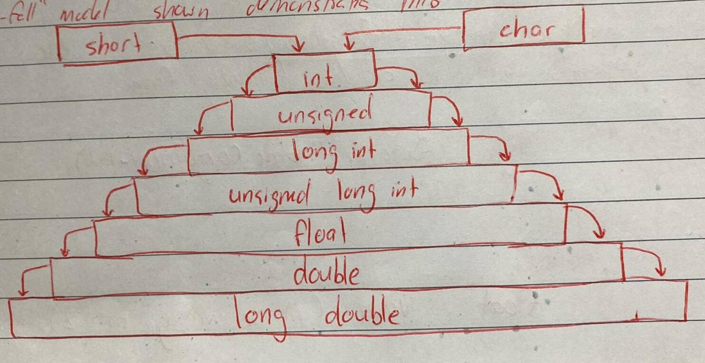

# Table of Contents

- [Casting](#casting)
- [Implicit Type Conversions](#implicit-type-conversions)
- [Casting Using C-Style Syntax](#casting-using-c-style-syntax)
- [Basic Type to Class Type](#basic-type-to-class-type)
- [Class Type to Basic Type](#class-type-to-basic-type)
- [Class Type to Class Type](#class-type-to-class-type)
- [C++ Casting Operators](#c-casting-operators)
  - [static_cast](#static_cast)
  - [dynamic_cast](#dynamic_cast)
  - [const_cast](#const_cast)
  - [reinterpret_cast](#reinterpret_cast)
- [Summary](#summary)


# Casting

Casting in C++ involves **converting data between types**. It can happen automatically (implicit casting) or explicitly (explicit casting).


# Implicit Type Conversions

Whenever data types are mixed in an expression, C++ performs the conversions automatically. This process is known as implicit or automatic conversion.

When the compiler encounters an expresson, it divides the expressions into subexpressions consisting of one operator and one or two operands. For a binary operator, if the operands type differ, the compilers converts one of them to match with the other, using the rule that **the "smaller" is converted to the "wider" type**.

For example, if one of the operand is an `int` and the other is a `float`, the `int` is converted into a `float` because a `float` is wider than an `int`. The "waterfall" model shown demonstrates this,



```C++
int x = 5;
double y = 2.75;

std::cout << x + y << std::endl;
```
 Will output `7.75` because the result will be the larger type, i.e. `float`.

 Additionally, `unsigned` is seen as `wider`

 ```C++
unsigned int four_billion = 4000000000;
int negative_int = -1000;
cout << four_billion + negative_int;
 ```

 Will output `3999999000`, a number that is beyond the maximum `signed int` type (`2,147,483,647`).

# Casting Using C-Style Syntax

The syntax for C-Style casting is,

```C++
(type) value
```

This type of casting is not type-safe and can perform several kinds of conversions. It's equivalent to trying all other C++ casts (`static_cast`, `const_cast`, etc) and choosing **the first valid one**.

A basic type casting would be the following,

```C++
double pi = 3.14159;
int truncatedPi = (int) pi;            // Truncates decimal part
std::cout << truncatedPi << std::endl; // Outputs 3
```

This type of casting lacks clarity and is error-prone. Modern C++ encourages type-safe C++ casts.

# Basic Type to Class Type

You can define how to convert a basic type (`int`, `double`, ...) to a class type by **defining a constructor that takes that basic type** as a parameter.


```C++
#include <iostream>

class MyNumber {
    int value;

public:
    MyNumber(int v) : value(v) {}        // Conversion constructor

    void display() const {
        std::cout << "Value: " << value << std::endl;
    }
};

int main() {
    MyNumber implicitNum = 42;                   // Implicit conversion from int to MyNumber
    implicitNum.display();                       // Outputs "Value: 42"

    MyNumber explicitNum = MyNumber(84); // Explicit conversion
    explicitNum.display();               // Outputs "Value: 84"
}
```

To not allow implicit conversions we can modify the constructor to use the `explicit` keyword,

```C++
explicit MyNumber(int v) : value(v) {}  
```

This will only allow the explicit conversions.

# Class Type to Basic Type

To convert a class type to a basic type, you will need to define a conversation operator as a method on the class which uses the syntax,

```C++
operator type() const {
    ...
    return value;
}
```

The following will convert our previous object of `MyNumber` to an `int` by defining a `operator int()`.

```C++
#include <iostream>

class MyNumber {
    int value;

public:
    MyNumber(int v) : value(v) {}

    operator int() const {
        std::cout << "`operator int()` called!" << std::endl;
        return value;
    }
};

int main() {
    MyNumber num(42);
    int intValue = num;                 // Implicit conversion from MyNumber to int

    std::cout << intValue << std::endl; // Outputs 42
}
```

# Class Type to Class Type

Conversions between class types are done through **constructors or conversion operators**. The following examples are performing a conversion from the the `Celcius` class to `Fahrenheit`.

If you choose to **use a constructor** to perform the conversion, we will need to define a constructor on the `Fahrenheit` class that takes `Celcius` as a parameter. It can be done in the following way,

```C++
#include <iostream>

class Celsius {
    double temperature;

public:
    Celsius(double t) : temperature(t) {}

    double getTemperature() const { return temperature; }
};

class Fahrenheit {
    double temperature;

public:
    Fahrenheit(double t) : temperature(t) {}

    // Constructor for conversion from Celsius
    Fahrenheit(const Celsius& c) : temperature(c.getTemperature() * 9.0 / 5.0 + 32) {}

    double getTemperature() const { return temperature; }
};

int main() {
    Celsius c = 25;
    Fahrenheit f = c; // Implicitly converts Celsius to Fahrenheit
    std::cout << "Fahrenheit: " << f.getTemperature() << std::endl; // Outputs 77
}
```

If you chose to **use the operator method** to perform the conversion from `Celcius` to `Fahrenheit`, it would require defining `operator Fahrenheit()` within the `Celcius` class. It can be done in the following way,

```C++
#include <iostream>

class Fahrenheit {
    double temperature;

public:
    Fahrenheit(double t) : temperature(t) {}

    double getTemperature() const { return temperature; }
};

class Celsius {
    double temperature;

public:
    Celsius(double t) : temperature(t) {}

    operator Fahrenheit() const {
        return Fahrenheit(temperature * 9.0 / 5.0 + 32);
    }
    double getTemperature() const { return temperature; }
};

int main() {
    Celsius c = 25;
    Fahrenheit f = c; // Implicitly converts Celsius to Fahrenheit using `operator Fahrenheit()`

    std::cout << "Fahrenheit: " << f.getTemperature() << std::endl;                // Outputs 77
    std::cout << "Fahrenheit: " << ((Fahrenheit) c).getTemperature() << std::endl; // Outputs 77
}
```

# C++ Casting Operators

Four different types of casting were introduced in C++,

1. `static_cast`
2. `dynamic_cast`
3. `const_case`
4. `reinterpret_cast`

It is preferred to use these types of casting over the C style casting as it helps describe the intent. Using the C still casting will, ineffect, try out these different types of casts.
## `static_cast`

`static_cast` is a compile-time cast operator used for safe and well-defined type conversions between related types. It performs conversions that can be determined **at compile-time**, without requiring runtime type information.

`static_cast` can handle the following conversions,

1. Implicit conversions (e.g., `int` to `float`, `double` to `int`)
2. Upcasting within the class hierarchy (e.g., converting a derived class pointer/reference to a base class pointer/reference)
3. Downcasting within the class hierarchy, **but without any runtime type checking** (e.g., converting a base class pointer/reference to a derived class pointer/reference)

`static_cast` **does not perform any runtime checks** to ensure the validity of the conversion.

Continuing from the previous example above the use of `static_cast` would appear as the following,

```C++
Celsius c = 25;
Fahrenheit f = static_cast<Fahrenheit>(c);
```

Here is a code example that shows how to use `static_cast` involving inheritance,

```C++
#include <iostream>

class Base {
public:
    void baseFunction() {
        std::cout << "Base function" << std::endl;
    }
};

class Derived : public Base {
public:
    void derivedFunction() {
        std::cout << "Derived function" << std::endl;
    }
};

int main() {
    // Upcasting using static_cast
    Derived derivedObj;
    Base* basePtr = static_cast<Base*>(&derivedObj);
    basePtr->baseFunction();  // Calls Base::baseFunction()

    // Downcasting using static_cast
    Base baseObj;
    Derived* derivedPtr = static_cast<Derived*>(&baseObj);
    derivedPtr->derivedFunction();  // Undefined behavior!

    return 0;
}
```

The `static_cast` from a base class object to a derived class pointer is not safe because the object being cast is not actually a derived class object. This violates the type system and can result in unpredictable consequences. To avoid undefined behavior and safely perform downcasting with runtime type checking, instead `dynamic_cast` should be used.

In this example, "Derived function" will be outputted to the console, but is ultimately unsafe and undefined behaviour and therefore should never be used when downcasting. As we will soon see using `dynamic_cast`, this would not be the behaviour.

Using `static_cast` provides explicitness, compile-time type checking, control over conversions, and a consistent syntax for type conversions. These benefits can help improve code readability, maintainability, and safety.

## `dynamic_cast`

`dynamic_cast` is a runtime cast operator used for safe type conversions involving polymorphic types and performing runtime type checking. It allows conversions **between pointers or references of related classes in the class hierarchy**.

`dynamic_cast` can handle conversions like,

1. Upcasting within the class hierarchy (e.g., converting a derived class pointer/reference to a base class pointer/reference).

2. Downcasting within the class hierarchy, with runtime type checking to ensure the validity of the conversion.

`dynamic_cast` requires the classes involved to have at least one virtual function. If the conversion is not valid, `dynamic_cast` returns a `nullptr` (for pointers) or throws a `std::bad_cast` exception (for references). It should be used when you need to perform runtime type checks and ensure the validity of the conversion, especially in cases where you are not certain about the exact types involved.

In this code example we demonstrate how upcasting is generally safe but downcasting is not guaranteed to be safe, but we utilize `dynamic_cast` to prevent exceptions from occurring by checking the pointer returned by `dynamic_cast`,

```C++
#include <iostream>

class Base {
public:
    virtual void baseFunction() {
        std::cout << "Base function" << std::endl;
    }
    virtual ~Base() {}
};

class Derived : public Base {
public:
    void derivedFunction() {
        std::cout << "Derived function" << std::endl;
    }
};

int main() {
    // Upcasting using dynamic_cast
    Derived derivedObj;
    Base* basePtr = dynamic_cast<Base*>(&derivedObj);
    basePtr->baseFunction();

    // Downcasting using dynamic_cast
    Base baseObj;
    Derived* derivedPtr = dynamic_cast<Derived*>(&baseObj);

    if (derivedPtr != nullptr) {
        derivedPtr->derivedFunction();
    } else {
        std::cout << "Dynamic cast failed." << std::endl;
    }
    return 0;
}
```

# `const_cast`

`const_cast` is used to add or remove `const` qualifiers.

```C++
#include <iostream>

void modify(const int& value) {
    int& nonConstValue = const_cast<int&>(value);
    nonConstValue += 10;
}

int main() {
    int x = 5;
    modify(x);
    std::cout << x << std::endl; // Outputs 15
}
```

# `reinterpret_cast`

`reinterpret_cast` is used for low-level, unsafe casts, such as converting unrelated pointer types. This type of cast **should be avoided unless absolutely necessary**.

```C++
#include <iostream>

int main() {
    int a = 65;
    int* intPtr = &a;
    char* charPtr = reinterpret_cast<char*>(intPtr);
    std::cout << *charPtr << std::endl; // Outputs 'A' (ASCII 65)
}
```

# Summary

| **Type of Cast**       | **Use Case**                                                       |
|-------------------------|--------------------------------------------------------------------|
| **C-Style Cast**        | Legacy code (not recommended in modern C++).                     |
| **Basic → Class Type**  | Define a constructor in the class.                               |
| **Class → Basic Type**  | Define a conversion operator (`operator type`).                  |
| **Class → Class Type**  | Use a constructor or a conversion operator in one of the classes.|
| **`static_cast`**       | Well-defined conversions like numeric or upcasting.              |
| **`dynamic_cast`**      | Runtime-checked downcasting in polymorphism.                     |
| **`const_cast`**        | Add/remove `const` qualifiers.                                   |
| **`reinterpret_cast`**  | Low-level pointer casting (dangerous; avoid if possible).        |
