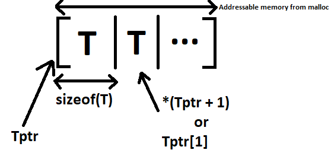
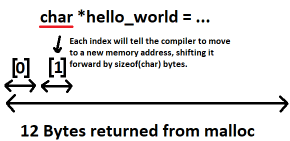

# Pointer Arithmatic

The only difference between pointer arithmatic and regular arithmatic is that the number you are adding to the pointer will be multiplied by the size of the type that the pointer is pointing to. For example, if you have a pointer to an `int` and an `int` size is `4` bytes, `pointer_to_int + 4` will evaluate to a memory address `16` bytes `(4 ints)` ahead.

So when you write,

```C
a_pointer + a_number
```

in pointer arithmatic, what's really happening is,

```C
a_pointer + (a_number * sizeof(*a_pointer))
```

When you have a `T*` and you index from that, you access memory locations as if it contained an array of contiguous elements of `T`.



The following arithmatic operations operations are valid on pointers,

- **Increment (++)** - Moves the pointer to the next element in an array.
- **Decrement (--)** - Moves the pointer to the previous element in an array.
- **Addition (+)** - Allows adding an integer to a pointer to move it forward by multiple elements.
- **Subtraction (-)** -  Allows subtracting an integer from a pointer to move it backward by multiple elements.

Pointer arithmetic is valid on any pointer to a contiguous block of memory, not strictly limited to arrays. However, the concept makes the **most sense in the context of arrays** (or blocks of allocated memory that behave like arrays). When a pointer points to a single `int` (or any single variable), performing pointer arithmetic on it is generally not meaningful and **can lead to undefined behavior** if it moves outside the variable's address.

```C++
#include <iostream>

int main() {
    int* a = new int[10] { 1, 2, 3, 4, 5, 6, 7, 8, 9, 10 }; // Returns the memory address of the first `int`

    // NOT pointer arithmatic as it's pointing to the element inside the array, returns the `int` at index 0 and adds 1000
    std::cout << a[0] + 1000 << std::endl;

    // Pointer arithmatic as we're adding 5 to the pointer, i.e. move 5 indexes ahead
    std::cout << *(a + 5) << std::endl;

    typedef double Vector3[3];

    // Create an array of size two, for `Vector3 *`
    Vector3* myTwoVectors[2];

    myTwoVectors[0] = new Vector3[10];
    myTwoVectors[1] = new Vector3[20];

    // Pointer arithmatic being applied here as `myTwoVectors[0]` is returning a `Vector3 *` array pointer
    std::cout << myTwoVectors[0] + 5 << std::endl;    // 6th Vector inside of `new Vector3[10]`

    // Equivalent to...
    std::cout << myTwoVectors[0][5] << std::endl;     // 6th Vector inside of `new Vector3[10]`
    return 0;
}
```

# Pointer Arithmatic and `malloc`

Pointer arithmatic can play an important role in `malloc`. For example if we use `malloc` to store "Hello World",

```C
#include <stdio.h>
#include <stdlib.h>
#include <string.h>

int main() {
    char *hello_world = malloc(strlen("Hello World") + 1); // +1 for the null terminator

    // Copy the strings into the allocated memory
    strcpy(hello_world, "Hello World");

    // Print the first string character by character
    for (int i = 0; hello_world[i] != '\0'; i++) {
        printf("%c", hello_world[i]);
    }

    // Don't forget to free the allocated memory when you're done using it
    free(hello_world);

    return 0;
}
```

The indexing has nothing to do with `malloc`. It is not `malloc` that is doing the indexing. It is the compiler. When the code does indexing the compiler will generate the right offsets based on the type of the pointer. All `malloc` does is allocate the size of memory that you tell it to (well possibly a bit more for book keeping and alignment).

In the example above `malloc` returns a pointer which points to a memory address space of `12` bytes. Now, we have assignment a pointer type to it being `char *`, which tells the compiler, each index should be of size `char`. This means `hello_world[0]` will be the memory address returned to by `malloc`, but `hello_world[1]` will be the memory address location of `hello_world[0]` with the offset of the pointer type `char`.


