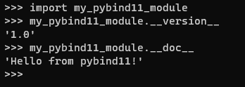
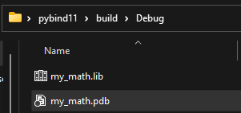
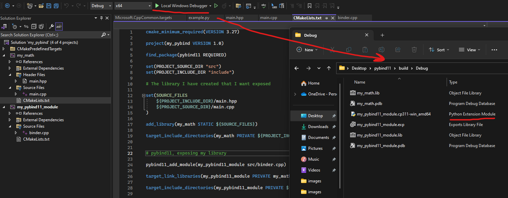
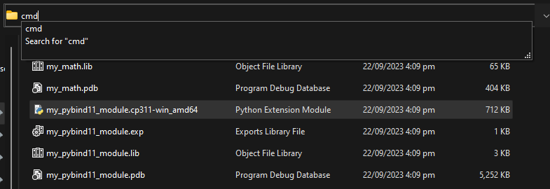
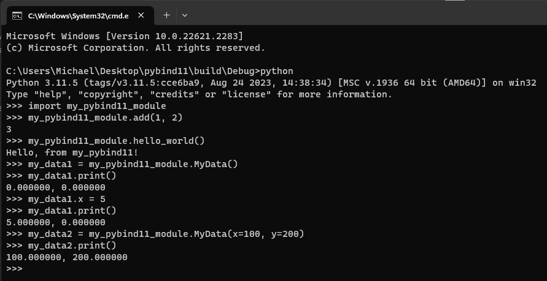

# pybind11

Pybind11 is an open-source C++ library that simplifies the process of creating Python bindings for C++ code. In other words, it allows you to seamlessly integrate C++ code with Python, enabling you to use C++ libraries and functions from within Python programs without the need for complex and error-prone manual wrapping of C++ code.

Calling code written in C++ instead of Python will always be faster, hence pybind11 can be extremely useful for writing algorithms where time is important or areas where time needs to be improved.

In this example I will be demonstrating a full top to bottom example of making callable C++ code from Python. This example will also be using CMake and with all full source code example in the directory.

We will have the following structure,

```
📁 pybind11
    📁 include
        main.hpp
    📁 src
        binder.cpp
        main.cpp
    CMakeLists.txt
    example.py
```

- The `include` directory is where we will include all of our header files.
- `src/main.cpp` contains the C++ code which we want to make callable to Python.
- `src/binder.cpp` contains pybind11 includes and expode the chosen methods/data/classes etc...
- `CMakeLists.txt` is the CMake file which handles creating our build system.
- `example.py` contains our Python code where we will call our newly exposed C++ code.

# Writing the C++ Codes

Before we deal with CMake and pybind11, I will begin our example by writing the C++ code what we want to expose. 

`main.hpp`

```C++
#pragma once

void hello_world();

int add(int i, int j);

struct MyData
{
    float x, y;

    MyData() : x(0), y(0) {};

    MyData(float x, float y) : x(x), y(y) {};

    void print();
};
```

I will be  creating a `hello_world`, a simple `add` function and a `struct MyData` to hold an `x` and `y` value with an optional zero parameter option. The implementation of this header file will be,

`main.cpp`

```C++
#include "main.hpp"

#include <iostream>

void hello_world(){
    std::cout << "Hello, from my_pybind11!\n";
}

int add(int i, int j) {
    return i + j;
}

void MyData::print()
{
    printf("%f, %f\n", x, y);
}
```

The end goal here is using `pybind11` is to call `hello_world`, `add` and create instances of `MyData` from Python.

# pybind11

Our pybind11 code will be written in the file `binder.cpp`. The reason we split this binding code into an independent file is that it allows our library to exist without depending on pybind11, therefore we have the option to allow our library to be used by other C++ developers without the need for pybind11 and also choose then make to exposed to a Python extension module.

`binder.cpp`

```C++
#include <pybind11/pybind11.h>

#include "main.hpp"

PYBIND11_MODULE(my_pybind11_module, module) {
    module.attr("__version__") = "1.0";
    module.doc() = "Hello from pybind11!";

    module.def("add", &add, "Adds two numbers");
    module.def("hello_world", &hello_world, "Hello World!");

    pybind11::class_<MyData>(module, "MyData")
        .def(pybind11::init<>())
        .def(pybind11::init<float, float>(), "double float constructor", pybind11::arg("x"), pybind11::arg("y"))
        .def("print", &MyData::print)
        .def_readwrite("x", &MyData::x)
        .def_readwrite("y", &MyData::y)
        ;
}
```

`PYBIND11_MODULE(my_pybind11_module, module)` uses the  `#define` that is written as `#define PYBIND11_MODULE(name, variable) ...` defined by `pybind11`. We use this macro to construct a way of choosing what to expose.

- `my_pybind11_module` is the name of our module, which will later be called via `import my_pybind11_module`. The variable `module` is not something we will use, but something for pybind.
- `module.attr("__version__") = "1.0";` sets the version to our module.
- `module.doc() = "Hello from pybind11!";` sets the documentation for our module.

Both are called as follows,



- `module.def("add", &add, "Adds two numbers");` exposes the `add` function. The first parameter `"add"`, is the name of function that will be called from Python, this does not have to have the function name defined in C++. The second parameter is a pointer to the function and finally the last parameter is some documentation for the function. This is identical behaviour to `module.def("hello_world", &hello_world, "Hello World!");`

- Finally `pybind11::class_<MyData>(module, "MyData")` is required to expose our `struct MyData`. `.def(pybind11::init<>())` is used for an empty constructor and the `pybind11::init<float, float>()` is used for the double `float` constructor. `.def("print", &MyData::print)` is used to expose the method on the `struct`, finally, `.def_readwrite("x", &MyData::x)` allows us to call the attributes `x` and `y` directly on the object.

# CMake

The above code will allow us to complete our goal of using pybind11 and expose our functions, however, it is always good practice to use CMake for cross platform compatibility. I will enhance our example by allowing the use of CMake in our example.

Our `CMakeLists.txt` will look like the following,

```CMake
cmake_minimum_required(VERSION 3.27)

project(my_pybind VERSION 1.0)

find_package(pybind11 REQUIRED)

set(PROJECT_SOURCE_DIR "src")
set(PROJECT_INCLUDE_DIR "include")

# The library I have created that I want exposed

set(SOURCE_FILES
    ${PROJECT_INCLUDE_DIR}/main.hpp
    ${PROJECT_SOURCE_DIR}/main.cpp
)

add_library(my_math STATIC ${SOURCE_FILES})

target_include_directories(my_math PRIVATE ${PROJECT_INCLUDE_DIR})

# pybind11, exposing my library

pybind11_add_module(my_pybind11_module src/binder.cpp)

target_link_libraries(my_pybind11_module PRIVATE my_math)

target_include_directories(my_pybind11_module PRIVATE ${PROJECT_INCLUDE_DIR})
```

The line `find_package(pybind11 REQUIRED)` will find `pybind11`. To configure `find_package` to find `pybind11` I will retrieve first retrieve `pybind11` via Python. I will run the command `pip install pybind11` and drag the folder into `C:\local\cmake\pybind11\...`. When running CMake via the GUI I need to configure the variable `CMAKE_PREFIX_PATH` to search in `C:\local\cmake`. This will allow CMake to the pybind config file located at, `C:\local\cmake\pybind11\share\cmake\pybind11`. This config file is responsible for creating the targets, functions and setting up variables that we will later use.


- `add_library(my_math STATIC ${SOURCE_FILES})` creates the `my_math.lib` file, it is a statically linked file that is built from `main.hpp` and `main.cpp`. This is built independently of our python module such that our library does not have a dependency on `pybind11`.

- `target_include_directories(my_math PRIVATE ${PROJECT_INCLUDE_DIR})` allows us to find `main.hpp` when we use `#include "main.hpp"` inside of `main.cpp`.  Recall that `target_include_directories` specifies include directories to use when compiling a given target, this mean that it allows for our target `my_math` to find `main.hpp` for the line `#include "main.hpp"`.



Now we get into the behaviour of using `pybind11` to expose our library to python.

To begin this we need to use their CMake function `pybind11_add_module` that was given to us when we configured `pybind11` from `find_package` using their configuration file.

- We use their function as `pybind11_add_module(my_pybind11_module src/binder.cpp)`, where `my_pybind11_module` is also the same name as the module we specified inside of `binder.cpp` (`PYBIND11_MODULE(my_pybind11_module ...)`). We also specify the file location of where our `pybind11` code is located.

- `target_link_libraries(my_pybind11_module PRIVATE my_math)` is an important line as it links the created binaries to our target, allowing it to find the implementation code of our library which would be inside of `my_math.lib`. For example, we use `#include main.hpp`, the linker is what is responsible for actually finding the implementation of the code such that when we pass it as a pointer via, `&add`. We need the linker to know the memory address location of the function.

- Finally, we have `target_include_directories(my_pybind11_module PRIVATE ${PROJECT_INCLUDE_DIR})`. This is responsible for allowing us to have `#include main.hpp`.

# Building the `.pyd`

After `CMakeLists.txt` has been correctly configured, we can now proceed to build our build system. In this example I will be creating a VS Solution. Hence, once I run `Generate` and `Open Project` using the CMake GUI, I still need to use Visual Studio to compile our source code and generate our library files.



Running the compiler, it will output our library file `my_math.lib` and also generate Python Extension Module (`.pyd`) called `my_pybind_module.cp311-win_amd64.pyd`.

# Calling from Python

To test our Python Extension Module, we execute `python` from the command line inside the directory where our `.pyd` resides. This helps as it will import from our current directory and not have to deal with editing the `PYTHONPATH`.



Finally, let's execute example code calls and test our extension module!

