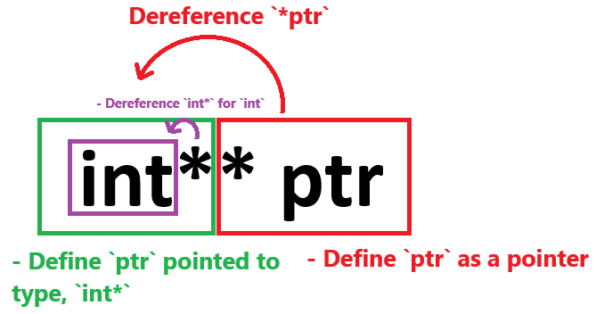

# Reading Types in C++

To read any C++ type, a reliable approach is to start from the variable name and read backward, applying a `right-left rule`. This means **starting from the variable name and moving outward**. An important exception is arrays, where the size is defined in square brackets `[]` on the right side of the variable name.


# Pointers and `const` Placement

To determine whether `const` applied to the pointer or the data being pointed to, split the statement at the `*` symbol.

- If `const` appears on the left (`const int * ptr`), it modifies the **pointed-to data**, making the data constant.

- If `const` is on the right (`int * const ptr`), it applies to **the pointer**, making the pointer itself constant.

```C++
int * ptr;                 // pointer to int
int const * ptr;           // pointer to const int
int * const ptr;           // const pointer to int
int const * const ptr;     // const pointer to const int
int const ** ptr;          // pointer to a pointer to a const int
int * const * const ptr;   // const pointer to a const pointer to an int
```

Both `const int *` and `int const *` are equivalent - they declare a pointer to a constant integer. Similarily, `const int * const` and `int const * const` are interchangeable.

For each `*` present, this means we need to use `*` again to deference it.

# Complex Pointer Declarations

C++ allows for complex pointer declarations with multiple levels of indirections. Here are some examples,

## `int** ptr`

`int** ptr` is a **pointer to a pointer to an integer**.

To interpret the declaration `int** ptr`, we **read from the variable name**(`ptr`) backwards.

1. **First`(*)`** - This tells us that `ptr` is a pointer, meaning, it holds a memory address. The type which `ptr` is pointing to is the remaining type infront of the `*`, `(int*)* ptr`.
2. **Second`(*)`** - The remaining types beyond the first `*` is `int*`. If we continue reading we reach another `*`, meaning, `ptr` is a pointer which points to a pointer.
3. **int** - Finally, we reach the final end type, `int`. This is the type of which the second `*` is pointing to.

So, `int** ptr` declares `ptr` as a pointer to a pointer that will ultimately lead us to an `int` value.



```C++
int value = 10;
int* p1 = &value;    // `p1` is a pointer to `int`
int** ptr = &p1;     // `ptr` is a pointer to `p1`, which points to `value`

std::cout << **ptr << std::endl; // Output: 10
```

To generalize ths code above,

1. An `int* ptr` holds the address of an `int`, so `*ptr` retrieves the integer value.
2. An `int** ptr` holds the address of an `int*`, so `*ptr` retrieves the `int*, and `**ptr` retrieves the integer value.

In this way, each level of `*` adds a layer of indirection. For `int** ptr`, it takes two dereferences to reach the integer value.


## `int** const ptr = &p1;`

`int** const ptr = &p1;` declares `ptr` as a *constant pointer to a pointer to an integer**.

To interpret the declaration `int** const ptr = &p1;`, we read from the variable name(`ptr`) backwards.

1. `* const` - `ptr` is declared as a pointer (indicated by the first `*`) and is constant, meaning that once it is set to point to `p1`, it **cannot point to a different address**. The `const` qualifier here applies to `ptr` itself, **not to the data it points to**.
2. `int*` - Identical to above, this is the type that `ptr` is pointing to. Indicated by reading it after the first `* const`, `(int*)* const ptr = &p1;`. Meaning, `ptr` holds the address of a pointer to an `int`, indicated by the two `*` symbols.


```C++
int value1 = 10;
int value2 = 20;

int* p1 = &value1;
int* p2 = &value2;

int** const ptr = &p1;  // `ptr` is a constant pointer to `p1`
*ptr = p2;              // Allowed: Change the pointer `*ptr` points to
**ptr = 30;             // Allowed: Modify the value at `p2`
// ptr = &p2;           // Error: `ptr` is constant and cannot point to `p2`

std::cout << **ptr << std::endl; // Output: 30
```

# Built-in Types

C++ has several built-in data types.

| Type        | Description                                                                                   |
| ----------- | --------------------------------------------------------------------------------------------- |
| `int`       | Basic integer (typically 4 bytes)                                                  |
| `char`      | Character type (usually 1 byte)                                                               |
| `float`     | Single-precision floating-point (often 4 bytes)                                               |
| `double`    | Double-precision floating-point (usually 8 bytes)                                             |
| `bool`      | Boolean type (`true` or `false`)                                                              |
| `void`      | Special type indicating no data. Used in functions that don’t return anything or for pointers |

Each of these types can be modified with keywords like `signed`, `unsigned`, `short` and `long`.

- `signed` - Means the type **can hold both positive and negative values**. This is usually the default.
- `unsigned` - The type can hold **only positive values**, effectively doubling its range.
- `short` - **Reduces the range** (typically 2 bytes for `short int`). Because `int` now has 2 less bytes, the range has now changed to become `-32768` to `32767` (Reduced from the 4 byte range to 2 byte range). `short` and `short int` are essentially the same thing
- `long` - **Expands the range** (often 8 bytes for `long long int` on modern systems).

# Arrays

Arrays in C++ represent a sequence of elements of a particular type, placed in contiguous memory locations. With arrays, curly braces **`{}` are used for initializing arrays and aggregate types**, while square brackets **`[]` are used for array indexing and declaration**. When declaring an array the square brackets `[]` are always to the right of the variable, with the ability to initialize it using `{}` afterwards.

In this example below, I use `typedef` to define `Vector3` as an array of size `3`. The size is defined using `[]` to the right of the variable name and is read right to left. This is then defined later on using `{}`.

```C++
#include <iostream>

int main() {
    typedef int Vector3[3];
    Vector3 v3 = { 1, 2, 3 };
    return 0;
}
```

**Static Arrays** are defined with a fixed size at compile-time.

- `int arr[10];` - `arr` is an array of 10 integers.
- `double matrix[5][5]` - `matrix` is a 5x5 2D array of doubles.

**Array of pointers** are arrays which store pointers, making the declaration look more complex.

- `int* arr = new int[5] { 1, 2, 3, 4, 5 };` - `arr` is an array of 5 pointers to the type of `int`. When creating the array, `arr` will be pointing to the first index of the created array, hence `*arr` will output `1`.

Read `[]` as "array of". Hence, `int[10]` is an array of 10 integers.

Additionally, the `int*` type represents a pointer to an `int`, but **it can point to either a single integer or the first element in the array of integers**. In this example below, the type of `a` and `c` are both `int*`, however, `a` is the first element of an array, whereas `c` is pointing to an integer. This means `a` can also have pointer arithmatic done on it.

```C++
#include <iostream>

int main() {
    int* a = new int[10] { 1, 2, 3, 4, 5, 6, 7, 8, 9, 10 };

    int b = 5;
    int* c = &b;
    return 0;
}
```

Therefore, it is still essential for the developer to distinguish between **pointer to a single object** and **pointer to the first element in an array** when reading the code because they do have the same type of `int*`.

If a pointer is used with `[]` or in pointer arithmetic (e.g., `ptr + i`), it’s likely pointing to an array. If a pointer is simply dereferenced (`*ptr`), it’s probably intended to point to a single variable. Although dereferncing a pointer that points to an array will dereference the index that it points at, e.g. `*a` will be `1` in this example.

Additionally, the behaviour for the same operations is not identical,

```C++
#include <iostream>

int main() {
    int* a = new int[10] { 1, 2, 3, 4, 5, 6, 7, 8, 9, 10 };

    int b = 100;
    int* c = &b;

    std::cout << *a << std::endl;       // Will output 1
    std::cout << a[5] << std::endl;     // Will output 6
    std::cout << *(a + 5) << std::endl; // Will output 6

    std::cout << *c << std::endl;       // Will output 5
    std::cout << c[5] << std::endl;     // Derefencing 5 `int` memory address locations ahead. Unknown addresses.
    std::cout << c + 5 << std::endl;    // Memory address of 5 `int` ahead. Unknown addresses.
    return 0;
}
```