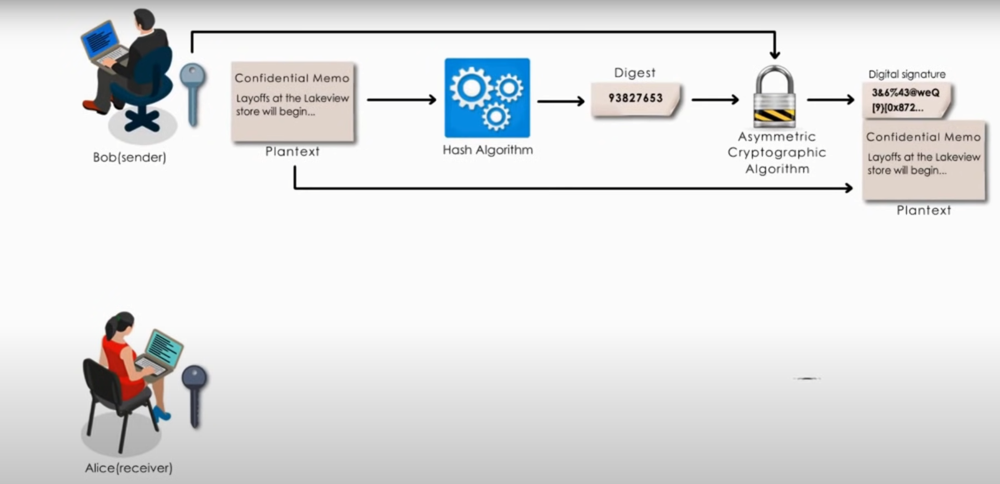
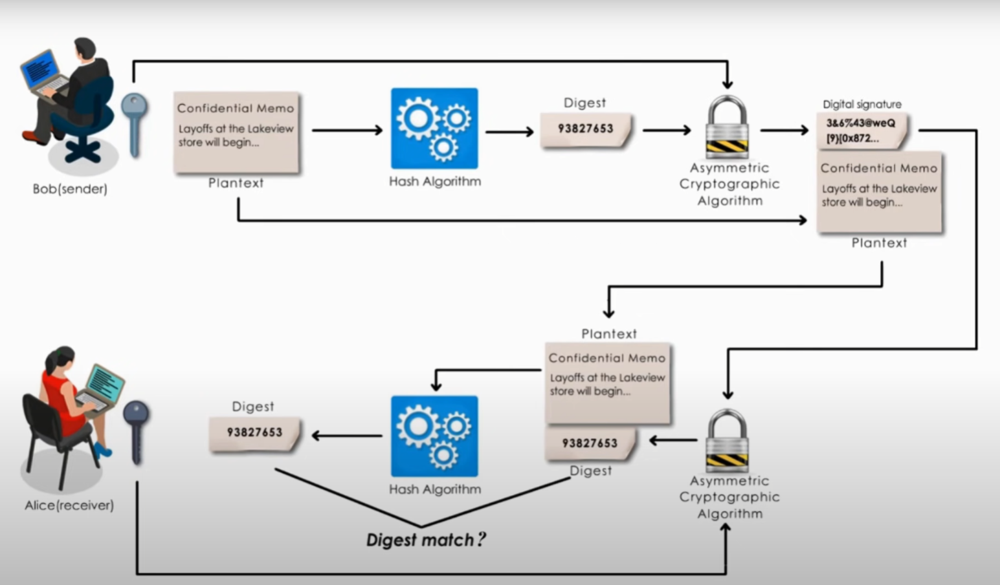
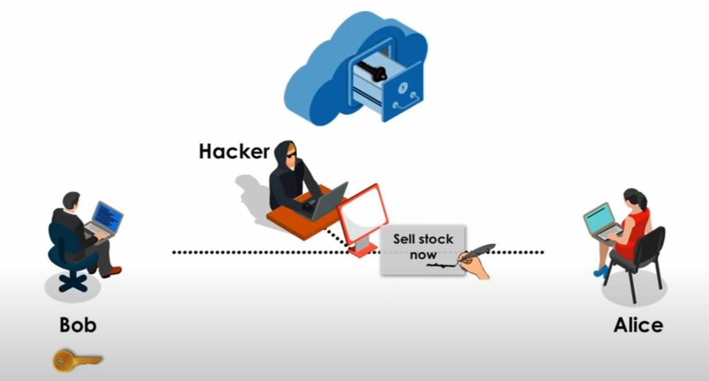
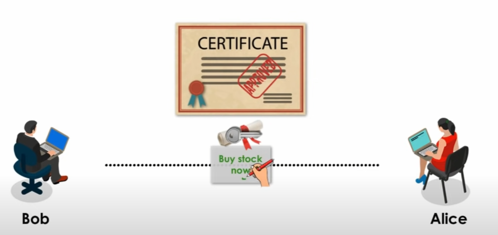

# Digital Signatures

Before we begin to understand digital certificates, we need to understand how a digital signature works and find out the weakness of digital signatures. From here, we could understand why digital certificates are necessary. 

A digital signature is equivalent to a handwritten signature. It is an electronic vertification of the sender. A digital signature serves three purposes,

1. **Authentication** - A digital signature gives the receiver reason to believe the message was created and sent by the claimed sender.
2. **Non-repudiation** - With digital signature, the sender cannot deny having sent the message later on.
3. **Integrity** - A digital signature ensures that the message was not altered in transit.

Digital signatures uses asymmetric cryptography, which means a public key algorithm is used. Also, using digital signatures do not encrypt the message itself. In the example below, Bob is sending plaintext. If he wanted to encrypt his message, he would have to use Alices public key.

The following example demonstrates how digital signatures work,

Bob wants to send a digitally signed message to Alice.

1. Bob creates a pair of keys, public key and private key.
2. Bob uses a hashing algorithm to create a digest from the contents he is sending.
3. Bob then encrypts this digest using his private key with a asymmetric cryptographic algorithm.
4. The output of the encrypted digest is the digital signature. Bob will send both the content and the digital signature to Alice.
5. Bob keeps his private key and puts his public key in a public place after sending the message to Alice.

When Alice receives the message she will then,

1. Alice retrieve Bobs public key and uses it to decrypt the digital signature inside the message and retrieve the original digest. If Alice cannot decrypt the digital signature, Alice knows it did not come from Bob.
2. Once Alice has the digest, she will check the integrity of the message. To do this, Alice hashes the contents of the message again to verifies that the hash is equal to the digest in the messsage. She will use the same hashing algorithm has Bob.
3. If Alice verifies Bobs digital signature by matching the calculated hash with the provided digest in the message, she has reason to believe the message was created and sent by Bob and his message was not altered in transit. If they're not equal, Alice will know that the message was altered in transit.

# Digital Certificates

As we look at the example above on how digital signatures were created and how it was verified, we find out there is one big problem. Now, the problem happens when a hacker intercepts Bobs digitally digned message. The hacker simply discards Bobs message and creates his own entirely new message creating his own public/private key pair and places his public key in a public location, just like Bob.

The hacker will create an entirely new message with his own signature, because Alice will decrypt the signature and notice that the digest has not changed, she has reason to believe that Bob was the sender, when he was not. Alice has no idea of the true identity of the sender, because anybody can pretend to be Bob. Therefore, there is one weakness in digital signature, lack of authentication. Digital signature itself does not verify true identity of the sender and his public key. The solution is digital certificate.

Digital certificates are electronic credentials issued by trusted third party. It not only verifies the identity of the owner, but also verifies that the owner owns the public key. Now, when Bob sends his public key to Alice, he does not ask her to retrieve his public key from a central site. Instead, Bob attaches a digital certificate to his public key and sends them to Alice together with his digitally signed message.

Information inside the digital certificate can be,

1. Certificate owners name
2. Owners public key and expiration date
3. The certificate issuers name
4. The certificate issuers digital signature
5. ...

Alice would check all this information on the certicicate. Because she trusts the third party, she would trust the digital certificate. Alice can safely assume that the public key contained in the digital certificate is actually from Bob, not anyone else, thus preventing a man-in-the-middle attack.

Keep in mind, a digital certificate is based on trust. The trusted third party is a certificate authority, an entity that issues digital certificates. You believe my passport can verify my identity, simply because you trust my passport's issuer. Another life analogy can be, when we sign very important contracts, we need a public notary, such as a bank, to verify the identity of the signer signing the document, witnesses the signatures and marks the document with a stamp or seal. A notary is supposed to ensure that all signatures on a document are legitimate.

In summary, digital certificates are based on trust, or chain of trust. It verifies the identity of the public keys owner. In other words, it verifies the digital signature is truly signed by the claimed signer.

