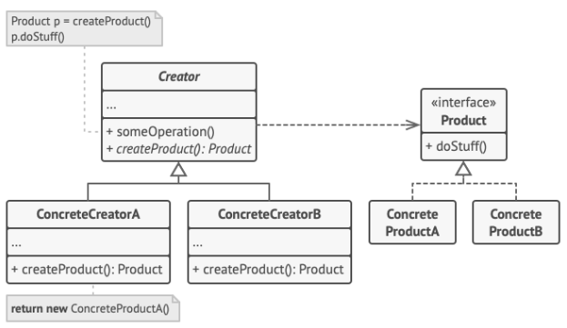

<div align='center'>
    <h1> Factory Method </h1>
</div>

The Factory Method is a **pattern for creating objects** when you,

1. Know you need a **family of related objects**, but
2. Don't want the **client code** to know which concrete class is beung used.

Instead of having the client code do,

```python
if backend == "png":
    exporter = PngExporter()
elif backend == "svg":
    exporter = SvgExporter()
```

you **encapsulate the creation in a creator object**. Now, the client only interacts with the creator.

```python
creator = PngCreator()
creator.export(image, options)
```

The `if` still exists somewhere, such as choosing `PngCreator` or `SvgCreator`, but it is **moved outside the workflow**, leaving the algorithm itself branch-free.

## Motiviation

Consider exporting images. Different formats require,

- Different preprocessing (`prepare_data`)
- Different options (`dpi`, `page_size`, etc...)

Without the Factory Method,

- Workflow logic is mixed with creation and backend selection.
- Adding a new backend requires requires **modifying the workflow** - breaking the Open/Closed Principle.
- Client code must know internal details of every backend.

With the Factory Method,

- Workflow (`export`) is **stable**.
- Backend selection and preparation are **isolated** in a concrete creator.
- Adding a new format only requires a new creator and product class.

## Architecture

<div align='center'>
    
</div>

The pattern consists of,

1. A **Product** interface. The products define **the backend implementation**.
2. A **Creator** class that defines a factory method **and a workflow**.
3. **Concrete Creators** that override the factory method to produce specific products.

- **Client code** that selects the appropriate creator once, then invokes the workflow.

| Role                 | Responsibility                                                                                                      |
| -------------------- | ------------------------------------------------------------------------------------------------------------------- |
| **Product**          | Interface for objects being created (`ImageExporter`, `Serializer`)                                                 |
| **Concrete Product** | Actual backend implementation (`PngExporter`, `JsonSerializer`)                                                     |
| **Creator**          | Declares a factory method (`create_exporter()`, `create_serializer()`) and a stable workflow (`export()`, `dump()`) |
| **Concrete Creator** | Overrides the factory method and optionally prepares backend-specific data or options (`PngCreator`, `JsonCreator`) |

You can identify the factory method by,

1. A base class has a `create_*()` method.
2. Subclasses override it to **instantiate different products**.
3. Workflow logic in the base class uses the product but **does not branch**.

## Handling Multiple Variables

Factory Method is fundamentally a solution to **one dimension of variation**. It answers a single question 'Which concrete implementation should be created in this context?'. Problems arise when systems evolve to vary along multiple orthogonal axes, independent decisions that should not constrain each other.

Orthogonal axes represent distinct concerns. When more than one axis exists, attempting to encode all decisions in a single factory leads to combinatorial growth and brittle designs. The correct approach is not to extend Factory Method, but to **apply it repeatedly**, once per axis and **compose the results**.

With multiple axes, object creation becomes staged. Each stage resolves exactly one axis and produces either a concrete object or a factory suitable for resolving the next axis. Factories no longer create final products directly, instead, they progressively narrow the design space.

As factories begin returning other factories, **Abstract Factory naturally emerges**. It is not a replacement for Factory Method, but a structural organization of multiple Factory Methods that belong to the same axis family. Each factory remains narrow in responsibility and orthogonality is preserved through **composition rather than inheritance**.

The defining principle is simple, **one axis per abstraction, one decision per factory**. This structure scales linearly, keeps changes localized and avoids leaking combinations into the type stream.

This means each factory,

- Resolves exactly one axis.
- Knows nothing about the others.
- Passes control forward.

This avoids,

- A single class having multiple responsibilities and conversions.
- Nested conditionals.
- Class explosion.

Hence, with multiple orthogonal axes, Factory Method is used multiple times in sequence, not once in combination.

Let's imagine a system that processes documents before delivery. The three axes will be,

1. **Document Type**

   - Invoice
   - Report
   - Letter

2. **Processing Pipeline**

   - Simple (Validate only)
   - Audited (Validate + Log)
   - Secure (Validate + Encrypt)

3. **Delivery Channel**
   - Email
   - File system
   - Cloud storage

Each axis represents a **separate concern**.

- What the document is.
- How it is processed.
- Where it is delivered.

None of these logically depends on the others. This is orthogonal because,

- Any document type can go through any processing pipeline.
- Any pipeline can deliver through any channel.
- Adding a new delivery channel should not require modifying document logic.

So the design space is `Document x Pipeline x Delivery`. The staged factory resolution will be,

```
Client
  |
  v
Document Factory
  |
  v
Pipeline Factory
  |
  v
Delivery Factory
  |
  v
Concrete Delivery Action
```

Each factory will,

- Resolve one axis.
- Produce an object suitable for the next stage.
- Hides concrete combinations behind boundaries.

The client has **three independent choices**.

- What document am I sending?
- How should it be processed?
- How should it be delivered?

The client makes these choices once, at configuration time.

```python
document_factory = InvoiceDocumentFactory()
document = document_factory.create()
```

At this point, the client has a document. **No knowledge of processing or delivery**.

```python
pipeline_factory = SecurePipelineFactory()
processed = pipeline_factory.create().process(document)
```

Now, the document is validated / logged / encrypted. The client still knows nothing about delivery.

```python
delivery_factory = EmailDeliveryFactory()
delivery_factory.create().send(processed)
```

Finally, the user can choose the concrete delivery mechanism. The client never seens the concrete classes.

## Example 1 - Different Serializer

Different serializers (JSON, XML, YAML) share a uniform interface, but the system chooses which one to use at runtime.

#### Products

```python
from abc import ABC, abstractmethod

import json

class Serializer(ABC):
    @abstractmethod
    def serialize(self, data):
        pass

class JsonSerializer(Serializer):
    def serialize(self, data):
        return json.dumps(data)

class YamlSerializer(Serializer):
    def serialize(self, data):
        return f"yaml: {data}"  # placeholder
```

#### Creators

```python
class SerializerCreator(ABC):
    @abstractmethod
    def create_serializer(self) -> Serializer:
        pass

    def dump(self, data):
        serializer = self.create_serializer()
        return serializer.serialize(data)

class JsonCreator(SerializerCreator):
    def create_serializer(self):
        return JsonSerializer()


class YamlCreator(SerializerCreator):
    def create_serializer(self):
        return YamlSerializer()
```

#### Client Code

```python
data = {"x": 10, "y": 20}

creator = JsonCreator()
print(creator.dump(data))

creator = YamlCreator()
print(creator.dump(data))
```

Will have the following workflow,

```
          Creator.dump()
                 |
                 v
     +------------------------+
     | create_serializer()    |
     +-----------+------------+
                 |
       -------------------
       |                 |
       v                 v
 JsonCreator       YamlCreator
       |                 |
       v                 v
 JsonSerializer   YamlSerializer
```

## Example 2 - Different Backend Exporter

We want a consistent **data-export workflow**, but **different backends** (Matplotlib, Qt) require preprocessing and produce different output formats.

#### Problem

The following code has multiple problems,

1. Data preparation logic is mixed with backend selection.
2. Hard to test, hard to extend.
3. Every new backend forces editing this function.
4. Violates SRP and Open/Closed principles.

```python
def export(raw_data, backend):
    if backend == "matplotlib":
        exporter = MatplotlibExporter()
        x, y = raw_data["x"], raw_data["y"]
        return exporter.export((x, y))

    elif backend == "qt":
        exporter = QtExporter()
        prep = {"points": list(zip(raw_data["x"], raw_data["y"]))}
        return exporter.export(prep)

    else:
        raise ValueError("Unknown exporter")
```

We can identify the following patterns,

1. They're all 'exporting' with a similar interface.
2. They all have data preparation steps.
3. Deciding which exporter to use is determined by the variable `backend`.

Hence,

- The **Product** is **exporting**.
- The **Creator** is **data preparation and using the exporter**.

Knowing this we want and need to,

1. Have the client code to **interface with the creator**.
2. Create a **Product** interface for exporting.
3. Create a **Creator** interface for **data preparation and exporting**.

#### Products

Create a product interface for exporting and implement exporting behaviour for **each backend**.

```python
from abc import ABC, abstractmethod

class Exporter(ABC):
    @abstractmethod
    def export(self, prepared_data):
        pass

class MatplotlibExporter(Exporter):
    def export(self, prepared_data):
        x, y = prepared_data
        print("Matplotlib plotting x,y…")


class QtExporter(Exporter):
    def export(self, prepared_data):
        # prepared_data is a dict with labels
        print(f"Qt drawing graph: {prepared_data}")
```

#### Creator

Creator handles **data normalization** and calls the exporter.

```python
class ExporterCreator(ABC):
    @abstractmethod
    def create_exporter(self) -> Exporter:
        pass

    @abstractmethod
    def prepare_data(self, raw):
        pass

    def export(self, raw):
        exporter = self.create_exporter()
        prepared = self.prepare_data(raw)
        return exporter.export(prepared)
```

#### Concrete Creator

```python
class MatplotlibCreator(ExporterCreator):
    def create_exporter(self):
        return MatplotlibExporter()

    def prepare_data(self, raw):
        return raw["x"], raw["y"]


class QtCreator(ExporterCreator):
    def create_exporter(self):
        return QtExporter()

    def prepare_data(self, raw):
        return {"points": list(zip(raw["x"], raw["y"]))}
```

#### Client Code

```python
raw = {"x": [1,2,3], "y": [10,20,30]}

creator = MatplotlibCreator()
creator.export(raw)

creator = QtCreator()
creator.export(raw)
```

## Example 3 - Image Exporter With Options

The Factory Method supports options **by pushing option interpretation into the concrete creator**, not the client and not the exporter interface. The client **should pass intent, not backend-specific options**. If the client has to know that PNG needs DPI but SVG doesn’t, the abstraction has already failed.

So,

- The client passes a generic options object.
- The concrete creator interprets what matters.
- The exporter receives only what it understands.

#### Product Interface - Stable

```python
class ImageExporter(ABC):
    @abstractmethod
    def export(self, image, options):
        pass
```

Here,

- `options` is deliberately opaque.
- The interface does not promise specific parameters.

#### Creator Owns Option Translation

```python
class ImageExportCreator(ABC, Generic[T]):
    @abstractmethod
    def create_exporter(self) -> ImageExporter[T]:
        pass

    @abstractmethod
    def prepare_options(self, raw_options: dict) -> T:
        pass

    def export(self, image, raw_options: dict):
        exporter = self.create_exporter()
        options = self.prepare_options(raw_options)
        exporter.export(image, options)
```

#### Concreate Creators Adapt Options

For each creator,

1. Accept the same raw option shape.
2. Extracts only what matters.
3. Silently ignores irrelevant fields.

```python
class PngCreator(ImageExportCreator[PngOptions]):
    def create_exporter(self) -> ImageExporter[PngOptions]:
        return PngExporter()

    def prepare_options(self, raw_options: dict) -> PngOptions:
        return PngOptions(
            dpi=raw_options.get("dpi", 300),
            transparent=raw_options.get("transparent", False)
        )

class SvgCreator(ImageExportCreator[SvgOptions]):
    def create_exporter(self) -> ImageExporter[SvgOptions]:
        return SvgExporter()

    def prepare_options(self, raw_options: dict) -> SvgOptions:
        return SvgOptions()  # nothing needed for SVG

class PdfCreator(ImageExportCreator[PdfOptions]):
    def create_exporter(self) -> ImageExporter[PdfOptions]:
        return PdfExporter()

    def prepare_options(self, raw_options: dict) -> PdfOptions:
        return PdfOptions(
            page_size=raw_options.get("page_size", "A4")
        )
```

Additionally, include the typehint for the provided options.

```python
class PngOptions(TypedDict, total=False):
    dpi: int
    transparent: bool

class SvgOptions(TypedDict, total=False):
    pass

class PdfOptions(TypedDict, total=False):
    page_size: str
```

#### Exporters Stay Simple

Exporters do not,

- Validate foreign options.
- Know about user intent.
- Perform format selection.

They only do format-specific work.

```python
class PngExporter(ImageExporter[PngOptions]):
    def export(self, image, options: PngOptions):
        print(f"PNG export with options: {options}, image={image}")

class SvgExporter(ImageExporter[SvgOptions]):
    def export(self, image, options: SvgOptions):
        print(f"SVG export with options: {options}, image={image}")

class PdfExporter(ImageExporter[PdfOptions]):
    def export(self, image, options: PdfOptions):
        print(f"PDF export with options: {options}, image={image}")
```

#### Client Code

The client code,

- Does not know which options are supported.
- Does not branch on option sets.
- Does not change when new formats are added.

```python
image = "my_image_data"
raw_options = {"dpi": 150, "transparent": True, "page_size": "Letter"}

png_creator = PngCreator()
png_creator.export(image, raw_options)

svg_creator = SvgCreator()
svg_creator.export(image, raw_options)

pdf_creator = PdfCreator()
pdf_creator.export(image, raw_options)
```

## Example 4 - Backend x File Formats

Now let us suppose we attempt to combine our previous examples and export using a specific backend, into a specified file format. We are now describing two independent axes of variation,

1. **Backend / Engine**.

   - Matplotlib
   - Qt
   - ...

2. **Output Format**.
   - PNG
   - SVG
   - PDF

The previous design assumes **one axis of variation**, `Creator → Exporter`. Now we actually have two forms of variation, `Backend x Format`. If you try to stay with only the Factory Method, you will end with with an explosion.

```
MatplotlibPngCreator
MatplotlibSvgCreator
MatplotlibPdfCreator
QtPngCreator
QtSvgCreator
QtCreator
```

This is a combinational smell. **Factory Method works best when one dimension varies**. When two dimensions vary independently, it is no longer the right abstraction on its own. So the short answer here is, you don't "fix" the Factory Method here, you instead compose it or lift it into Abstract Factory.

We now have two decisions that are independent,

1. Which backend am I using?
2. Which format am I exporting to?

These decisions should **not be merged into one hierarchy**. Instead, one abstraction chooses the backend and another abstraction chooses the format-specifier exporter within that backend. This leads to Abstract Factory build out of Factory Methods.

As a high-level architecture, the conceptual concept is,

```
Client
  |
  v
BackendFactory  (Matplotlib / InHouse)
  |
  +-- create_png_exporter()
  +-- create_svg_exporter()
  +-- create_pdf_exporter()
```

Each backend factory guarantees,

- All exporters it creates are compatible with that backend.
- Unsupported formats can fail or be mitted.

This is exactly what Abstract Factory is for.

#### Product Interface

The product interfaces stay the same.

```python
class ImageExporter(ABC):
    @abstractmethod
    def export(self, image, options):
        pass
```

#### Abstract Backend Factory

We now need to create the abstract factory, for each backend. This factory represents **one backend ecosystem**.

```python
class ImageExportBackend(ABC):
    @abstractmethod
    def create_png_exporter(self) -> ImageExporter:
        pass

    @abstractmethod
    def create_svg_exporter(self) -> ImageExporter:
        pass

    @abstractmethod
    def create_pdf_exporter(self) -> ImageExporter:
        pass
```

#### Concreete Backend

The factory will be represent each backend, containing factory methods. Each backend controls,

- Which formats it supports.
- Which exporters are implemented.

```python
class MatplotlibBackend(ImageExportBackend):
    def create_png_exporter(self):
        return MatplotlibPngExporter()

    def create_svg_exporter(self):
        return MatplotlibSvgExporter()

    def create_pdf_exporter(self):
        return MatplotlibPdfExporter()
```

The Factory Method fits specifically in each method,

```
create_png_exporter()
create_svg_exporter()
create_pdf_exporter()
```

is itself a Factory Method. So, we did not abandon the Factory Method. Instead, we organized multiple Factory Methods under a higher abstraction.

#### Client Code.

Now, the client code is a two-axis choice, cleanly separated.

```python
if backend == "matplotlib":
    factory = MatplotlibBackend()
else:
    factory = InHouseBackend()

if format == "png":
    exporter = factory.create_png_exporter()
elif format == "svg":
    exporter = factory.create_svg_exporter()
else:
    exporter = factory.create_pdf_exporter()

exporter.export(image, options)
```

Now,

- The client never mixes backend classes.
- The backend guarantees compatibility.
- Adding a new backend does not modify client logic.
- Adding a new format modifies only the factory interface.

We need to avoid using a single Facory Method here.

```python
create_exporter(backend, format)
```

Because this would collapse two independent concerns. This can lead back to,

- Large conditional blocks.
- Tight coupling.
- Hard-to-test combinations.

Abstract Factory exists specifically to avoid this.

- **Factory Method** - Given this context, create one product.
- **Abstract Factory** - Given this backend, create any product in its family.
