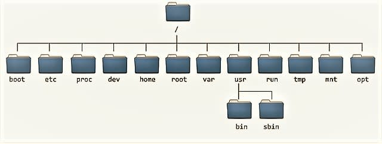
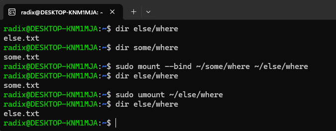

# What is Linux?

Linux is a family of open-source Unix-like operating systems based on the **Linux Kernel**. It was released by Linux Torvalds of September 17, 1991. An operating system is software that manages all of the hardware resources associated with your desktop or laptop. To put it simply, the operating system manages the communication between your software and your hardware. Without the operating system (OS), the software wouldn't function.

The Linux operating system comprises several different pieces:

#### 1. **Bootloader**

The software that manages the boot process of your computer. For most users, this will simply be a splash screen that pops up and eventually goes away to boot into the operating system.

A bootloader is a crucilal piece of software that plays a fundamental role during the startup (boot) process of your computer. Its primary responsibility is to load the operating system into memory so that the computer can transition from a powered-off state to an operational state. Think of the bootloader as the gateway between the hardware (such as the CPU, memory and storage) and the OS.

#### 2. Kernel

This is the one piece of the whole that is actually called "Linux". The kernel is the core of the system and manages the CPU, memory and peripheral devices. The kernel is the lowest level of the OS.

#### 3. Init System

This is a sub-system that bootstraps the user space and is charged with controlling daemons. One of the most widely used init systems is `systemd`, which also happens to be on the most controversial. It is the init system that manages the boot process, once the initial booting is handed over from the bootloader (i.e., GRUB or GRand Unified Bootloader). 

In this context, bootstrap as a verb usually refers to the process of setting up a project/environment/program before the main development/use/execution. Bootstrapping - in broad means to start the process from the nothing. Like think of the initializer - it initializes.

#### 4. Daemons

These are background services (printing, sound, scheduling, etc...) that either start up during boot or after you log into the desktop.

#### 5. Graphical Server

This is the sub-system that displays the graphics on your monitor. It is commonly referred to as the X server or just X.

#### 6. Desktop environment

This is the piece that the users actually interact with. There are many desktop desktop environments to choose from (GNOME, cinnamon, Mate, etc...). Each desktop environment includes build-in applications (such as file managers, configuration tools, web browsers, and games).

#### 7. Applications

Desktop environments do not offer the full array of apps. Just like Windows and macOS, Linux offers thousands upon thousands of high-quality software titles that can be easily found and installed. Most modern Linux distributions include App Store-like tools that centralize and simplify application installation. For example, Ubuntu Linux has the Ubuntu Software Center (a rebrand of GNOME software) which allows you to quickly search among the thousands of apps and install them from one centralized location.

# Linux Distributions

There are various Linux distributions (often called distros) tailored for different purposes and user preferences. Some well-known Linux distributions are,

- **Ubuntu** - A user-friendly distro with a large community and extensive software support.
- **Debian** - Known for its stability and adherence to free software principles.
- **RedHat** - Widely used in enterprise environments.
- **Kali** - Designed for penetration testing and security auditing.

A Linux distribution is a complete operating system package based on the Linux kernel. It includes,

1. **Kernel** - The core of the operating system that interacts with hardware.
2. **System libraries** - Essential libraries for software development and execution.
3. **Utilities** - Command-line tools, system services, and configuration files.
4. **Package manager** - Software for installing, updating, and managing applications. Different distros often use different package managers, e.g. APT, RPM and Pacman.
5. **Desktop environment** - Although not mandatory, most distros come with a default desktop environment.

Keep in mind a Linux distribution is a complete operating system built on top of the Linux kernel. It includes not only the kernel but also a collection of software applications, utilities, libraries, and package management systems. This differs to a desktop environment.

A desktop environment provides a graphic user interface (GUI) for interacting with the operating system. A desktop environment includes,

1. **Window manager** - Handles window placement, resizing and decorations.
2. **File manager** - Allows users to navigate files and directories.
3. **Panel or taskbar** - Displays menus, app launchers, and system notifications.
4. **Settings manager** - Provides options for configuring the desktop environment.
5. **Widgets and applets** - Small utilities (e.g., clock, weather) on the desktop or panel.

Some additional key points are,

1. **Modularity** - Desktop environments are modular and can be installed independently of the distro.
2. **Customizability** - Users can choose their preferred desktop environment.
3. **Visual Style** - Desktop environments determine how windows, icons, and menus appear.
4. **User Experience** - Different desktop environments cater to user needs (e.g., lightweight, feature-rich)

Examples of popular desktop environments include GNOME, KDE Plasma, XFCE, Cinnamon and LXQt. A distribution can offer multiple desktop environments (e.g. Fedora provides both GNOME and KDE Plasma). Conversely, the same desktop environment can be available on several Linux distributions (e.g., GNOME on both Fedora and Ubuntu).

The most crucial understanding is that, a Linux distribution provides the entire OS package, while a desktop environment enhances the user experience by providing a GUI layer on top of the kernel and system utilities. Users can mix and match distributions and desktop environments to create their preferred Linux setup.


# Linux Folder Structure

The Linux file system is defined by the [Filesystem Hierarchy Standard](https://en.wikipedia.org/wiki/Filesystem_Hierarchy_Standard) in an attempt to create a standard between many linux distributions.




1. **Root Directory** `(/)`

- The root directory is the starting point for the entire Linux file system. Everything - files, directories, and subdirectories descends from this root.
- Analogous to a plants root, it serves as the foundation for the entire directory tree.
- Absolute paths in Linux start from the root directory, e.g. `/home/user/documents/`.

2. `/bin` **(Binaries)**

Essential command binaries that need to be available in single-user mode, including to bring up the system or repair it. This includes binaries that are usable before the `/usr` partition is mounted. This is used for trivial binaries used in the very early boot stage or ones that you need to have available in booting single-user mode.

- Contains essential executable files for basic shell commands, e.g. `ls`, `curl` and `cd`.
- These programs are in binary format and are accessible to all users.
- The `/bin` directory ensures that critical commands are available even during system recovery

3. `/sbin`

The `sbin` directory contains system binaries that can only be executed by the root user. These contain commands such as `mount` or `deluser`.

4. `/dev` **(Device Files)**

- Here, we can interface with hardware or drivers as if they were regular files. You might create disk partitions here.
- Contains special files representing devices (not physically on disc).
- Examples:
    - `/dev/null` - Used to discard data.
    - `/dev/zero` - Contains an infinite sequence of zeros.
    - `/dev/random` - Contains an infinite sequence of random values.
- Device files facilitate communication with hardware components.

5. `/etc` **(Editable Configuration Files)**

Host-specific system-wide configuration files.

- Many of these files end in `.conf` and are generally text based config files
that we can modify in an editor.
- Holds core system configuration files used by adminstration and services.
- Examples include password files, networking settings, and system-wide configurations.
- Seperating configuration files from binaries ensure easier maintenance and customization.

The `/etc` directory has the following subdirectories,

1. `/etc/opt` - Configuration  files for add-on packages stored in `/opt`

2. `/etc/sgml` - Configuration files, such as catalogs, for software that processes SGML.

3. `/etc/X11` - Configuration files for the X Window System, version 11.

4. `etc/xml` - Configuration files, such as catalogs, for software that processes XML.

Additional subdirectories can be on a per install bassis, or example, when configuring NGINX, I copied the configuration file to `/etc/nginx/conf.d`

6. `/home` **(User Home Directories)**

Users home directories, containing saved files, personal settings, etc...

- Each user has a subdirectory here (e.g., `/home/<user>) containing personal files.
- User-specific settings, documents and downloads reside here.

7. `/usr` **(Unix System Resources)**

Contains system-wide resources, including executables, libraries and documentation. Secondary hierarchy for **read-only** user data; contains the majority of (multi-)user utilities and applications. Should be shareable and read-only. The subdirectories of `/usr` such as `/usr/local` is for everyone binaries. They're not per-user. Although `/usr` is pronounced like user, remember that it stands for `Unix System Resources`. The `/usr` hierarchy should contain shareable, read only data.

The `/usr` directory has the following subdirectories,

1. `/usr/bin` - Non-essential command binaries (not needed in single-user mode); for all users. Application/distribution binaries meant to be accessed by locally logged in users

2. `/usr/include` - This directory contains standard include files.

3. `/usr/lib/` - Libraries for the binaries in `/usr/bin` and `/usr/sbin`.

4. `/usr/libexec` - Binaries run by other programs that are not intended to be executed directlry by users or shell scripts (optional).

5. `/usr/local` - Tertiary hierarchy for local data, specific to the host (i.e., computer/system). The `/usr/local` hierarchy **is for use by the system administrator** when installing software locally. Typically has further subdirectories, e.g. `bin`, `lib` and `share`. Its subdirectories such as `/usr/local/bin/` is for programs that a normal user may run. It needs to be safe from being overwritten when the system software is updated. `/usr` is generally system-wide and installed from your package manager, `/usr/local` is supposed to be system-wide compiled and installed by the system administrator

`/usr` is generally system-wide and installed from your package manager, `/usr/local` is supposed to be system-wide compiled and installed by the system administrator. 

8. `/var` **(Variable Data)**

Variables files are files whose content is expected to continually change during normal operation of the system, such as logs, spool files and temporary e-mail files. The `/var/` directory has the following subdirectories,

1. `/var/cache` - Application cache data. Such data are locally generated as a result of time-consuming I/O or calculation. The application must be able to regenerate or restore the data. The cached files can be deleted without loss of data.

2. `/var/lib` - State information. Persistent data modified by programs as they run (e.g., databases, packaging system metadata, etc...)

3. `/var/lock/` - Lock files. Files keeping track of resources currently in use.

4. `/var/log` - Log files. Various logs.

5. `/var/mail` - Mailbox files. In some distributions, these files may be located in the deprecated `/var/spool/mail`.

6. `/var/opt` - Variable data from add-on packages that are stored in `/opt`

7. `/var/run` - Run-time variable data. This directory contains system information data describing the system since it was booted.

8. `/var/spool` - Spool for tasks waiting to be processed (e.g., print queues and outgoing mail queue).

9. `/var/spool/mail` - Deprecated location for users mailboxes

10. `/var/tmp` - Temporary files **to be preserved** between reboots.

---

9. `/tmp` **(Temporary Files)**

Directory for temporary files that are often not preserved between system reboots and may be severely size-restricted.

- Stores temporary files created by applications or users.
- Cleared upon system reboot.
- Ensures that temporary data doesn't clutter other directories.

10. `opt` **(Optional Software Package)**

Contains add-on and third-party software packages. These are not essential for basic system functionality, e.g. `opt/google/chrome`.

- Used for installing additional software packages not part of the default system.
- Provides a designated location for third-party software.

11. `srv` **(Service Data)**

- Contains data for services provided by the system (e.g. web server files)
- Keeps service-specific data seperate from user data.


# Package Management

Package management in Linux involves the installation, upgrading, configuration, and removal of software packages. These packages contain compiled binaries, libraries, configuration files, documentation, and other resources necessary for the software to function. The package management system ensures that software installations are organized, dependencies are resolved, and updates are applied consistently across the system.

Most modern Linux distributions include what most would consider an app store. This is a centralized location where software can be searched and installed. Ubuntu Linux (and many other distributions) rely on GNOME software, Elementary OS has the AppCenter, Deepin has the Deepin Software Center, etc...

Regardless of the name, each of these tools do the same thing; a central place to search for and install Linux software. Of course, these pieces of software depend upon the presence of a GUI. For GUI-less servers, you will have to depend upon the command-line interface for installation.

There are several package management systems used in various Linux distributions. Some of the most common ones include,

1. **APT (Advanced Package Tool)** - Used in Debian-based distributions like Ubuntu, APT provides `apt-get`, `apt`, and related commands for package management. It utilizes `.deb` packages.

2. **RPM (RPM Package Manager)** - Used in Red Hat-based distributions like Fedora, CentOS and RHEL. RPM provides commands like `rpm`, `yum` and `dnf` for package management. It utilizes the `.rpm` packages.

3. **Pacman** - Used in arch Linux and its derivatives, Pacman provides commands like `pacman` for packagement management. It utilizes `.pkg.tar.xz` packages.

4. **Portage** - Used in Gentoo Linux, Portage provides commands like `emerge` for package management. It utilizes source-based packages.

When you install packages using `apt`, the files are typically placed in standard directories within the Linux filesystem. The specific directories depend on the type of files being installed (executables, configuration files, libraries, etc...). The locations are standardized across most Linux distributions to ensure consistency and compatibility. Although previously mentioned, when installing the important directories to know are,

1. `/usr/local` - This directory is typically used for software that is not provided by the distributions package manager. Software installed here is usually compiled from source or installed manually. For example, if you compile and install software from source code, it often gets installed under `/usr/local`. The `/usr/local` hierarchy is for use by the system administrator when installing software locally. It needs to be safe from being overwritten when the system software is updated

2. `/home/<user>` - Each user on a Linux system has a home directory located under `/home`. Users can install software in their home directories for personal use. This is useful for installing software that does not require administrative privileges.

3. `/usr` - This directory contains files that are not part of the operating system itself but are installed by the system administrator. It includes system-wide software packages installed by the package manager.

4. `etc` - Configuration files for installed software are typically stored in this directory or its subdirectories.


When using package managers like APT (`apt-get` or `apt`) to install software,

- **System Administrator Installation** - When installed by the system administrator (using `sudo`), packages are typically installed under system directories like `/usr` or `/usr/local`. This ensures that the software is available system-wide and **can be used by all users**.

- **User installation** - When installed by a normal user (without `sudo`), packages are installed in directories within the users home directory, such as `~/bin` or `~local`. This allows users to install and use software without requiring administrative privileges. In Linux, the tilde `(~)` is typically used as a shortcut to represent the home directory of the current user, i.e. `~/bin` is `/home/<user>/bin`.

When we run a command such as `apt-get` to install packages, it will fetch from remote software repositories. The list of remotes can be can be observed by looking at, `/etc/apt/sources.list`.

# Mounting

Mounting refers to attaching a filesystem or storage device (such as a hard drive, network share, or partition) to a specific directory (called the mount point). When you mount something, you make its contents accessible within your file system.

Unix systems have a single directory tree. All accessible storage must have an associated location in this single directory tree. This is unlike Windows where (in the most common syntax for file paths) there is one directory tree per storage component (drive).

There is a "root" directory, which is denoted by `/`, which corresponds to the top directory on the main drive/partition (in the Windows, this would be `C:`). Any other directory and file in the system can be reached from the root, by walking down sub-directories.

Mounting is the act of associating a storage device to a particular location in the directory tree. For example, when the system boots, a particular storage device (common called the root partition) is associated with the root of the directory tree, i.e., that storage device is mounted on `/` (the root directory).

It's worth noting that mounting not only associates the device containing the data with a directory, but also with a filesystem driver, which is a piece of code that understands how the data on the device is organized and presents it as files and directories.

Let's say you want to access files on a CD-ROM. You must mount the CD-ROM on a location in the directory tree (this may be done automatically when you insert the CD). Let's say the CD-ROM device is `/dev/cdrom` and the chosen mount point is `/media/cdrom`. The corresponding command is,

```sh
mount /dev/cdrom /media/cdrom
```

After that command is run, a file whose location on the CD-ROM is `/dir/file` is now accessible on your system as `media/cdrom/dir/file`. When you've finished using the CD, you run the command `umount /dev/cdrom` or `umount /media/cdrom` (both will work; typical desktop environments will do this when you click on the "eject" or "safely remove" button).

In Windows, if you insert a USB stick in Windows, you will get a new drive, e.g. `F:`, if in Linux I mount it on directory `/media/usb`, then the top directory on the USB stick (What I would see by opening the `F:` drive in Windows) will be visible in Linux as directory `/media/usb`. In this case, the `/media/usb` directory is called a "mount point".

**Mounting applies to anything that is made accessible as files, not just actual devices**. For example, all Linux systems have a special filesystem mounted under `/proc`. That filesystem (called `proc`) does not have underlying storage, the files in it give information about running processes and various other system information. The information is provided directly by the kernel from its in-memory data structures.

# Bind mounts

A bind mount is an alternative view of a directory tree. Classically, mounting creates a view of a storage as a directory tree, this was previoulsy mentioned directly above. Instead, bind mount takes an existing directory tree and replicates it under a different point. The directories and files in the bind mount are the same as the original. Any modification on one side is immediately reflected on the other side, since the two views show the same data.

For example, after issuing the Linux command,

```sh
mount --bind /some/where /else/where
```

the directories `/some/where` and `/else/where` have the same content, which is the content of `/some/where`. **If `/else/where` was not empty, its previous contet is now hidden.** Unlike a hard link or symbolic link, a bind mount doesn't affect what is stored on the filesystem. It's a property of the live system.



In the following example above I have two directories. `~/some/where` which contains a file `.some.txt` and another directory `~/else/where/` which contains a file `else.txt`.

With the current working directory being `~`, I run the following command `sudo mount --bind ~/some/where ~/else/where`. This will create a bind mount with the mount point being, `~/else/where`. This means, the content inside of `~/else/where` is now the content inside of `~/some/where`, which can be seen by `dir else/where` and observing that the content is now `some.txt`

After observing this, we can unmount is by the command `umount` and observe that `~/else/where` has now been restored to its original content of only containing `else.txt`.

Currently visible mounts can be viewed by running `mount`. However, this does not show the source directory. Infact if I run it now, the output I receive for my current bind mount is, `/dev/sdc on /home/radix/else/where type ext4 (rw,relatime,discard,errors=remount-ro,data=ordered)`. The source directory here is not `/dev/sdc`. Therefore, we will instead use the command `findmnt` and then use `grep` to filter it down for our source directory. Hence, `findmnt | grep some/where` will correctly show us the source directory and the mount point for our recently created mount.
