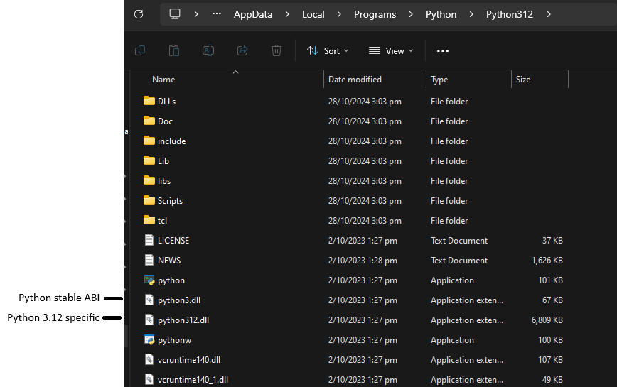

<div align="center">
  <h1> Binary Compatibility </h1>
</div>
Binary compatibility between files refers to the ability of compiled code (binaries) to work together without causing errors or crashes. Simply running on the same CPU architecture (e.g. x86, x86_64, ARM) is **necessary**, but **not sufficient** to ensure binary compatibility. The reason is that binary compatibilty depends on more than just the CPU architecture; it also involves:

1. Application Binary Interface (ABI) differences
2. Linking mechanisms
3. Memory Layout
4. Calling conventions
5. Runtime libraries

## CPU Architecture vs ABI

The CPU architecture defines the **instruction set** that the processor can execute. If binaries are compiled for the same architecture, they contain instructions that the CPU can understand. However, beyond the instruction set, there's the **ABI**, which is the contract between binaries that determines how data is passed between them, how function calls are made, and how system resources (.e.g memory and registers) are used.

### Application Binary Interface (ABI)

An ABI defines **how functions are called, how parameters are passed, how memory is managed, and how different data types are represented**. Even if two compilers generate code for the same CPU architecture, their ABIs can differ, **causing binaries from different compilers to be incompatible**. These differences arise in,

1. **Calling conventions** - How function arguments are passed and return values are handled.
2. **Name mangling** - How C++ symbol names are transformed into binary labels.
3. **Memory layout and alignment** - How data is stored in memory.
4. **Exception handling** - How exceptions are propagated across the program.

### Example: MSVC and GCC (MinGW)

Microsofts MSVC compiler and GCC (often used with MinGW for Windows) generate binaries that target the same architecture, but they use **different ABIs**, key differences include

1. MSVC use a different calling convention than GCC (e.g., `__cdecl` vs `__stdcall`), which determines whether the caller or callee is 
responsible for cleaning the stack
2. Different data type sizes - For example, [GCC](https://stackoverflow.com/questions/7134547/gcc-printf-and-long-double-leads-to-wrong-output-c-type-conversion-messes-u) uses 16 bytes for a `long double`, while MSVC aliases it to `double` (8 bytes).
3. MSVC and GCC mangle C++ function names differently due to their distinct approaches to object-oriented features. This is probably the most known issue. C++ compilers need to decorate symbols so that (among many things) function overloading is possible. There is no standard name mangling scheme, so compilers choose their own, which causes incompatibility. This occurs because code compiled with MSVC might not recognize the names in a library compiled with GCC.
4. They also have different exception handling mechanisms (SEH for MSVC vs DWARF for GCC)

This is why mixing MSVC and MinGW binaries (e.g., Qt compiled with MinGW and linking it in MSVC) will cause linking errors or runtime failures.

## Linking Mechanisms

When a program is compiled, it often depends on external libraries (e.g., system libraries or third-party libraries). The compiled binary is linked with these libraries at either **compile time** (static linking) or **run time** (dynamic linking). The format of these libraries must be compatible with the programs binarys, or the binary will fail to execute or behave incorrectly.

Even if two binaries are compiled for the same architecture, if they are linked to libraries in different formats, they are incompatible. For example, binaries compiled on Linux (Using ELF) will not run on Windows (Which uses PE) even if they target the same CPU architecture.

## Memory Layout and Data Representation

Different compilers may handle the layout of objects and data types in memory differently. This involves,

1. **Padding** - The insertion of unused bytes to align data in memory for performance reasons.
2. **Endianness** - The byte order in which data is stored (although most modern architectures are little-endian).
3. **Struct Packing** - How structs (complex data types made up of smaller types) are laid out in memory. Some compilers may add padding between fileds to ensure efficient memory access.

If two compilers do not agree on the memory layout, accessing data in memory from one binary in another way may lead to errors or corrupted data.

Consider a `struct` like this in C,

```C
struct Example {
    char a;
    int b;
};
```

One compiler may add padding after `a` to align `b` on a 4-byte boundary (since `int` is typically 4 bytes). Another compiler might use a different padding straghety. If two binaries compiled with different compilers try to access this struct, they could read incorrect values.

## Calling Conventions

The calling convention defines how functions receive arguments and return values at the assembly level, as well as how the stack is cleaned up after a function call. Different compilers and even different settings within the same compiler can use different calling conventions.

Common calling conventions include,

1. **cdecl** - The caller cleans up the stack (used by GCC).
2. **stdcall** - The callee cleans up the stack (used by MSVC for certain Windows API functions).
3. **fastcall** - Some arguments are passed via registers for efficiency.

If one binary uses `cdel` and another uses `stdcall`, a function call between them will likely result in a crash or corrupted data, as the wrong party will attempt to clean up the stack.

## Runtime Libraries

Different compilers rely on different runtime libraries to provide essential functionality, such as memory allocation, file I/O and threading. Even if two binaries target the same architecture, if they link against different runtime libraries, they may not work together. MSVC uses the Microsoft Visual C++ Runtime (`msvcrt.dll`) to handle things like heap memory management and I/O operations. MinGW on the other hand, links against its own runtime (`libgcc` and `libstdc++`). If an MSVC-compiled program tries to link dynamically against a MinGW-compiled library, there could be conflicts in runtime behaviour, leading to crashes or unexpected behaviour.

# Binary Compatility Summary

For binaries to be compatible,

1. They must target the same CPU architecture
2. They must follow the same ABI (same calling conventions, symbol name mangling, etc...)
3. They must use compatible runtime libraries
4. They should handle memory layouts and object alignment consistently
5. They must use the same linking format.

If any of these requirements are not met, the binaries will not be compatible, even if they are for the same CPU architecture.

In practice, this means that binaries compiled with different compilers (e.g. MSVC and MinGW) are often incompatible and trying to mix them will lead to errors. For smooth integration, ensure that all components of a project are compiled with the same toolchain. In general, things compiled with one compiler aren't compatible with another compiler.

# API and ABI and Binary Compatibility

## API (Application Programming Interface)

An API is a contract that defines how different software components should interact with each other. It includes,

- Function names, signatures and data types.
- How to call those functions and in what order.
- It **does not care** about the underlying implementation details - only the "interface" that the software provides.

For example, in Python, if a library exposes a function,

```Python
def add(a: int, b: int) -> int:
    return a + b
```

The **API is a contract** saying "This function `add()` takes two integers and returns an integer".

## ABI (Application Binary Interface)

An ABI **is a contract at the binary level**. It specifies how different binary components (compiled code) interact at runtime, focusing on:

- The **memory layout** of data types, e.g. how an integer is represented in memory
- **Calling conventions**, e.g. how function arguments are passed in memory or registers.
- **Binary formats** used in compiled files, e.g. `.dll`, `.so.` and `.pyd`.

While APIs focus on how to **call** functions, **ABIs ensure that binaries can link and run properly together**, defining the lower-level details of data passing, function calling, and memory layout between them.

For instance, two different binaries (compiled on different platforms or with different compilers) can share the same API (function signatures) but might have **different ABIs** - meaning they won't necessarily run correctly together.

The distinction between API and ABI compatibility is subtle but crucial,

- **API compatibility** means that the source code can compile without changes when using a different version of a library
- **ABI compatibility** means that the **precompiled binares** can run without modifications across different versions of a library.

In short, API compatibility lets you recompile and run on a new version, ABI compatibility means you don't need to recompile - you can just link and run.

## Binary Compatibility

Binary compatibility ensures that a compiled binary (`.dll`, ...) can work with **different versions of libraries or runtimes without needing to be recompiled**. It requires **both the API and the ABI to remain compatible** across different versions or implementations.

When a binary is compatible with a particular version of a library or runtime, it means,

- It can link against and call functions from the runtime or library
- The memory layout and function calling conventions of the binary match the runtime or library, ensuring correct execution.

## Summarized Comparison

- **API (Application Programming Interface)** - Defines available functions, methods, and classes for source code to compile without modification. This is strictly for the **source level (compilation)**.

- **ABI (Application Binary Interface)** -  Defines how different program modules or components interact at the binary level. It includes details like calling conventions, machine interface, and binary formats. This is strictly for the **binary level (linking and runtime)**.

- **Binary Compatibility** - Ensures that compiled binaries from different versions can work together, maintaining ABI compatibility. This is strictly at the **binary level (linking and runtime)**.

- **Backward Compatibility** - Allows newer version to support older code or data, **typically at the source code level, but may or may not ensure ABI or binary compatibility**.

## Example - Python source code and Python extension modules

Python is a dynamic language and most Python code is distributed as **source code** (`.py` files), where API compatibility is the main concern. However, things become more complex when dealing with compiled extension modules (`.pyd` and `.so` files).

These compiled modules interact with Python through both the API (Python's C API) and the ABI (binary compatibility between the extension modules and the Python interpreter)


Python exposes a C API that allows C/C++ code to interact with the Python interpreter. If we had a C function in a Python extension module that might look like this,

```C
static PyObject* my_function(PyObject* self, PyObject* args) {
    int x, y;
    if (!PyArg_ParseTuple(args, "ii", &x, &y)) {
        return NULL;
    }
    return PyLong_FromLong(x + y);
}
```

This function uses the Python C API to parse arguments (`PyArg_ParseTuple`) and return a Python object (`PyLong_FromLong`).

When compiling this C extension into a `.pyd` or `.so`, the resulting binary interacts with Python through both,

- **API** - The C API functions (`PyArg_ParseTuple`, etc.) define how your code calls into Python
- **ABI** - The compiled binary must be **binary compatible** with the Python interpreter it runs against. This means, that itt must adhere to the same memory layout for Python objects (e.g., how `PyObject` is represented in memory) and must use the same calling conventions for passing arguments and returning values between extension module and the interpreter.

## Python Wheel Format and ABI Compatibility

Python introduces a multiple version ABI compatibility through tools like `PEP 384`, which defines a stable ABI. This ensures that Python extension modules compiled against one version of the stable ABI can work with future Python versions without needing to be recompiled. Wheels can contain both pure Python code and compiled extension modules.

A wheel file name encodes information about,

1. Python version 
2. ABI compatibility
3. platforms

It has the format of `{python tag}-{abi tag}-{platform tag}`. For example, the wheel file name `mylib-1.0.0-cp39-cp39-win_amd64.whl` means,

1. `mylib-1.0.0` - The library name and version
2. `cp39` - This library is compatible with CPython 3.9
3. `win_amd64` - This is a Windows 64-bit binary

There are two main categories used for wheels,

1. **Pure Python** - Pure Python wheels are not bound to the environment that it runs in like compiled code, because it does not contain any extension modules, it can be shared between environments. 

For this reason, pure Python wheels have less restrictive tags and can be in the format of `{python-tag}-none-any`, where 

- `python tag` - Should be similar to `py2`, `py3`, as this is the supported generic Python versions it can run within.

- `abi tag` - Should be `none`, because it is not linked to Python as it's not a Python extension module

- `any` - This is because Python source code is not platform dependent, the `platform tag` is primarily used for compiled code.


2. **Python Extension Modules** - Python extension modules are libraries that they have compiled code (C/C++/Rust, ...) that has been made to be callable by the Python runtime. This is visible by the presence of `.pyd` files. Because the library contains compiled code it is therefore restricted to run on the environment it was compiled for.

Within the Python install directory, there is two important `.dll` files. One is the `.dll` that is tied to the Python interpreter version that you're currently using, such as `python312.dll` for Python 3.12, in addition to this, it also contains a `python3.dll`. The `python3.dll` is Pythons "stable ABI" and "limited API" and is enabled by library developers after `PY_LIMITED_API` is defined in their library code.

- `python3.dll` - This is a `.dll` that provides a stable ABI for Python `3.x` versions. It allows extension modules compiled with the stable ABI (using `PY_LIMITED_API`) to work across different Python `3.x` versions without recompilation.

- `python312.dll` - This is a version-specific `.dll` for Python 3.12, it includes all features and changes specific for Python 3.12, which might not be present in other versions.

While both `.dll` files are part of the same CPython runtime and can be considered binary compatible in terms of the stable ABI, they are not necessarily API compatible. The `python312.dll` might include new or changed APIs that are not presented in `python3.dll`. This means that if an extension module relies on these new or changed APIs, it would need to be compiled specifically for Python 3.12 and would not work with just `python3.dll`.

`python3.dll` ensures binary compatibility across Python `3.x` versions for modules using the stable ABI, while `python312.dll` provides the full API for Python 3.12, which may include changes that are not backward comppatible. The distinction is crucial for developers to enture their modules work correctly across different Python versions.

When a library developer uses the `PY_LIMITED_API`, they need to link to the `python3.dll` and will have the following consequences on the wheel,

- `python tag` - Will have the value `cp3`, as it's bound to work on multiple CPython versions.

- `abi tag` - Will have the value `abi3`, this means it was linked to the `python3.dll`, this is the stable release of CPython that is both ABI compatible with the Python runtime, but API compatible with varying Python3 versions, removing the need to rebuild the wheel each Python release.

- `platform tag` - Because this contains compiled code, it will also be bound to its environment and will also appear as something like `win_amd64`

When a library developer does not link towards `PY_LIMITED_API`, they will instead be linking towards the specific Python version, such as `python312.dll`. This could be due to requiring additional API functionality. The result will be the following,

- `python tag` - Will have the value `cp312`, as it's bound to the CPython 3.12 runtime.

- `abi tag` - Will have the value `cp312`, as it was linked to the `python312.dll`.

- `platform tag` - Will remain the same as above, as this is the platform its bound to.

When a library developer links to the `python3.dll`, this is very useful as it's shipped to the install directory of every `Python3X` version. Meaning, the same `python3.dll` is inside the install directory location of `python39.dll`, `python312.dll`, ... and is useful the the library developer to not recompile their library for every Python version release.



It's important to remember that when a developer is creating a library, they have `python3.lib` and `python3.dll` in their local development environment. So, let's say we are building `mylibrary.pyd` from compiling `mylibrary.cpp` and linking towards `python3.lib`.

The `python3.lib` will contain essential information such as the memory address location of functions and variables within `python3.dll`. This means, when a developer does not ship the `python3.dll` within the wheel they linked to and instead rely on the `python3.dll` that is found within the Python install directory, these memory address locations must remain unchanged. Therefore, it is essential for the `python3.dll` to remain unchanged between different Python versions found or the linked memory addresses that the library linked to from `python3.lib` will be incorrect and cause runtime errors.

Extending the API of `python3.dll` should not break binary compatibility as compilation of code is generally determinsitic, however, small changes such as the reordering of variables inside a `struct` will cause recompilation to change memory address locations or structure in memory. Therefore, extensions are acceptable when keeping the ABI stable, but, any reordering or changes that cause discrepancies between the linked `python3.lib` towards the provided `python3.dll` within the install directory will result in runtime problems.


There it important to understand the details here,

- **API compatibility** ensures that your source code can compile with different versions of Python. For library developers this means using `PY_LIMITED_API` in their code, ensuring that the API remains unchanged and the functions they want to linked to will always be present. Not using `PY_LIMITED_API` means that some API functions are not promised to keep available between different Python versions.

- **ABI compatibility** ensures that precompiled binaries can run with different versions of Python without needing to be recompiled. It is essential to remember that the library linked to `python3.lib` so the provided `python3.dll` during Python installation has the same memory address locations as to what the library linked to. ABI compatibility also refers to being ran using the runtime.
