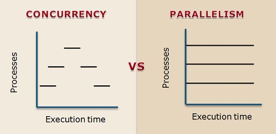

<div align="center">
  <h1> Threads </h1>
</div>

A thread is the smallest unit of execution within a process. While a process is an independent execution environment with its own memory space, threads within a process share the same memory and system resources. This shared memory model makes communication between threads faster and more efficient than between separate processes, but it also introduces challenges like synchronization and data safety.

Threads are commonly used to achieve concurrency, which allows multiple tasks to make progress simultaneously. By enabling tasks to overlap in time, threads can improve the responsiveness of applications, particularly those that involve blocking operations like I/O. Threads are used to achieve concurrency, which allows multiple tasks to be executed simultaneously and overlap in time, even though they may not truly run in parallel on multiple CPU cores.

The purpose of using threads is to improve the performance and responsiveness of applications by enabling them to handle multiple tasks concurrently. This is particularly useful when dealing with tasks that may block, such as I/O operations, as threads allow the application to make progress on other tasks while waiting.

It's important to note that while threads offer advantages for concurrent execution and I/O-bound tasks, they also come with challenges, such as the need for proper synchronization to avoid race conditions and potential performance bottlenecks when dealing with CPU-bound tasks. When designing threaded applications, careful consideration should be given to data safety and thread coordination.

<div align="center">
  
</div>

# Concurrency and Parallelism

 **Concurrency** refers to the ability of an application to handle multiple tasks simultaneously, allowing progress on multiple tasks to overlap in time. In a concurrent system, multiple tasks can be in progress, **but they don't necessarily execute simultaneously on multiple CPU cores**. Concurrency is typically achieved through multitasking and context switching, where the operating system rapidly switches between tasks, giving the illusion of simultaneous execution. Concurrency is useful when dealing with tasks that may block, such as I/O operations, as it allows the application to make progress on other tasks while waiting.

 **Parallelism**, on the other hand, involves executing multiple tasks **simultaneously on multiple CPU cores**. It allows tasks to truly run concurrently in separate threads or processes, leveraging the full potential of multi-core processors to speed up computation-intensive operations. Parallelism is suitable for tasks that can be divided into smaller, independent units that can be processed concurrently.

<div align="center">
  
</div>

Threads can be concurrent or parallel, **depending on the context and system they run on**. 

In Python, threads are concurrent but not truly parallel for CPU-bound tasks because the Global Interpreter Lock (GIL) allows only one thread to execute Python bytecode at a time. For I/O-bound tasks, threads can achieve parallelism as the GIL is released during blocking I/O operations.

In C++, threads can be both concurrent (on single-core CPUs) and parallel (on multicore CPUs), as there are no GIL-like restrictions.

# Threads in Python

In CPython, the Global Interpreter Lock (GIL) **ensures only one thread executes Python bytecode at a time**, even on multicore systems. This limits the performance benefits of threads for CPU-bound tasks **but not for I/O-bound tasks**, where threads can still improve concurrency by releasing the GIL during I/O operations. This design simplifies memory management and prevents race conditions, but it also means that multi-threaded Python programs cannot fully utilize multiple CPU cores for CPU-bound tasks. However, the result is that **threads are concurrent but not truly parallel** for CPU-bound tasks because the GIL allows only one thread to execute Python bytecode at a time.

<div align="center">
  
</div>

**For I/O-bound tasks, threads can achieve parallelism as the GIL is released during blocking I/O operations**. It is **crucial** to understand that it is possible for threads in Python to run in **parallel** if the threads **do not require the GIL**. 

Illustrated above T1 is performing the GIL free code execution, in this instance it would be the system call for reading/writing a file while T2 has grabbed the lock and performed Python code execution. Both T1 and T2 are within the `python.exe` process and because T1 is performing GIL free code execution it is running **in parallel** to T2. Without the multithreading approach when T1 is reading/writing to a file, their is no other thread to give the lock and continue performing tasks in parallel, therefore taking longer to complete.


# Core API for Threads

To create a minimal working thread in Python we need to use create a `thread.Thread` object and then initialize it by calling `start()`. The following code will start a thread within the current process.

```python
import threading
import time

def print_numbers():
    for i in range(5):
        print(f"Thread {threading.current_thread().name}: {i}")
        time.sleep(1)

thread1 = threading.Thread(target=print_numbers, name="Worker 1")

thread1.start()

thread1.join()

print("Main thread: All threads completed.")
```

#### Creating a Thread

To create a thread in Python, we use `threading.Thread`. This initializes an object with the following parameters,

- `target` - The callable (function or method) to run in the thread.
- `args` - A tuple of positional arguments for the target.
- `kwargs` - A dictionary of keyword arguments for the target
- `name` - A name for the thread
- `daemon` - A boolean, if `True`, the thread is a daemon thread and will terminate when the main program exists.

```python
def worker(name):
    print(f"Worker {name} is running")

thread = threading.Thread(target=worker, args=("Thread 1",))
thread.start()
```

#### Starting a Thread

To start a thread, **we must use** `Thread.start()`. This will start the threads activity by invoking the `run()` method. The thread begins executing the target function. To start a thread you should call `start()` and **not** `run()`.

The `run()` method contains the code that the thread will run. The `start()` method "starts" a new OS thread that then runs the code in that `run()` method. Hence `threading.current_thread().name` within `run()` will give us `MainThread`.


```python
thread.start()  # Runs the target function in a new thread
```

#### Joining a Thread

When you join a thread, it waits for the thread to complete its execution. If `timeout` is specified, it will wait up to that many seconds.

In the previous example we have,

```python
thread1.start()

thread1.join()

print("Main thread: All threads completed.")
```

This will output,

```
Thread Worker 1: 0
Thread Worker 1: 1
Thread Worker 1: 2
Thread Worker 1: 3
Thread Worker 1: 4
Main thread: All threads completed.
```

This occurs as the main thread will stop on `thread.join()` until the thread has ran to completion and will not call `print("Main thread: All threads completed.")` until the thread has completed. However, if we remove `thread1.join()` the main thread will continue execution and immediately attempt to execute `print("Main thread: All threads completed.")`. 

#### Thread Locks

A lock is an object that acts like a "gatekeeper" for critical sections of code. When a thread acquires a lock, it effectively "locks the gate", **preventing other threads from entering** the critical section until the lock is released.

Locks are commonly used to protect shared resources like global variable, files or any data structure that could be corrupted if accessed by multiple threads simultaneously such as mutable lists by ensuring that. Locks are commonly used to make a piece of code or a resource "thread-safe" in a multithreaded environment. The term thread-safe means that the code or resource can be safely accessed or modified by multiple threads without causing unintended behaviour, corruption or race conditions.

The key concepts of locks are,

1. **Acquire** - A thread attempts to acquire a lock before accessing shared resources.

2. **Release** - A thread releases the lock when it's done with the resource, allowing other threads to acquire it.

3. **Deadlock** - A deadlock occurs when two or more threads are waiting on each other to release locks, preventing them from proceeding.

Consider a shared counter incremented by multiple threads:

```python
import threading

counter = 0 # Shared resource

def increment_counter():
    global counter

    for _ in range(100_000):
        counter += 1

threads = [threading.Thread(target=increment_counter) for _ in range(5)]

for thread in threads:
    thread.start()

for thread in threads:
    thread.join()

print(f"Final counter value: {counter}")
```

If all threads safely incremented, the counter should be `500,000` (5 threads × 100,000 iterations). The counter value is inconsistent (e.g., `478923`). This occurs because of a race condition, where threads simultaneously access and modify counter.

To fix the race condition, we can use a `thread.Lock`.

```python
import threading

counter = 0 # Shared resource
lock = threading.Lock()

def increment_counter():
    global counter

    for _ in range(100_000):
        with lock: # Acquire lock
            counter += 1 # Modify shared resource safely

threads = [threading.Thread(target=increment_counter) for _ in range(5)]

for thread in threads:
    thread.start()

for thread in threads:
    thread.join()

print(f"Final counter value: {counter}")
```

1. A `threading.Lock` is created.

2. The critical section (incrementing `counter`) is enclosed within a `with lock` block. This automatically acquires and releases the lock.

3. Only one thread can execute the critical section at any time, ensuring data integrity.

The counter value is consistently `500,000`.

Newer versions of Python support using a context manager to acquire the lock using,

```python
with lock:
  ...
```

whereas the older behaviour needs to acquire it manually and use the following format,

```python
lock.acquire()

try:
  ...
finally:
    lock.release()
```

Where `lock.acquire()` will block and wait until it requires the lock.

# When to Use Threads

#### Performing I/O-bound Tasks Concurrently

When an application interacts with external resources like files, databases or network calls the CPU often spends time waiting for these operations to finish. Using threads allows other tasks to continue while waiting for I/O to finish. When we have multiple threads and any thread has a blocking call, it will be blocked within that thread. Meaning, other threads are still able to be executed and perform tasks.

#### Asynchronous Behaviour for Legacy Libraries and Dependencies 

If you are working with third-party libraries or modules that **are not designed to support asynchronous operations**, using threads can be an effective way to introduce concurrency into your application. This is a simple solution when you do not have access to modify the source code. 

Asynchronous code needs to be used within an event loop and using if the application does not have one setup such as `asyncio` for Python, threads are a simple alternative to allow for concurrent behaviour. This is useful if we have a GUI application and do not want to integrate the UI event loop and the asynchronous library event loop.

#### User Interface Responsiveness 

In graphical user interfaces (GUIs), threads can be used to offload time-consuming tasks from the main thread (often called the UI thread) to ensure the responsiveness of the UI and prevent it from freezing during long-running operations. 

If we were to run a computationally expensive operation that took 3 seconds inside a UI thread, it will freeze it over the duration. However, using threads, context switching will allow the UI thread to occassionally run paint and event operations to aid in responsiveness and not "freeze" the application until the computation has completed

# Daemon Threads

A daemon thread is a type of thread that runs in the background and **does not prevent the application from exiting**. These threads are typically used for background tasks that are not essential to the main program's execution. Because daemon threads do not halt the main process from finishing they're ideal for background threads such as,

1. **Garbage collection**
2. **Session management**
3. **Periodic clean-up operations**
4. **Logging**
5. **Background monitoring**

The lifecycle of a daemon thread is tied to the lifecycle of the main thread. If all non-daemon threads finish execution, the Python interpreter will exit, **stopping all daemon threads immediately**.

Let's view a quick example,

```python
import threading
import time

def daemon_thread():
    print("Daemon Thread: Starting")
    time.sleep(2)
    print("Daemon Thread: Finished")

thread = threading.Thread(target=daemon_thread)
thread.daemon = True

thread.start()

print("Main Thread: Done")
```

In this example, the output will be

```
Daemon Thread: Starting
Main Thread: Done

Process finished with exit code 0
```

It is crucial to understand that `Daemon Thread: Finished` **was never outputted to the console**. This is because the main application execution completed and because it is a daemon thread, it was killed. Now, let us compare to what would happenen when we remove

```python
thread.daemon = True
```

Execution of the script, we can see

```
Daemon Thread: Starting
Main Thread: Done
Daemon Thread: Finished

Process finished with exit code 0
```

When the main application ran to completion, the output of `Daemon Thread: Finished` was output to the console. This is because **it is not a daemon thread**. The main application will not exit **until all threads have ran to completion**.

# Threads and Asynchronous Code

#### Threads

- Use threads when you have many I/O-bound tasks to perform, and you want to execute them concurrently to reduce the overall waiting time.

- Threads are useful when you are working with libraries or modules that are not natively designed to support asynchronous operations. For example, when working with traditional blocking I/O libraries that do not provide asynchronous interfaces.

- Threads are also suitable when the external resources you are interacting with (e.g., web servers, APIs) have a relatively long response time, and the overhead of thread creation and management is not a significant concern.

- It is very difficult to write code that is thread safe. With asyncronous code, you know exactly where the code will shift from one task to the next and race conditions are therefore much harder to come by. The I/O part of threaded code is relatively easy but managing the shared state between threads (using locks/queues/etc) without race conditions is what makes it tricky. Using an async model means you have less going on at the same time so races are easily avoided. 

- Threads consume a fair amount of data since each thread needs to have its own stack. With async code, all the code shares the same stack and the stack is kept small due to continuously unwinding the stack between tasks.

- Threads are OS structures and are therefore more memory for the platform to support. There is no such problem with asynchronous tasks.

#### Asynchronous Code

- Use asynchronous code when you have a large number of I/O-bound tasks that spend a considerable amount of time waiting for responses (e.g., network requests, file I/O).

- Asynchronous code is more efficient than threads when dealing with many small I/O-bound tasks because it allows a **single thread to manage multiple asynchronous tasks** without the overhead of creating and switching between multiple threads.

- Asynchronous programming is particularly useful when the responsiveness and scalability of the application are crucial factors.

- Asynchronous frameworks, like Python's `asyncio`, are specifically designed for handling I/O-bound tasks efficiently and can provide excellent performance in such scenarios.

- Asynchronous code utilizes an [event loop](https://github.com/Michael-Cowie/Notes/blob/main/Python/asynchronous_programming.md#event-loop) **on a single thread** which differs the internal representation of concurrent behaviour to threads.

The choice between threads and asynchronous code often comes down to whether the libraries and external resources you are using have good support for asynchronous operations. If the libraries are asynchronous-friendly and you have many small I/O-bound tasks, `asyncio` or other asynchronous frameworks can offer significant advantages in terms of performance and scalability.

# Task Manager Analysis on Threads

It is important to know that **each thread can only run on a single CPU core**. Therefore if we open up task manager we can determine if we are IO Bound by analyzing the CPU usage when executing multi-threading code. If the CPU usage is much higher when running synchronous code, it means that multiple threads are working in parallel. Meaning it is spending a lot of time reading/writing files in some threads while the GIL thread is still executing, **leading to a much higher CPU usage**.