<div align="center">
  <h1>  Virtual Addresses </h1>
</div>
Virtual addresses are mainly used to address three core problems,

#### Problems With Memory

Virtual addresses are mainly used to address three core problems. If all programs have access to the same 32-bit memory space,

- It can **crash** if less than 4GB of RAM memory in the system.
- Can **run out of space** if we run multiple programs.
- Can **corrupt** other program's data.

#### Not Enough RAM

The first of these problems is if you don't have enough RAM in your computer. This problem was really the motivation for virtual memory in the first place. It use to be that RAM was really expensive and so we would want to use it very efficiently and we needed to be able to run programs even if you did not have enough memory.

Now, these days we tend to have sufficient RAM in our computers so this is much less of a problem, infact if we run out of memory on a computer today and have to use virtual memory as a result, it generally slows things down so much it's almost not worth doing. However, their are other problems that we have aswell.

#### Holes In Our Address Space

If you run multiple programs together and then you quit some of them, you leave these chunks of memory that are unavailable.

#### Programs Writing Over Each Other

We also have problems of programs writing over each other. We promise each program that it could access 32 bits of address space and so if we have two programs that both write to the same address, what happens? Do they write over each other? How do we keep them from crashing each other.

#### So Virtual is Virtual Memory?

Basically, virtual memory is simply indirection. Virtual memory is the idea that we take the address that the program uses and we map it to the real address in memory. By having this mapping going back and forth we can do a lot of interesting things about controlling where the memory goes and how we use it. Soon, I will demonstrate how this indirection will solve the problems above and also discuss page tables and translation, which is how we store the mappings and actually perform the mappings.

The key thing here is that virtual memory is what the **program sees**. While physical memory is the **physical RAM** in the computer.

#### How can we solve this?

Well, the key to this problem is in the wording **"same memory space"**. The reason we are having all these problems is due to the fact that we have **the same memory space for everything**. Every program has the same memory space and the installed RAM has the same memory space, because it is all the same, we do not have any flexibility.

So, if we can give each program it's **own** virtual memory space, then we can start solving these problems. This is what virtual memory does, it gives **each program** it's own virtual memory space and then maps it to the physical.

**Virtual memory is a layer of indirection**

Virtual memory takes **program addresses** and **maps** them to a **RAM address**.

#### Solving - Not Enough RAM

Programs can access any byte in their 32-bit address space. A 32-bit address space gives (theoretically) 4GB of memory you can address. In practice the OS reserves some if it. This comes from $2^{32}$ = `4 294 967 296`, which is 4.3GB, where each memory address is one byte and 1G = `1e9`.

Here, **each program** will receive 32-bit address space. Now, what if we don't have 4GB of memory? Go back in time, this was a practical problem where noone had 4GB of RAM, now it's quite common.

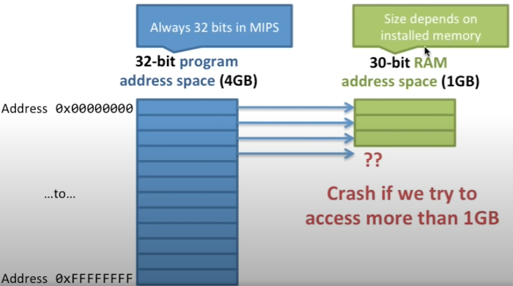

What happens when our program tries to use more than the 1GB of memory that is in our machine, well their is no memory there. Therefore, without virtual memory we will crash as we cannot access this component of the address space.

We promise each program a 32-bit address space, but the actual amount of memory address space we have depends on how much RAM is installed.


In the following example the memory address 0 maps to 1, 1 to 0, 2 to 2, however 3 can be mapped to the hard disk. Therefore, the program will **not crash**, it knows to go get the data from disk before it can continue. Virtual addresses gives us flexibility on how we can use physical memory when mapping.

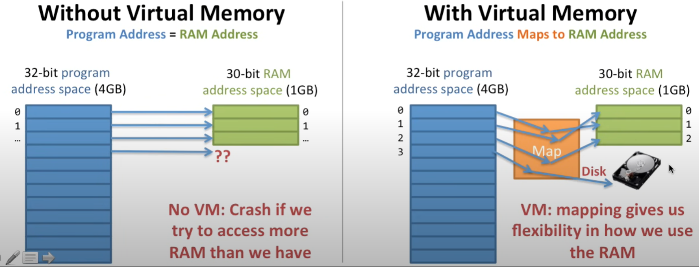

The trying to load a memory address that is on disk the following occurs,

1. Go to the map and try to access memory address 3.
2. The VM will complain as their is no more space in RAM.
3. Because of the flexibility we can move the data around. What will happen is that it will place address 3 in RAM. The VM will move the oldest data (0) to disk instead. **This is called a page out.**
4. After shuffling data, the map will be updated. This means it will say address 0 is in disk and address 3 is in a new address in RAM.

Mapping lets us use our disk to give the illusion of unlimited memory, meaning a program can use all 32-bit address space without problems as we can place it on disk when required. This is how it solves the problem of not enough memory.

The problem with this is that we get **horrible performance**. Reading from disk is slower than RAM. Remember that disks are **1000 * slower than RAM**. Anytime you can't fit your data in memory and have to go to disk you pay a HUGE performance penalty, this is why buying more RAM makes your computer faster.


#### Solving - Holes In Our Address Space

When we have multiple programs running together, they will share the memory and we put them in memory.

In this first example we have Program 1, Program 2 and Program 3. Here, we will run Program 1 and then run Program 2, both loaded into memory.

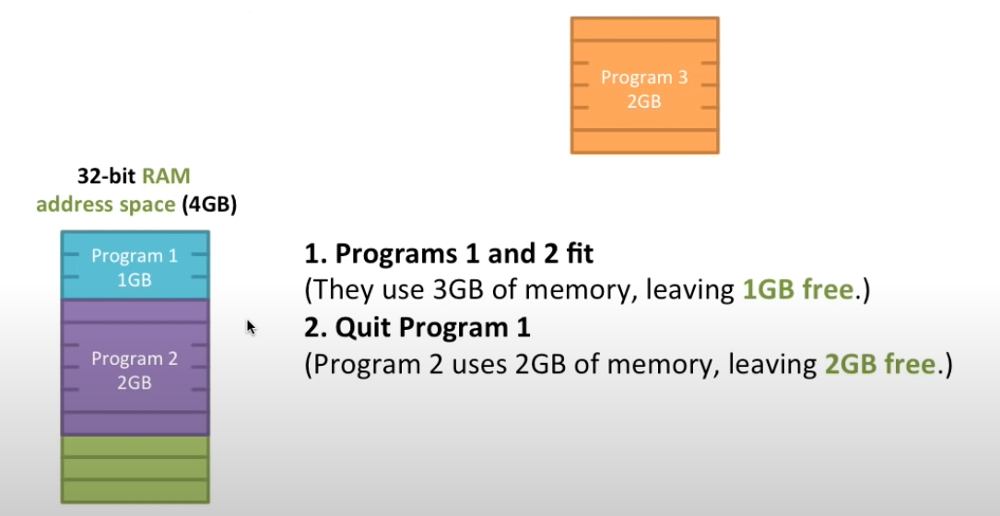

Now, what happens if we quit Program 1? We have now freed up 1GB of memory for other programs to use. The program is that we can't run Program 3, despite being their 2GB of memory available for Program 3. This is because we do not have 2GB of memory in a row for Program 3. This is called memory fragmentation, where we have holes in our memory due to the order in which we ran the programs.

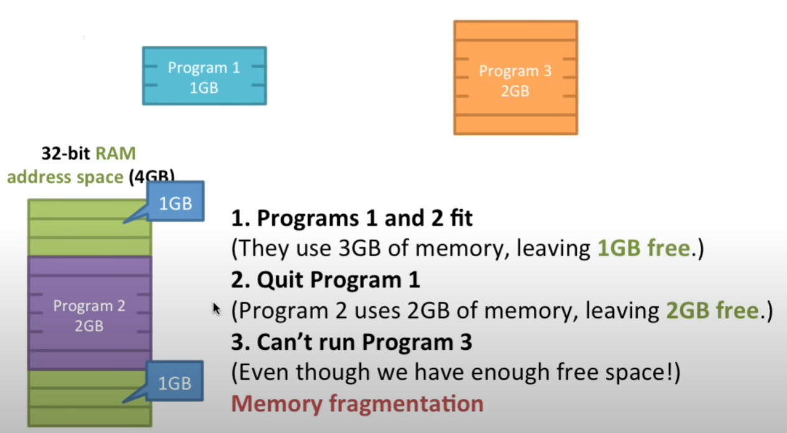

A map can help resolve the following problems by mapping Program 3 wherever we want with the added flexibility to fill up the holes.

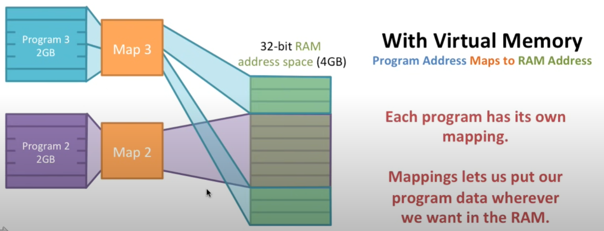

#### Solving - How Do We Keep Programs Secure?

Each program can access any 32-bit memory address, so what will happen if multiple programs access the same address? In this situation, we can have two different programs that execute the same instruction `sw R2, 1024(R0)`, which will write to address 1024 regardless of the program that's running.

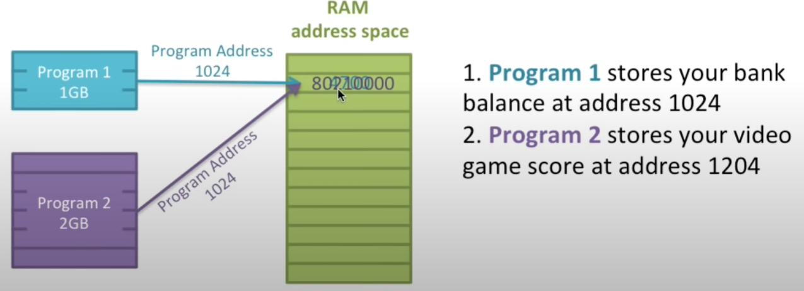

Now, in this example they have overwritten each other. Because we do not have a way to seperate the memory they're accessing, they're both trying to access memory 1024, which is perfectly legal, they're going to bump into each other. Hence, they can corrupt or crash each other, which is related to security and reliability.

This is why programs and computers crashed a lot in the past, because we were not using virtual memory.

The following example, both programs will store data in address 1024. However, the OS will map these to different locations in the RAM address and therefore not cause memory collision.

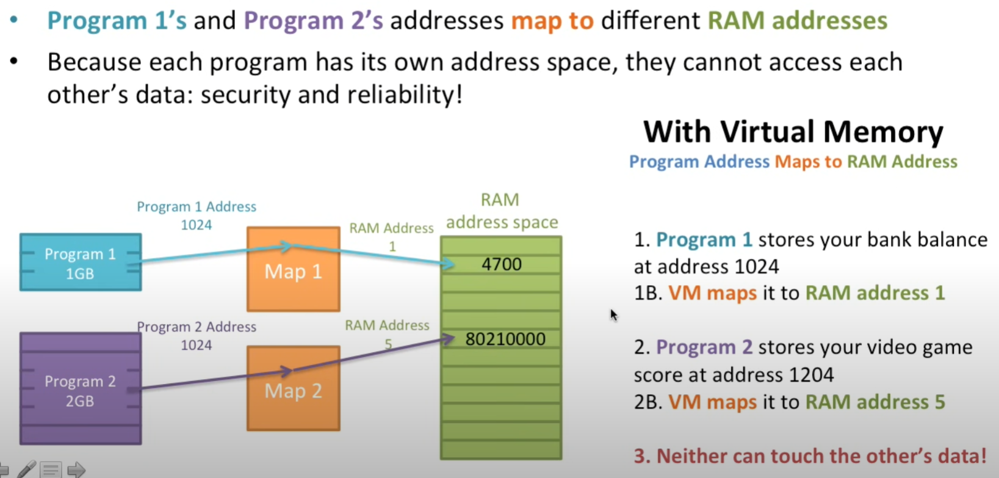

#### Making a VM Work: Translation Table

First, we need to know how a program accesses memory. It is,

1. The program executes a load specifying a virtual address (VA).
2. The computer translates the address to the physical address (PA) in memory.

The following is a diagram demonstrating a `1:1` mapping.

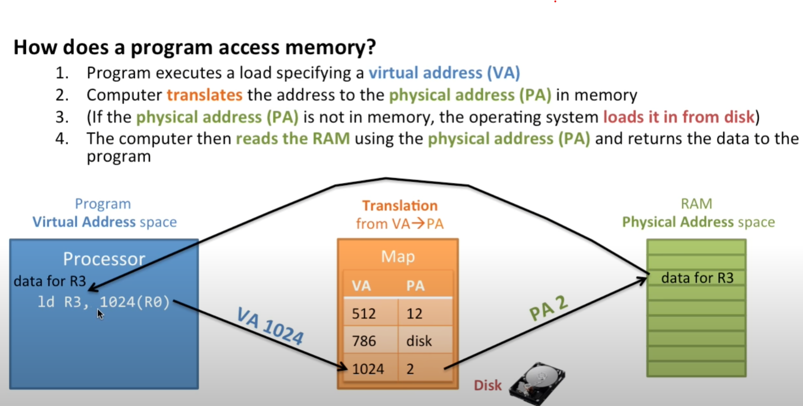

#### Page Tables

The map from virtual address to physical addresses is the **Page Table**. So far we have had one **Page Table Entry (PTE)** for every virtual address. The question is now, how big is this? 

 We have $2^{32}$ virtual addresses, we have $2^{32}$ *(number of bits for VA + number of bits for PA) just to keep track of the page table, this will add up very quickly! Hence, we need a different approach to solve this.

 #### Page Table Size

 We need to translate every possible address, which our programs have a 32-bit virtual address space. Given the calculation above, this can grow very quickly and we need to make this more manageable. This can be done by dividing memory up into chunks (pages) instead of words.

 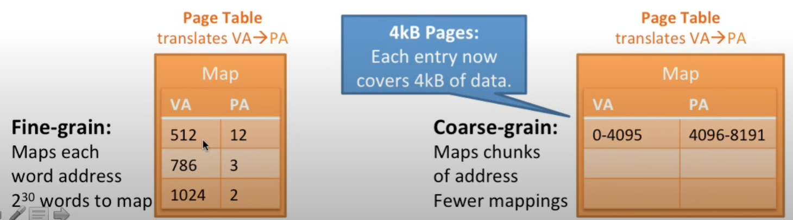

 This means that each Page Table Entry has a range of 4kB chunk of data. Now, each data entry covers a range of 4096 memory address, whereas the previous mapping covers 1 memory address translation per entry. Now, each Page Table maanges larger chunks (pages) of data. Fewer Page Table Entries needed to cover the whole address space. One negative is that it is less flexible in how to use it in RAM because we have to move an entire page at a time.

 In a 32-bit system, the virtual address space can address $2^{32}$ unique addresses, which is 4 GB (gigabytes) of memory. If you have a 4 KB (4096 bytes) page size, you can calculate the number of entries in the page table as follows:

```
Number of Entries = Total Addressable Space / Page Size

Number of Entries = 4 GB / 4 KB

Number of Entries = (2^32 bytes) / (2^12 bytes)

Number of Entries = 2^(32-12)

Number of Entries = 2^20
``````

So, for a 32-bit program with a 4 KB page size, you would need $2^{20}$ (or 1,048,576) entries in the page table to cover the entire 4 GB virtual address space.

#### How Do We Map Addresses With Pages?

Previously, this was very easy as it was a `1:1` conversion, now we need to do a minor calculation with an offset. However, now the mapping is done by ranges. To do this we must think of our Virtual Address Space and Physical Address Space in pages. Hence, we convert the VA to PA in pages and then perform the offset.

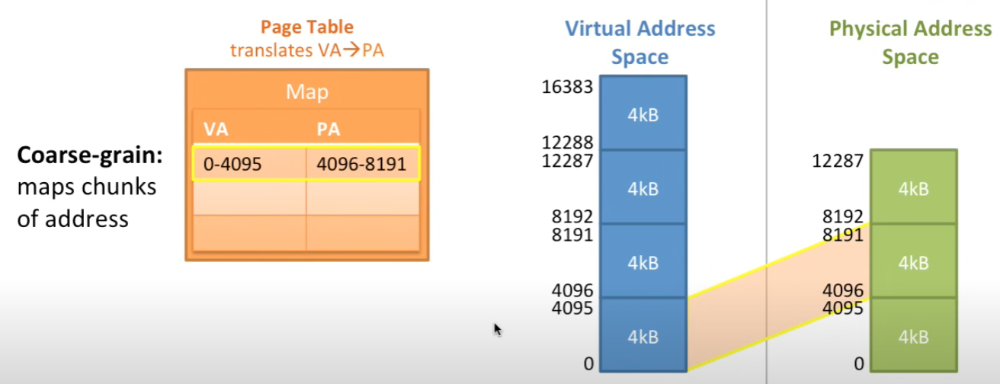

From the example above, what would be the Physical Address for Virtual Address 4? Well we know the the Virtual Address for 4 is in the Page 0 (0 to 4095), which means we need to go to Page 0 for the Physical Address (4096 to 8191) and add the offset of 4. Hence, the answer is `4096 + 4` = 4100.

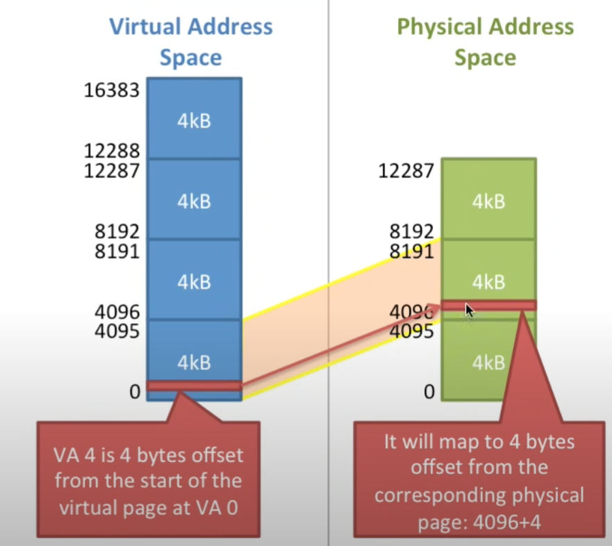

Now, this offset will change the number of available pages that we can use because we need to reserve come of the bits to create the offset, i.e. if we have a 32-bit machine we need `x` bits for the number of pages and `y` bits for the offset, where `x + y = 32`.

Now, what happens on a 32-bit machine with 256MB of RAM and 4kB pages? Well, we need 32-bits for the virtual address space and 28 bits for the physical address space. The pages are of 4kB size, meaning we need 12 bits for the off set, because $log_2  4000 \ = \ 12$. Therefore we have 20 bits for the virtual page number and 12 bits for the page offset and also 16 bits for the physical page number and 12 bits for the page offset. The page offset bits will always be the same.

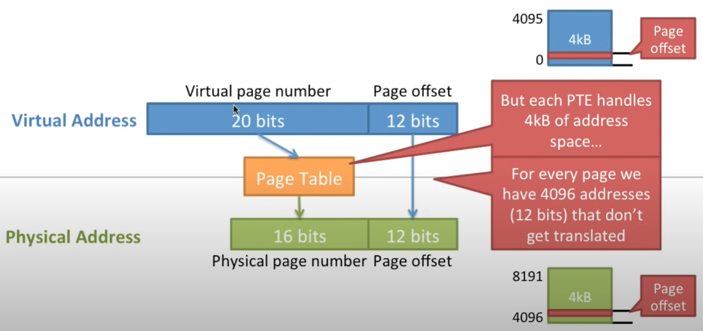

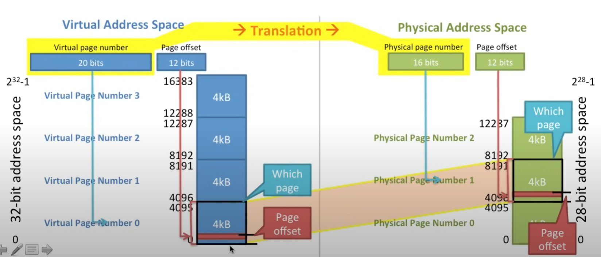

Let's walk through one more example. Here, we have the virtual address `0x00003204`. The first 20 bits will be reserved for the page number and the remaining 12 will be the page offset. This is an address represented in hexadecimal, meaning, each number is 4 bits (0 -> 9 and A -> F), hence, the first 5 numbers are 20 bits and the final 3 are 12 bits.

From here we can see that the virtual page number is `0x00003`, which is 3, and `0x204`, which is a constant page offset.
Looking at the translation table, the page number for the virtual address of 3 translates to `0x0006`, which is the physical address page number. Now, we join those back together to create the physical address of `0x0006204`, i.e. `0x0006` + `0x204`.

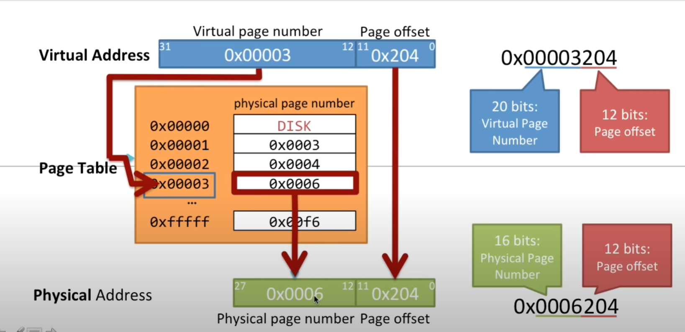

#### Page Faults

This is what happens when the data is not in RAM. We know this will occur when a page table entry points to disk. From the example above, this would occur if the page number was `0x00000` because the physical page number is `DISK`, then we know the page is on disk.

1. When the Page Table Entry says the page is on disk, the hardware (CPU) generates a **page fault exception**. 
2. This exception will then be caught by the operationg system. 
3. The hardware jumps to the OS page fault handler to clean up.
4. The OS chooses a page to evict from RAM and write to disk.
5. If the page is dirty, it needs to be written back to disk first. "dirty" means the data has been changed (written). If the page has been written since it was loaded from disk, then it doesn't have to be written back.
6. The OS then reads the page from disk and puts it in RAM.
7. The OS then changes the Page Table to map the new page.
8. The OS jumps back to the instruction that caused the page fault. This time it won't cause a page fault since the page has been loaded.

This process is a painfully long time. Disks are **much slower** than RAM, so every time you have a page fault it takes a painfully long time. Which is why it is always a good idea to get more RAM if this is an ongoing problem. Page faults are the SLOWEST possible thing that can happen to a computer (except for human interaction).

#### Making Virtual Memory Fast, the TLB (Translation Lookaside Buffer)

For each memory access with virtual memory we need to do the following,

1. Access the page table in RAM
2. Translate the address
3. Access the data in RAM

This is a lot of work for every memory access and remember we have an average of 1.33 accesses for each instruction. It is going to be very expensive this way and we need to find a way to do it faster, so in practice it is done slightly differently.

How can we make a page tabel look up really really fast? Well, software would be far too slow and also add on additional instructions required. The solution here is to have a page table cache inside the hardware. To make VM fast we add a special **Page Table cache**, called the Translation Lookaside Buffer (TLB).

The full page table will still sit in memory, but remember if our VA need to access the RAM each translation, this will be too slow.

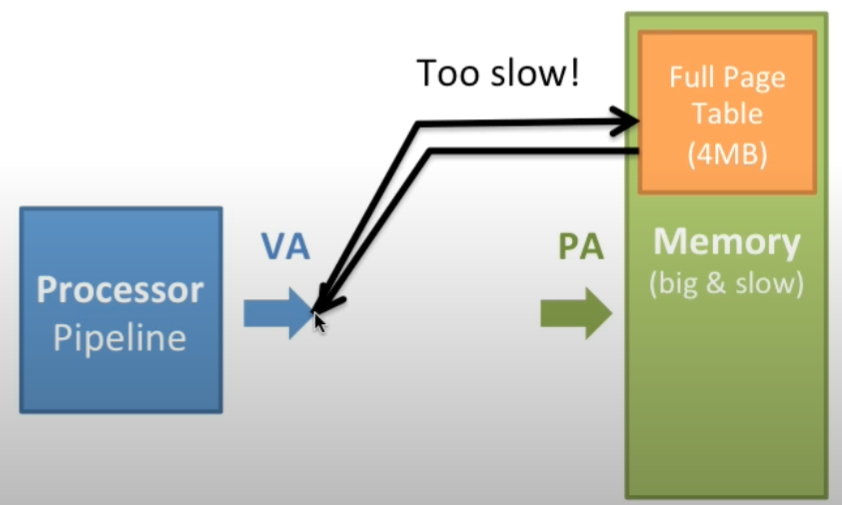

This is where the TLB comes into fruition, where we add this cache. If the TLB does not have the data, then we will pull it from the page table and store it in the TLB, so that the next translation, we do not need to grab it from the page table.

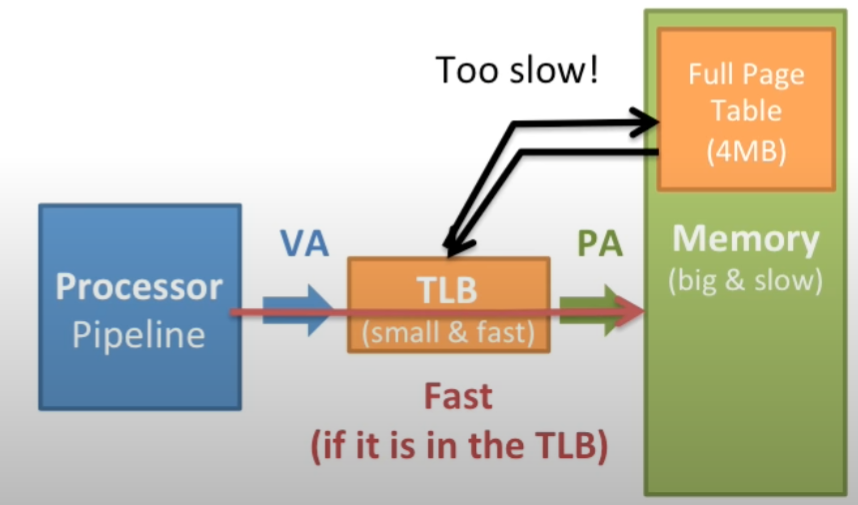

#### Virtual Addresses Examples with PDB Files

A practical example of virtual addresses come into play with `.pdb` files. A PDB file stands for "Program Database" file. PDB files are generated by Microsoft Visual C++ compiler (MSVC) and are used for debugging and symbol information. These files are associated with the debugging process and contain important information that helps developers debug and analyze their C++ program. Remember that all binary files have text based information removed from them, this means that function names, symbols, human readable information are all stripped away because the computer does not need them to run the program. 

PDB files contain debugging information that associates compiled machine code with the corresponding source code. This information includes symbol names, source file names, line numbers and more. It helps debugging tools like debuggers, associate executable code with the original source code, amaking it easier to identify and fix issues.

Inside compiled programs, their already exists memory address locations. However, these are **virtual addresses**. The purpose of the PDB files is that developers, when debugging a program will be able to map the memory address locations inside the compiled file back to the function names so that the developer can debug the program. These function names and the associated memory address will be inside the PDB file. Without the PDB file, their is no way of linking back the information inside the binary file back to a human readable format.

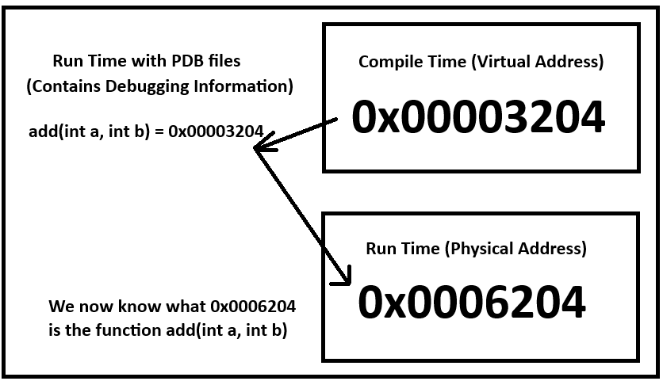