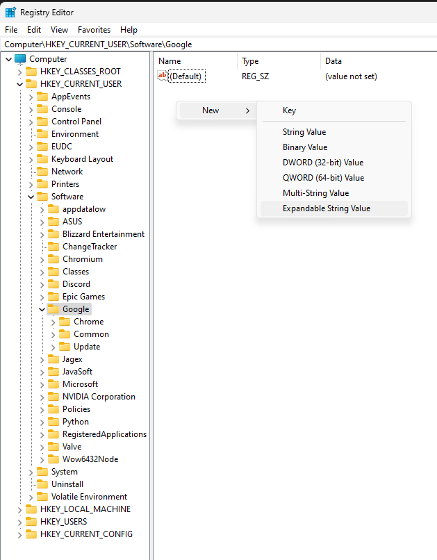

<div align="center">
  <h1>  Windows Registry </h1>
</div>
The Windows Registry is a hierarchical database that stores configuration settings and options for the Microsoft Windows operating system. It contains information about the system, hardware, installed software, user preferences, and more. The registry is organized into keys, subkeys, and values, which collectively store the data used by Windows and its applications.



Their are three important words areas to understand here and it is the HKey, Key and Name.

Here I will provide a small Python snippet to demonstrate the basic jargon (Excluding data type specific handling and error catching),

```Python
import winreg

key = winreg.OpenKey(winreg.HKEY_CURRENT_USER, r"Software\Google", 0, winreg.KEY_READ)
value, type_id = winreg.QueryValueEx(key, "MyExample")
winreg.CloseKey(key)
print(value, type_id, winreg.REG_SZ)
```


Their are six data types currently available and here I will explain each,

#### String Value (REG_SZ)

- This data type is used to store single-line text data, represented as a string.
- Example: Storing a user's name or a simple configuration settings.
- The `SZ` in `REG_SZ` stands for `String Zero-terminated`. When a value is stored as `REG_SZ`, it is considered a null-terminated string, meaning it is a sequence of characters terminated by a null character `'\0'`. The null character is used as a delimiter to mark the end of the string, indicating that there are no more characters following it.

#### Binary Value (REG_BINARY)

- The `REG_BINARY` data type is used to store raw binary data. It can represent any type of data, including text, images, or other non-textual information.
- Example: Storing machine code, encryption keys, or binary data for a custom file format.

#### REG_DWORD (32-bit Integer Value)

- `REG_DWORD` is a 32-bit integer value, commonly used to store boolean flags or numeric settings.
- Example: Storing configuration options with numerical values like screen resolution, number of processors, etc.

#### REG_QWORD (64-bit Integer Value):

- `REG_QWORD` is a 64-bit integer value, used for storing large numbers that do not fit into a `REG_DWORD`.
- Example: Storing a large numerical value, such as a timestamp representing a future date.

#### REG_MULTI_SZ (Multi-String Value)

- The `REG_MULTI_SZ` data type is used to store a list of strings, separated by null-terminator characters (`\0`).
- Example: Storing multiple configuration settings or a list of installed applications.

#### REG_EXPAND_SZ (Expandable String Value):

- This data type is similar to `REG_SZ` but allows the use of environment variables that will be expanded when the value is read.
- Example: Storing a file path that includes an environment variable, like `%SystemRoot%\System32`.

It's important to note that these data types are used to define the format in which data is stored in the registry. When reading or writing values to the registry using programming languages like Python or C#, you need to specify the appropriate data type to ensure the data is correctly interpreted and stored. Using the correct data type is crucial for the proper functioning of the system and applications that rely on the registry settings.

#### Python Example

Within this code example, I will create the following registry key `MyRegistryKey\MyApp` and populate it each data type.


Initially, the line `winreg.CreateKeyEx(key=winreg.HKEY_CURRENT_USER, sub_key=key_path, reserved=0, access=winreg.KEY_CREATE_SUB_KEY)` must first be ran. This line creats the registry key which will then be later populated. The full code will finally become,

```Python
import os
import winreg


key_path = r"MyRegistryKey\MyApp"
winreg.CreateKeyEx(key=winreg.HKEY_CURRENT_USER, sub_key=key_path, reserved=0, access=winreg.KEY_CREATE_SUB_KEY)


def create_registry_keys():
    # REG_SZ (String Value)
    value_name = "StringValue"
    value_data = "Hello, Registry!"
    create_reg_key(value_name, winreg.REG_SZ, value_data)

    # REG_BINARY (Binary Value)
    value_name = "BinaryValue"
    value_data = bytes([0x48, 0x65, 0x6C, 0x6C, 0x6F, 0x2C, 0x20, 0x52, 0x65, 0x67, 0x69, 0x73, 0x74, 0x72, 0x79])
    create_reg_key(value_name, winreg.REG_BINARY, value_data)

    # REG_DWORD (32-bit Integer Value)
    value_name = "DwordValue"
    value_data = 42
    create_reg_key(value_name, winreg.REG_DWORD, value_data)

    # REG_QWORD (64-bit Integer Value)
    value_name = "QwordValue"
    value_data = 9223372036854775807
    create_reg_key(value_name, winreg.REG_QWORD, value_data)

    # REG_MULTI_SZ (Multi-String Value)
    value_name = "MultiStringValue"
    value_data = ["Value1", "Value2", "Value3"]
    create_reg_key(value_name, winreg.REG_MULTI_SZ, value_data)

    # REG_EXPAND_SZ (Expandable String Value)
    value_name = "ExpandableStringValue"
    value_data = r"%LOCALAPPDATA%"
    create_reg_key(value_name, winreg.REG_EXPAND_SZ, value_data)


def create_reg_key(value_name, value_type, value_data):
    try:
        key = winreg.OpenKey(winreg.HKEY_CURRENT_USER, key_path, 0, winreg.KEY_WRITE)
        winreg.SetValueEx(key, value_name, 0, value_type, value_data)
        winreg.CloseKey(key)
        print(f"Registry key '{value_name}' of type '{value_type}' successfully created with value '{value_data}'.")
    except Exception as e:
        print(f"Error creating registry key: {e}")


def read_registry_key(value_name):
    try:
        key = winreg.OpenKey(winreg.HKEY_CURRENT_USER, key_path)
        value, value_type = winreg.QueryValueEx(key, value_name)
        winreg.CloseKey(key)

        if value_type == winreg.REG_SZ:
            print(f"String Value: {value}")
        elif value_type == winreg.REG_BINARY:
            print(f"Binary Value: {value}")
        elif value_type == winreg.REG_DWORD:
            print(f"DWORD Value: {value}")
        elif value_type == winreg.REG_QWORD:
            print(f"QWORD Value: {value}")
        elif value_type == winreg.REG_MULTI_SZ:
            print(f"Multi-String Value:")
            for val in value:
                print(f"  - {val}")
        elif value_type == winreg.REG_EXPAND_SZ:
            expanded_value = os.path.expandvars(value)
            print(f"Expandable String Value: {expanded_value}")
        else:
            print(f"Unknown Value Type: {value_type}")
    except Exception as e:
        print(f"Error reading registry key: {e}")


# Create the registry keys first
create_registry_keys()

# Read and print all the values
print("\nReading the registry values:")
read_registry_key("StringValue")
read_registry_key("BinaryValue")
read_registry_key("DwordValue")
read_registry_key("QwordValue")
read_registry_key("MultiStringValue")
read_registry_key("ExpandableStringValue")

```