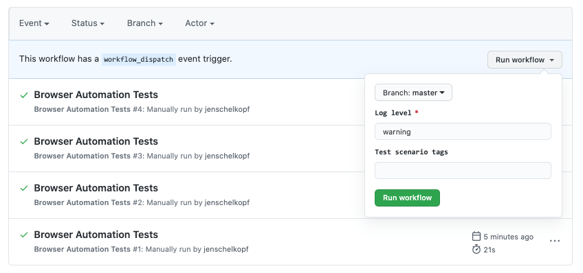

<div align="center">
  <h1> GitHub Actions </h1>
</div>

GitHub Actions is a **continuous integration and continuous delivery (CI/CD) platform** that allows you to automate your build, test and deployment pipeline. You can create workflows that build and test every pull request to your repository, or deploy merged pull requests to production.

GitHub Actions goes beyond just DevOps and lets you run workflows when other events happen in your repository. For example, you can run a workflow to automatically add the appropriate labels whenever someone creates a new issue in your repository.

GitHub provides Linux, Windows, and macOS virtual machines to run your workflows, or you can host your own self-hosted runners in your own data center or cloud infrastructure.

# The components of GitHub Actions

You can configure a GitHub Actions **workflow** to be triggered when an **event** occurs in your repository, such as a pull request being opened or an issue being created. Your workflow contains one or more **jobs** which can run in sequential order or in parallel. **Each job will run inside its own virtual machine runner**, or inside a container and has one or more **steps** that either run a script that you define or run an **action**, which is a reusable extension that can simplofy your workflow.


<div align="center">
  <h1> Workflows </h1>
</div>

A **workflow** is a configurable automated process that **will run one or more jobs**. Workflows are **defined by a YAML file** checked in to your repository and will run when triggered by an event in your repository, or they can be triggered manually, or at a defined schedule.

Workflows are defined in the `.github/workflows` directory in a repository. A repository can have multiple workflows, each of which can perform a different set of tasks such as,

- Building and testing pull requests
-  Deploying your application every time a release is created
- Adding a label whenever a new issue is opened

```
.github/
  workflows/
    my-workflow.yml
```

You can reference a workflow within another workflow.

<div align="center">
  <h1> Events </h1>
</div>


An **event** is a specific activity in a repository that **triggers a workflow run**. For example, an activity can orginate from GitHub when someone creates a pull request, opens an issue, or pushes a commit to a repository. You can also trigger a workflow to run on a schedule, by posting to a REST API, or manually. 

Events are defined at the top of the workflow file and contain the following format,

```YAML
name: <workflow-name>          # Name of the workflow (optional)

on:                            # Defines the trigger(s) for the workflow
  <event-name>:                # Event that triggers the workflow
    <event-options>            # Optional event-specific configuration (e.g., branches, paths)
```

Events can be written in multiple different ways,

- **Single Event**, 

```YAML
on: push
```

- **Multiple Events**

```YAML
on: [push, pull_request]
```

- **Events with Filters**

Events can be filtered further into "Activity types" on events. If you omit the `types` field under `pull_request`, the workflow triggers for **any types of pull request event**.

If you want to restrict it to a specific types of pull requests (e.g. only when the pull request is `opened` or `closed`), you must specify the `types` field.


```YAML
on:
  pull_request:
    types: [opened, closed, reopened]
    branches:
      - main
```

The full list of events and their optional parameters are [available online](https://docs.github.com/en/actions/writing-workflows/choosing-when-your-workflow-runs/events-that-trigger-workflows).

Let's go through an [example event](https://docs.github.com/en/actions/writing-workflows/choosing-when-your-workflow-runs/events-that-trigger-workflows#push), `push`. 


**Event Type:** `push`

The `push` event triggers a workflow whenever code is pushed to the repository. It can be filtered further by specifying which branches, tags or file paths are involved.

1. `branches` - Defines which branches trigger the workflow when code is pushed to them. You can specify one or multiple branches.

```YAML
on:
  push:
    branches:
      - main         # Trigger on push to 'main' branch
      - 'feature/*'  # Trigger on push to any branch starting with 'feature/'
```

2. `tags` - Defines which tags trigger the workflow. You can specify tags with specific patterns or exact matches.


```YAML
on:
  push:
    tags:
      - 'v*'         # Trigger on tags starting with 'v', such as 'v1.0', 'v2.1'
      - 'release-*'  # Trigger on tags starting with 'release-', e.g., 'release-2025'
```

3. `paths` - Filters pushes based on which files or directories were modified. You can specify exact paths or use glob patterns.

```YAML
on:
  push:
    paths:
      - 'src/**'  # Trigger when any file in the 'src' folder is modified
      - '**/*.yaml'  # Trigger when any YAML file is changed
```

4. `types` - Specifies which types of push events should trigger the workflow. For example, you can specify `created`, `deleted` or `synchronize` types.

```YAML
on:
  push:
    types:
      - created  # Trigger only when a branch is created
      - deleted  # Trigger only when a branch is deleted
```

These can be combined together and the full possible event can be combined to,

```YAML
on:
  push:
    branches:
      - main         # Trigger on 'main' branch
      - 'feature/*'  # Trigger on branches starting with 'feature/'
    tags:
      - 'v*'         # Trigger on tags starting with 'v', e.g., 'v1.0'
      - 'release-*'  # Trigger on tags starting with 'release-', e.g., 'release-2025'
    paths:
      - 'src/**'     # Trigger when anything inside the 'src' directory changes
      - '**/*.yaml'  # Trigger when any YAML file changes
    types:
      - created  # Trigger when a branch is created
      - deleted  # Trigger when a branch is deleted
      - updated  # Trigger when a branch is updated (default if not specified)
```


**Event Type:** `workflow_dispatch`

The `workflow_dispatch` event is used to trigger workflows **on-demand** instead of automatically based on predefined events (e.g., `push`, `pull_request`). It is particularly useful for scenarios like,

- Manually triggering deployments
- Running custom scripts or maintenance tasks
- Testing workflows with specific inputs

To define a workflow that can be manually triggered, include the `workflow_dispatch` event in the `on` section of your workflow file.

```YAML
name: Manual Trigger Workflow

on:
  workflow_dispatch:
```

This simple example allows users to manually start the workflow from the GitHub Actions tab in the repository.

You can define inputs for `workflow_dispatch` to collect information from the user when manually triggering the workflow. These inputs can have,

- **Name** - Identifier for the input.
- **Description** - A brief explanation of what the input is for.
- **Type** - Supported types are `string`, `boolean` and `choice` (for dropdowns).
- **Default** - A fallback value if no input is provided.
- **Required** - Whether the input is mandatory.

```YAML
on: 
  workflow_dispatch:
    inputs:
      logLevel:
        description: 'Log level'     
        required: true
        default: 'warning'
      tags:
        description: 'Test scenario tags'  
```

Will generate the following UI,



<div align="center">
  <h1> Jobs </h1>
</div>

A **Job** is a **set of steps** in a workflow that is executed on the **same runner**. Each step is **either a shell script that will be executed, or an action that will be run.** Steps are executed in order and are dependent on each other. Since each step is executed **on the same runner, you can share data** from one step to another. For example, you can have a step that builds your application followed by a step that tests the application that was built.

You can configure a jobs dependencies with other jobs. By default, jobs have no dependencies and run in parallel. When a job takes a dependency on another job, it waits for the dependent job to complete before running.

For example, you might configure multiple build jobs for different architectures without any job dependencies and a packaging job that depends on those builds. The build jobs run in parallel, and once they complete successfully, the packaging job runs.

<div align="center">
  <h1> Actions </h1>
</div>

An **action** is a custom application for the GitHub Actions platform that performs a complex but frequently repeated task. **Use an action to help reduce the amount of repetitive code that you write in your workflow files**. An action can pull your Git repository from GitHub, set up the correction toolchain for your build environment, or set up the authentication to your cloud provider.

You can write your own actions, or you can find actions to use in your workflows in the GitHub Marketplace.

The GitHub Actions `checkout` step is commonly used in workflows to check out your repositorys code into the GitHub Actions runner so that the workflow can operate on it, such as running tests.

The most basic usage of the `checkout` action looks like this,

```YAML
jobs:
  build:
    runs-on: ubuntu-latest

    steps:
      - name: Checkout code
        uses: actions/checkout@v4
```

GitHub knows where to fetch and run an action by using the `uses` keyword in your workflow YAML file. The value specified after `uses` tells GitHub where to find the action, either from a specific repository on GitHub or from a Docker image. 

When you specify an action in the `uses` field, GitHub looks for it in the specific repository on GitHub. The format is typically,

```YAML
uses: owner/repository@version
```

The commonly used `checkout` action can be inspected [online](https://github.com/actions/checkout/tree/v4) because of this reason and other actions are publically inspectable. The `version` is a tag.

You will need to analyze the documentation to determine which fields can be passed to the action via `with`.

<div align="center">
  <h1> Runners </h1>
</div>

A **runner** is a server that runs your workflows when they're triggered. Each runner can **run a single job at a time**. GitHub provides Ubuntu Linux, Microsoft Windows and macOS runners to run your workflows. **Each workflow run executes in a fresh, newly pro-visioned virtual machine**.

If you need a different operating system or require a specific hardware configuration, you can host your own runners.

<div align="center">
  <h1> Basic Structure </h1>
</div>

A GitHub Actions workflow is a YAML file that describes the automation process for CI/CD or other tasks in a GitHub repository. The file is typically located in `.github/workflows/` and is executed based on specific events such as `push`, `pull_request`, etc.

Below is an example below with placeholder values.


```YAML
name: <workflow-name>          # Name of the workflow (optional)

on:                            # Defines the trigger(s) for the workflow
  <event-name>:                # Event that triggers the workflow
    <event-options>            # Optional event-specific configuration (e.g., branches, paths)

env:                           # Global environment variables (optional)
  <key>: <value>

defaults:                      # Default settings for all `run` steps (optional)
  run:
    shell: <shell-type>        # Default shell to use (e.g., bash, pwsh)
    working-directory: <path>  # Default working directory

permissions:                   # Permissions for the GitHub token (optional)
  <scope>: <access>            # e.g., contents: read, issues: write

concurrency:                   # Ensures that only one workflow runs for a specific group (optional)
  group: <group-name>          # Group name (e.g., workflow-${{ github.ref }})
  cancel-in-progress: <bool>   # Whether to cancel ongoing workflows in the group

jobs:                          # Defines one or more jobs
  <job-id>:                    # Unique identifier for the job
    name: <job-name>           # Name for the job (optional, for better UI readability)
    runs-on: <os-type>         # OS type to run the job (e.g., ubuntu-latest, windows-latest)
    needs:                     # Dependencies on other jobs (optional)
      - <job-id>

    strategy:                  # Used for matrix builds or job variations (optional)
      matrix:
        <key>:                 # Matrix key (e.g., os, node-version)
          - <value>            # Values for the matrix key (e.g., ubuntu-latest, windows-latest)

    steps:                     # Sequence of steps in this job
      - name: <step-name>      # Descriptive name for the step
        uses: <action-name>    # Action to use (prebuilt or custom action)
        with:                  # Optional input parameters for the action
          <key>: <value>

      - name: <step-name>      # Another step
        run: <command-to-run>  # Direct shell command
        env:                   # Environment variables for this step (optional)
          <key>: <value>
```

<div align="center">
  <h1> Key Sections and Keywords </h1>
</div>

<div align="center">
  <h3> name </h1>
</div>

- `name` - Defines the name of the workflow. If omitted, GitHub will use the name of the file.

```YAML
name: CI Workflow
```

<div align="center">
  <h3> on </h1>
</div>

- `on` - Specifies the events that trigger the workflow. This is the most important part of the file, as it tells GitHub **when to run the workflow**. You can trigger workflows by events such as `push`, `pull_request`, `workflow_dispatch` and more. The `on` field can be customized with various options depending on the type of event.

```YAML
on: push
```

<div align="center">
  <h3> env </h1>
</div>

- `env` - The `env` keyword gets **global environment** available in all jobs and steps.

```YAML
env:
  NODE_ENV: production
  DEBUG: true
```

<div align="center">
  <h3> defaults </h1>
</div>

- `defaults` - The `defaults` keyword provides fault settings **for all steps in the workflow**. It can define the default shell or working directory.

```YAML
defaults:
  run:
    shell: bash
    working-directory: ./src
```

<div align="center">
  <h3> permissions </h1>
</div>

- `permissions` - The `permissions` keyword defines the access level of the `GITHUB_TOKEN` for the workflow.

```YAML
permissions:
  contents: write
  issues: read
```

<div align="center">
  <h3> concurrency </h1>
</div>

- `concurrency` - The `concurrency` keyword ensures only one instance of a workflow runs for a specific group. It is useful for avoiding race conditions.

```YAML
concurrency:
  group: workflow-${{ github.ref }}
  cancel-in-progress: true
```

<div align="center">
  <h3> Jobs </h1>
</div>

- `jobs` - The `jobs` keyword defines the tasks (jobs) the workflow will perform. **Each job runs independently unless specified using dependencies**.

```YAML
jobs:
  build:
    runs-on: ubuntu-latest
    steps:
      - name: Checkout Code
        uses: actions/checkout@v3
```

<div align="center">
  <h3> runs-on </h1>
</div>

- `runs-on` - Specifies the **operating system for the job**.

```YAML
runs-on: ubuntu-latest
```

<div align="center">
  <h3> needs </h1>
</div>

- `needs` - Defines dependencies between jobs. **A job waits for its dependencies to complete**.

```YAML
needs: build
```

<div align="center">
  <h3> strategy </h1>
</div>

- `strategy` - Configures matrix builds, enabling a single job to run with **multiple configurations**. You can reference matrix variables in steps using `${{ matrix.<key> }}`.

```YAML
runs-on: ${{ matrix.os }}
strategy:
  matrix:
    os: [ubuntu-latest, windows-latest, macos-latest]
    node: [14, 16, 18]
steps:
  - name: Checkout code
    uses: actions/checkout@v3

  - name: Setup Node.js
    uses: actions/setup-node@v3
    with:
      node-version: ${{ matrix.node }}
```
This matrix creates 9 jobs (3 OS × 3 Node.js versions):

1. Ubuntu + Node.js 14
2. Ubuntu + Node.js 16
3. Ubuntu + Node.js 18
4. Windows + Node.js 14
5. Windows + Node.js 16
6. Windows + Node.js 18
7. macOS + Node.js 14
8. macOS + Node.js 16
9. macOS + Node.js 18

<div align="center">
  <h3> Steps </h1>
</div>


- `steps` - Lists the sequence of steps in the job.

```YAML
steps:
  - name: Run Tests
    run: npm test
  - name: Install Dependencies
    run: npm install
```

<div align="center">
  <h3> name </h1>
</div>

- `name` - Gives a descriptive name to the step.

```YAML
- name: Run Linter
  run: npm run lint
```

<div align="center">
  <h3> uses </h1>
</div>

- `uses` - Specifies a prebuilt or custom action to use in the step.

```YAML
- uses: actions/setup-node@v3
  with:
    node-version: 16
```

<div align="center">
  <h3> run </h1>
</div>

- `run` - Runs a shell command.

```YAML
- run: echo "Hello, world!"
```

Additionally, you can use `|` to write **multi-line shell scripts**. It's part of YAML syntax, called a block scalar indicator and tells YAML that the subsequent text is a multi-line literal string. All the lines after the `|` are treated as a single string, preserving line breaks.

```YAML
jobs:
  example:
    runs-on: ubuntu-latest
    steps:
      - name: Multi-line script example
        run: |
          echo "This is the first line"
          echo "This is the second line"
          echo "This is the third line"
```

<div align="center">
  <h3> env </h1>
</div>

- `env` - Specifies environment variables for the step.

```YAML
- run: echo "Using $API_KEY"
  env:
    API_KEY: ${{ secrets.API_KEY }}
```

<div align="center">
  <h3> with </h1>
</div>

- `with` - Provides input parameters to an action.

```YAML
      - name: Set up Python
        uses: actions/setup-python@v4
        with:
          python-version: 3.9  # Specify the Python version to install
```

<div align="center">
  <h3> Outputs </h1>
</div>

- `outputs` - Defines outputs for jobs that can be passed to other jobs.

```YAML
jobs:
  job1:
    outputs:
      result: ${{ steps.step1.outputs.value }}
    steps:
      - id: step1
        run: echo "value=123" >> $GITHUB_ENV

  job2:
    needs: job1
    runs-on: ubuntu-latest
    steps:
      - run: echo ${{ needs.job1.outputs.result }}
```

<div align="center">
  <h3> if </h1>
</div>

- `if` - Adds conditional logic to jobs or steps that determines if it is ran or not. If the condition is true, the associated job or step runs.

```YAML
- name: Deploy

  if: github.ref == 'refs/heads/main'
  run: npm run deploy
```

Some GitHub Action functions are frequently used in `if` statements.

- `success()` - True if all previous steps in the job succeeded.
- `failure()` - True if any previous step in the job failed.
- `always()` - Always evaluates to true (useful for cleanup steps).

Using `if: success()` and `needs` (dependencies) are two distinct mechanisms in GitHub Actions, and they are applied in different scenarios on the workflow.

The `success()` function is a condition applied to individual steps or jobs. It ensures that a particular step/job runs only if **all preceding steps/jobs** in the workflow or within the same job have completed successfully.

```YAML
steps:
  - name: Step 1
    run: echo "Step 1 executed"

  - name: Step 2 (Only if Step 1 succeeds)
    if: success()
    run: echo "Step 2 executed"
```

Whereas the `needs` is at the job level,

```YAML
jobs:
  job-id:
    needs: [other-job-id]
```

<div align="center">
  <h1> Secrets </h1>
</div>

GitHub Actions secrets are encrypted variables that you can use in your workflow to securely store sensitive data, such as API keys, tokens and passwords. These secrets are stored in your GitHub repository or organization and are only accessible by workflows running in that context.

- `Repository-Level Secrets` - Navigate to *Settings -> Secrets and variables -> Actions -> New repository secret*


Secrets are accessed using the `secrets` context `${{ secrets.SECRET_NAME }}`.

Here is an example of using secrets for authorization,

```YAML
name: Deploy to AWS

on:
  push:
    branches:
      - main

jobs:
  deploy:
    runs-on: ubuntu-latest

    steps:
      - name: Checkout code
        uses: actions/checkout@v3

      - name: Deploy to AWS
        run: |
          aws configure set aws_access_key_id ${{ secrets.AWS_ACCESS_KEY_ID }}
          aws configure set aws_secret_access_key ${{ secrets.AWS_SECRET_ACCESS_KEY }}
          aws s3 sync ./public s3://my-bucket-name
```

In this example,

- `AWS_ACCESS_KEY_ID` - Access key for AWS.
- `AWS_SECRET_ACCESS_KEY` - Secret key for AWS.

<div align="center">
  <h1> Artifacts </h1>
</div>

GitHub Action artifacts allow you to **share data between jobs, store workflow results, or to upload/download files** generated during workflow execution. Artifacts are often used to retain build outputs, test results, or any other files you want to access after a workflow completes.

```YAML
name: Upload Artifact Example

on:
  push:
    branches:
      - main

jobs:
  build:
    runs-on: ubuntu-latest
    steps:
      - name: Checkout Code
        uses: actions/checkout@v3

      - name: Run Build Script
        run: |
          mkdir -p build
          echo "Hello, World!" > build/output.txt

      - name: Upload Build Artifact
        uses: actions/upload-artifact@v3
        with:
          name: build-artifact
          path: build/     # Path to the file or directory to upload
```

<div align="center">
  <h1> Creating Reusable Actions </h1>
</div>

Creating a reusable action in GutHub Actions allows consumers to use. Reusable actions are those that generally involve using `with` to pass parameters. These inputs define configurable options that consumers can pass when using the action.

GitHub Actions come in three types,

1. **Composite Actions** - Combine multiple steps or reusable workflows written entirely in YAML

2. **JavaScript Actions** - Run custom JavaScript/TypeScript logic using Node.js

3. **Docker Actions** - Execute within a Docker container, allowing custom environments and dependencies.

Actions are actions always called `action.yml` and can be created in varying levels.

##### Repository-Local (Organized)

Can be placed inside `.github/actions/`. If you intend to use the action within the same repository, it's good practice to place it in `.github/actions/`. This is not a requirement but a convention for clarity and organization.

- **Folder** - `.github/actions/my-js-action/`
- **Usage** - `uses: ./github/actions/my-js-action`

This keeps your repository cleaner by grouping reusable actions under `.github/actions/`, distinct from workflows in `.github/workflows/`.

##### Repository-Local (Flexible)

If you're developing a repository-local action but don't want to follow the `.github/actions/` convention, you place it anywhere within the repository. However, referencing it will require a relative path to the action folder.

- **Folder** - `custom-actions/my-js-action/`
- **Usage** - `uses: ./custom-actions/my-js-action`

This is technically valid but can make your project structure less clear for collaborators.

##### Published Reusable Action

If you want your action to be reusable across multiple repositories or shared with the community, you should create it in its own dedicated repository. It doesn't have to live in a `.github/` folder for this.

- **Repo** - `my-org/my-js-action`
- **Usage** - `uses: my-org/my-js-action@v1`

Published actions cannot use relative paths because they're versioned and referenced via the repository URL.

Actions organized in this way have an entire repository for a single action, while this may seem excessive there are solid reasons for this design.

1. Actions are versioned by GitHub repositories.
2. Modular and reusable design.
3. Independence for updates and maintenance
4. Avoid repository bloat.
5. Flexibility for complex actions.


---

Reusable actions have similar keywords but introduce some new ones such as `run`.

<div align="center">
  <h3> name </h1>
</div>

This is an optional keyword that specifies the name of the action.

```YAML
name: "My Action"
```

<div align="center">
  <h3> description </h1>
</div>

Provides a short description of what the action does.

```YAML
description: "This action builds and tests the code"
```

<div align="center">
  <h3> inputs </h1>
</div>

Defines the input parameters that the action accepts. Each input can have description, default value and required flag.

- `description` - Short description of the input.
- `required` - Whether the input must be provided (`true` or `false`)
- `default` - Default value if the input is not provided.

```YAML
inputs:
  name:
    description: "The name of the user"
    required: true
  greeting:
    description: "Greeting message"
    required: false
    default: "Hello"
```

<div align="center">
  <h3> outputs </h1>
</div>

Defines the output parameters that the composite action generates, which can be consumed by other steps or workflows.

The value can be retrieved using `steps.<step-name>.outputs.<key>`

```YAML
outputs:
  greeting_message:
    description: "The generated greeting message"
    value: ${{ steps.generate-message.outputs.result }}
```

<div align="center">
  <h3> runs </h1>
</div>

The keyword `runs` has different meanings depending on the type of action being created. Composite actions, JavaScript and Docker container actions all use the `runs` keyword differently.

### Composite Actions

In composite actions, the `runs` field must use `using: composite`. This tells GitHub that the action will consist of a series of steps written in YAML, as opposed to executing custom code like JavaScript or a Docker image.

`action.yml`

```YAML
name: "My Composite Action"
description: "Reusable composite action to greet users"
inputs:
  name:
    description: "Name of the user"
    required: true
outputs:
  greeting:
    description: "The greeting message"
runs:
  using: "composite"
  steps:
    - name: Checkout code
      uses: actions/checkout@v3

    - name: Generate greeting
      id: generate
      run: echo "Hello, ${{ inputs.name }}!" > greeting.txt

    - name: Set greeting output
      run: echo "greeting=$(cat greeting.txt)" >> $GITHUB_ENV
```

In composite actions, `using: composite` is the only option for `runs`. Steps are defined under `steps` and they can include `run`.

Finally, the composite actions is used as,

```YAML
jobs:
  test:
    runs-on: ubuntu-latest
    steps:
      - name: Run Composite Action
        uses: my-org/my-composite-action@v1
        with:
          name: "Alice"
```

The folder structure would therefore look like this,

Within the repository `my-composite-action` inside the organization `my-org` with a tag `v1`.

```plaintext
├── action.yml
└──  README.md
```

### JavaScript Actions

for JavaScript actions, the `runs` field **specifies the runtime** and the entry point for the action. Typically, this uses `using: node12` or `using: node16`, and the `main` field points to the JavaScript file containing your action logic.

`action.yml`

```YAML
name: "JavaScript Action"
description: "A Node.js-based action to greet users"
inputs:
  name:
    description: "Name of the user"
    required: true
outputs:
  greeting:
    description: "The greeting message"
runs:
  using: "node16"
  main: "dist/index.js"
```

Here, `using: node16` specifies that the action will run in the Node.js environment and `main: dist/index.js` points to the JavaScript file that contains the actions logic.

The `index.js` needs to include `require('@actions/core')` and could appear as this,

`index.js`

```JavaScript
const core = require('@actions/core');

try {
  const name = core.getInput('name');
  const message = `Hello, ${name}!`;

  console.log(message);
  
  core.setOutput('greeting', message);
} catch (error) {
  core.setFailed(error.message);
}
```

To prepare this action you will need to compile all of the dependencies into a single JavaScript file. `ncc` is a Simple CLI for compiling a Node.js module into a single file, together with all its dependencies, gcc-style.

To create this action first initialize the project,

1. Initialize the project.

```Bash
npm init -y
npm install @actions/core
```

2. Build the action.

Write the `index.js` file. Optionally, compile TypeScript to JavaScript using `tsc.

3. Build the code.

```bash
ncc build index.js --license licenses.txt
```

Finally, it can be used as the following.

```YAML
jobs:
  test:
    runs-on: ubuntu-latest
    steps:
      - name: Run JavaScript Action
        uses: my-org/my-js-action@v1
        with:
          name: "Bob"
```

In the organization `my-org` their is a repository `my-js-action` that has a tag called `v1` that contains the following,

```plaintext
├── action.yml
├── package.json
└── index.js
```

### Docker Actions

Docker actions allows you to run code in an isolated container. These are useful when you need a specific environment, tools or when the action has dependencies that are not supported in the default GitHub-hosted runners.

When you use a Docker-based action in a GitHub workflow, GitHub automatically **builds the Docker image based on the `Dockerfile` and runs a container** from that image.

Here, all 

- `runs: using: docker` - specifies that the action will use a Docker container.
- `image` - Defines the Docker image to use (Can be `Dockerfile` or prebuilt images).
- `args` - Optional, pass arguments to the container.

`action.yml`

```YAML
name: "Docker Action"
description: "A Docker-based action to greet users"
inputs:
  name:
    description: "Name of the user"
    required: true
runs:
  using: "docker"
  image: "Dockerfile"
  args:
    - ${{ inputs.name }}
```

`Dockerfile`

```Docker
FROM node:16
WORKDIR /app
COPY . /app
RUN npm install
CMD ["node", "index.js"]
```

`index.js`

```JavaScript
console.log(`Hello, ${process.argv[2]}!`);
```

You can finally use the Docker Aciton as follows.

```YAML
jobs:
  test:
    runs-on: ubuntu-latest
    steps:
      - name: Run Docker Action
        uses: my-org/my-docker-action@v1
        with:
          name: "Charlie"
```

In the orgnaization `my-org` their is a repository called `my-docker-action` with a tag `v1` that holds the contents.

```plaintext
├── action.yml
├── index.js
├── package.json
├── package-lock.json
└── Dockerfile
```

<div align="center">
  <h3> Secrets in Reusable Actions </h1>
</div>

 Secrets are masked in GitHub Actions logs. If you try to print a secret (e.g., `echo $API_TOKEN`), it will appear as `***` in the logs.

 Secrets are scoped to the repository, organization, or environment. **They are not automatically inherited by reusable actions and must be passed** explicitly to prevent unintended exposure.

 Secrets must be explicitly passed from the workflow to the reusable action using the `with` or `env` attributes in the workflow.

 ```YAML
 name: Main Workflow

on:
  workflow_dispatch:

jobs:
  example:
    runs-on: ubuntu-latest

    steps:
      - name: Run Reusable Composite Action
        uses: my-org/my-composite-action@v1
        with:
          name: Alice
          api_token: ${{ secrets.MY_API_TOKEN }} # Pass the secret
```

`action.yml`

```YAML
name: 'My Composite Action'
description: 'An action that uses a secret'
inputs:
  name:
    description: 'Name of the person'
    required: true
  api_token:
    description: 'API token for authentication'
    required: true # Required secret

runs:
  using: 'composite'
  steps:
    - name: Use the secret
      run: |
        echo "Hello, ${{ inputs.name }}!"
        echo "Using the secret token: ${{ inputs.api_token }}"
```

<div align="center">
  <h1> Creating Reusable Workflow </h1>
</div>

Reusable workflows and composite actions both help you to avoid duplication. Whereas reusable workflows allow you to reuse an entire workflow, with multiple jobs and steps, composite actions combine multiple steps that you can then run within a job step, just like any other action.

Reusable workflows are triggered by the `workflow_call` event. This is the only event that allows workflows to be reused by others.

Secrets **cannot be accessed directly** in reusable workflows. Instead, they must be explicitly passed from the calling workflow using `secrets:`.

`.github/workflows/reusable.yml`

```YAML
name: Deploy Workflow

on:
  workflow_call:
    inputs:
      branch:
        description: "Branch to deploy"
        required: true
        default: "main"
    secrets:
      AWS_ACCESS_KEY:
        required: true
      AWS_SECRET_KEY:
        required: true

jobs:
  deploy:
    runs-on: ubuntu-latest
    steps:
      - name: Checkout Code
        uses: actions/checkout@v3

      - name: Configure AWS CLI
        run: |
          aws configure set aws_access_key_id ${{ secrets.AWS_ACCESS_KEY }}
          aws configure set aws_secret_access_key ${{ secrets.AWS_SECRET_KEY }}
      - name: Deploy Application
        run: echo "Deploying branch ${{ inputs.branch }}"
```

`.github/workflows/caller.yml`

```YAML
name: Call Reusable Workflow

on:
  push:
    branches:
      - main

jobs:
  call-reusable:
    uses: my-org/my-repo/.github/workflows/reusable.yml@v1
    with:
      branch: "main"
    secrets:
      AWS_ACCESS_KEY: ${{ secrets.AWS_ACCESS_KEY }}
      AWS_SECRET_KEY: ${{ secrets.AWS_SECRET_KEY }}
```