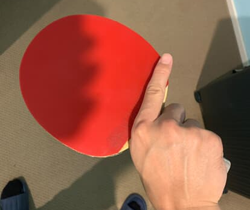
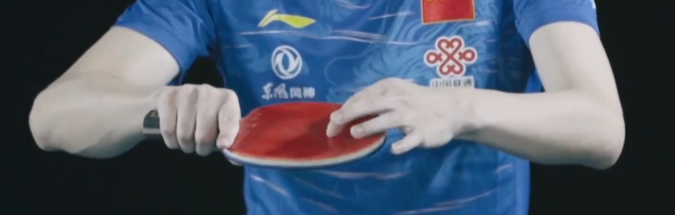
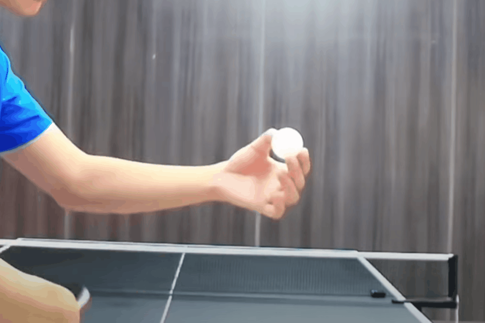
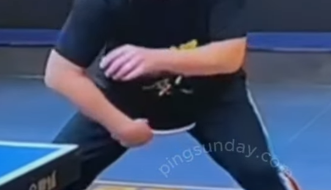
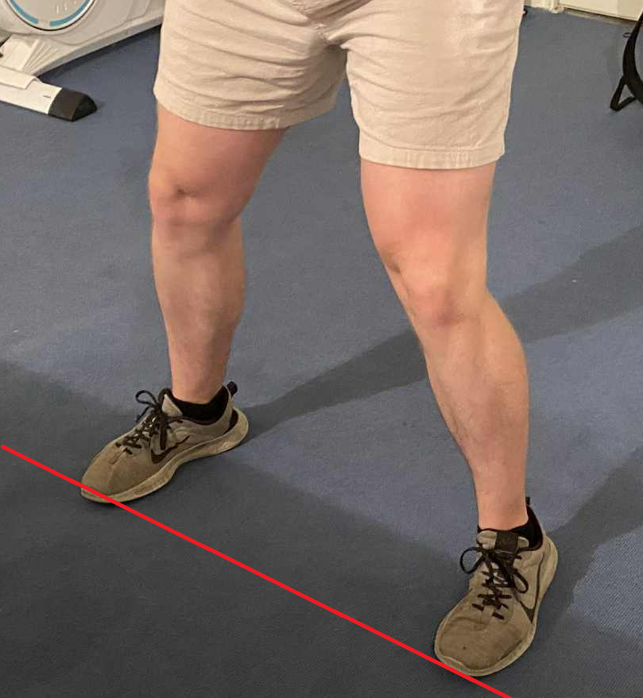

    <h1> Holding the Paddle - Backhand </h1>

When holding the paddle for a backhand, the position of the index finger at the back remains the same. **The key difference is the thumb**. Now, we raise the thumb slightly higher in order to support the paddle to give it more power.

    

    

    <h1> Stance </h1>

For the backhand loop the right foot should be slightly infront of the left foot this, allow for **rotation of the body to generate power**. This stance is true for both topspin and backspin, both will use rotation of the body when performing the backhand loop. In addition to this the feet should be **slightly than shoulder width apart**.

Their will be a difference between the body stance in terms of how deep you kneel versus backspin and topspin which will be addressed below.

    <h1> Motion </h1>

Using your waist is essential for the backhand loop. The movement **should be side to side**.

1. Slightly tuck in the abdomen.
2. Start your hand **slightly left of the stomach**, not in the center. From the center you cannot generate power. As the movement is restricted from down to upwards when performing the loop, this is very weak.
3. Pivot on your right leg while internally rotating wrist/forearm.
4. Start with the upper arm leading the forearm. Then the upper arm leading the wrist. Finally, the paddle tip comes through. This is a complete power sequence and it must be a complete chain movement.

The correct feeling of the backhand loop is the following.

- Your racket meets the balls surface with a brushing contact. You cannot muscle through it, grip the balls surface and spin it outward through the whipping motion. This sensation defines true looping. Hitting into it directly is not proper looping technique.
- At the same time, your forearm/wrist/wait supply controlled power into that brushing path.
- Think of it as "brushing through the ball with power". This is not two steps, but one blended contact.

**Against backspin**, imagine you are "lifting and brushing" the ball upwards in one motion.
**Against topspin**, imagine you are "brushing forward through" the ball with a bit more drive.

    

    

Small but critical details which make a great forehand loop are,

1. **Triangle Motion** - The motion of the backhand loop should create a △ shape. Where the lower right point represents the elbow and the bottom left to top point represent the hand motion. This does not represent the complete posture movement 1 to 1, but represents the movement behaviour. **The point is this is to illustrate that the elbow should not be moving around. Once the elbow moves, the triangle is gone**.

    

2. **Correct Paddle Contact** - When looping with the backhand, the contact point on the rubber should be **slightly above center**. This helps to create a whipping effect. If you contact the ball too low on the rubber, that is incorrect as you will not get enough brushing action either.

    

3. **Correct Ball Contact** - Hit the **upper middle part of the ball**. A brushing contact is essential, but so is the point of contact. Without doing so, the angle racket will be incorrect.

    

4. **Wrist Rotation** - Whether the ball is backspin or topspin, we use the wrist power like the following. As long as you want to apply force, always generate forward forward then use the wrist rotation for the arc direction. This motion also determines how deeply you can hold the ball.

    

5. **Wrist Adjustment After Contact** - A constant racket angle is incorrect. While versus topspin it is a much less of an angle versus backspin, a constant angle is not correct. When performing a loop you **must push forward**. This means to **hold the ball, then push forward**. This happens from a combination of brushing (To grab the ball) then push forward to produce power. The paddle angle **should change from closed open to closed, do not keep the same paddle angle**.

    

6. **Initial Racket Angle** - When it comes to the backhand loop, for a higher quality shot it's important to use a more **closed angle and NOT an open angle at the beginning**. You cannot loop forward with an open racket face. The power is coming from the wrist rotation of moving back to front and using a **brushing** action to control the ball. An open racket can still get the ball on the table, but the power is limited.

    

7. **Foot Stance** - During the backhand loop it's very important to have your feet parallel. Having your feet parallel means that when creating rotation by twisting your body can you **create a significantly higher amount of power by utilization of the hip**, this is much more difficult to do if you were to have your left foot lower. Power comes from hip rotation. **Transfer power from the legs and hips through rotation**.

    

    <h1> Versus Backspin </h1>

-- Use legs
