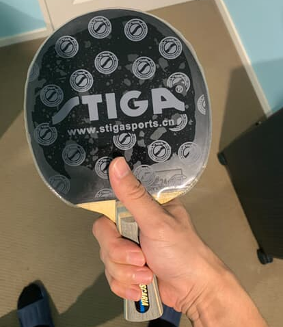
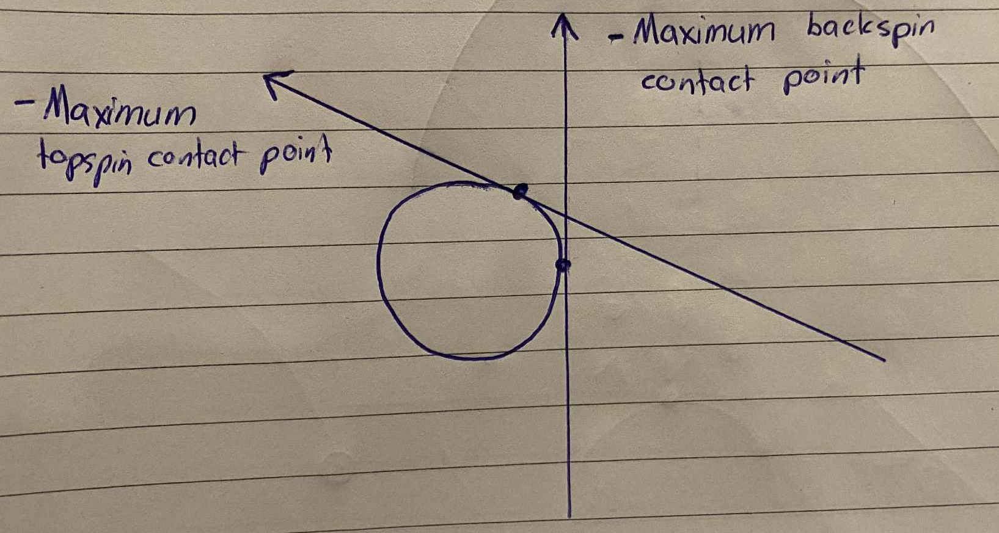

    <h1> Holding the Paddle - Backhand </h1>

When holding the paddle for a backhand, the position of the index finger at the back remains the same. **The key difference is the thumb**. Now, we raise the thumb slightly higher in order to support the paddle to give it more power.

    

    

    <h1> Stance </h1>

For the backhand loop the right foot should be slightly infront of the left foot this, allow for **rotation of the body to generate power**. This stance is true for both topspin and backspin, both will use rotation of the body when performing the backhand loop. In addition to this the feet should be **slightly than shoulder width apart**.

Their will be a difference between the body stance in terms of how deep you kneel versus backspin and topspin which will be addressed below.

    <h1> Technique For Distance </h1>

- **Very Close** - For a very close ball, you use the **banana flick**.

    

- **Mid Range** - For a mid range backhand loop, it's very important for 80% to 90% of the underarm and the wrist. You don't want to use the hip and shoulder for a midrange shot. In addition, notice that the **elbow is high**.

    

    

    

- **Long Range** - This is the type of loop where we need to more far more of the hip for power.

    <h1> Backhand Motion and Versus Topspin </h1>

#### Preparation - Beginning of Stroke

- **Legs** - Knees are slightly bent (not as deep as vs backspin). **This lowers your center of gravity**, keeps you balanced and "loads" your legs like springs.
- **Torso** - Upper body leans forward slightly over the table, compact stance.
- **Elbow** - Elbow is raised, which allows the wrist to naturally drop and face inwards to the body, giving a close racket preparation.
- **Wrist** - Slightly cocked back, ready to snap forward. The wrist should have naturally fit into place due to the position of the elbow.

#### Acceleration into Contact - Middle of Stroke

- **Legs** - Knees begin to rise slightly, providing forward-upward force. Here the upward component is small, since the ball already carries topspin (natural lift). The main purpose is to stabilize and transfer energy into the stroke.
- **Torso** - Slight rotation and forward drive of the shoulders to add body weight into the ball.
- **Forearm** - Moves forward more than upward (Flatter trajectory compared to backspin). **Accelerate in the later part of the swing**.
- **Contact Point** - Make contact close to the body, but not too close. This allows for longer contact time as the paddle moves in the motion with the arm. In the later part of the swing, there is a section where the racket carries the ball. If you contact it too late, there is no time or space the the ball to stay on the racket.
- **Contact** - Happen when the ball is at or just after the peak of its bounce, **with the wrist in the middle of its snap**, accelerating through. Contact happens right as the wrist is accelerating through its midpoint, not fully bent, not fully snapped forward. This ensures you "catch" the ball with maximum brushing speed. - After you contact the ball, you need to feel like you're lifting the ball. **Then complete the follow-through. Do not brush upward, brush forward**. Think of it as catching the ball on your rubber and guiding it forward, while the spin you impart keeps it afloat.
- **Wrist** - Snap forward with a shoft, sharp motion. Yur forearm/wrist/wait supply controlled power into that brushing path.

#### Follow Through

When making contact at a closed angle, it's **vital to follow through**. By following through, it increases dwell time which significantly increases the probability of the ball hitting the table by increasing by improved accuracy.

- **Legs** - Fully support your body weight in a stable stance, not fully blocked, still flexible.
- **Torso** - Finishes its forward lean, then stabilizes.
- **Forearm** - Complete its forward swing, not too high.
- **Wrist** - Finishes its snap and relaxes, rotating the wrist outwards.

    

    

Small but critical details which make a great backhand loop are,

1. **Speed over Power** - You need to focus on speed not power. Focus on speed and spin, which requires brushing and light contact of the ball.

2. **Wrist** - For backhand loops, topspin or backspin, even backhand flicks, the following wrist motion is always used. This motion is used to grip the ball and add spin. Whenever spin is involved, topspin or backspin, for backhand **always rotate the racket back first with a closed racket face**.

    

3. **Relax The Wrist and Direct With the Elbow** - Do not force or direct your wrist into position. Players should not think "I must bend my wrist inwards". Instead, their **arm structure and elbow motion** naturally guide the wrist into the correct angle. Relax the wrist, it should follow the elbow and forearm. Put your elbow forward, you notice that your hand will naturally come towards your body and rotate inward.

When Zhang Jike pushes his elbow slightly forward-outward, the geometry of the arm does the work. The forearm rotates, the wrist folds inward toward the body (Without conscious muscular effort). This happens because the elbows direction changes the kinetic chain - the wrist simply falls into its natural efficient slot.

If you try to manually bend your wrist inwards, it will feel stiff and break fluidity. But if you move the elbow forward-outward correctly, the wrist will automatically "arrive": in the right place with minimal effort. This means, **focus your effort on elbow placement and forearm swing**. Keep the wrist relaxed and passive, it will nautrally forward inward as a result.

Zhang Jike doesn't put muscular effort into forcing his wrist position. His **elbow placements sets the geometry** and the wrist "falls into" its optimal place without extra tension. The brilliance of his technique is how compact and natural it looks - because the motion is biomechanically efficient, not artifically placed.

3. **Contact Angle** - The racket may appear to be a very high degree when leaving, but the actual contact point is closed. This contact angle is used to add spin.

    

4. **Elbow Placement** - Swing it freely.

    

5. **Follow Through** - Similar to the forehand, it's crucial to follow through. The backhand loop requires the waist and legs to generate power, not just the arms. Additionally, **do not deliberately go upward**. Brush and go forward. When you go rotate, go forward.

    

6. **Correct Paddle Contact** - When looping with the backhand, the contact point on the rubber should be **slightly above center**. This helps to create a whipping effect. If you contact the ball too low on the rubber, that is incorrect as you will not get enough brushing action either.

    

7. **Correct Ball Contact** - Hit the **upper middle part of the ball**. A brushing contact is essential, but so is the point of contact. Without doing so, the angle racket will be incorrect.

    

8. **Wrist Adjustment After Contact** - A constant racket angle is incorrect. While versus topspin it is a much less of an angle versus backspin, a constant angle is not correct. When performing a loop you **must push forward**. This means to **hold the ball, then push forward**. This happens from a combination of brushing (To grab the ball) then push forward to produce power. The paddle angle **should change from closed open to closed, do not keep the same paddle angle**. "Press down" doesn't mean literally pushing the ball downard into the table. It refers to a **controlled closing of a racket angle and slightly brushing over the ball** to keep it low and stable. The "press down" happens **right at and immediately after contact**.

    

9. **Foot Stance** - The left foot is usually a **tiny bit** behind the right foot.

10. **Wrist movement** - Rotate the wrist outwards on completion.

    

11. **Center of Gravity** - Center of gravity needs to stay low, balanced and slightly forward. Allowing use of the core efficiently. **Center of gravity should be maintained with good footwork**.

    <h1> Versus Backspin </h1>

When you lower your center of gravity and tuck your wrist inward, the forward motion naturally has an upward motion. When lowering your center of gravity, the forward strike naturally generates an upward force.

Contact point for backspin is the most important, remember versus topspin is can be higher, but for backspin its very important to brush the ball but also hit it on a much flatter angle in conjunction to lifting the ball.

    

    

    

    

