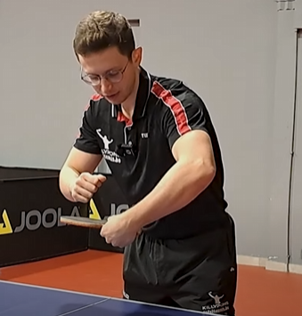
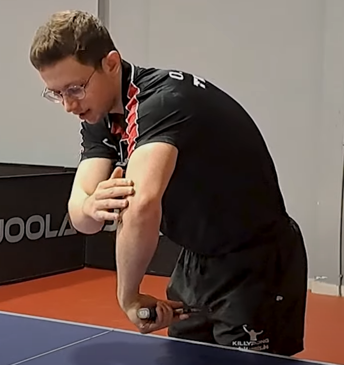
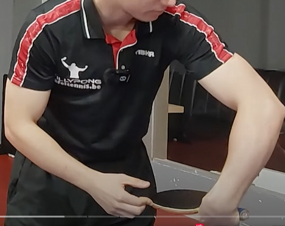
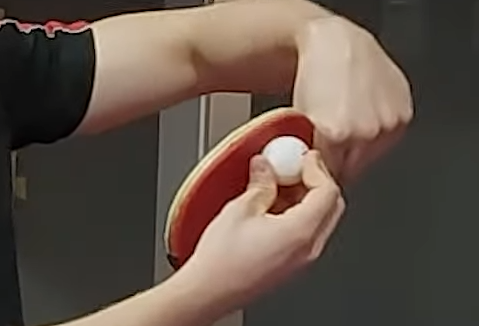

    <h1> Backhand Banana Flick </h1>

### Elbow and Upper Body Positioning

Make sure that your underarm has some sort of wiggle room, some room for **acceleration**. First start at the posture shown below.

    

Leading from this position, **point your elbow at much forward as you can**. As a natural result of pointing your elbow more forward, you naturally lean forward more and lean over. You want to have your elbow **also pointed to your opponent**. Because of this we have more space, to accelerate. This occurs because as the elbow raises, the forearm is now being tucked into the body.

    

#### Paddle Direction

Once the elbow is pointed forward and we're leaning towards the ball, we still need to think about the wrist. **Your paddle should be almost parallel with the table and the top of the racket pointed towards you**.

First lead in using your arm and then follow through with your wrist.

    

#### Point of Contact

This is also shown in the summary `.gif`. The point of corner is not in the center but rather higher up in the corner.

    

#### Using Your Legs

#### Angle for Spin

For **backspin** - Angle the racket higher.
For **topspin** - No need to angle at as high.

#### Summary

The banana flick is a backhand flick with side and topspin, curving the ball over the net. It’s especially effective against short serves to the backhand and is a favorite in modern play. Use the banana flick when,

1. The ball **is short** and bouncing close to the net.
2. The ball is on your backhand side.
3. You want to **attack a short ball with spin and placement**.

The first thing to do when performing the banana flick is to,

1. Move your body to the ball and step in with your dominant foot.
2. Lean forward and create enough space for a powerful arm movement.
3. Stand a bit sideways.
4. Get low and bring your wrist close to the surface of the table.

    

