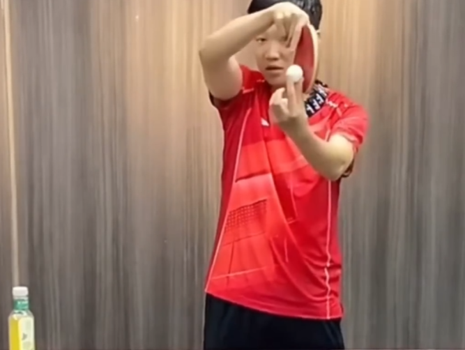
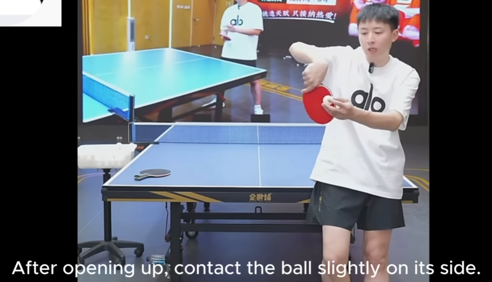
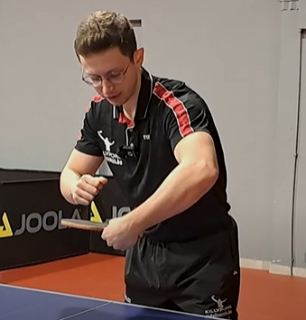
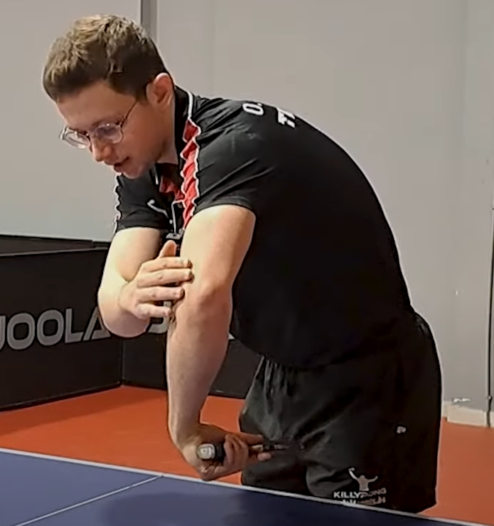
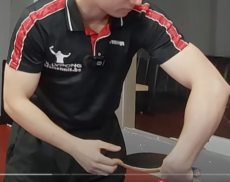
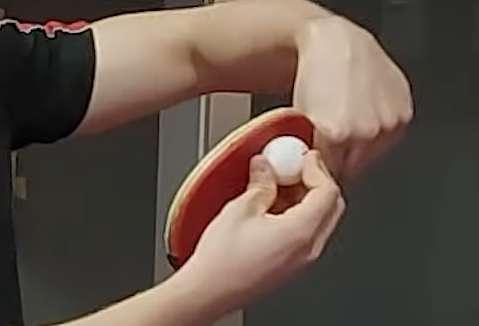
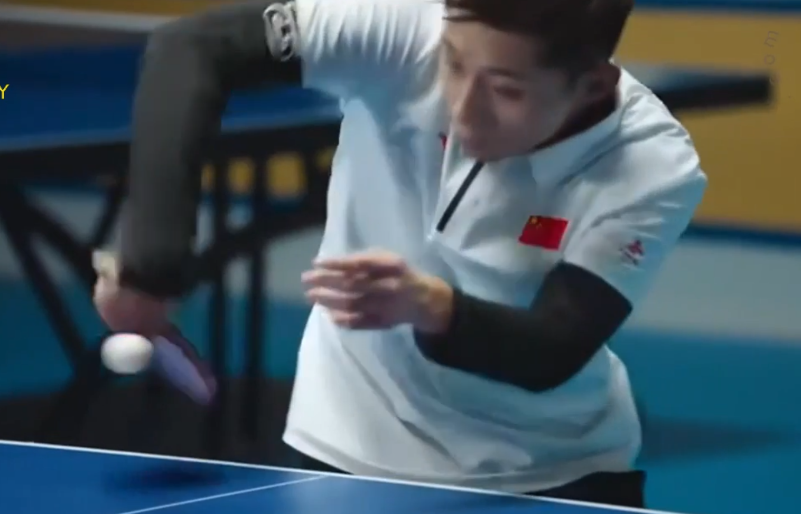
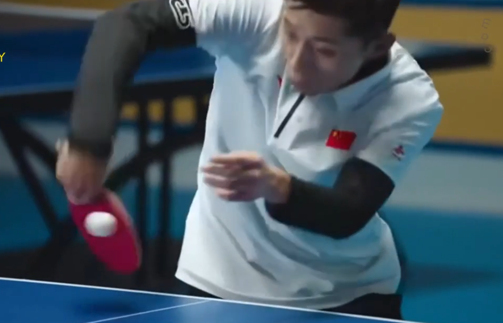

    <h1> TLDR </h1>

The most important components on the backhand flick to remember is,

1. **Face the racket downward** - As the racket head points down, the wrist must be pulled in. If the wrist isn't pulled in, the racket head will turn to the left. **If your racket head is pointing to the left during your flick, no matter how much force you use, the ball will go into the net.**

2. **Rotate your wrist** - The racket should be bent back sufficiently bent. To allow for additional wrist flexion, **raise your elbow**.

#### Wrong - Wrist Pointing Left

    

#### Correct - Racket Head Facing Down

    

3. **Contact The Side** - Always aim to flick from the side. Flicking from the front often leads to the ball going into the net. **By flicking from the side, you avoid the spin**. You don't confront the balls spin directly.

    

    

    

4. **Let the ball come to you** - Let the ball come close to you and do not hit too early. This allows for you to grab the ball and use your entire body and arm to lift the ball over the net. By hitting too early, you have less dwell time and do not use your arm to lift the ball.

5. **Relax then release power instantly**.

6. **Follow through, directing your arm to your oppoent**. Focusing on controlling the ball and brushing forward.

    <h1> Backhand Banana Flick </h1>

### Elbow and Upper Body Positioning

Make sure that your underarm has some sort of wiggle room, some room for **acceleration**. First start at the posture shown below.

    

Leading from this position, **point your elbow at much forward as you can**. As a natural result of pointing your elbow more forward, you naturally lean forward more and lean over. You want to have your elbow **also pointed to your opponent**. Because of this we have more space, to accelerate. This occurs because as the elbow raises, the forearm is now being tucked into the body.

    

#### Paddle Direction

Once the elbow is pointed forward and we're leaning towards the ball, we still need to think about the wrist. **Your paddle should be almost parallel with the table and the top of the racket pointed towards you**.

First lead in using your arm and then follow through with your wrist.

    

#### Point of Contact

This is also shown in the summary `.gif`. The point of corner is not in the center but rather higher up in the corner.

    

#### Using Your Legs

#### Angle for Spin

For **backspin** - Angle the racket higher with the contact point on the lower-mid part.
For **topspin** - No need to angle at as high and the contact point should be higher than backspin.

#### Summary

The banana flick is a backhand flick with side and topspin, curving the ball over the net. It’s especially effective against short serves to the backhand and is a favorite in modern play. Use the banana flick when,

1. The ball **is short** and bouncing close to the net.
2. The ball is on your backhand side.
3. You want to **attack a short ball with spin and placement**.

The first thing to do when performing the banana flick is to,

1. Move your body to the ball and step in with your dominant foot.
2. Lean forward and create enough space for a powerful arm movement.
3. Stand a bit sideways.
4. Get low and bring your wrist close to the surface of the table.

    

    <h1> Zhang Jike </h1>

#### Total Wrist Rotation

    

#### Contact Points

1. **Treat the ball as backspin**. This means, always hit in the lower component of the ball.
2. **Hit the ball on the corner of the paddle as illustrated below**. By rotating your wrist and hitting in the lower left component of the rubber, it increases the dwell time.
3. **BRUSH THE BALL**.

    

    

