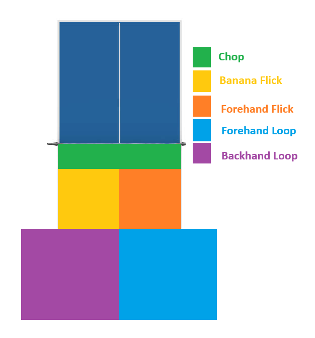

    <h1> Determining Technique </h1>

While multiple techniques exist such as,

- Chops
- Forehand loop
- Banana Flick
- ...

Deciding which technique to use at the right time is crucial.

#### Chop

Use the chop technique when the returning ball is very close to the net.

#### Banana Flick

Use the banana flick for an attacking style return when the ball is within the centre area of the left side of the table, using the backhand.

#### Backhand Loop

Use the backhand loop when the ball is long, close to the end of the table or comes off.

#### Forehand Flick

Use the forehand flick technique when is ball is within the centre around and we do not have enough space to perform a loop.

#### Forehand Loop

When the ball bounces long enough on the right side of the table, this is the optional range to perform a forehand loop.

    

