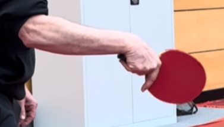
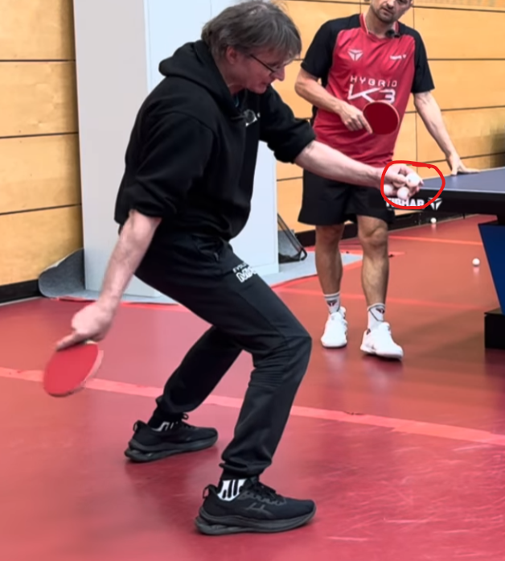
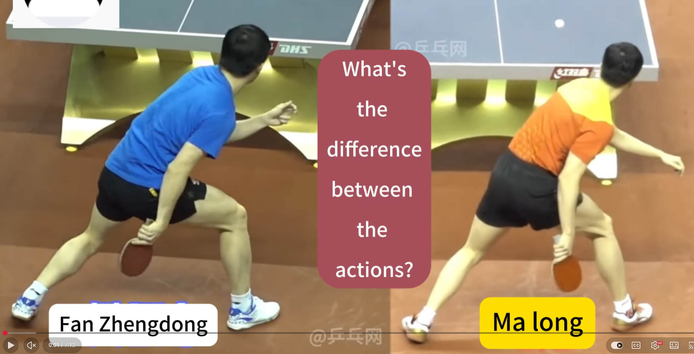
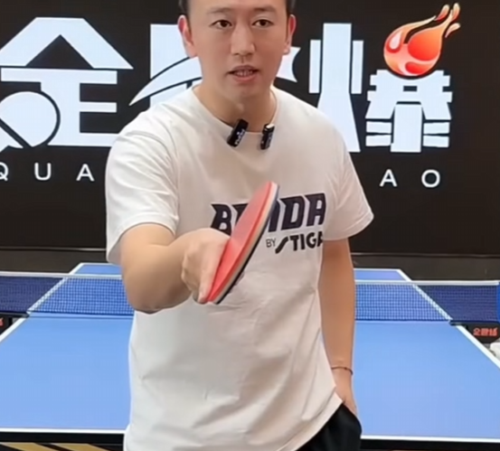
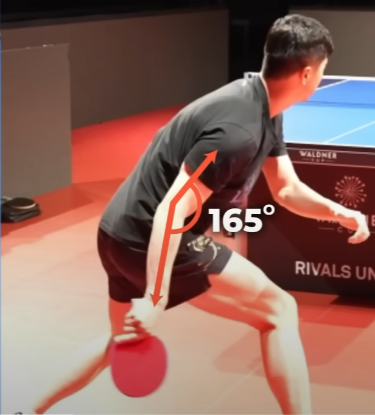
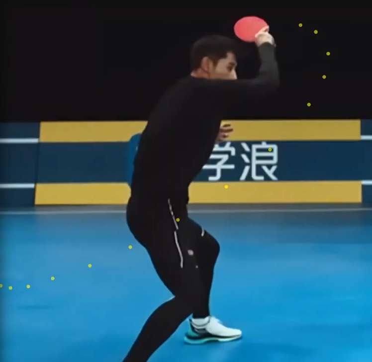
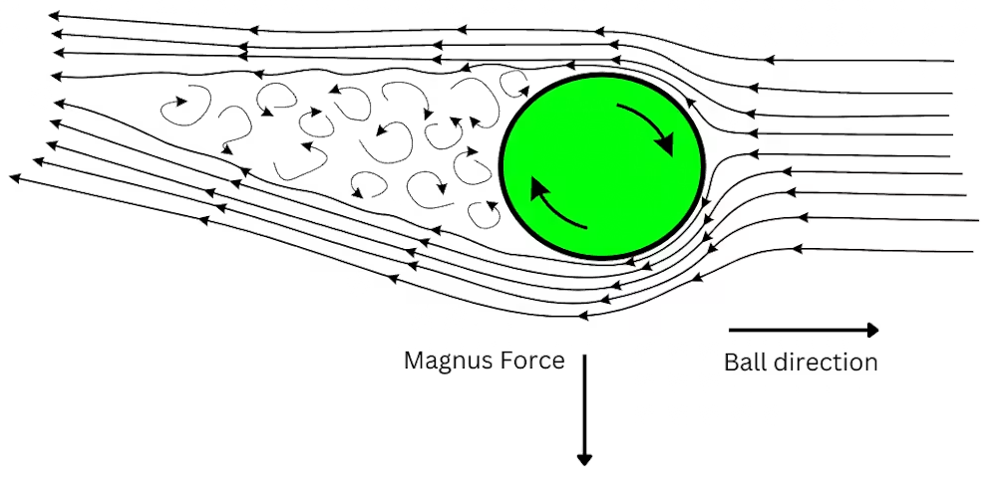
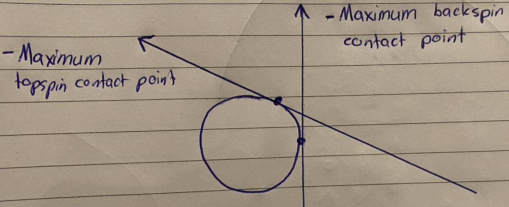

    <h1> Forehand Loop </h1>

#### Wrist Rotation

The wrist rotation should be going backwards, **not downward**. A requirement to do this is to have a **relaxed wrist**. It's important to think of this as cleaning a window. A relaxed, soft wrist. Additionally, you can also think of this as **rotation of the index finger**, which implicitly rotates the wrist.

    

When you go downwards, it causes the player to do slower movements because you need to wrap your wrist around the back of your body.

    

#### Creating a Faster Ball - Follow Through!

In order to create a faster ball, the contact point time is very crucial. That is, it is to be hit in the middle of the motion illustrated below.

    

The movement will not be so much of a higher angle. **It's very important that you're brushing upwards**. At the moment of contact you need to rotate your wrist as mentioned above to create the topspin arc. **Never smash the ball**. Rotation is a matter of topspin. There is no rotation, if you forget this you have no chance and the ball will go directly into the net.

The brushing topspin, wrist rotation and follow through are all used together to create a faster ball that creates an arc, allowing the ball to go over the net and back onto the table. Additionally, **make sure to get low**. This allows for additional reaction time and more space to generate power.

    

#### Backspin and Topspin - Identical Racket Angle 

- Drop the racket low, this is essential to grab the ball.
- Keep the elbow near the body.
- Rotate with the waist.
- Hit forward at 45°, not upward.
- Follow through, brushing the ball.

    

Table tennis is complicated, **just fix the angle** and handle the both of top and under spin in same way. The **only difference is the center of gravity**. Do not open the paddle for backspin, fearing it will not go over the net. Do not close the paddle for topspin, fearing it will go over. **We only need to adjust the body movement direction**. If the racket angle keeps changing, shots be inconsistent.

The racket angle should be approximately $45^\circ$. Too vertical means you can only hit the ball while too horizontal means you can only brush it.

    

- For looping **topspin** shots, the body rotates backward and the forearm moves straight forward.

- Now for **backspin**, the body movement changes slightly. **The paddle angle remains consistent**. The looping backspin shots, the forearm moves **forward and upward**.

    

#### Don't Push Downward

When performing the forehand loop, it's very important to **not push downward**. This can be unintuitive to beginners without a history of spin sports. Amateur players may attempt to grab the ball and then create an arc by having a downward motion, **do not create a downward motion**. 

The motion should have extreme emphasis on the following,

1. Getting low in order to grab the ball
2. Holding the racket at roughly $45^\circ$
3. Correct contact timing, not too early! When the ball is nearly next to you
4. A relaxed wrist, follow through with wrist rotation upon contact
5. Contact with a thin brush in order to properly grab the ball and apply spin
6. Create a follow through movement by accelerating and making sure the hand follows upto the head (Demonstrated below by Ma Long).
7. Make sure that when performing the loop, you can only see the red side of the rubber and not the black.

- **For topspin**, make sure to drive it forward. Extend the shot, make sure its flatter and longer.

    

    

    

    

- **For backspin**, make sure to drive it forward but **also have a more upward component to it than topspin**.

    

The important thing to understand is spin mechanics. When performing all previous criteria before, you will employ significant topspin. **This topspin is what causes the ball to arc downwards because of the magnus force**. Without this, the ball with travel in a flat line and go off the table when applying significant force.

    

    

