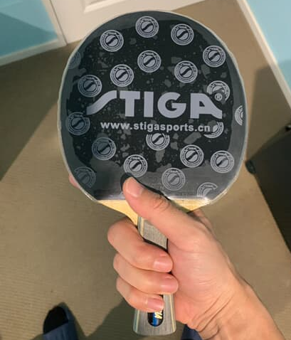
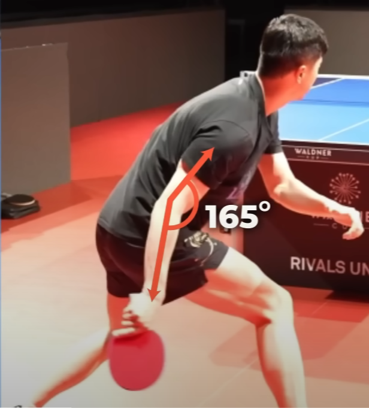
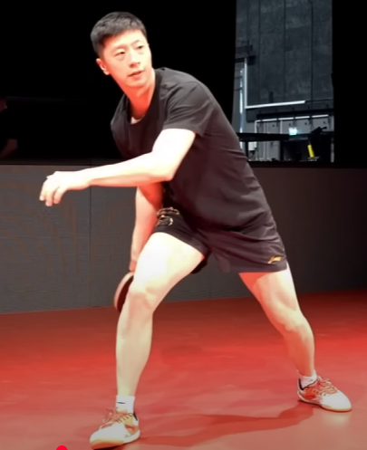
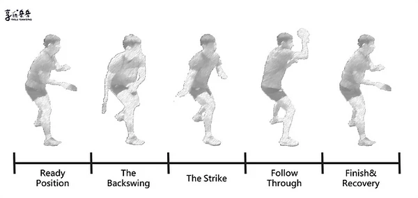

    <h1> Holding the Paddle - Forehand Loop </h1>

Power comes from the legs, hip and core. Using only the hand will not give you any stability. When performing the forehand loop there are some essential key points,
When holding the paddle for the forehand loop the key characteristics are

1. Not holding the thumb completely horizontal, instead raise it slightly upward.
2. The index finger should be risen on the back as to not allow for the index finger to go completely off the paddle.

    

    

1. **Drop The Bat Low** - It's useful to drop the bat as low as the knee. When the paddle is lowered deeply, it's important to keep the **elbow close to your body**. Under this situation is important to use your entire body during this motion. In instances when the ball is very fast and their is no time to drop it low, it's approprtiate to not pull it down as far.
2. **Relax Your Body** - Make sure to keep your arm relaxed, the only point of tension should be **your wrist right before contact**. Only at the **end**, lock the wrist. **You can only tighten one place**, you cannot tighten everything. You need to focus only one thing to tighten, which is the wrist right before contact.
3. **Squeeze Your Core** - For balance and added power, make sure you're applying tension to your core as if you're doing a plank during all of your shots.
4. **Timing** - Make sure to wait for when the ball hits the apex and **begins to slightly lower**. Ideal contact point is between **12 and 2 o'clock**.
5. **Don't Rush** - Acceleration at point of contact is what causes the speed. Begin slow and **then accelerate** when raising your arm. When using acceleration instead of a fixed speed, it increases contact time on the ball.
6. **Follow Through** - After completion of the shot, **keep the paddle driving up to your head**. This is important to having the paddle near the middle of the body, allowing the use of a paddle backhand return afterwards.
7. **Brushing Contact** - During the contact phase, players aim to brush the ball with the racket's surface while maintaining a closed racket angle. This brushing action generates topspin, causing the ball to rotate forward and descend quickly over the net. **The ball should be struck with the middle or upper portion of the racket for maximum control**.
8. **Brushing Balance** - Think - "Brush through the ball with power". First make contact with a **brushing angle**, then use your arm, waist and legs to **drive through** the ball.
9. **Begin Down and Then Pull Backwards - Form an Arc** - As demonstrated below, Ma Long is performing a forehand loop. He first lowers his paddle and instead of immediately driving it upwards, he pulls it back to perform an arc movement. It's very important to pull it backwards, **otherwise it removes too much of the forward momemtnum**. It's more difficult to **brush forward** without puling backwards and then arcing forward, otherwise it has too much upward direction and less forward direction. The two black dots illustrate the contact point in the middle of the movement, which is the ideal contact point. The difference being when pulling backwards and then arcing forwward, has significantly more forward momentum. This extra forward momentum used in conjunction with a **brushing** contact aids in control, spin and speed.

    

    

10. **Turn Your Index Finger Upward** - It's very important to keep **the wrist relaxed** in a natural position. When coming up in an upward motion you will turn your **index finger upward**.

    

10. **MOVE!** - It's very important to get into the correct position to perform the forehand loop. Good footwork is important and always remember `Eyes (Watch the ball) → Legs (Get into position) → Arm (Follow through with the loop)`. **Anticipation** is important but comes with practice, you need to "visualize" the ball in the position where you believe it will go to and preemptively move and prepare.

11. **Full Body Movement** - Many players make the mistake of following through with the arm only. The forehand is a full body motion starting from the legs, going through the waist, shoulder and finishing with the wrist. To summarize,

- Drop the racket low.
- Keep the elbow near the body.
- Rotate with the waist.
- Hit forward at 45°, not upward.
- Follow through, brushing the ball.

    

    

    

    

    

While the above is general advice the sequence of steps can be broken down into,

1. When the ball starts to touch the table, shift your weight to your right foot, knees bent.

2. Twist your waist and rotate your shoulders at the same time.

3. Drop your hand down behind your knee while **keeping your arm almost straight.**

    

    

    

    

    <h1> Forehand Looping Backspin </h1>

When performing a forehand loop against backspin it's crucial to make the following adjustments,

1. Store the power to the right leg. Shift the entire weight to the right leg. Do not rotate the right leg once planted.
1. While pressing down on the right leg, we inwardly rotate the right hip. Then, the waist rotates. Do not rotate your legs or the waist cannot rotate properly.

    

1. The power from the waist and hips come out. If you can feel the rotation of your waist and hips and they cannot rotate any further, that means your waist and hips are in position.

1. Loop the ball at **2 o'clock**. Unlike topspin, it's essential to wait for the ball to fall a bit more than normal. It's completely fine to loop a topspin ball near 12 o'clock, but versus backspin it's very important to loop it around **2 o'click**.
1. Inital contact is in the lower-mid component of the ball, illustrated below by the image.
1. When looping backspin, it's very important **to brush the ball**.
1. Make sure to **accelerate** and **follow through** with the looping motion so the hand is above the head which leads to increased contact time. If the ball goes off to table it is an indication that more brushing is required or more follow through is required.
1. Rotate the wrist before contact to help lift the ball.

    

1. After making contact with the ball at the lower-mid point, wrist rotation and natural follow through will keep the ball on the table. **After successfully making a brushing contact at the correct contact point, at this point you can then rotate the wrist and brush in a forward direction to get the ball over the net at a velocity that isn't as easy to return**. If you brush and lift at too high of an angle, giving the opponent an easy high topspin ball allows them to easy loop it back for an offensive return, which is not good.

**Contact Point + Follow Through** are the most important aspects of looping a backspin ball. Within the mid-lower contact, you have higher dwell time. This increased dwell time, combined with wrist movement and follow through allows you to pull the ball over the net. **The follow through racket may look high, but the initlal contact point is still the lower-middle**. The wrist rotation during the follow through creates this illusion. The conclusion here is that **heavy backspin balls can be contacted at mid or slightly below center**.

    

    

#### Brushing Rule of Thumb

- When **close to the table** → More Brush to for control, high arc.
- When **farther from the table** → More power for penetration and depth.
- When against **backspin** → Brush more to lift the ball.
- When against **topspin** → Use more power and forward drive to counter.

    <h1> Racket Angle </h1>

- **Backspin** - More open angle, brush more.
- **Topspin** - More closed angle, drive more.

Knowing the swing path of the forehand topspin is **based on the balls incoming spin**.

When performing a forehand loop **versus backspin** it's crucial to angle the racket in a much higher angle. This is because backspin forces the ball go to downwards onto the table, we therefore need to counteract this by aiming our paddle at a much higher angle, relying on the backspin to pull it back onto the table. Additionally, when trying to loop versus backspin **you need to drop the paddle even lower** in order to generate more power and combat the backspin.

When performing a forehand loop **versus topspin**, we need hit the ball on a much lower angle. This is because the ball has high amounts of topspin which causes the ball go to upwards on contact. You need to calibrate how much power and what angle is required **depending on the amount of spin on the ball**.

    

    

