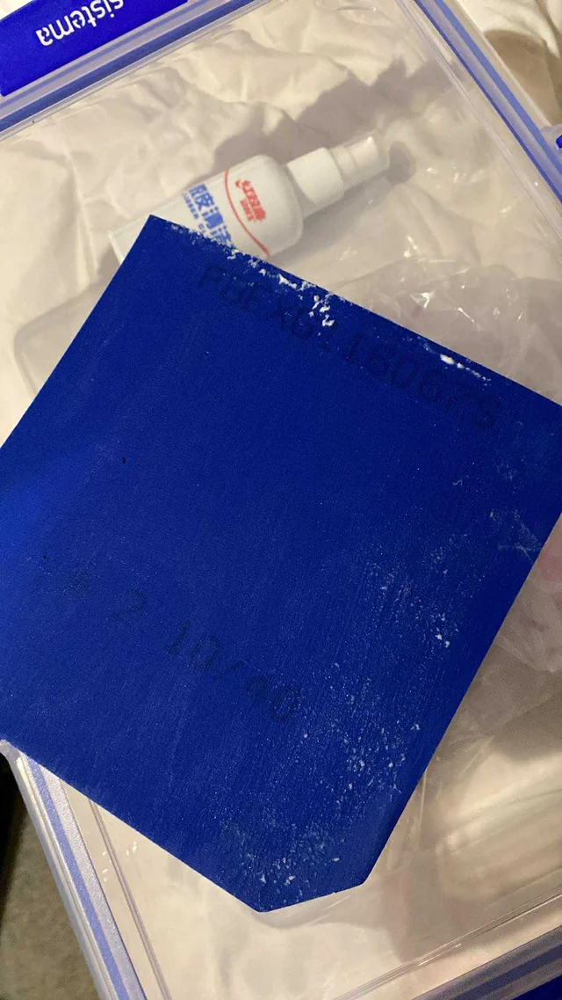

<div align='center'>
    <h1> Gluing Rubber - DHS No 15 </h1>
</div>

When first using DHS No. 15 glue, players may feel like that the glue dries almost instantly, leaving only seconds to spread it before it congeals. In reality, this is not caused by true drying, but by **frictional congealing**. Excessive rubbing during application generates heat, causing latex adhesive to ball up into chunks. This creates an uneven film and compromises adhesion.

Butterfly Free Chack, being thinner and smoother, is less prone to this effect. DHS glue, by contrast, requires a more controlled spreading technique, especially when applied by tacky rubbers such as Hurricane 3. DHS No. 15 glue presents challenges due to its higher viscosity and sensitivity to friction, but these can be managed through proper technique. Understanding that "rapid drying" is actually frictional congealing allows players to adapt their method. The dot distribution pattern combined with cross-spreading strokes ensures smooth, uniform layers. By avoiding common mistakes such as heavy rubbing, overapplication or premature assembly, players can achieve professional-quality adhesion particularily for tacky rubbers.

#### Glue Application - Dot Method

Instead of applying a single blob or hozizontal line of glue, use multiple spaced dots. This reduces friction and promotes uniform cover. An example pattern using 3-2-3 distribution.

```
 _______________________________________
|                                       |
|        •           •           •      |
|                                       |
|             •           •             |
|                                       |
|        •           •           •      |
|_______________________________________|
```

- **Rubber Side - Sponge** - Use a 3-2-3 pattern and use **two layers of glue**.
- **Blade Side** - 2-3 smaller dots only as wood absorbs less glue. Use **one layer of glue**.

This pattern ensures that glue spreads from multiple centers, reducing the need for heavy rubbing and minimizing clumping.

#### Spreading Technique

- **First pass** - Spread **horizontally** in long, light strokes to distribute glue across the surface.
- **Second pass** - Smooth vertically with **minimal pressure** to eliminate streaks and ensure even thickness.

Think of painting, not scrubbing. Friction generates heat and causes clumps. **Ensure the applicator is fully loaded with glue**. Using a dry sponge edge will drag glue unevenly, leaving streaks. This will cause clumping as demonstrated below,

<div align='center'>
    
</div>

#### Drying and Assembly

Allow both blade and sponge to dry until the glue turns **clear and tacky**, not white or wet. You can test if it's test by placing your finger on the glue, if glue gets on your finger, it's not dry.

Align the rubber at the handle edge and roll it upward onto the blade, pressing outward with a roller.

Wait 10-20 minutes before trimming to allow the bond to stabilize

#### Common Mistakess

##### Applying glue as a single blob or line

This will create uneven thickness and requires excessive spreading. Use multiple dots for balanced coverage.

##### Rubbing too hard during spreading

Produces frictional heat, causing glue to congeal into chunks. **Spread lightly with smooth strokes**

##### Using a dry sponge edge

Drags glue unevenly, leaving streaks. **Ensure the applicator is fully loaded with glue**.
