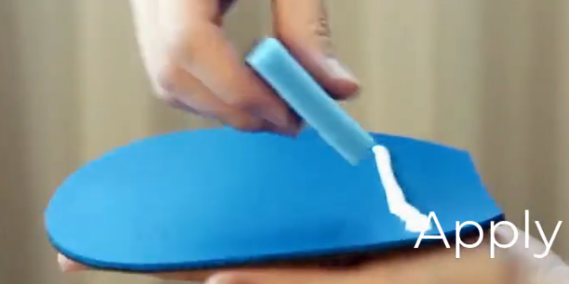
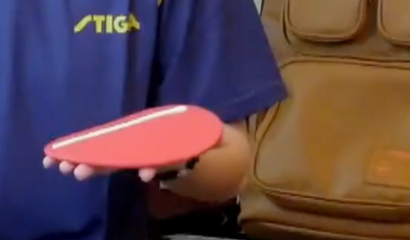
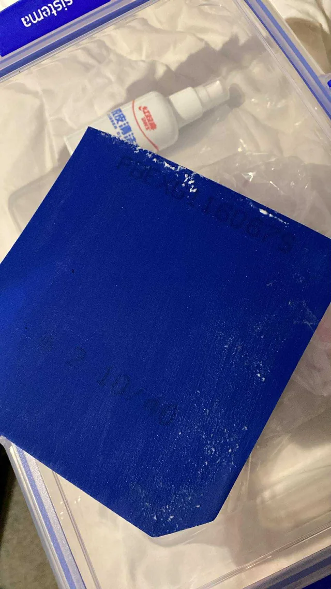

    <h1> Gluing Rubber - DHS No 15 </h1>

When first using DHS No. 15 glue, players may feel like that the glue dries almost instantly, leaving only seconds to spread it before it congeals. In reality, this is not caused by true drying, but by **frictional congealing**. Excessive rubbing during application generates heat, causing latex adhesive to ball up into chunks. This creates an uneven film and compromises adhesion.

Butterfly Free Chack, being thinner and smoother, is less prone to this effect. DHS glue, by contrast, requires a more controlled spreading technique, especially when applied by tacky rubbers such as Hurricane 3. DHS No. 15 glue presents challenges due to its higher viscosity and sensitivity to friction, but these can be managed through proper technique. Understanding that "rapid drying" is actually frictional congealing allows players to adapt their method. The dot distribution pattern combined with cross-spreading strokes ensures smooth, uniform layers. By avoiding common mistakes such as heavy rubbing, overapplication or premature assembly, players can achieve professional-quality adhesion particularily for tacky rubbers.

#### Glue Application - Line Near the Bottom

Apply a direct single line as shown in preparation for the bottom to top movement.

    

    

#### Spreading Technique - Bottom to Top

When performing strokes. Always make the motion from **bottom to up**. For the rubber, make sure the **bottom of the rubber is at the top of your stroke** (This is the part that touches the blade handle). What matters is **staying consistent** and not going back-and-forth/circular, since that's what causes ridges and uneven thickness.

    

    

Think of painting, not scrubbing. Friction generates heat and causes clumps. **Ensure the applicator is fully loaded with glue**. Using a dry sponge edge will drag glue unevenly, leaving streaks. This will cause clumping as demonstrated below,

    

#### Drying and Assembly

Allow both blade and sponge to dry until the glue turns **clear and tacky**, not white or wet. You can test if it's test by placing your finger on the glue, if glue gets on your finger, it's not dry.

Align the rubber at the handle edge and roll it upward onto the blade, pressing outward with a roller.

Wait 10-20 minutes before trimming to allow the bond to stabilize

Once the glue is non-sticky and transparent you can apply, **2 layers for the rubber and one layer for the blade**.

#### Common Mistakess

##### Rubbing too hard during spreading

Produces frictional heat, causing glue to congeal into chunks. **Spread lightly with smooth strokes**

##### Using a dry sponge edge

Drags glue unevenly, leaving streaks. **Ensure the applicator is fully loaded with glue**.

#### Cutting The Rubber

1. Use an X-Acto #11 blade or scalpel for cutting the rubber.
2. Cut after the glue is fully dried and rolled.
3. Keep blade at 45° to the blade edge.
4. Replace blade after every 1–2 rubbers for best results.
