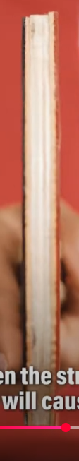
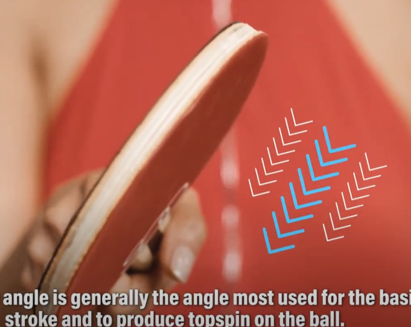
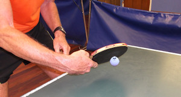
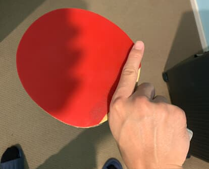

    <h1> Holding the Paddle</h1>

How the racket is held during the reception of a serve can greatly influence the ability to control and direct the return. Generally, the face of the racket is what primarily determines whether it is open or closed. The face of the racket is the **flat part you hit the ball with** - the round rubber-covered surface. So when people say "open the racket" or "close the racket", they mean:

- **Open** - Tilt the racket os the face points more upward.
- **Close** - Tilt the racket so the face points more downward.

Both the forehand and backhand sides of the paddle are faces. When referencing open or closed, it refers to how that specific face is angled - regardbless of whether its the red or black side.

- If you're doing a push with your backhand, you use the backhand face.
- If you tilt that backhand face upward → you're using an open racket.
- If you tilt it downward → it’s closed.

Same logic applies if you use your forehand.

- **Neutral Grip** (0° tilt, parallel to the floor) - In a neutral grip, the racket is held in a way that the angle of the blade is relatively vertical to the ground. This grip provides versatility, allowing the player to react to both topspin and backspin serves effectively. **It's major usecase is for blocking or redirecting spin; minimizes inherent spin effects.**

    

    

- **Open Racket** (10–30° backward tilt) - The racket is tilted slightly backward (away from body), which opens the face of the racket. **The grip is ideal for counteracting backspin by lifting the ball; ideal for pushing or lifting against underspin**. The open racket position is vulnerable to topspin serves due to excessive ball elevation.

    

    

- **Closed Racket** (10–30° forward tilt) - In contrast, a closed racket position means the racket face is angled downward toward the table. **This position is ideal against topspin, enabling drives or loops**. It in effective against heavy backspin, as the angle promotes net errors and angles the ball directly into the table.

    

    

A receiver must be adaptable in choosing between an open or closed grip based on the incoming spin, ball placement, and desired trajectory of the return.

    <h1> Holding the Paddle - Forehand Loop </h1>

When holding the paddle for the forehand loop the key characteristics are

1. Not holding the thumb completely horizontal, instead raise it slightly upward.
2. The index finger should be risen on the back as to not allow for the index finger to go completely off the paddle.

    

    

    <h1> Holding the Paddle - Backhand </h1>

When holding the paddle for a backhand, the position of the index finger at the back remains the same. **The key difference is the thumb**. Now, we raise the thumb slightly higher in order to support the paddle to give it more power.

    

    

