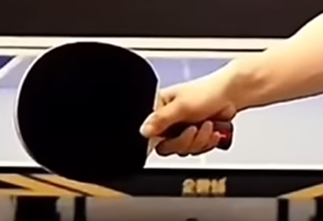
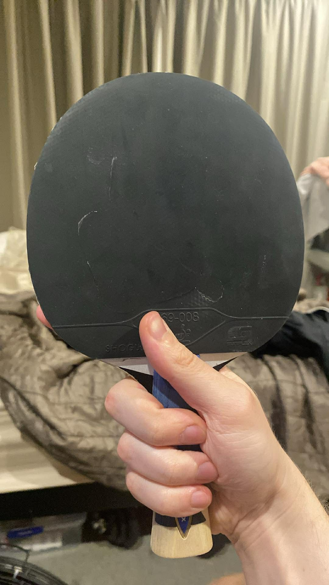

    <h1> Holding the Racket </h1>

Given the significant of the backhand in table tennis it's very important to have a powerful backhand. Each technique, whether it be backhand or forehand have optimal grip and thumb placements. However, during a match it can be very difficult to transition between the two. For this reason, it's ideal to have a single grip. Modern tennis tabble favours the backhand and having a grip for the backhand still allows for a good forehand. The current grip style of many professional table tennis players all lean towards the backhand.

If your backhand isn't strong, you're at a huge disadvantage. However, in todays style, even if your forehand is weak as long as your backhand is strong you still have a good chance. Now, with traditional table tennis the spin has decreased and the speed increased.

This grip is a neutral grip, designed for an efficient backhand and forehand. It is not perfectly optimal for backhand nor forehand, but is a great neutral balance when playing and transitioning between them. For the forehand, you will need to open the wrist up a bit more.

    

When playing a game, it's important to first [move the body and leg](https://www.youtube.com/shorts/j_ZAVNtv4_0) and then the arm.

    

