

    <h1> Pendulum Serve </h1>

The pendulum serve involves swinging your forearm from right to left, like a pendulum, brushing the ball on its side or underside. It's commonly used by elite players because it can,

1. Produce very heavy spin with subtle variations.
2. Be served short (to stop attack) or fast and long (to surprise opponents).
3. Be deceptive - the motion for topspin and backspin can look very similar.

## Grip

The shakehand grip is too stiff on the wrist, instead you need to change to use a pinch grip.

    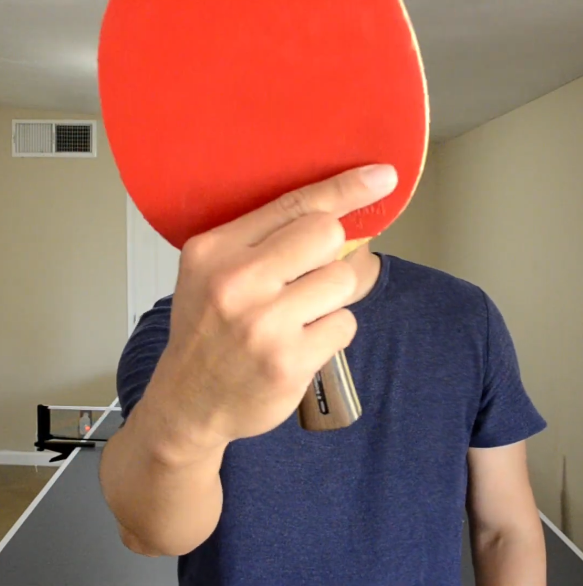

    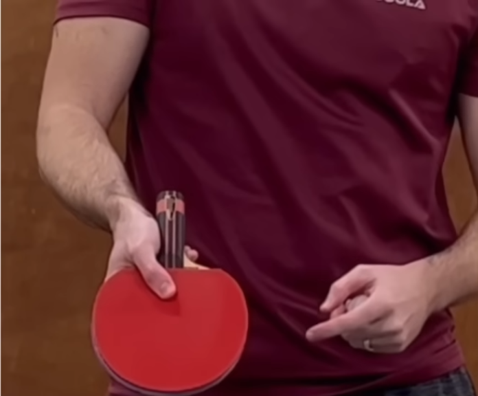

The goal is to allow the wrist to flow freely.

    

## Basic Steps

#### Preparation

    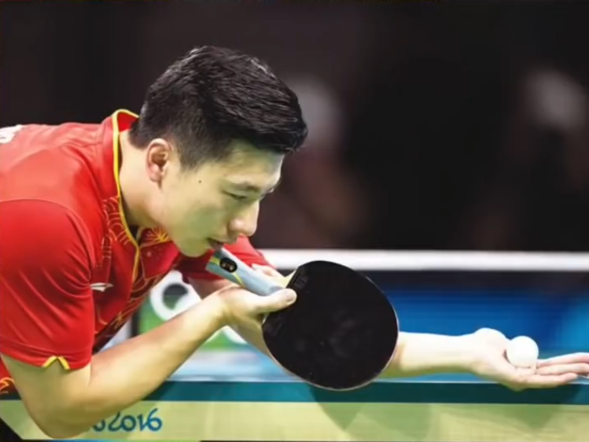

#### Pendulum Motion

Get the elbow to be the anchor for the pendulum. The forearm and the racket needs to move in a pendulum motion.

    

#### Wrist Snap

The wrist needs to perform a snapping motion to generate the spin.

    

#### Contact Point

During the pendulum service, the goal is to make contact on the left side of the racket. This is due to allowing the most amount of spin due to increased contact time.

    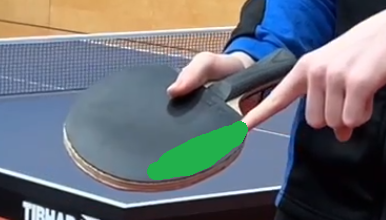

#### Variations

#### Ma Long

    

    

    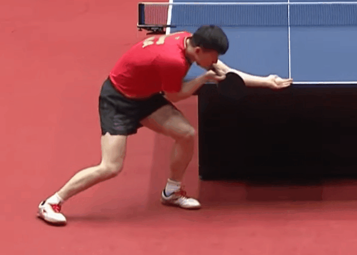

    

    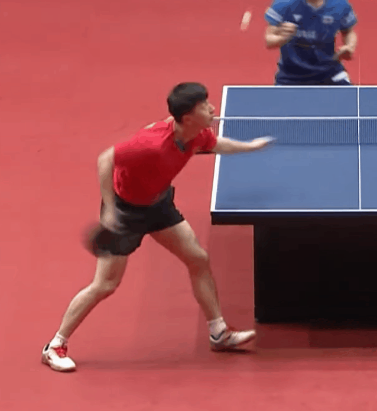

    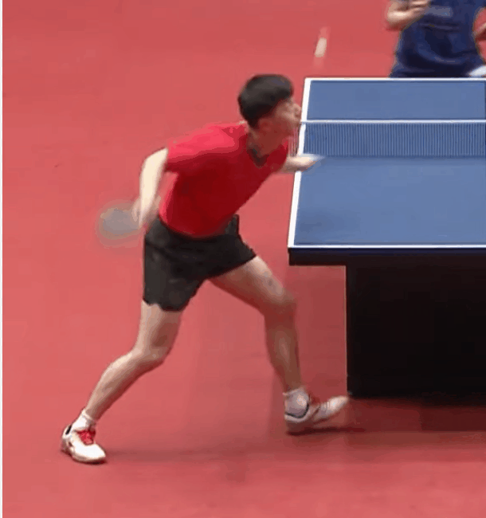

    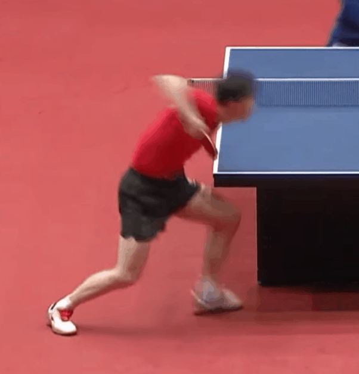

    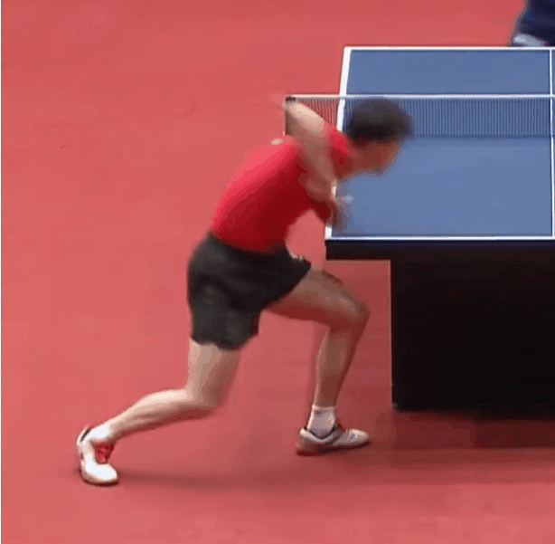

    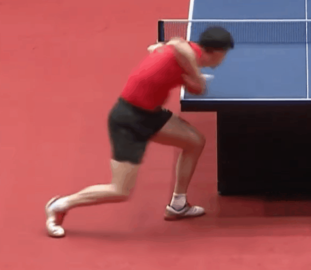

    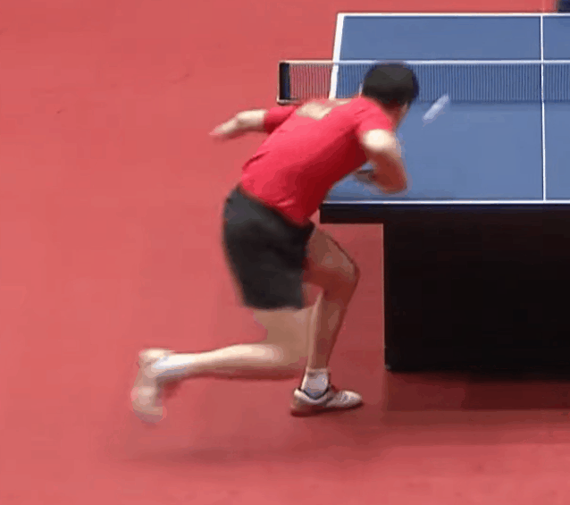

#### Backspin

    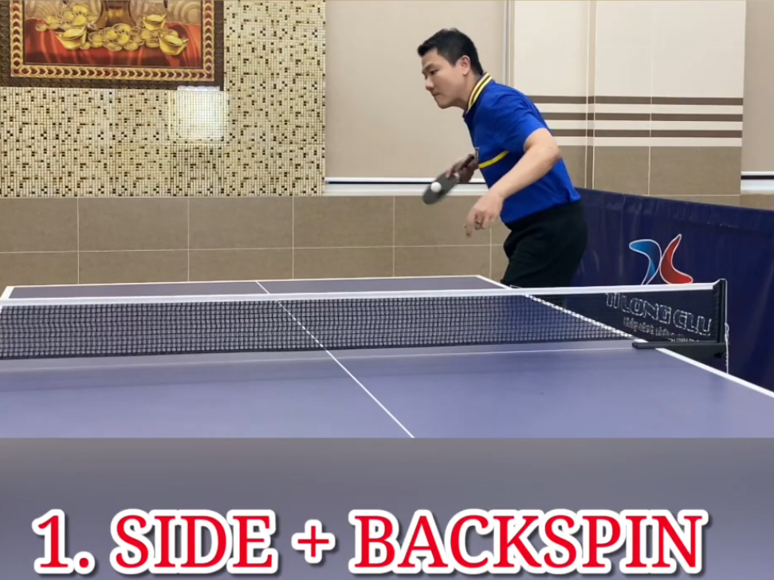

    

### Topspin

    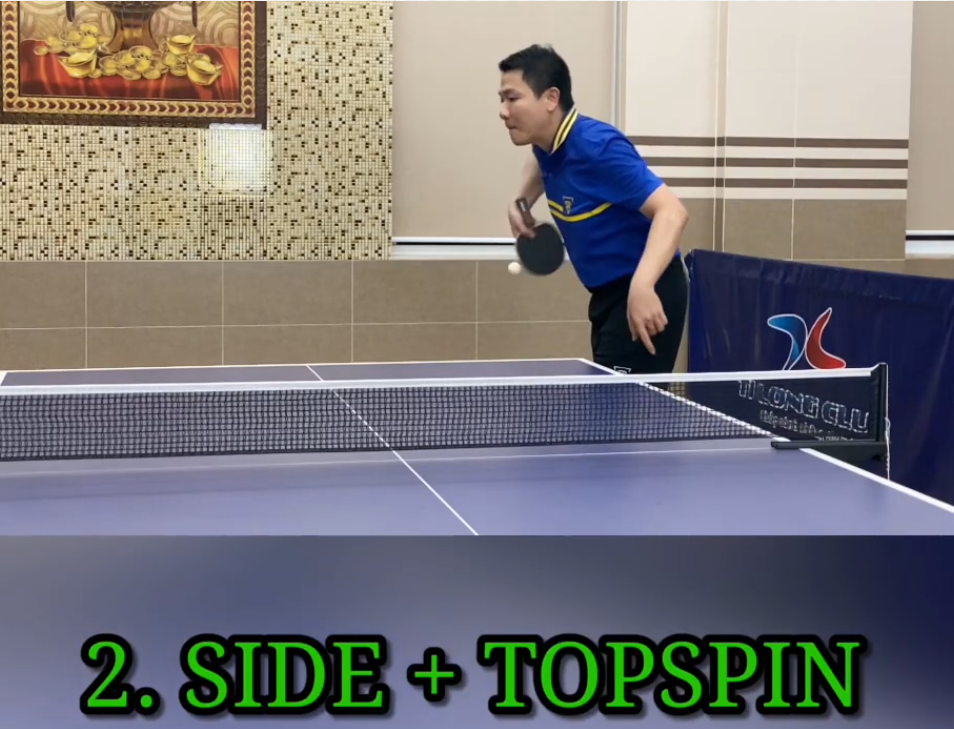

    

