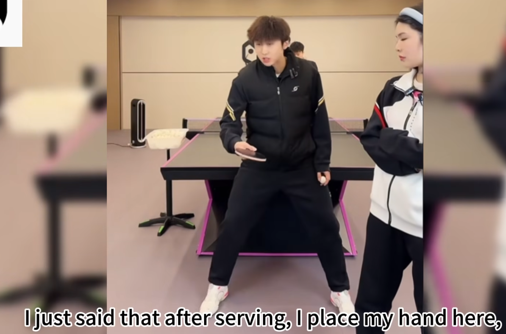
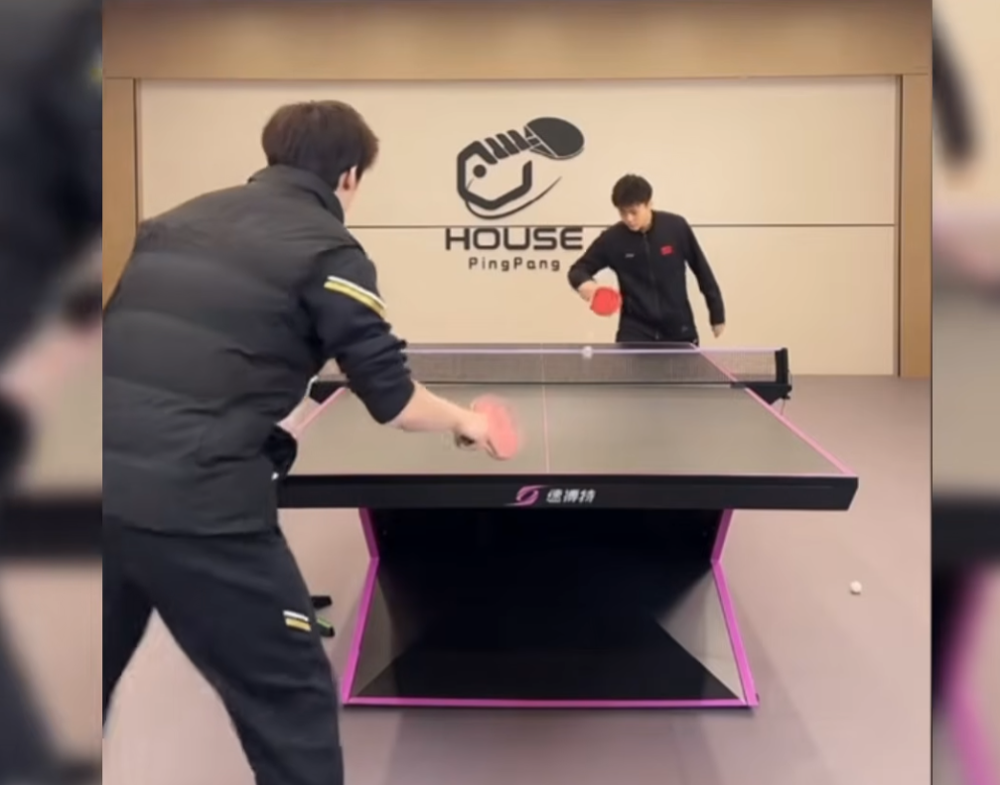
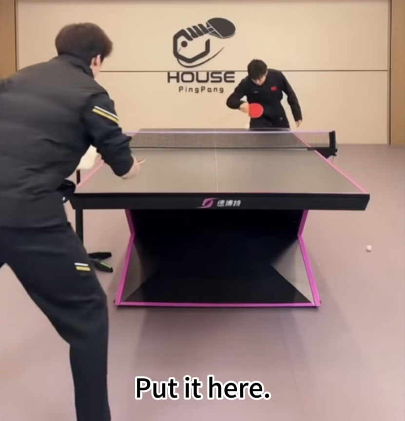

    <h1> Preparation <h1>

No matter how many forehands your opponents hits to you, **you must always prepare for your backhand first**. This does not mean that you backswing in advance! After each hit place the hand position shown below. As soon as the opponent makes contact with the ball, this is when you switch to perform a forehand or backhand movement. This position still allows for an easy transition to swing with your forehand, but is close to perform a backhand movement.

    

#### Incorrect Preparation

Below is a frequent, but incorrect preparation. This technique makes it difficult to prepare for backhand and forehand and reduced time.

    

#### Correct Preparation

Notice here that is hand is facing inwards, rotated. This means it's significantly easier to go for a backhand while still maintaining good posture for a forehand transition.

    

    

