

    <h1> Introduction - Receiving Serve </h1>

The service is one of the most important phases of play and the way a player receives the service can drastically affect the outcome of a rally. While many players focus on the mechanics of serving, the return of serve is just as crucial to gaining an advantage. To effectively return serves, a player must not only understand the physical and technical aspects of the return itself but also anticipate the intentions of their opponent.

The most critical part in analyzing the opponents serve **is watching the point of contact.** As this is what ultimately determines what spin is on the ball. The opponent may try to deceive you by waving the paddle in the wrong direction before before hitting or even after contact, this meaning nothing! Additionally, the direction as well as the point of contact is both what ultimately decides the overall service.

The first and most important thing when returning a service, is to **let the ball come to you**. All good serve return is based off this. All good players have the ability to let the ball come to them and **not chase the ball**. You need to have the ability to capture the energy and not go to it. If you go to the ball, we have energy + energy which can equal no control. **This means don’t reach, don’t lunge, and don’t rush your stroke**. Instead, get in the right position early and allow the ball to enter your ideal contact zone, where you can control it calmly and efficiently. We can then go to the spot, holding the racket very still and then letting the ball touch the racket. We need the ability to,

1. Ability to predict the future location of the ball. Go to that spot and be very passive with the ball. Think of it like catching a water balloon — you don’t stab at it; you let it fall into your hands, absorbing the force to control it without bursting.
2. Ability to hold the racket very still.

The meaning of “letting the ball come to you” in table tennis — controlled absorption and redirection rather than aggressive interception. It also means,

1. Don't reach out of lunge toward the ball too early.
2. Don't attack the balls energy with your own excessive force (especially on returns)
3. Instead, read the serve early, move your body to the correct spot and meet the ball in your ideal contact zone - usually close to your body, in front of you.

    <h1> Stance Position </h1>

The stance of the receiver when preparing to return a serve is one of the most important factors influencing the quality of their return. An effective stance allows for flexibility, balance, and the ability to react quickly to various types of serves.

When receiving the ball, we often have very little time to react and you must execute our response in a single action and a single movement. There is no preparation phase, only immediate execution. In these situations it is crucial to pay close attention to our stance when receiving the ball, especially the position of the racket.

The most commonly recommended stance for receiving a serve is a slightly open, balanced position with 

1. The knees slightly bent.
2. Distribute about 70% of your weight on the balls of your feet and 30% on your heels.
2. You should be roughly half a step distance from the table.
4. The body should be positioned at a slight angle to the table. Lean your torso forward at about 15-20 degrees from vertical.
5. The non-dominant foot (left foot for right-handed players) should be slightly ahead of the dominant foot, allowing for quicker lateral movement if needed.

A guideline for your starting position can be to just touch the edge of the table in the middle with your arm bent. If you're versusing a player who serves almost entirely long, it's acceptable to step back by 10cm to 20cm if you need a little more time to react.

- **For forehand dominant players**, stand slightly to the left of the center.

- **For backhand dominant players**, stand closer to the middle or slightly toward your backhand side.

    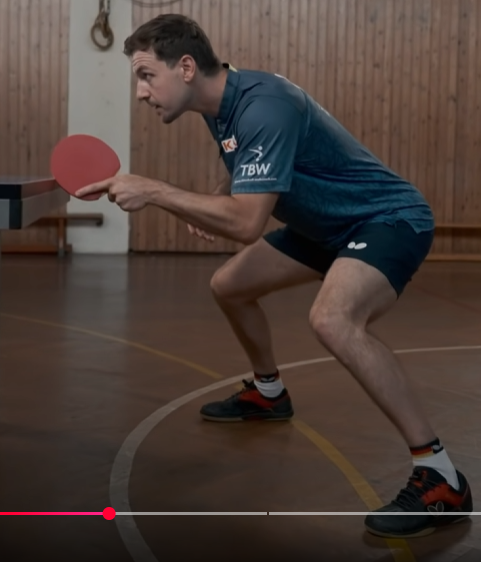

Keeping it centered and infront of the body is essential to be able to respond effectively with either a forehand or a backhand. **It's much easier to have a paddle higher and moving it lower**, than having it lower and moving it upwards as we have the help of gravity.

    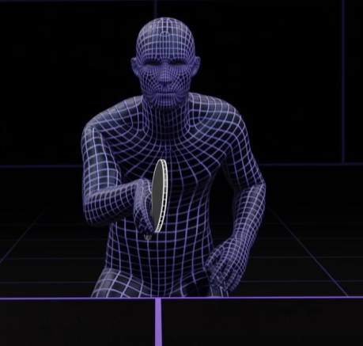

    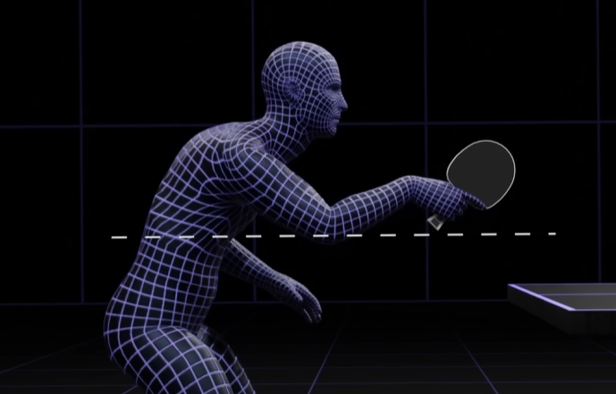

    <h1> Holding the Paddle</h1>

How the racket is held during the reception of a serve can greatly influence the ability to control and direct the return. Generally, the face of the racket is what primarily determines whether it is open or closed. The face of the racket is the **flat part you hit the ball with** - the round rubber-covered surface. So when people say "open the racket" or "close the racket", they mean:

- **Open** - Tilt the racket os the face points more upward.
- **Close** - Tilt the racket so the face points more downward.

Both the forehand and backhand sides of the paddle are faces. When referencing open or closed, it refers to how that specific face is angled - regardbless of whether its the red or black side.

- If you're doing a push with your backhand, you use the backhand face.
- If you tilt that backhand face upward → you're using an open racket.
- If you tilt it downward → it’s closed.

Same logic applies if you use your forehand.

- **Neutral Grip**  (0° tilt, parallel to the floor) - In a neutral grip, the racket is held in a way that the angle of the blade is relatively vertical to the ground. This grip provides versatility, allowing the player to react to both topspin and backspin serves effectively. **It's major usecase is for blocking or redirecting spin; minimizes inherent spin effects.**

    

    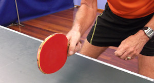

- **Open Racket** (10–30° backward tilt) - The racket is tilted slightly backward (away from body), which opens the face of the racket. **The grip is ideal for counteracting backspin by lifting the ball; ideal for pushing or lifting against underspin**.  The open racket position is vulnerable to topspin serves due to excessive ball elevation.

    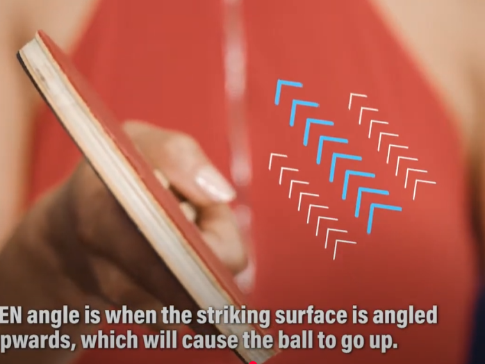

    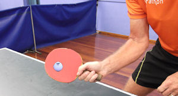

- **Closed Racket** (10–30° forward tilt) - In contrast, a closed racket position means the racket face is angled downward  toward the table. **This position is ideal against topspin, enabling drives or loops**. It in effective against heavy backspin, as the angle promotes net errors and angles the ball directly into the table.

    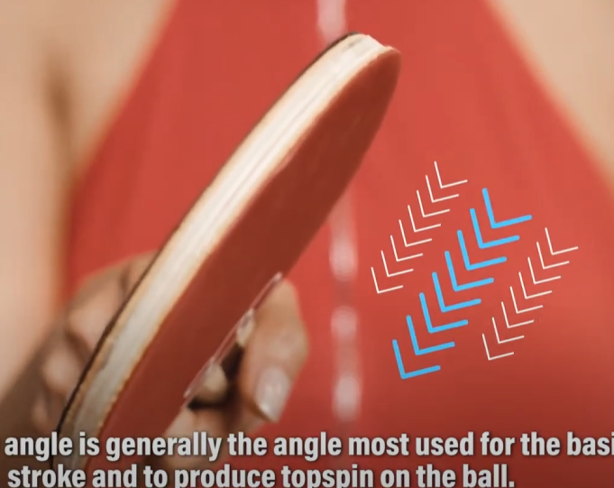

    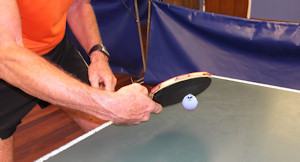

A receiver must be adaptable in choosing between an open or closed grip based on the incoming spin, ball placement, and desired trajectory of the return.

    <h1> Spin Mechanics</h1>

## Topspin

A topspin service causes the ball to **dip quickly after crossing the net**. Topspin occurs when the server brushes upward across the ball's surface, creating forward rotation. This rotation generates force that push the ball downward during flight, compressing its trajectory arc and accelerating its descent toward the table. When a topspin ball contacts the table surface, the rotational energy converts to forward momentum, producing a higher, more aggressive bounce with increased velocity.

    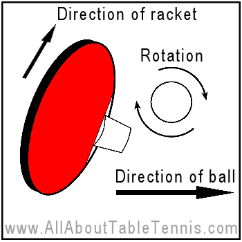

Upon reaching the receiver, the topspin forward rotation creates distinctive challenges. As the spinning ball contacts the receiver's racket, **the rotation forces the ball to climb upward if met with a neutral racket angle**. This upward deflection frequently sends returns beyond the table boundaries when not properly countered. **Receivers must compensate by closing their racket angle and adjusting their timing to neutralize the incoming rotation**. The physical interaction between topspin and racket surface necessitates precise adjustments that challenge even experienced players.

    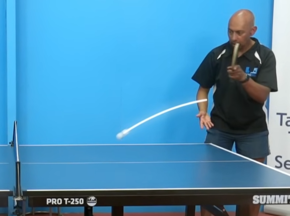

    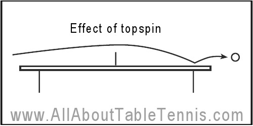

## Backspin

Backspin service mechanics operate on opposite principles to topspin. By brushing downward on the ball, the server creates backward rotation that generates upward forces during flight. These forces counteract gravity, allowing the ball to float longer with a flatter trajectory curve and extended horizontal travel distance. The physics of backspin create a distinctive flight pattern that experienced players recognize and anticipate.

    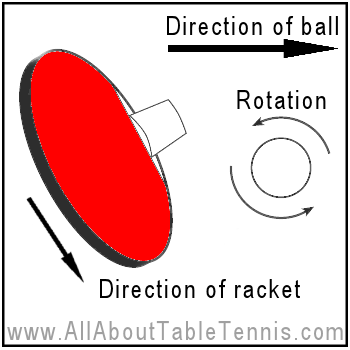

When a backspin ball contacts the table, its backward rotation works against forward momentum, creating friction that significantly reduces the ball's speed and produces a characteristically low, skidding bounce. This reduced bounce height complicates receiver positioning and timing. **Upon contact with the receiver's racket, backspin creates downward pressure, directing the ball toward the table surface and often into the net if not properly countered**. Receivers **must open their racket** angle and employ upward brushing motions to neutralize the incoming spin, requiring precise technical adjustments to avoid common error patterns.

1. While in the air - The ball **floats slightly** and often travels shorter.
2. On the bounce - The ball tends to **stay low** and may even **kick backward** slightly or stop.
3. On the paddle - If you just block it, the ball **drops into the net** due to the spin pulling it downward.

    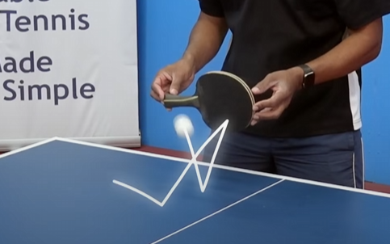

## Sidespin

Sidespin introduces horizontal rotation by brushing sideways across the ball. Unlike topspin and backspin which primarily affect vertical ball movement, sidespin creates lateral forces that cause the ball to curve sideways during flight. The direction of curve corresponds to the rotation direction—left-to-right sidespin curves rightward while right-to-left sidespin curves leftward. This horizontal deviation challenges receivers' positioning and anticipation.

    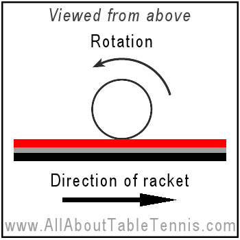

    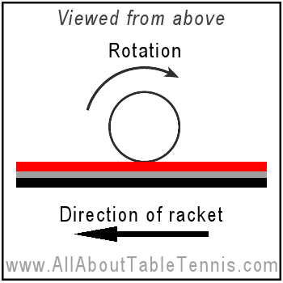

The physics of sidespin become particularly evident during bounce, where the ball deviates from standard reflection angles. Rather than rebounding at the geometrically expected angle, sidespin balls maintain their rotational energy through the bounce and continue curving in the spin direction. When contacting the receiver's racket, sidespin creates sideways forces that push the ball laterally across the racket face, typically deflecting returns in the direction opposite to the incoming spin. This lateral displacement requires receivers to adjust both their positioning and racket angle horizontally, adding complexity to the return technique.

**For returning spin services** we will create the mirror rule - **Mirror their paddle direction - their right becomes your left**. This works because **the angle their arm rotates to cause the spin, is the angle that the ball will bounce off towards**.

    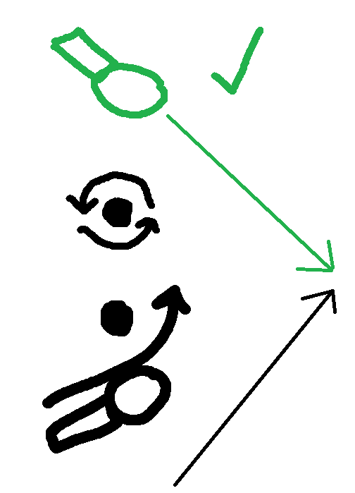

- Your opponents paddle moves **to their right** - You angle your paddle **to your left**.
- Your opponents moves to **to their left** - You angle your paddle **to your right**.

It works because the spin they apply ends up pushing the ball in the **same direction their paddle was moving** — and you're tilting your paddle to mirror and meet that.

1. You don't need to know spin names.
2. You don't need to watch the ball curve.
3. **Just mirror their paddle direction**. - "Their paddle goes that way, my paddle points the other way."

### Right Sidespin

When you deliver right sidespin onto the ball, by brushing onto the right hand side of the ball, **it will cause it to go to the left**.

    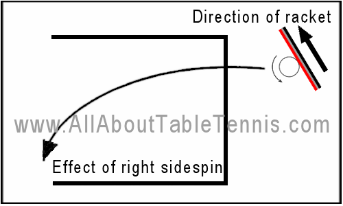

However, when a right sidespin stroke makes contact with the opponents racket, **the right sidespin will cause it to rebound to their left**. Always remember that the direction the ball will bounce from contact with the paddle **will be the direction of the servers arm when making contact to generate the sidespin**. In other words, if the opponent created a right sidespin by moving their arm to their right, the ball will bounce towards this direction when making contact with your paddle as a receiver.

    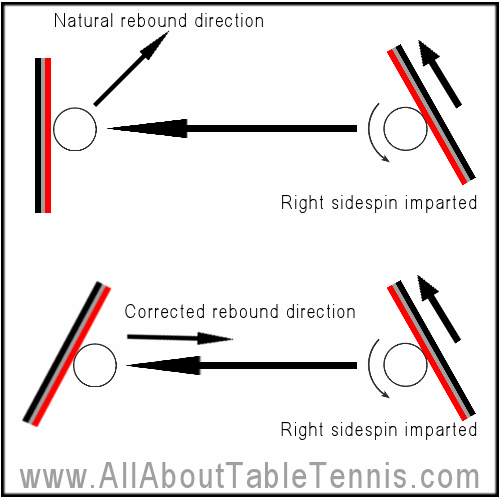

### Left Sidespin

When you deliver left sidespin onto the ball, by brushing onto the left hand side of the ball, **it will cause it to go to the right**.

    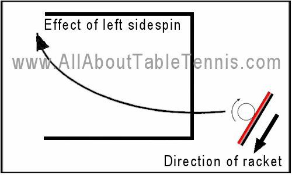

However, when a left sidespin stroke makes contact with the opponents racket, **the left sidespin will cause it to rebound to their right**. Always remember that the direction the ball will bounce from contact with the paddle **will be the direction of the servers arm when making contact to generate the sidespin**. In other words, if the opponent created a left sidespin by moving their arm to their left, the ball will bounce towards this direction when making contact with your paddle as a receiver.

    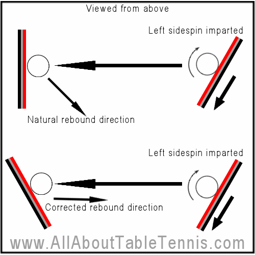

## Combinations Spins

Combination spins represent the most technically advanced service variations, involving simultaneous rotation around multiple axes. These complex spins typically combine elements of topspin or backspin with sidespin components. The physics of combination spins involve compound forces acting on the ball simultaneously, creating multi-directional effects throughout the ball's trajectory and bounce.

    <h1> Different Return Techniques </h1>

## Backhand Push

The push is a foundational defensive stroke in table tennis used **to return backspin balls**. It's not meant to be an attacking shot, but rather a control-based return that keeps the ball low and prevents the opponent from initiating a strong attack. Pushes can be played short or long, depending on your tactical intent. Pushes are most useful in the early parts of a rally when you're not ready to attack, or when you want to provoke an opening from your opponent that you can counter.

You can use the backhand push when,

1. Against **backspin serves** or **pushes** that are **low and short**.
2. To **keep the rally passive** while waiting for a better opportunity to attack.
3. As a tactical variation.

We know that when hitting a flat surface with backspin, the ball will be go inwards into the table. Therefore, we need a way to counter this and angle the paddle to compensate for when receiving against it. The push return is considered a safe, reliable and short return. To do this we,

1. Open your paddle (tilt it slightly upward).
2. **Brush gently under the ball**, moving **forward and slightly down**.
3. Use soft hands - don't jab or hit hard. Avoid using wrist force, push using your elbow instead.
4. Try to keep the return low and short over the net.

    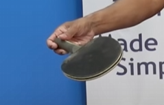

    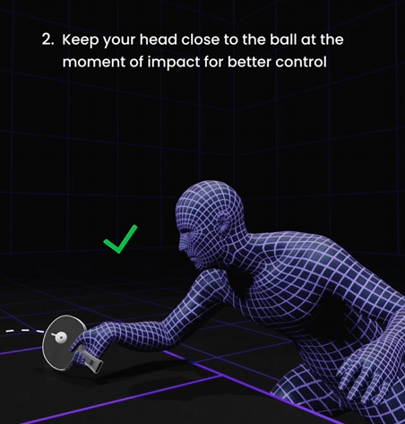

- The heavier the spin, the more you must **open** the paddle and **brush under it**.
- If the ball bounces short, try and keep your return short too, this will prevent them from responding with a powerful attack return.
- If the spin is intensely high, it is important to also [lift the ball](https://www.youtube.com/watch?v=HJLXf_Vv-nU).

    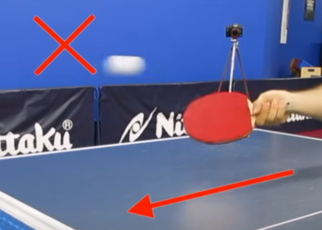

    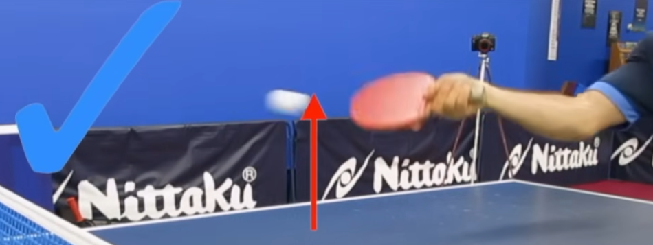

**Extra Tip** - Use the underspin on the forehand flick, **don't fight it**. You can use the backspin to get the ball down. So all you have to do is hit up on the ball and let the backspin do the work of taking the ball back on the table, so you're using the backspin.

    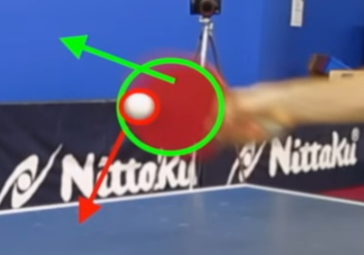

## Forehand Flick

#### Stance

The flick is an agressive return used against **short balls**, usually serves or short pushes. It involves quickly lifting the ball over the net with a snap of the wrist, generating speed and light topspin. Whilst the push shot uses an open racket, the forehand flick **uses a closed racket**. If your opponent plays a return short over the net, there is often opportunity to play a forehand flick stroke. Because we're using a closed racket, we're often relying on the backspin on the ball to get it over the net. Often good technique involves keep the racket in a slight open position when getting into the correct stance and then used a close paddle. It should be used,

1. Against **short serves** or or short pushes **that are not heavily backspun**.
2. When you want to gain initiative instead of pushing.
3. To surprise opponents who expect a passive return.

When performing the forehand flick the first thing to get right is the position of your body. This technique is performed primarily on short serves and therefore requires the receiver to get close to the table with their dominant foot under the table. This is done to later extend your body and reach the ball. It's also necessary to bend in your knee.

    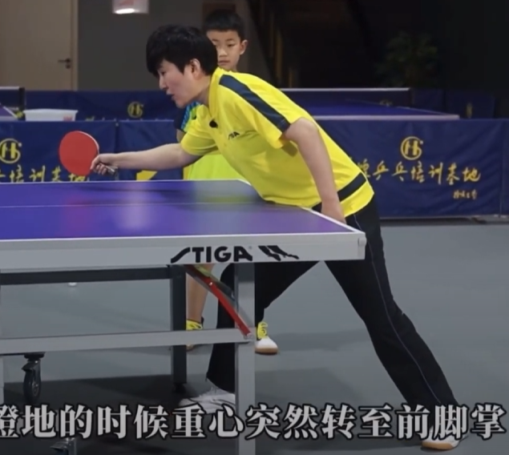

#### Timing

The timing is the next important concept, when performing the forehand flick **we need to wait for the apex of the flight**. Waiting until the ball is at its highest point, gives the best opportunity to perform the forehand flick. If you attempt to hit the ball too late when the balls position is closer to the table, the execution cannot be that effective.

#### Racket Angle

The racket angle is **always dependent on the incoming spin**. If the incoming ball has much more backspin, you need to slightly open your paddle more. In addition to this your stroke will also be more upwards. Initially the paddle is in an open position, but will later be transferred to a close position. **Remember to compensate for sidespin when performing the flick** by remembering the direction to slightly tilt the paddle.

You must not use your upper arm otherwise you will lose control. Focus on your forearm, wrist and fingers. Finally, a sudden acceleration to hit the ball.

    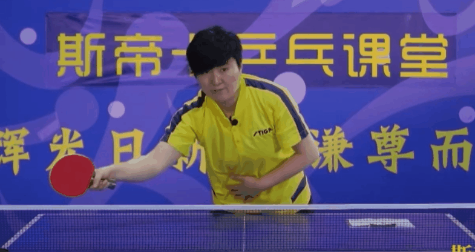

    

## Backhand Banana Flick

The banana flick is a backhand flick with side and topspin, curving the ball over the net. It’s especially effective against short serves to the backhand and is a favorite in modern play. Use the banana flick when,

1. The ball **is short** and bouncing close to the net.
2. The ball is on your backhand side.
3. There is **backspin or no spin** on the serve.
4. You want to **attack a short ball with spin and placement**.

The first thing to do when performing the banana flick is to,

1. Move your body to the ball and step in with your dominant foot.
2. Lean forward and create enough space for a powerful arm movement.
3. Stand a bit sideways.
4. Get low and bring your wrist close to the surface of the table.

    

    

## Forehand Loop

Power comes from the legs, hip and core. Using only the hand will not give you any stability. When performing the forehand loop there are some essential key points,

1. **Drop the bat low** - It's useful to drop the bat as low as the knee.
2. **Relax your arm** - Make sure to keep your arm relaxed, the only point of tension should be your wrist **right before contact**.
3. **Squeeze your core** - For balance and added power, make sure you're applying tension to your core as if you're doing a plank during all of your shots.
4. **Don't aim your racket inward** - Make sure that your racket is slightly open.
5. **Timing** - Make sure to wait for when the ball hits the apex and **begins to slightly lower**.
6. **Don't rush** - Acceleration at point of contact is what causes the speed. Begin slow and then accelerate when raising your arm.
7. **Follow through** - After completion of the shot, keep the paddle driving up to your head. This is important to having the paddle near the middle of the body, allowing the use of a paddle backhand return afterwards.
8. **Brushing contact** - During the contact phase, players aim to brush the ball with the racket's surface while maintaining a closed racket angle. This brushing action generates topspin, causing the ball to rotate forward and descend quickly over the net. **The ball should be struck with the middle or upper portion of the racket for maximum control**.
9. **Extend your arm so its near flat** - When kneeing down, make sure you're nearly extending your nearly flat as depicted by the image below.

While the above is general advice the sequence of steps can be broken down into,

1. When the ball starts to touch the table, shift your weight to your right foot, knees bent.

2. Twist your waist and rotate your shoulders at the same time.

3. Drop your hand down behind your knee while **keeping your arm almost straight.**

    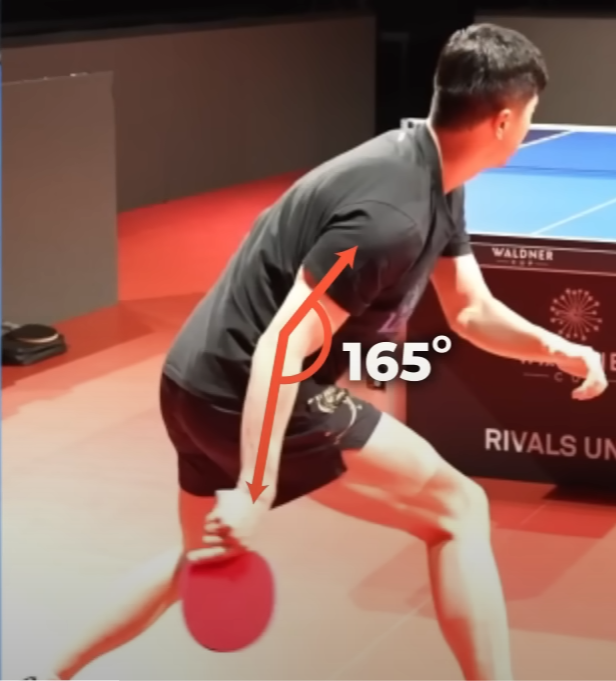

    

    

    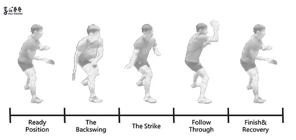

#### Footwork

Good footwork is vital to get into position and move effiently. Without proper footwork you will miss the opportunity to get in propert position to get a good hit.

The way most players like Ma Long perform footwork is to perform jumping actions to ensure to get into correct position quickly. The key characteristics are,

1. Have a strong core the entire game. Similar to how you would perform the planking exercise.
2. Feet wide apart and weight on the balls of your feet.
3. Knees bent
4. Springs with both feet
5. Feet remain apart during the jump

Avoid doing too many steps, more steps is a loss of power.

    

#### Racket Angle

Knowing the swing path of the forehand topspin is **based on the balls incoming spin**.

When performing a forehand loop **versus backspin** it's crucial to angle the racket in a much higher angle. This is because backspin forces the ball go to downwards onto the table, we therefore need to counteract this by aiming our paddle at a much higher angle, relying on the backspin to pull it back onto the table.

    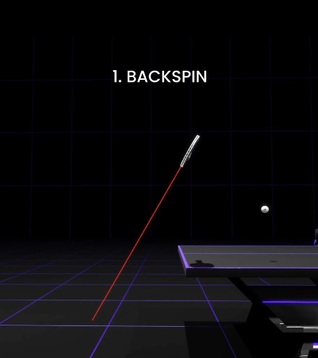

Additionally, when trying to loop versus backspin **you need to drop the paddle even lower** in order to generate more power and combat the backspin.

    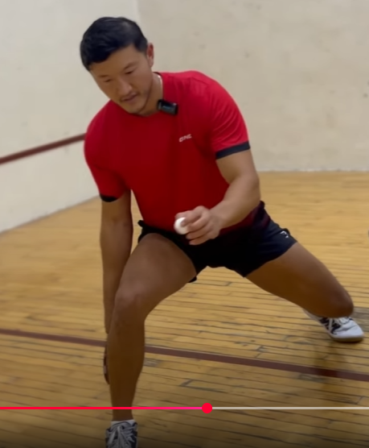

When performing a forehand loop **versus topspin**, we need hit the ball on a much lower angle. This is because the ball has high amounts of topspin which causes the ball go to upwards on contact. You need to calibrate how much power and what angle is required **depending on the amount of spin on the ball**.

    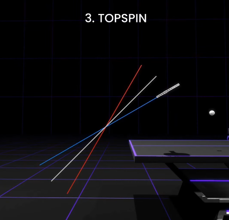

## Backhand Loop - TODO

- https://www.youtube.com/watch?v=5WX40KF9z58

# Determining Which Return Technique To Use - TODO

