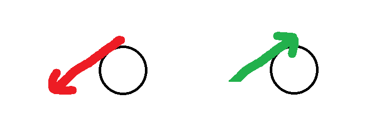

    <h1> Introduction - Receiving Serve </h1>

The service is one of the most important phases of play and the way a player receives the service can drastically affect the outcome of a rally. While many players focus on the mechanics of serving, the return of serve is just as crucial to gaining an advantage. To effectively return serves, a player must not only understand the physical and technical aspects of the return itself but also anticipate the intentions of their opponent.

The most critical part in analyzing the opponents serve **is watching the point of contact.** As this is what ultimately determines what spin is on the ball. The opponent may try to deceive you by waving the paddle in the wrong direction before before hitting or even after contact, this meaning nothing! Additionally, the direction as well as the point of contact is both what ultimately decides the overall service.

The first and most important thing when returning a service, is to **let the ball come to you**. All good serve return is based off this. All good players have the ability to let the ball come to them and **not chase the ball**. You need to have the ability to capture the energy and not go to it. If you go to the ball, we have energy + energy which can equal no control. **This means don’t reach, don’t lunge, and don’t rush your stroke**. Instead, get in the right position early and allow the ball to enter your ideal contact zone, where you can control it calmly and efficiently. We can then go to the spot, holding the racket very still and then letting the ball touch the racket. We need the ability to,

1. Ability to predict the future location of the ball. Go to that spot and be very passive with the ball. Think of it like catching a water balloon — you don’t stab at it; you let it fall into your hands, absorbing the force to control it without bursting.
2. Ability to hold the racket very still.

The meaning of “letting the ball come to you” in table tennis — controlled absorption and redirection rather than aggressive interception. It also means,

1. Don't reach out of lunge toward the ball too early.
2. Don't attack the balls energy with your own excessive force (especially on returns)
3. Instead, read the serve early, move your body to the correct spot and meet the ball in your ideal contact zone - usually close to your body, in front of you.

    <h1> Return Technique - Mirroring

**For returning spin services** we will create the mirror rule - **Mirror their paddle direction - their right becomes your left**. This works because **the angle their arm rotates to cause the spin, is the angle that the ball will bounce off towards**. Keep in mind this **will not work** when your opponent using the opposite hand that you use, e.g. right handed versus left handed.

    

- Your opponents paddle moves **to their right** - You angle your paddle **to your left**.
- Your opponents moves to **to their left** - You angle your paddle **to your right**.

It works because the spin they apply ends up pushing the ball in the **same direction their paddle was moving** — and you're tilting your paddle to mirror and meet that.

1. You don't need to know spin names.
2. You don't need to watch the ball curve.
3. **Just mirror their paddle direction**. - "Their paddle goes that way, my paddle points the other way."

    <h1> Return Technique - Inverse

An alternative technique is to think of **doing the inverse**. Firstly, keep an eye on the servers paddle and observe **the point of contact**. When applying spin, the paddle will momentarily contact the paddle and then move a direction to apply spin. This technique is to watch the paddles movement and **apply the opposite**.

When the paddle makes contact with the ball, if the paddle moves **from your left to the right, then hit the ball in the inverse direction, i.e. left**. To shorten this further we can condense it from a thought process as to simply **looking at the point of contact, then directing the ball in the opposite direction**.

    

The mirror technique has slightly difficulties when applying it to the pendulum serve. The inverse technique does not struggle with this. Suppose the server is performing **a inverse pendulum**. Once the paddle has made contact with the ball, the paddle **will move left** and cause the ball to move in a counter-clockwise rotation. Hence once it has made contact with our paddle on a neutral position, the ball will go left.

Applying the inverse rule above, we need to direct the ball in the opposite direction of the paddle movement. The red line is the direction of the servers paddle upon contact with the ball. The inverse direction of this means we need to hit the ball to the right.

    

    

    

    

## Combinations Spins

Combination spins represent the most technically advanced service variations, involving simultaneous rotation around multiple axes. These complex spins typically combine elements of topspin or backspin with sidespin components. The physics of combination spins involve compound forces acting on the ball simultaneously, creating multi-directional effects throughout the ball's trajectory and bounce.

    <h1> Different Return Techniques </h1>

## Backhand Push

The push is a foundational defensive stroke in table tennis used **to return backspin balls**. It's not meant to be an attacking shot, but rather a control-based return that keeps the ball low and prevents the opponent from initiating a strong attack. Pushes can be played short or long, depending on your tactical intent. Pushes are most useful in the early parts of a rally when you're not ready to attack, or when you want to provoke an opening from your opponent that you can counter.

You can use the backhand push when,

1. Against **backspin serves** or **pushes** that are **low and short**.
2. To **keep the rally passive** while waiting for a better opportunity to attack.
3. As a tactical variation.

We know that when hitting a flat surface with backspin, the ball will be go inwards into the table. Therefore, we need a way to counter this and angle the paddle to compensate for when receiving against it. The push return is considered a safe, reliable and short return. To do this we,

1. Open your paddle (tilt it slightly upward).
2. **Brush gently under the ball**, moving **forward and slightly down**.
3. Use soft hands - don't jab or hit hard. Avoid using wrist force, push using your elbow instead.
4. Try to keep the return low and short over the net.

    

    

- The heavier the spin, the more you must **open** the paddle and **brush under it**.
- If the ball bounces short, try and keep your return short too, this will prevent them from responding with a powerful attack return.
- If the spin is intensely high, it is important to also [lift the ball](https://www.youtube.com/watch?v=HJLXf_Vv-nU).

    

    

**Extra Tip** - Use the underspin on the forehand flick, **don't fight it**. You can use the backspin to get the ball down. So all you have to do is hit up on the ball and let the backspin do the work of taking the ball back on the table, so you're using the backspin.

    

