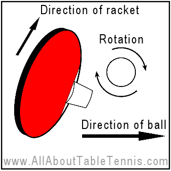
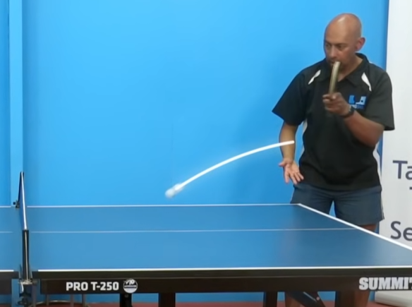
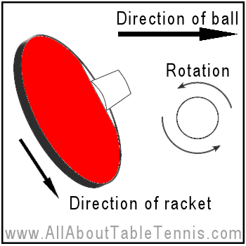
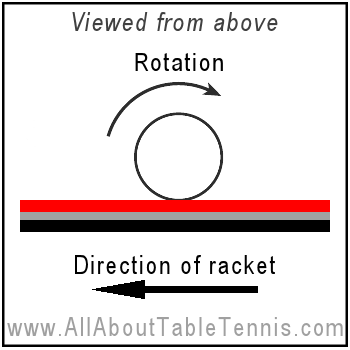
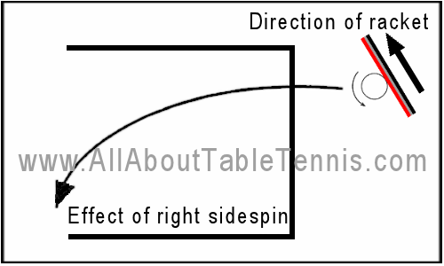

    <h1> Topspin </h1>

A topspin service causes the ball to **dip quickly after crossing the net**. Topspin occurs when the server brushes upward across the ball's surface, creating forward rotation. This rotation generates force that push the ball downward during flight, compressing its trajectory arc and accelerating its descent toward the table. When a topspin ball contacts the table surface, the rotational energy converts to forward momentum, producing a higher, more aggressive bounce with increased velocity.

    

Upon reaching the receiver, the topspin forward rotation creates distinctive challenges. As the spinning ball contacts the receiver's racket, **the rotation forces the ball to climb upward if met with a neutral racket angle**. This upward deflection frequently sends returns beyond the table boundaries when not properly countered. **Receivers must compensate by closing their racket angle and adjusting their timing to neutralize the incoming rotation**. The physical interaction between topspin and racket surface necessitates precise adjustments that challenge even experienced players.

    

    

    <h1> Backspin </h1>

Backspin service mechanics operate on opposite principles to topspin. By brushing downward on the ball, the server creates backward rotation that generates upward forces during flight. These forces counteract gravity, allowing the ball to float longer with a flatter trajectory curve and extended horizontal travel distance. The physics of backspin create a distinctive flight pattern that experienced players recognize and anticipate.

    

When a backspin ball contacts the table, its backward rotation works against forward momentum, creating friction that significantly reduces the ball's speed and produces a characteristically low, skidding bounce. This reduced bounce height complicates receiver positioning and timing. **Upon contact with the receiver's racket, backspin creates downward pressure, directing the ball toward the table surface and often into the net if not properly countered**. Receivers **must open their racket** angle and employ upward brushing motions to neutralize the incoming spin, requiring precise technical adjustments to avoid common error patterns.

1. While in the air - The ball **floats slightly** and often travels shorter.
2. On the bounce - The ball tends to **stay low** and may even **kick backward** slightly or stop.
3. On the paddle - If you just block it, the ball **drops into the net** due to the spin pulling it downward.

    

    <h1> Sidespin </h1>

Sidespin introduces horizontal rotation by brushing sideways across the ball. Unlike topspin and backspin which primarily affect vertical ball movement, sidespin creates lateral forces that cause the ball to curve sideways during flight. The direction of curve corresponds to the rotation direction—left-to-right sidespin curves rightward while right-to-left sidespin curves leftward. This horizontal deviation challenges receivers' positioning and anticipation.

    

    

The physics of sidespin become particularly evident during bounce, where the ball deviates from standard reflection angles. Rather than rebounding at the geometrically expected angle, sidespin balls maintain their rotational energy through the bounce and continue curving in the spin direction. When contacting the receiver's racket, sidespin creates sideways forces that push the ball laterally across the racket face, typically deflecting returns in the direction opposite to the incoming spin. This lateral displacement requires receivers to adjust both their positioning and racket angle horizontally, adding complexity to the return technique.

This unique behaviour is primarily explained by the **magnus effect** and needs to be understood especially for sidespin to understand why **the natural contactless direction of the ball goes in the direction of the spin applied**. This means when the player hits the ball with right sidespin (Illustrated below) the ball **will move right**, due to the magnus effect. However, it must be understood that when the ball makes contact with the paddle, **the ball will move in the opposite direction of the natural flow**. This occurs because the ball is spinning to its right and therefore when it makes contact, it will naturally move in the direction it is spinning.

    

According to Bernoulli's principle, in a flowing fluid (like air), **faster flow means lower static pressure** and slower flows means higher static pressure.

- If the air moves quickly over one side of the ball, the pressure there drops.
- If the air moves more slowly on the other side, the pressure there is relatively higher.

This pressure imbalance generates a net force.

When the ball spins,

1. On one side, the surface ball moves **with** the airflow. The relative speed is higher and thus, has **lower pressure**.
2. On the other side, the surface moves **against** the airflow. The relative speed is lower and thus, has **higher pressure**.

**That pressure differences pushes the ball in the direction of the lower pressure**, this is the magnus force.

Think of air as having two forms of energy,

1. **Kinetic Energy** - Movement, velocity of the air molecules.
2. **Pressure Energy** - Static pressure pushing on the surface.

Energy is conversed so,

- If air moves **faster**, more energy is in "velocity", leaving less energy in pressure and therefore has lower pressure.

- If air moves **slower**, less energy in velocity, so more remains in static pressure and therefore has higher pressure.

    

These principles can be applied to all types of spin, hence

- **Topspin** - The opposite directions meet on the top (Lower pressure on bottom), hence the magnus effect causes it to naturally go downards. Keep in mind, when making contact with the rubber, will go upwards.
- **Backspin** - The opposite directions meet on the bottom (Lower pressure on top), hence the magnus effect causes it to naturally go upwards. Keep in mind, when making contact with the rubber it will go downwards.

    <h1> Right sidespin </h1>

When you deliver right sidespin onto the ball, by brushing onto the right hand side of the ball, **it will cause it to go to the left**.

    

However, when a right sidespin stroke makes contact with the opponents racket, **the right sidespin will cause it to rebound to their left**. Always remember that the direction the ball will bounce from contact with the paddle **will be the direction of the servers arm when making contact to generate the sidespin**. In other words, if the opponent created a right sidespin by moving their arm to their right, the ball will bounce towards this direction when making contact with your paddle as a receiver.

    

    <h1> Left sidespin</h1>

When you deliver left sidespin onto the ball, by brushing onto the left hand side of the ball, **it will cause it to go to the right**.

    

However, when a left sidespin stroke makes contact with the opponents racket, **the left sidespin will cause it to rebound to their right**. Always remember that the direction the ball will bounce from contact with the paddle **will be the direction of the servers arm when making contact to generate the sidespin**. In other words, if the opponent created a left sidespin by moving their arm to their left, the ball will bounce towards this direction when making contact with your paddle as a receiver.

    

