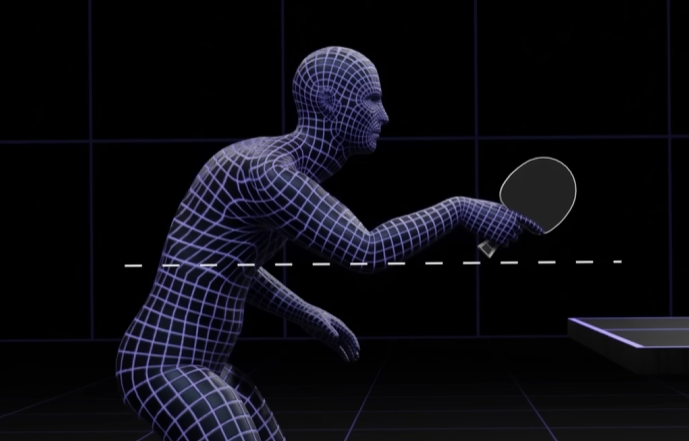

    <h1> Stance Position </h1>

The stance of the receiver when preparing to return a serve is one of the most important factors influencing the quality of their return. An effective stance allows for flexibility, balance, and the ability to react quickly to various types of serves.

When receiving the ball, we often have very little time to react and you must execute our response in a single action and a single movement. There is no preparation phase, only immediate execution. In these situations it is crucial to pay close attention to our stance when receiving the ball, especially the position of the racket.

The most commonly recommended stance for receiving a serve is a slightly open, balanced position with 

1. The knees slightly bent.
2. Distribute about 70% of your weight on the balls of your feet and 30% on your heels.
2. You should be roughly half a step distance from the table.
4. The body should be positioned at a slight angle to the table. Lean your torso forward at about 15-20 degrees from vertical.
5. The non-dominant foot (left foot for right-handed players) should be slightly ahead of the dominant foot, allowing for quicker lateral movement if needed.

A guideline for your starting position can be to just touch the edge of the table in the middle with your arm bent. If you're versusing a player who serves almost entirely long, it's acceptable to step back by 10cm to 20cm if you need a little more time to react.

- **For forehand dominant players**, stand slightly to the left of the center.

- **For backhand dominant players**, stand closer to the middle or slightly toward your backhand side.

    

Keeping it centered and infront of the body is essential to be able to respond effectively with either a forehand or a backhand. **It's much easier to have a paddle higher and moving it lower**, than having it lower and moving it upwards as we have the help of gravity.

    

    

