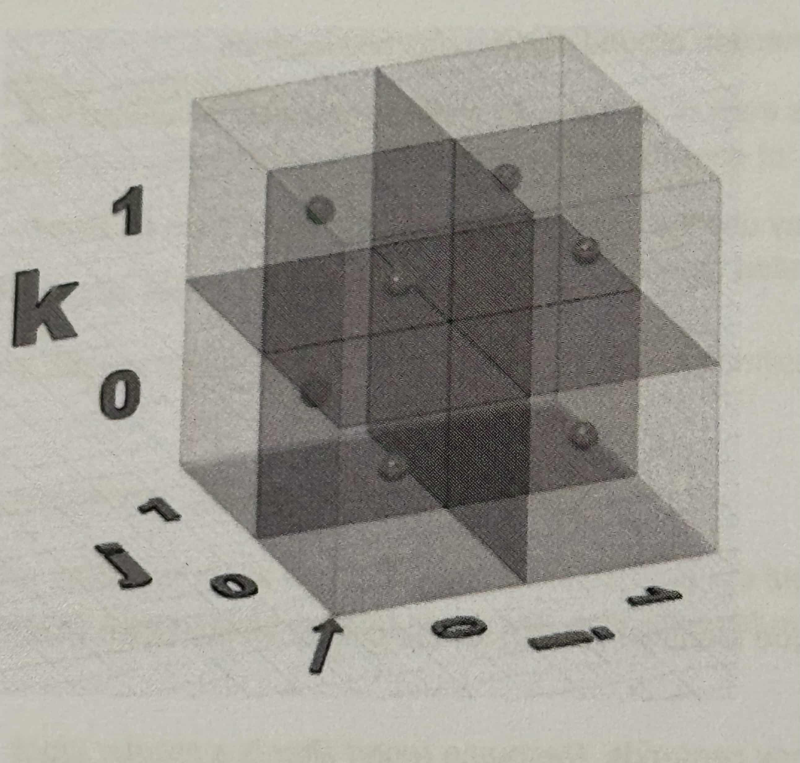
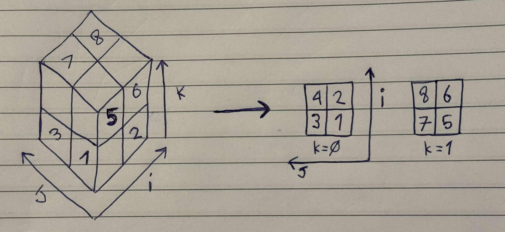
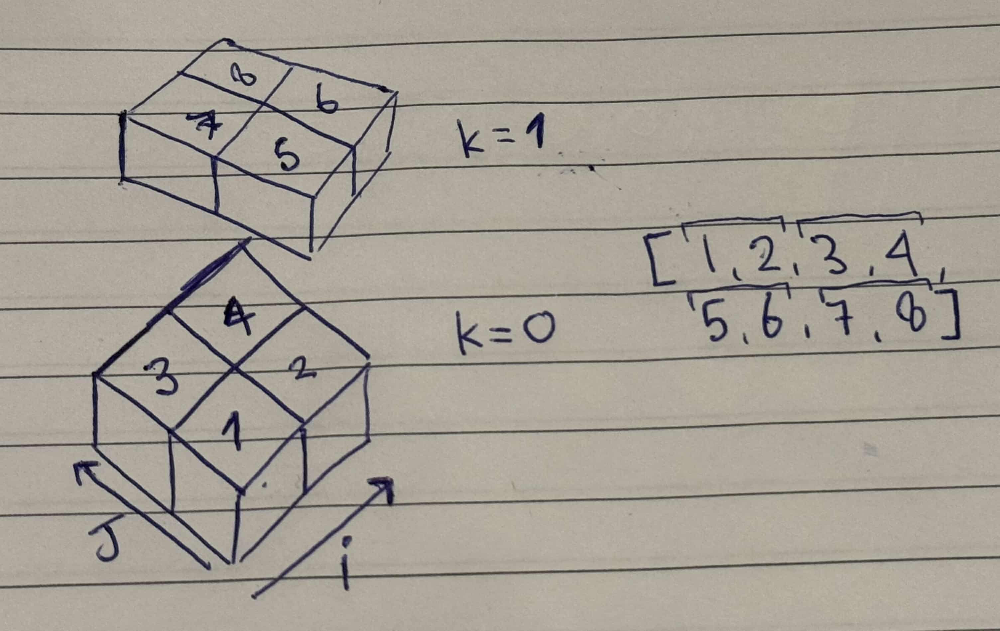

<div align="center">
    <h1> 3D and 2D Array Representation in 1D </h1>
</div>

It's a common strategy to represent multi-dimensional arrays as a one dimension array. In memory, multi-dimensional arrays are merely syntactic sugar. Under the hood, they are laid out in contiguous memory.The purpose of this is to illustrate how to represent a multimensional array as a one dimension array and create an equation to map between it.

## Row-major Order vs Column-major Order

The idea between row and column ordering will effect the order is which it is represented in the one dimensional array. The concepts of row-order and column-order relates to how multimensional-data is stored and accessed in memory.

#### Row-major Order

Row-major order means row-order indexing. This means that **the rows are stored in memory one after another**. This is common in C, C++ and Python (NumPy by default).

Suppose we have a 2D Matrix,

```python
A = [[1, 2],
     [3, 4]]
```

This means it will have the memory layout of `[1, 2, 3, 4]`.

#### Column-major Order

Column-major order means column-order indexing. This means that **the columns are stored in memory one after another**. This is common in Fortran, MATLAB and R.

Suppose we have a 2D Matrix,

```python
A = [[1, 2],
     [3, 4]]
```

This means it will have the memory layout of `[1, 3, 2, 4]`.


## 2D to 1D

Firstly, let's demonstrate the translation of a 2D array into a 1D array.

| Col 1 | Col 2 |
|-------|-------|
| 7     | 48    |
| 42    | 5     |
| 90    | 31    |
| 8     | 21    |

To represent this in a 1D array we will use **row-order** and we will therefore list the one dimensional arrays as,

```python
[7, 48, 42, 5, 90, 31, 8, 21]
```

The formula for translating from 2D to 1D will therefore be,

$$index = (row * \text{numberOfColumns}) + column$$

Hence, if we had 31 at location (2, 1), it would be represented at index $2 * 2 + 1 = 5$.

## 3D to 1D

Translating a 3D array to a 1D array is a bit more challenging. The use case I will be doing will use in the context of Block Models. In following examples I will be using `i`, `j` and `k` to represent the position of a Block within a Block Model. Using the image below to demonstrate,

- `i` - Grows in the X direction, used to represent which Block is used along the X axis.
- `j` - Grows in the Y direction, used to represent which Block is used along the Y axis.
- `k` - Grows in the Z direction, used to represent which Block is used along the Z axis.

In a traditional 2D layout, the X axis will run in the horizontal and the Y axis will be perpendicular to it. In the image below, the overall axis has a slight tilt so that the X axis will still grow horizontally but on a around 20 degree angle.

<div align="center">
    
</div>

So, let's first try to expand on the previous 2D array with a 3D representation.

<div align="center">
    
</div>

When structuring it into a 1D array, we first list `i`, `j` and `k` as follows,

```
[
    (0, 0, 0), (1, 0, 0), (0, 1, 0), (1, 1, 0),
    (0, 0, 1), (1, 0, 1), (0, 1, 1), (1, 1, 1)
]
```

This will then give us,

```
[
    1, 2, 3, 4,
    5, 6, 7, 8
]
```

Which can be visually flattened to `[1, 2, 3, 4, 5, 6, 7, 8]`.

<div align="center">
    
</div>

To index into the flattened array we need a formula that needs to perform three key steps,

1. Traverse through the elevation Z axis, using `k`.
2. Traverse upwards through the Y axis, using `j`.
3. Perform a displacement on the horizontally through the X axis, using `i`.

To traverse through the elevation in the one dimensional array we need to make "jumps" of the number of blocks on each elevation height. This would be calculated from the number of blocks on the X axis multiplied by the number of blocks on the Y axis.

$$ k * \text{sizeX} * \text{sizeY} $$

To traverse vertically through the Y axis in the one dimensional array we need to make "jumps" of the number of blocks on the X axis.

$$ j * \text{sizeX} $$

Finally, once we have the correct elevation and height, we only need to add the horizontal displacement `i` to the final result to find the index inside the one dimensional array. This will give us the final 3D to 1D translation mapping of,

$$ index = i + j * \text{sizeX} +  k * \text{sizeX} * \text{sizeY} $$

In the previous example with a `2 x 2 x 2` Block Model, the 3D to 1D translation we will have our final mapping equation,

$$ index = i + j * 2 + K * 4$$

We previously saw the number 7 in index 6 of the flattened array which was represented by the position (0, 1, 1). Here we can validate our equation using,

$$ index = 0 + 1 * 2 + 1 * 4$$
$$ index = 0 + 2 + 4$$
$$ index = 6$$

As an important contextual note, it's vital to understand context. Here, in our first example we represented the table in a format of X and Y which can be translated to the X axis being columns and the Y axis as rows. This is not transferable to the 3D space. The X axis is no longer "rows" and the Y axis is no longer "columns" as it is no longer a table.

The labels we assign to coordinates depend on the context. 

- Sometimes could be called length, width and height because that's what those numbers represent.
- Sometimes they are rows and columns.
- Sometimes they are x y and z.
- Sometimes they are age, weight and height.

Mixing different labels together is a bad practice, as it often leads to confusion. Pick one terminology that applies to your context and stick to it. In this context we use `i`, which points to the X direction. This is used to indicate the Block Model in this direction, it does not represent any point along the X axis.
