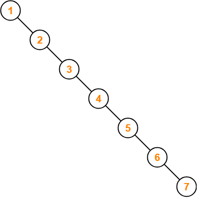
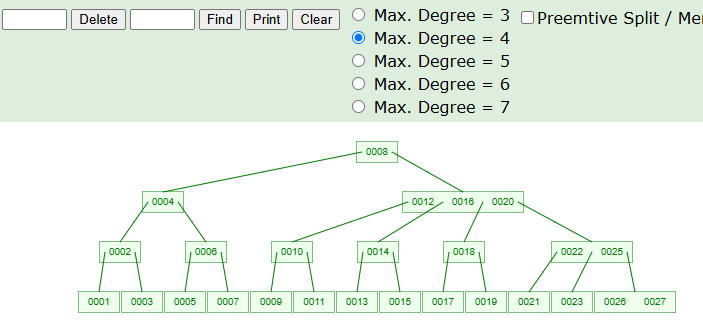

<div align="center">
    <h1> B-Trees </h1>
</div>

A B-Tree is a self-**B**alancing tree data structure that generalizes a binary search tree (BST) by allowing nodes to have more than two children. It is optimized for systems that read and write large blocks of data, such as **database systems and filesystems**. Unlike standard binary trees, B-Trees are designed to **minimize disk I/O operations**, making them highly suitable for external memory or secondary storage. The B-tree generalizes the binary search tree, allowing for nodes with more than two children.

B-Trees have many real world usages such as,

- **Databases (MySQL, PostgreSQL)** - Use **B+ Trees** for indexing.
- **Filesystems (NTFS, HFS+)** - Use B-Trees to index directories and metadata.
- **Operating Systems** - Often use B-Trees in a page tables or buffer caches.

Variations of B-Trees exist such as the B+ Tree where,

1. All values are stored **at the leaf level**.
2. Internal nodes only store keys.
3. Leaves are linked for fast range queries.

B-Trees core concepts,

1. **Balanced, Multi-way Search Tree** - All leaves are at the **same depth**, guaranteeing `O(log n)` operations.

2. **Grows Upward** - When a node is full, it splits and promotes **the middle key up**. If the root splits, the tree gains a new root, increasing height.

3. **Shrinks Downward** - On deletion, if a node has too few keys, it borrows from siblings or merges, possibly causing parent adjustments.

4. **Each Node Holds Multiple Keys** - Each Node will have at most `m -1` keys and maximum `m` children. More keys per node results in a shorter free height.

5. **Min Keys Enforced** - Each node (Except root) has atleast $\left\lceil \frac{m}{2} \right\rceil - 1$ keys to prevent imbalance. Only the root node can have less than the specified minimum.

6. **Self Balancing** - Insertion and deletion preserve all variants through localized, recursive rebalancing.

**All leaves are always at the same depth**. This occurs because growth (via splits) and shrinkage (via merges) only happens in a way that preserves height consistency.

- **Node Splitting** - Node splitting occurs when an insertion results in `m` amount of keys. When a node splits, **the middle key is promoted up** to the parent. This avoids deepening only one side.
- **Root Splitting** - When the root splits, **a new root is created**. This increases the height uniformly for all paths.
- **Deletion** - Deletion may **merge nodes**, but only when siblings and parents can absorb the change, ensuring no leaf becomes shallower than others.

## Why not Binary Search Trees?

While Binary Search Trees offer `O(log n)` time complexity for search, insertion and deletion in ideal balanced cases, their performance **can grade to** `O(n)` if the tree becomes unbalanced.  This would occur if you were to insert elemented in sorted order. Although AVL trees and Red-Black trees address this issue through self-balancing, they are still binary and each node holds only one key and two children. Here "key" refers to the value stored in a node.

<div align="center">
    
</div>

## The Problem with Disk Access

Disk accesses are expensive. A binary tree, even if balanced may require many disk reads if the trees height is large and each node access may involve reading a small piece of data from a different block on disk.

B-Trees are designed to,

- **Minimize disk reads** by storing multiple keys per node.
- Keep the **tree height low**.
- Allow **bulk reads** and writes by loading a whole node at once.

In short, **B-Trees optimize I/O** at the cost of more complex in-memory logic.

## Definition and Properties

A **B-Tree of order m**  has the following properties,

1. Each node contains a **maximum of (m - 1) keys**.
2. The root has atleast two children **if it is not a leaf node**.
2. A non-leaf node with `k` children contains `k−1` keys.
2. Each node has **between** $\left\lceil \frac{m}{2} \right\rceil$ **and m children**. The example below is using `m` as `4`, illustrationg the node `[0012, 0016, 0020]` having `3` keys and additionally having `4` children. Where `⌈` and `⌉` denote the ceiling function, meaning the number is rounded up to an integer.

<div align="center">
    
</div>

3. All **leaves are at the same depth**.
4. **Keys within each node** are sorted in ascending order.
5. For a node with keys `[k1, k2, ..., kn]`, all values in the first child are `< k1`, in the second are between `k1` and `k2`, etc...
6. **Internal Nodes** - Internal nodes (also known as inner nodes) are all nodes **except for leaf nodes and the root node**.

## Time Complexity

| Operation | Time Complexity |
| --------- | --------------- |
| Search    | `O(log n)`      |
| Insertion | `O(log n)`      |
| Deletion  | `O(log n)`      |
| Space     | `O(n)`          |

In any tree structure, **the height** directly affects the performance of operations like `Search`, `Insert` and `Delete`. These operations require traversing from root the leaf, which takes `O(height)` time. Therefore, the shorter the tree the faster the operations.

<div align="center">
    <h1> Insertion </h1>
</div>

Assuming we're working with a B-Tree of order `m = 4`, meaning,

1. A maximum of 3 keys per node (`m - 1`).
2. A minimum of 1 key per non-root node (`⌈m/2⌉ − 1`)
3. A maximum of 4 children per node

Always insert into a **leaf node**. If the leaf is **full, split it** and promote the middle key to the parent. If the parent is also full, continue recursively splitting up.

#### Basic Insertion

Insert `10`, `20` and `5`.

```
[10] → [10, 20] → [5, 10, 20]
```

In this example, no splitting occurs.

#### Insertion Causing Root Split

Insert `6` into `[5, 10, 20]`. This will now become `[5, 6, 10, 20]`, resulting in 4 keys and thus requiring a split.

The middle key is `10` and will be promoted. The left is `[5 ,6]` and the right being `[20]`. Resulting in a new root `[10]`.

```
      [10]
     /    \
[5, 6]    [20]
```

## Insert Into Full Child

- Insert `12`.
  * Because `12 > 10`, we place `12` onto the right child as room exists and becomes `[12, 20]`.

- Insert `30`.
    * The right child now becomes `[12, 20, 30]`, now resulting in a full node.

- Insert `17`
  * Right child now becomes `[12, 17, 20, 30]`, requiring a splitting.
  * Promote `20`
```
      [10]
     /    \
[5, 6]    [12, 17, 20, 30]
```

- - Root `[10]` becomes `[10, 20]`
- - The left `[12, 17]` will become its own left node.
- - The right `[30]` will becomes its own right node.

```
      [10, 20]
     /   |    \
[5,6] [12,17] [30]
```

## What if the Root is Full?

Here we have the following tree,

```
     [20  40  60]
   /    |    |    \
[10] [30] [50] [70 80 90]
```
The root `[20, 40, 60]` has 3 keys, which is the maximum allowed.

- Insert `100`
  * First we find the target leaf. Because `100 > 60`, we go to the 4th child and append it to the list `[70, 80, 90]`
  * It's already full, so the insertion makes it temporarily `[70, 80, 90, 100]`. Now we must split.
  * The middle index `⌊4/2⌋ = 2` results in the middle key being `90`.
  * Left = `[70, 80]`
  * Right = `[100]`
  * Promote `90` to the parent `[20, 40, 60]`

```
     [20  40  60, 90]
   /    |    |   |    \
[10] [30] [50] [70 80] [100]
```

Now the parent becomes `[20, 40, 60, 90]` which results in splitting being required. Now we must promote `60` and assign left to `[20, 40]` and right to `[90]`

```
             [60]
           /     \
     [20 40]     [90]
    /   |   \     /   \
[10] [30] [50] [70 80] [100]
```

<div align="center">
    <h1> Deletion </h1>
</div>

We assume a B-Tree of order `m`, where

1. Each node can contain at most `m - 1` keys.
2. Each non-root node must contain atleast `⌈m⁄2⌉ − 1` keys.
3. Internal nodes have between `⌈m⁄2⌉` and `m` children.


1. **Key is in leaf with more than** `⌈m⁄2⌉ − 1` **keys** - Direct deletion is safe. Result still satisfies minimum key requirement.

```
[10, 20, 30]
```

Delete `30`. No restructuring needed as it has a sufficient amount of keys.

```
[10, 30]
```

2. **Key is in leaf with exactly** `⌈m⁄2⌉ − 1` **keys** - Deletion would cause **underflow**. Now we must borrow from the sibling if that has more than `⌈m⁄2⌉ − 1` keys or merge with sibling and pull down a parent key.

```
    [20]
   /    \
[10]   [30, 40]
```

Leaf `[10]` has only 1 key. Deleting `10` will cause an underflow. The right sibling `[30, 40]` has 2 keys, which means we can borrow it.

The parent `20` moves down to the left `[20]` and the right siblings smallest key `30` moves up to the parent.

```
    [30]
   /    \
[20]   [40]
```

3. **Key is in an internal node** - Now, we must replace the key with either the predecessor (Max key from left subtree) or the success (Min key from the right subtree). Then delete that replacement key from a leaf.

```
    [20]
   /    \
[10]   [30, 40]
```

Here, we delete the internal key `20`. The successor is `30` (Min of right subtree). Therefore, we replace `20` with `30`.

```
    [30]
   /    \
[10]   [40]
```

4. **Child we descend into has** `⌈m⁄2⌉ − 1` **keys** - During traversal for deletion, if the child has only `⌈m⁄2⌉ − 1` keys, we must first **borrow** from a sibling (if possible) or **merge** with sibling and move down a parent key. This guarantees we never descend into a underfull node.

```
     [40]
    /    \
[20]     [60, 80]
```

Here, we want to delete `20`. It's in the left child `[20]` which has only 1 key, the exact minimum `⌈m⁄2⌉ − 1`. We must first fix the structure before the deletion. The right sibling has 2 keys `[60, 80]`, meaning we can borrow it.  First rotate `40` down to `[20]` and then move `60` upward. Then, we can safely delete `20`.

```
   [60]
  /    \
[40]  [80]
```

<div align="center">
    <h1> Example </h1>
</div>

Let's walk through a practical example of `search`, `insert`, `delete` and `rebalancing`. We'll use a B-Tree of order `m = 4`, meaning,

1. Each node can hold upto `3 keys` (`m - 1`)
2. Each node can have upto `4 children` (`m`)
3. Each node (Except root) must have at least $\left\lceil \frac{m}{2} \right\rceil - 1 = 1$ key
4. All leaves must be at the same depth 

Here we will insert `10`, `20`, `5`, `6`, `12`, `30`, `7`, `17`.

At each step we need to follow,

1. Insert
2. If full, split. We will promote the key at index `⌊number_of_keys / 2⌋`. Where `⌊` and `⌋` are the floor functions.
3. Maintain balanced tree structure

#### Insert `10`

Here, the insertion starts at the root. If the root is not full, insert in sorted order.

```
[10]
```

This is now the **root node** and a **leaf**.

## Insert `20`

Still space in in the root (Max is 3 keys), so just add `20` after `10`.

```
[10, 20]
```

## Insert `5`

Insert in correct order. Now we have,

```
[5, 10, 20]
```

Node now has 3 keys, which is the max allowed.

## Insert `6`

Now the **node is full**, so we must split.

**When a node has `m - 1` keys and you need to insert more, it is split into two parts and the middle key is promoted to the parent**. If the parent is full, this split may propagate up.

Split `[5, 10, 20]` + `6`.

1. Keys `[5, 6, 10, 20]` → sorted = `[5, 6, 10, 20]`
2. Middle Key ` ⌊4/2⌋ = 2` = `10` → promoted
3. Left = `[5, 6]`, Right = `[20]`

```
      [10]
     /    \
[5, 6]   [20]
```

Now we have a **tree height of 2**.

## Search for `6`

**At each node, scan left to right**. If `key < node key`, go to the left. If `key = node key`, done. If `key > all keys`, go to rightmost child.

```
      [10]
     /    \
[5, 6]   [20]
```

1. `6 < 10` → go to left child `[5, 6]`
2. Found `6`

## Insert `12`

`12 > 10` → go to right to `[20]` → insert there.

```
      [10]
     /    \
[5, 6]   [12, 20]
```

## Insert `30`

- `30 > 10` → go right
- `[12, 20]` has 2 keys, room for one more → insert `30`.

```
      [10]
     /    \
[5, 6]   [12, 20, 30]
```

## Insert `7`

- `7 < 10` → go left → `[5, 6]`
- It has 2 keys, room for 1 more → insert `7`

```
      [10]
     /    \
[5, 6, 7] [12, 20, 30]
```

## Insert `17`

- `17 > 10` → go right → `[12, 20, 30]`
- This node is full, so we must split it.
- Split `[12, 20, 30]` + `17`
- Keys `[12, 17, 20, 30]` → middle = `⌊4/2⌋ = 2` = `20`.
- Left = `[12, 17]`
- Right = `[30]`
- Root = `[10]` → inset `20` to root. Root becomes `[10, 20]`

```
        [10, 20]
       /   |    \
[5,6,7] [12,17] [30]
```

## Delete `6`

In `[5, 6, 7]` → remove directly.

```
       [10, 20]
      /   |    \
[5,7] [12,17] [30]
```

## Delete `5`

`[5, 7]` → remove `5` → now `[7]`.

```
       [10, 20]
      /   |    \
[7]   [12,17] [30]
```

## Delete `7`

Removing `7` creates an empty node which creates underflow. Having this empty node results in all leaves not being in the same depth, which is problematic. We now need to resolve this.

The sibling has `[12, 17]` which has 2 keys, meaning we can borrow some.

- Move `10` down to the left child.
- Move `12` up to parent.
- `[10, 20]` becomes `[12 , 20]`
- Left child becomes `[10]`
- Middle child becomes `[17]`

```
     [12, 20]
    /   |    \
[10]  [17]   [30]
```

## Summary of Key Concepts

| Operation | Concept Used              | Notes                                   |
| --------- | ------------------------- | --------------------------------------- |
| Insert    | Node splitting            | Promote middle key at index `⌊4/2⌋`     |
| Insert    | New root creation         | Happens during root split               |
| Search    | Guided descent using keys | Standard binary search pattern          |
| Delete    | Leaf deletion             | Directly remove if node has enough keys |
| Delete    | Underflow handling        | Rebalance using borrowing from sibling  |
| Rebalance | Borrowing keys            | Promote/demote keys to maintain balance |
