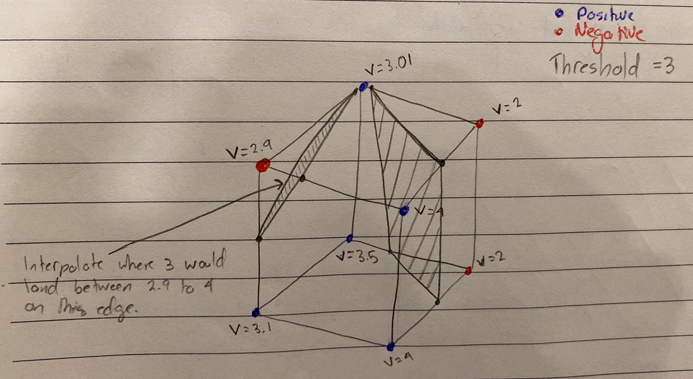
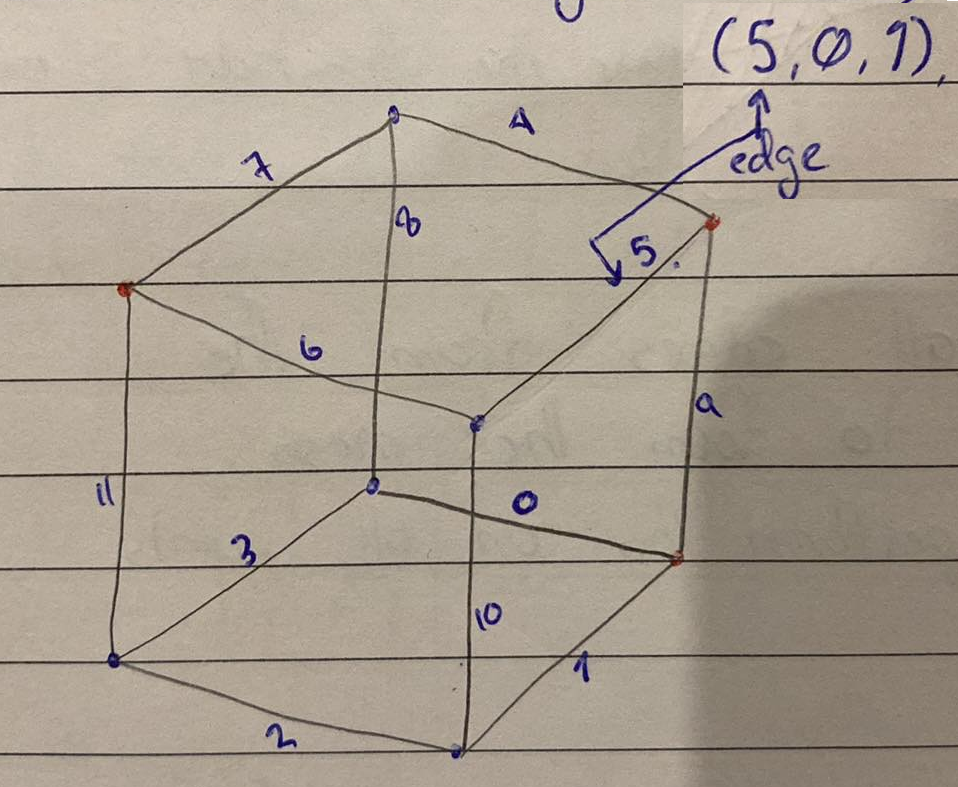
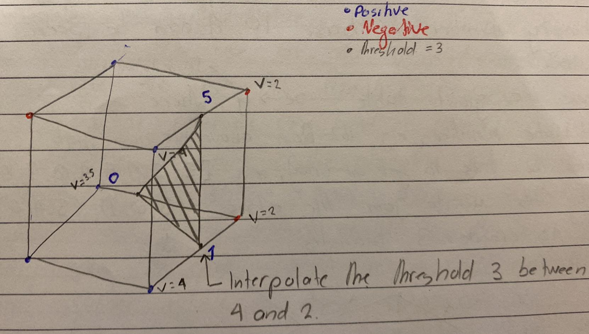

  <h1> Isosurfaces </h1>

An isosurface is a **three-dimensional surface that represents points of a constant value within a volume of space**. This value could be anything measurable, such as pressure, temperature, velocity, or density. For example,

- In meterology, an isosurface might represent regions with the same temperature or pressure in the atmosphere.

- In medical imaging, isosurfaces are used to visualized structures such as bones or organs by representing areas of equal density in CT or MRI scans.

Now, a scalar field is a mathematical function that assigns a single scalar value to every point in a space. A scalar value is a single numerical value that represents a quantity. If $f(x, y, z)$ is a scalar field, an isosurface for the isovalue $c$ is defined as,

$$
f(x, y, z) = c
$$

The isosurface divides the 3D volume into two regions,

1. Points where $f(x, y, z) < c$ (negative side)
2. Points where $f(x, y, z) > c$ (positive side)

The generated isosurface will use verticies that are interpolated between the verticies that hold a negative and positive value from the scalar field.

# Algorithms for Generating Isosurfaces

The most widely used algorithm for generating isosurfaces is **Marching Cubes**. It creates a polygonal mesh approximating the isosurface. **The input** to the algorithm is a 3D scalar field defined on a regular grid of points, along with an isovalue $c$. **The output** will be a triangulated mesh approximating the isosurface.

##### 1. Divide the Volume into Cubes

The first step of the algorithm is to divide the 3D grid into small cubes called voxels, each defined by eight vertices.

##### 2. Classify the Vertices

For each cube, classify the vertices as,

1. **Inside** if $f(x, y, z) < c$ (negative side)
2. **Outside** if $f(x, y, z) > c$ (positive side)

##### 3. Identify the Intersected Edges

Determine which edges of the cube are intersected by the isosurface. This depends on the sign of $f(x, y, z) - c$ at the vertices. There are $2^8 = 256$ possible vertex sign combinations, but symmetry reduces these to 15 unique cases.

**At each vertex, we compute $f(x, y, z) - c$**. This determines whether the vertex is **inside** ($f(x, y, z) - c < 0$ ) or **outside** $f(x, y, z) - c > 0$. Each edge of the cube connects two vertices. If the scalar values of these two vertices have **opposite signs**, i.e. a positive and a negative scalar value. This will mean that the **isosurface passes through that edge. If the signs are the same, the edge is not intersected**. Some implementations of the Marching Cube algorithm might treat $f(x, y, z) = c$ as a special case and consider the vertex to be part of the isosurface itself.

In the example below, I have set the threshold (isovalue $c$) to $3$. In this example, we can see interpolated verticies on all edges that are connected through a positive vertex ($> 3$) and a negative vertex ($< 3$).

##### 4. Generate Triangles

For each cube, generate triangles by interpolating positions on edges where the scalar value equals $c$. A lookup table maps each vertex configuration to a set of triangles. For code generation, the cubes has 8 verticies labelled from 0 to 7. Now if verticies 7,5 and 1 were active, turn it into `1010 0010`. Viewing this as a binary number, in base 10 it can be seen as 162.

We have a mapping table called the triangulation table, where the BitCube number is the key, e.g. 162 from above. We now grab 162 from the table to get an array, e.g. `[5, 0, 1, 5, 4, 0, 7, 6, 11]`. This array tells us to join the edges `(5, 0, 1), (5, 4, 0), (7, 6, 11)` to form our triangle.

##### 5. Connect Triangles

Now, look up the two verticies that are connected to the edges 5, 0 and 1. Perform interpolation to find where the vertex will be on your edge between the P and N verticies and perform this on the other edges. Finally, connect the interpolated values on each edge to create the triangle. Combine triangles from all cubes to form a continuous mesh.

# Mesh Generation with Interpolation

We have a scalar field $f(x, y, z)$ defined on a cube with vertices $A$ and $B$ where,

- $A = (0, 0, 0)$ with a scalar value $f(A) = 2$ (positive)
- $B = (1, 0, 0)$ with a scalar value $f(B) = -1$ (negative)
- Isovalue $c = 0$

We need to calculate the point $p$ on the edge $AB$ where the isosurface $f(x, y, z) = 0$ intersects. To perform this, we will use two key formulas.

##### Relative Distance Calculation

We need to calculate the relative position along an edge where a scalar field $f(x, y, z)$ equals a specified isovalue $c$. To accomplish this, we will the following formula,

$$
t = \frac{|f(A) - c|}{|f(A) - c| + |f(B) - c|}
$$

Where,

- $f(A)$ is the scalar field value at point $A$
- $f(B)$ is the scalar field value at point $B$
- $c$ is the isovalue we are looking for in the scalar field
- $t$ is the fractional value between 0 and 1 that specifies the relative position along the edge $AB$

This can be explained in the following steps,

1. The numerator, $|f(A) - c|$ meaures how far the scalar value at $A$ is from the isovalue $c$.
2. The denominator, $|f(A) - c| + |f(B) - c|$, is the total distance between the field values $A$ and $B$ relative to the isovalue.

$t$ is the proportion of the distance that $A$'s scalar value contributes to the total distance from $c$.

##### linear Interpolation

$t$ is then used to find the exact point $p$ along the edge where $f(p) = c$ using the formula,

$$
p = A + t(B - A)
$$

##### Substitution

First let's calculate $t$ as,

$$
t = \frac{|2 - 0|}{|2 - 0| + |-1 - 0|} = \frac{2}{2 + 1} = \frac{2}{3}
$$

Then, interpolate the value of $p$ using,

$$
p = (0, 0, 0) + \frac{2}{3}((1, 0, 0) - (0, 0, 0)) = (0, 0, 0) + \frac{2}{3}(1, 0, 0) = (\frac{2}{3}, 0, 0)
$$

Therefore, the isosurface intersects the edge $AB$ at $p = (\frac{2}{3}, 0, 0)$ 

# Non-Perfect Grids and Isosurface Generation

Generating isosurfaces from irregular grids (such as a dataset from MRI imaging with bone density measurements) involves working with scattered, unstructured data points that don't form a perfect, regularly spaced grid. This is a common scenario when working with real-world data from sources like MRI scans, where each data point might represent a measurement at an arbitrary location in space. 

Before generating the isosurface, the irregular data points need to be preprocessed to create a structured representation that can be used for isosurface extraction.

When dealing with unstructured or scattered data points, alternative methods like Delaunay triangulation with Marching Tetrahedra, Radial Basis Functions, and Poisson Surface Reconstruction can be used to generate isosurfaces. These methods adapt to the irregular data and provide accurate visualizations.

Radial Basis Functions (RBF) can be used to interpolate the scattered data points onto a regular grid. Once the data is interpolated onto a grid, traditional isosurface extraction algorithms can be applied.
