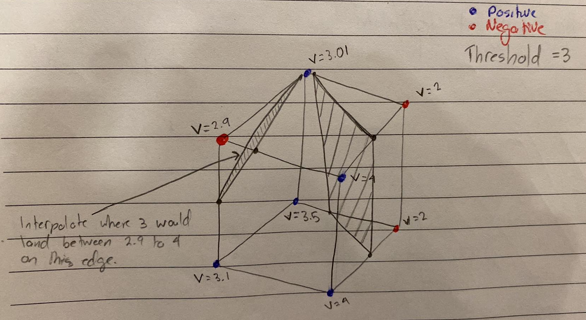
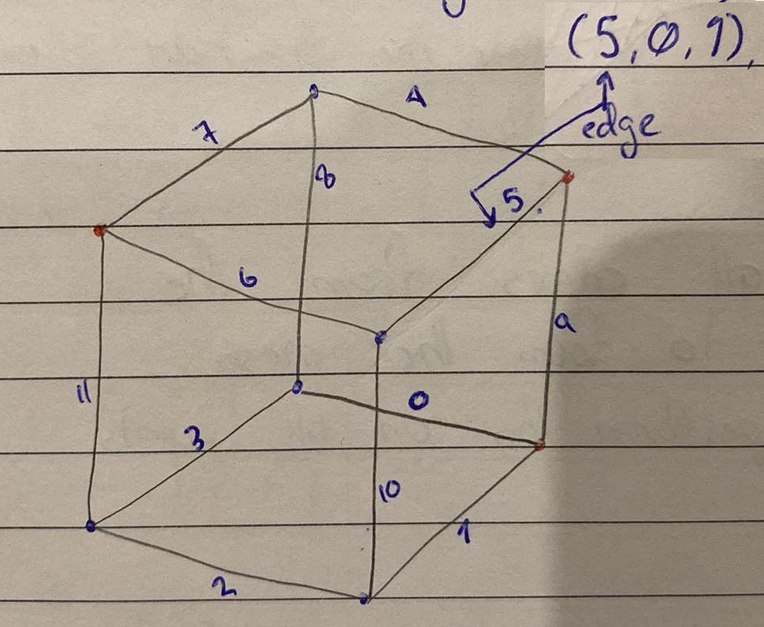
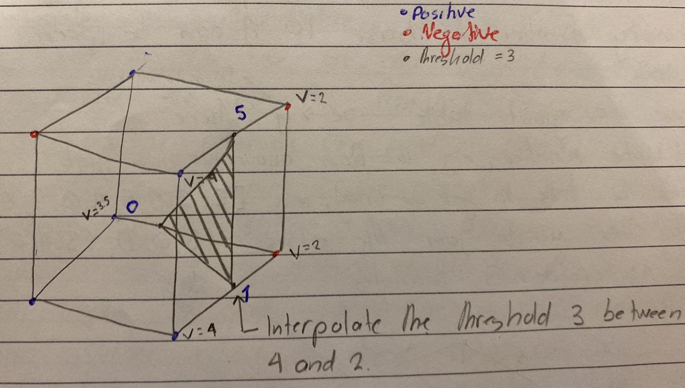

# Marching Cube

We need a function that takes in some point and outputs a single value, `f(x, y, z) -> v`. In LF this could be the use of numeric estimators such as RBF. We can use this function to sample points at regular intervals, e.g. Grid of Points.

The goal of the Marching Cube algorithm is to construct the surface of the shape from triangles so that we can display it as a mesh. To think about how this works we can simplify the problem into just a single cube. Therefre are eight corner points of which either can be inside or outside of the shape, which gives us $2^8$ or 256 different configurations.

Points that are `>=` to the threshold are seen as Positive, values that are `<` to the threshold are seen as Negative. Two verticies that are next to each other where one is P and the other is N will have a vertex interpolated between them, this vertex is later used for mesh construction.

For code generation, the cube has 8 verticies, labelled from 0 to 7. Now if 7,5 and 1 were active, turn it into `1010 0010`. Viewing this as a binary number, in base 10 it can be seen as 162.

We have a giant table `x -> y` called the triangulation table, where `x` is the BitCube number, e.g. 162 from above. We now grab 162 from the table to get an array, e.g. `[5, 0, 1, 5, 4, 0, 7, 6, 11]`. This array tells us to join the edges `(5, 0, 1), (5, 4, 0), (7, 6, 11)` to create 3 triangles.

1. Look up the two verticies that are connected to your edge.
2. Perform interpolation to find where the vertex will be on your edge between the P and N verticies and perform this on the other edge, finally, connect them.

Full Breakdown,

1. Pick a threshold value
2. Assign each Bitcube vertex a P or N value
3. Change this binary combination to a $base_{10}$ number and use it to find your edges. From this trianglulation table, e.g. `1010 0010 -> 162`. Then `162 -> [5, 0, 1, 5, 4, 0, 7, 6, 11]`
4. Look at edge 5 and interpolate the vertex between `v = 2` and `v = 4`
5. Repeat for edge `0` and `1`.
6. Join the 3 vertex's from (5, 0, 1) to create a triangle.

7. Repeat this for all edges from the trianglulation table to form the mesh.
8. March through to perform this on all points.
