<div align='center'>
    <h1> Derivatives </h1>
</div>

One of the most fundamental problems in mathematics is the problem of change. How can change be measured precisely? At first, this question appears simple. If a car travels 100 kilometres in 2 hours, then it drives at an **average** rate of $50 \frac{km}{hr}$ over the 2 hour drive to drive a total distance of 100 kilometres.

<div align='center'>
    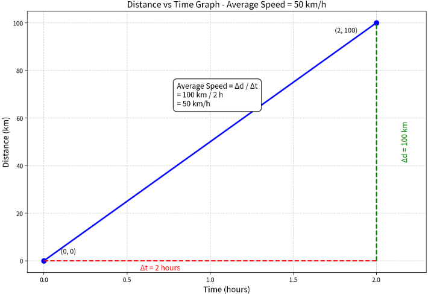
</div>

This measures average change over a finite interval. However, deeper conceptual difficulties emerge immediately when attempting to describe at a single instant. Suppose a car is moving along a road and the question is asked, "What is the car's velocity at exactly 2 seconds?". This creates a serious mathematical problem. Ordinary velocity calculations require both,

1. Two positions
2. An interval between them

Without an interval, there appears to be no change to measure.  A similar difficulty appears geometrically, the slope of a line is defined using two distinct points.

```math
\frac{\Delta y}{\Delta x}
```

However, **curves are not straight lines**. A curve changes direction continuously. At a single point on the curve there appears to be no second nearby points available to produce an ordinary slope. We can imagine that a car is never driving at a rate of $50\frac{km}{hr}$ continuously. The car will,

- Accelerate and decelerate
- Stop at red lights
- Speed up and slow down depending on traffic

<div align='center'>
    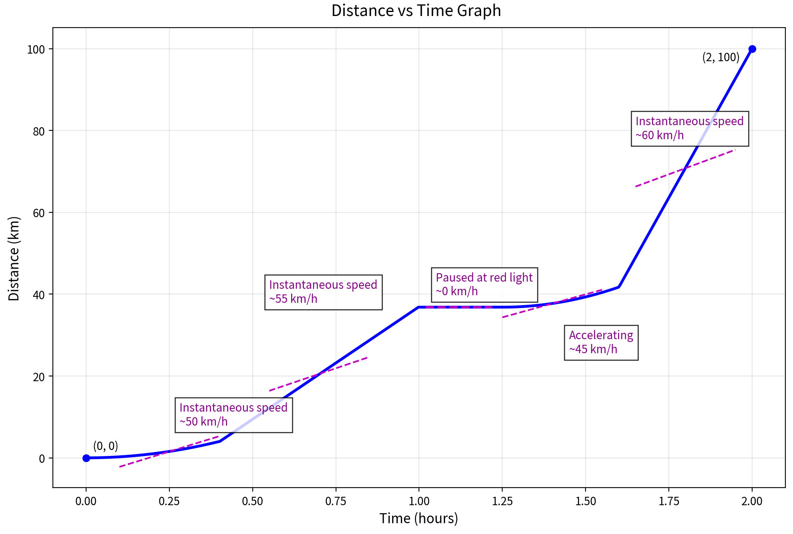
</div>

This creates one of the deepest conceptual problems in mathematics. How can something possess an instantaneous rate of change at a single point if ordinary change requires an interval? The derivative was invented to resolve this problem.

<div align='center'>
    <h1> Derivatives as a Rate of Change </h1>
</div>

A derivative is a mathematical tool used to describe **rate of change**. When a quantity depends on another quantity, the derivative measures how quickly the output changes as the input changes. On a graph, this appears as the slope of the curve at a particular point. 

- A **positive derivative** means the function is **increasing**
- A **negative derivative** means the function is **decreasing**
- A **derivative of $0$** indicatives a **flat point** where the function momentarily stops rising or falling 

In practical terms, derivatives allow mathematics to move beyond simply describing values and instead describe behaviour. Rather than only stating where an object is, derivatives explain 

- How fast it is moving at a certain time
- How quickly population grows at a certain time
- How temperature changes at a certain time
- How rapidly profit increases with production
- How much of $y$ changes with respect to $x$, because of $\frac{\Delta y}{\Delta x}$
- ...

When performing a differentiation of two variables between the $y$ and $x$ axis, we're calculating the slope between them. That is, we will be performing a calculation involving $\frac{\Delta y}{\Delta x}$ at the given point. Therefore, the units need to be understood so that the relationship makes sense. A common example is a distance-time graph. Suppose a car travels a distance $s(t)$, where $t$ is measured in hours and distance is measured in kilometres. The derivative of the function for distance with respect to time is velocity,

```math
v(t) = \frac{ds}{dt} = \frac{km}{h}
```

Suppose we graph $s(t) = t^2$. With,

- $y = s(t) = t^2$ with units km
- $x = t$ with units hour
- Slope between any two points $\frac{\Delta y}{\Delta x} = \frac{\text{km}}{\text{hour}}$
- The red line represents the function $s(t)$, graphing distance-time.
- The blue line is a function which graphs the derivative of $s(t)$. 

<div align='center'>
    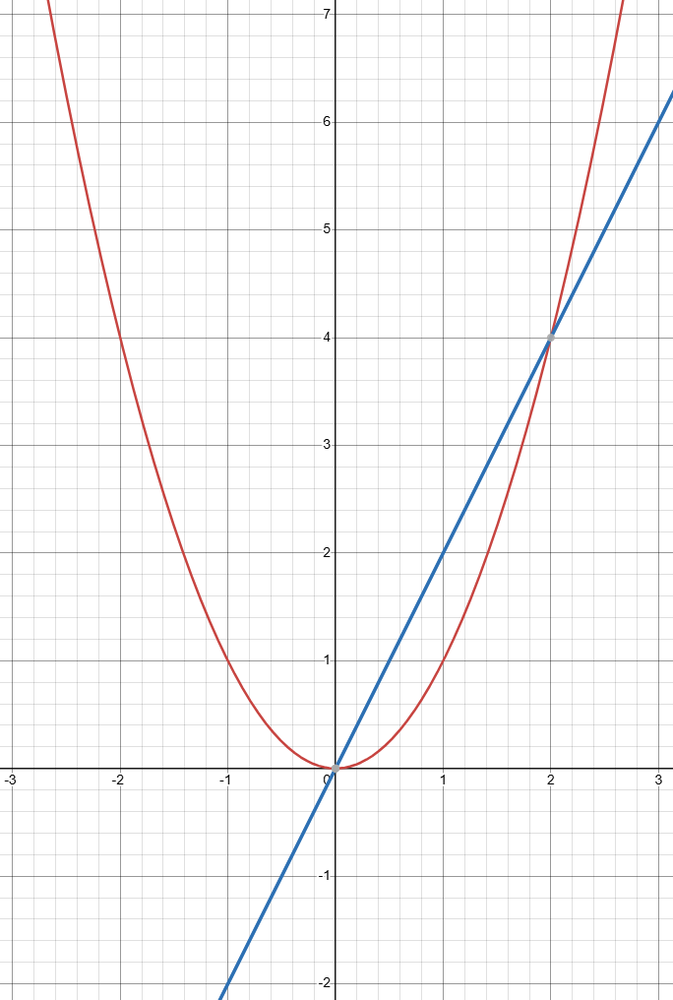
</div>

This derivative measures how quickly distance changes as time changes. If the graph of distance versus time is steep, the car is travelling quickly. If it is shallow, the car is travelling slowly. Because distance is measured in kilometres (km) and time in hours (h), the derivative has units of kilometres per hour $\left( \frac{\text{km}}{\text{hr}}\right)$. Thus, the derivative function converts a "position" function into a "speed" function. 

Expanding on our distance function

```math
s(t) = t^2
```

This function itself describes the car's total distance from the starting point, while its derivative describes the cars instantaneous velocity. Differentiating gives

```math
v(t) = \frac{ds}{dt} = 2t
```

If $t = 10$, 

- The distance function gives $s(10) = 100$, meaning the car is 100 kilometres from its starting point. 
- The derivative $v(10) = 20$, meaning that at that exact instant the car is travelling at $20 \frac{km}{hr}$

This interpretation is fundamental in physics, engineering and economics because it allows changing systems to be analyzed instantaneously rather than only over large intervals.

The second derivative extends this idea further by measuring how the rate of change itself changes. In motion, the first derivative of distance gives velocity, while the second derivative of velocity gives acceleration.

```math
a(t) = \frac{dv}{dt} = \frac{d^2s}{dt^2}
```

Acceleration describes how quickly velocity changes over time. If a car's speed increases from $50 \frac{\text{km}}{\text{hr}}$ to $70 \frac{\text{km}}{\text{hr}}$, the vehicle is accelerating, if the speed decreases, it is declerating. As with every differentiation we're performing a slope calculation. Because the $y$ axis is velocity and has units of $\frac{\text{km}}{\text{hr}}$ and the $x$ axis has the units of $\text{hr}$.

```math
\frac{\Delta y}{\Delta x} = \frac{\frac{\text{km}}{\text{hr}}}{\text{hr}} = \frac{\text{km}}{\text{hr}} \div \text{hr} = \frac{\text{km}}{\text{hr}} \cdot \frac{1}{\text{hr}} = \frac{\text{km}}{\text{hr}^2}
```

The differentiation process is,

```math
a(t) = \frac{dv}{dt} = \frac{d^2s}{dt^2} = 2
```

If $t=10$,

- The distance function $s(10)$ gives $100$. Meaning the car is 100 kilometres from its starting point.

- The first derivative gives $v(10) = 20$. Meaning the car is currently travelling at $20 \frac{\text{km}}{\text{hr}}$.

- The second derivative gives $a(10) = 2$. Meaning the cars velocity is increasing at a constant rate of $2 \frac{\text{km}}{\text{hr}^2}$.

<div align='center'>
    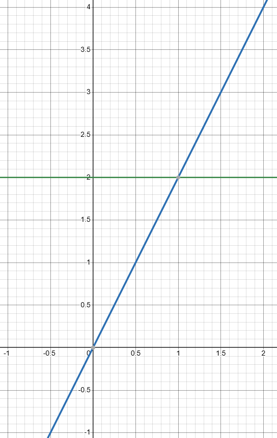
</div>

This shows how each derivative adds another layer of interpretation. 
- The original function describes position. The $y$ axis units is $km$. The $x$ axis units is $hr$.
- The first derivative describes instantaneous velocity. The $y$ axis units is $\frac{km}{hr}$. The $x$ axis units is $hr$.
- The second derivative describes how rapidly the velocity itself changes. The $y$ axis units is $\frac{km}{hr^2}$. The $x$ axis units is $hr$.

<div align='center'>
    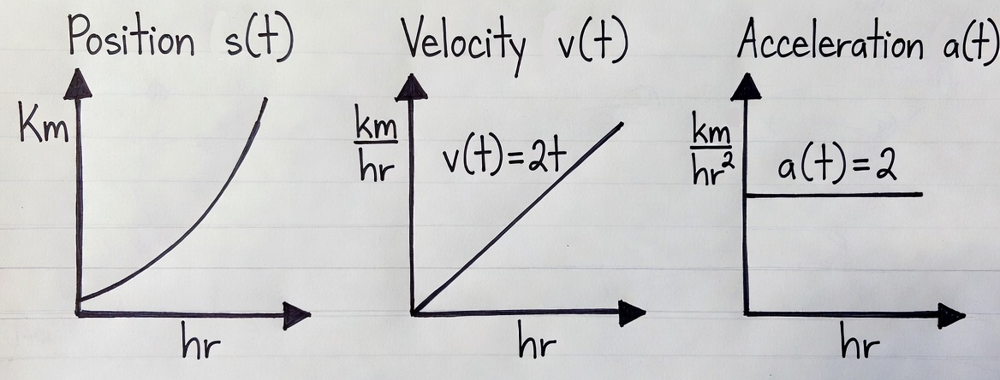
</div>


<div align='center'>
    <h1> Derivative Theorem </h1>
</div>

Suppose a function changes from $f(x)$ to $f(x + h)$. We can create a generalized function for calculating the slope between 2 different points, from $(x, f(x))$ and $(x + h, f(x + h))$.

<div align='center'>
    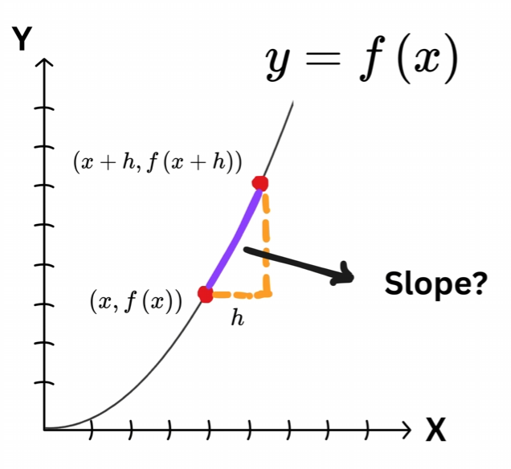
</div>

This generalized function will be calculated as,

```math
\frac{\Delta y}{\Delta x} = \frac{f(x + h) - f(x)}{x + h - x} = \frac{f(x + h) - f(x)}{h}
```

Geometrically, this is a slope of a secant line joining two points on a curve.

<div align='center'>
    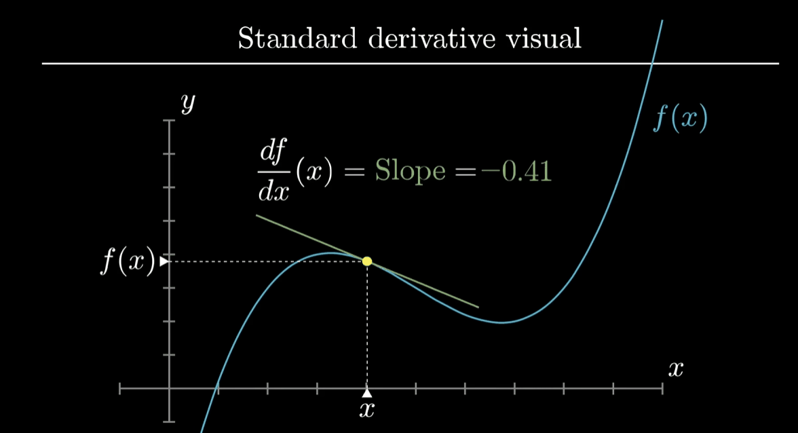
</div>

However, this still does not answer "What is occurring at exactly one point". To resolve this difficulty, calculus studies what happens as the interval shrinks indefinitely. This is precisely how limits are linked to derivatives. You cannot set the value of $h$ to $0$ as you will receive a division by $0$, calculus resolves this difficulty by examining the slopes between nearby points and then studying the limiting behaviour of those slopes as the interval between the points shrink indefinitely.

**The key idea is that the existence of a limit depends on nearby convergence behaviour, not on whether the limiting value is directly attained**. It only needs to describe a unique value all sufficiently close inputs force the expression toward. That number is then taken as the derivative because it is fully determined by the local behaviour of the function, even though the defining expression itself never needs to be evaluated at the limiting case. 

Calculus defines the derivative as the limit because the nearby secant slopes can converge toward one unique value as the interval width approaches $0$. **The derivative is therefore defined by**,

```math
f'(x) = \lim_{h \rightarrow 0} \frac{f(x + h) - f(x)}{h}
```

<div align='center'>
    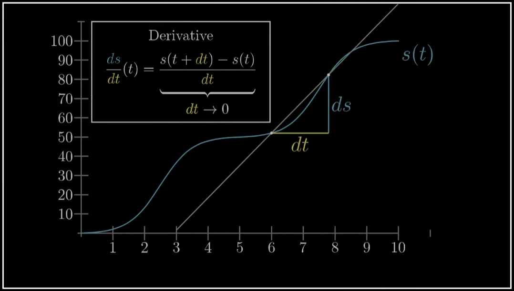
</div>


It is therefore crucial to understand that **the derivative is a limit value**. The derivative is not obtained by directly substituting $h=0$. Doing so would produce division by 0. Instead, calculus examines the behaviour of nearby secant slopes as the interval width becomes arbitrarily small. This creates an extremely important conceptual distinction. The derivative **is not**,

- One finite slope
- One secant line
- One ordinary ratio

Rather, the derivative at a point **is the exact limiting value** of nearby secant slopes as the interval width approaches 0. This means the derivative originates from convergence behaviour. **The derivative is therefore the exact number forced by the limiting behaviour**. Finite secant slopes may differ slightly from one another. However, if all sufficiently small nearby slopes converge toward one unique value, calculus defines that value to be the derivative. 

### Manual Derivative Caculation

We can create the derivative for the previous distance function $s(t) = t^2$, which is used to graph the velocity. Starting with the distance function $s(t) = t^2$, the derivative is found using the fundamental difference quotient definition,

```math
f'(x) = \lim_{h \rightarrow 0} \frac{f(x + h) - f(x)}{h}
```

Substitution of $f(x)$ for $s(t)$ and finally $s(t) = t^2$, it till become

```math
\begin{aligned}
s'(t) &= \lim_{h \to 0} \frac{(t+h)^2-t^2}{h} \\
s'(t) &= \lim_{h \to 0} \frac{t^2+2th+h^2-t^2}{h} \\
s'(t) &= \lim_{h \to 0} \frac{2th+h^2}{h} \\
s'(t) &= \lim_{h \to 0} \frac{h(2t+h)}{h} \\
s'(t) &= \lim_{h \to 0} 2t+h
\end{aligned}
```

Now let $h \to 0$.

```math
s'(t) = 2t
```

During the final calculation,

```math
\lim_{h \to 0} 2t + h
```

the $h$ term vanishes because the limit is examining what happens as $h$ gets arbitrarily close to $0$. Earlier in the differentiation, $h$ represented a small change in time used to compare two nearby points on the graph. After simplifying the difference quotient, the only remaining effect of that small change is the extra $h$ in $2t + h$. As the gap between the two points shrinks to nothing, that extra amount also shrinks to nothing, leaving only the instantaneous rate of change. This is possible because the derivative is the limit value where $h \to 0$, resulting it in being removed as it can be simplifying as it converges to a single value.


<div align='center'>
    <h1> Derivatives Notation </h1>
</div>

One of the most distinctive features of calculus is its symbolic language. Even within the topic of derivatives alone, several forms of notation are commonly used.

```math
\frac{dy}{dx}
\qquad
f'(x)
\qquad
\frac{d}{dx}f(x)
```

These are different notational systems describing the same mathematical object. The distinction between them lies not in meaning, but in emphasis. Each notation highlights a different perspective on differentiation and serves a different stylistic or conceptual purpose within mathematics.

The development of multiple derivative notations reflects the historical growth of calculus itself. Different mathematicians approached differentiation through different ways of thinking. Some emphasized changing quantities, other emphasized functions, while others viewed differentiation as an operation applied to an expression. Over time, these approaches evolved into the notation systems still used today.

Understanding derivative notation therefore involves more than simply learning how to read symbols. It involves understanding the mathematical perspective encoded within each notation. Some notations are especially useful in physics, others in pure mathematics and others in formal manipulation or computation. Together, they form a flexible symbolic language for expressing differentiation in a wide variety of contexts.

## Leibniz Notation — $\frac{dy}{dx}$

The notation,

```math
\frac{dy}{dx}
```

is known as Leibniz notation, named after Gottfried Wilhelm Leibniz, one of the founders of calculus. It is one of the most recognizable forms of derivative notation and remains especially common in physics, engineering and applied mathematics. 

This notation is read as "The derivative of $y$ with respect to $x$" or informally "d y by d x". Where the "d" means differential. Alternatively it can be meaning the differential (or change, represented by $d$) of the quantity in the numerator, with respect to the variable in the denominator.

Hence,

- **Numerator - What is changing**, $y$, $f(x)$, etc. This is the **dependent variable, what is changing**.

- **Denominator - What it is changing with respect to**, $x$, $t$, etc. This is the **independent variable, what you change**.

In plain words "How $y$ changes as $x$ changes" or more generally "Rate of change of the numerator with respect to the denominator variable".

One of the defining characteristics of Leibniz notation is that it explicitly displays the relationship between variables. The numerator indicates the quantity being differentiated, while the denominator indicates the variable with respect to which the differentiation occurs. In this way, the notation naturally communicates dependency.

For example,

```math
\frac{dy}{dt}
```

immediately indicates differentiation with respect to time, while

```math
\frac{dP}{dr}
```

indicates differentiation with respect to radius. The notation therefore embeds interpretation directly into the symbols themselves.

Historically, Leibniz developed this notation from the idea of infinitesimal changes. Although modern calculus defines derivatives rigorously through limits, the notation preserves the intuitive appearance of a ratio between tiny changes. That is $dy$ represents the "infinitesimal" change in $y$ and $dx$ represents the "infinitesimal" change in $x$. Therefore, $\frac{dy}{dx}$ can be conceptually thought of as the ratio of these two infinitesimal variables which is represented in the notation.

If 

```math
y = f(x)
```

then $y$ and $f(x)$ represent the same quantity. Consequently,

```math
dy = d(f(x))
```

and therefore

```math
\frac{dy}{dx} = \frac{d(f(x))}{dx}
```

Similarly, if

```math
y = g(h)
```

then

```math
\frac{dy}{dh} = \frac{d(g(h))}{dh}
```

This demonstrates that the numerator may be a variable or an entire expression. In both cases it identifies the quantity whose rate of change is being

A crucial point to understand is that $y$ and $x$ are frequently used for graphing, but are not special because they're axes, they're just names.

In $y = f(x)$, you happen to be using graphing convention where

- $x$ is the input, a horizontal axis.
- $y$ is the output, a vertical axis.

but calculus doesn't depend on that visual choice. If we were to instead have,

```math
h = j(z) = z^2
```

Nothing structurally changes. It is the same idea.

- $z$ is the input, independent variable.
- $h$ is the output, dependent variable.

So it just means "Take a number $z$, square it and call it $h$". So think of this as,

```math
\text{input} \to \text{rule} \to \text{output}
```

So if,

```math
\begin{aligned}
h &= j(z) = z^2 \\
\frac{dh}{dz} &= 2z
\end{aligned}
```

So this means identically, "How the output $h$ changes when the input $z$ changes". So to generalize this notation, it's read as, **change in output quantity per change in input quantity**. The thinking for these should be "There is a relationship between two quantities, and one depends on the other.".

So for additional examples,

##### $y = f(x)$

$y$ depends on $x$. Hence, $\frac{dy}{dx}$ measures how $y$ changes with $x$. 

For functional notation it is written as 

```math
\frac{d(f(x))}{dx} = f'(x)
```

##### $h = j(z)$

$h$ depends on $z$. Hence, $\frac{dh}{dz}$ measures how $h$ changes with $z$. 

For functional notation it is written as 

```math
\frac{d(j(z))}{dz} = j'(z)
```

##### $P = r^3$

$P$ depends on $r$. Hence, $\frac{dP}{dr}$ measures how $P$ changes with $z$.

Leibniz notation is also highly effective when expressing relationships between variables algebraically. In differential equations, for example, derivatives are often manipulated symbolically in ways that resemble ordinary fractions. Because the notation visually separates the dependent and independent variables, it naturally supports these forms of calculation.

Another important feature of Leibniz notation is its adaptability to higher derivatives. The second derivative may be written as,

```math
\frac{d^2y}{dx^2}
```

or generally

```math
\frac{d^ny}{dx^n}
```

This structure preserves the relationship between the variables while clearly indicating repeated differentiation.

#### Fraction-Like Behaviour

One of the most distinctive features of Leibniz notation is that it often behaves as though it were an ordinary fraction. Let's take,

```math
\frac{dy}{dx} = f(x)
```

It is common to write

```math
dy = f(x) \ dx
```

or to apply symbolic manipulations that resemble multiplying or dividing by $dx$. Similar behaviour appears in the chain rule.

```math
\frac{dy}{dx} = \frac{dy}{du} \cdot \frac{du}{dx}
```

Where the factor $du$ appears to "cancel", leaving the derivative of $y$ with respect to $x$. At first glance, this may seem surprising because the derivative is not formally defined as a quotient of two quantities. Rather, the derivative is defined through a limit of difference quotients,

```math
\frac{dy}{dx} = \lim_{\Delta x \to 0} \frac{\Delta y}{\Delta x}
```

From this definition alone, $dy$ and $dx$ **are not independent algebraic quantities** that may simply be cancelled like ordinary fraction behaviour. The symbol $\frac{dy}{dx}$ represents **a single mathematical object**, the derivative.

Nevertheless, Leibniz deliberately designed his notation to reflect the idea of infinitesimal changes. In Leibniz's original conception, $dy$ and $dx$ represented infinitesimally small changes in the variables $y$ and $x$, and the derivatives was viewed as the ratio between them. Although modern calculus no longer defines derivatives in this way, the notation preserves this intuition.

A subtle but important distinction should also be made the derivative and the differential. Although it is common to write

```math
\frac{dy}{dx} = f'(x)
```

and then "multiply" by $dx$ to obtain

```math
dy = f'(x) \ dx
```

**this is not how the equation is justified normally**. Since the derivative is not defined as fractions, the equation cannot be rigorously derived through ordinary algebraic multiplication. Instead, the differential $dy$ is defined in terms of the derivative. If $y = f(x)$, then the differential of $y$ is defined by

```math
dy = f'(x) \ dx
```

where $dx$ is an independently chosen differential of the variable $x$. Consequently, the equation is true by definition rather than by multiplication of the derivative notation.

As calculus developed, mathematicians discovered that many of the symbolic suggested by Leibniz notation could be justified rigorously. In modern differential calculus, $dx$ and $dy$ are mathematical objects in their own right and the equations such as

```math
dy = f'(x) \ dx
```

are genuine mathematical statements. Consequently, many calculations that appear to involve multiplying, dividing or cancelling $dx$ and $dy$ and be understood within a precise mathematical framework.

## Prime Notation — $f'(x)$

Prime notation is written as

```math
f'(x)
```

and was introduced by Joseph-Louis Language. This notation is read as "f prime of x". Where Leibnzi notation emphasizes variables and relationships, prime notation emphasizes the function itself. The prime symbol marks the function as having been differentiated. For example, if

```math
f(x) = x^3
```

then its derivative is written as

```math
f'(x) = 3x^2
```

The notation presents differentiation as a transformation from one function into another. The original function $f(x)$ and its derivative $f'(x)$ are viewed as related mathematical objects.

One reason prime notation became popular is its simplicity and compactness. It allows derivatives to be written quickly and cleanly without repeatedly specifying variables or operators. This makes it especially useful in contexts where the variable is already understood.

Prime notation is particularly effective when discussing repeated differentiation. Successive derivatives are written using additional primes. 

```math
f(x) \to f'(x) \to f''(x)
```

This creates a concise symbolic hierarchy that is visually easy to follow. In subjects such as differential equations and mathematical analysis, where higher derivatives appear frequently, prime notation becomes more frequently used. Despite its simplicity, prime notation carries a strong conceptual message, differentiation transforms functions into new functions.

## Operator Notation — $\frac{d}{dx} f(x)$

Operator notation is written as

```math
\frac{d}{dx} f(x)
```

and emphasizes differentiation as an operation applied to a function or expression.

The symbol

```math
\frac{d}{dx}
```

acts as a mathematical instruction meaning "differentiate with respect to $x$". The phrase "with respect to $x$ refers to that fact that,

1. $x$ is the variable being allowed to vary, i.e. we can have $x$ and $x + h$.
2. The denominator contains the change in $x$, namely $\Delta x$.
3. The limit is taken as $\Delta x \to 0$

If we have $y = f(x) = x^2$. All of these are equivalent differentiation notations.

```math
\frac{d}{dx}y = 
\frac{d}{dx}f(x) =
\frac{d}{dx}(x^2)
```

In this notation , differentiation is treated less as a static relationship and more as an active process. For example,

```math
\frac{d}{dx} (x^2) = 2x
```

means, apply differentiation to the expression $x^2$. This means to apply the function $f(x) = x^2$ in the quotient difference. Although this is what occurs for every differentiation notation, this notation places a larger emphasis on functions.

```math
\frac{d}{dx}(x^2) = \lim_{h \rightarrow 0} \frac{(x + h)^2 - x^2}{h}
```

Operator notation becomes particularly valuable when differentiating large or complicated expressions. 

```math
\frac{d}{dx}[x^2 \sin(x)]
```

The notation makes it immediately clear that the derivative operator acts on the entire product inside the brackets. Another reason operator notation is important is that it encourages viewing differentiation as a mathematical transformation. The derivative operator behaves almost like a machine that accepts a function as input and produces another function as output.


<div align='center'>
    <h1> Differential Notation </h1>
</div>

While differential notation is most commonly encountered through the derivative $\frac{dy}{dx}$, the symbols $dx$, $dy$ and $d(f(x))$ have meanings of their own that are worth understanding. Developing an intuition for these symbols provides a deeper understanding of derivatives and their applications.

The starting point is a finite change in the input $\Delta x$ which produces a corresponding finite change in the output

```math
\Delta y = f(x + \Delta x) - f(x)
```

The ratio

```math
\frac{\Delta y}{\Delta x}
```

represents the average rate of change over the interval. To obtain the instantaneous rate of change, we take the limit.

```math
\frac{dy}{dx} = \lim_{\Delta x \to 0} \frac{\Delta y}{\Delta x}
```

This is the derivative. Notice that the limit is applied to the entire ratio $\frac{dy}{dx}$, not $\Delta x$ or $\Delta y$ individually. This distinction is important. The symbols $dx$ and $dy$ **are introduced after the derivative has been established** and provide a convenient language for **describing infinitesimal change**.

Conceptually,

- $dx$ represents an infinitesimal change in the input variable.

- $dy$ represents the corresponding infinitesimal change in the output variable.

If a point lies on a curve at $(x, y)$, then a tiny movement along the curve can be described by

```math
(x + dx, y + dy)
```

These quantities are not intended to represent finite displacements. Instead, they describe local behaviour at a single point. Once the derivatives exists, we define the differential relationship

```math
dy = \frac{dy}{dx}dx
```

This equation is one of the most important identities in calculus. It states that the infinitesimal change in the output is obtained by multiplying the infinitesimal change in the input by the derivative. In this sense, the derivative acts as a local scaling factor.

Consider the function

```math
y = x^3
```

Its derivative is

```math
\frac{dy}{dx} = 3x^2
```

Therefore,

```math
dy = 3x^2 dx
```

At the point $x = 2$,

```math
dy = 12dx
```

The symbol $dx$ is not a finite input value. It represents an infinitesimal change arising from the limiting process that produced the derivative. Instead, the equation $dy = 12dx$ should be interpreted as "Near $x=2$, the output changes approximately $12$ times as fast as the input". Although $dx$ itself is not a finite value, differentials are often used to approximate finite changes.

Suppose we choose

```math
\Delta x = 0.1
```

Since the derivative at $x = 2$ is $12$, we estimate

```math
\Delta y \approx dy = 12(0.1) = 1.2
```

The original value is $2^3 = 8$, adding the estimated change gives $8 + 1.2 = 9.2$. 

```math
(2, 8) \to (2 + \Delta x, 8 + \Delta y) \to (2.1, 9.2)
```

The exact value is $2.1^3 = 9.261$. This is one of the primary uses of differentials, they provide local linear approximations.

#### Differential Notation for Functions

Differential notation applies not only to variables such as $y$, but also directly to functions.

Consider a function 

```math
y = f(x) = x^3
```

The differential of the function value is written as

```math
dy = d(f(x)) = df = d(x^3)
```

This is read as "The differential of $f(x)$ or the infinitesimal change in $f(x)$". This describes how the value of the function changes when its input changes by an infinitesimal amount. 

Just as

```math
dy = \frac{dy}{dx}dx
```

We have

```math
dy = d(f(x)) = \frac{d(f(x))}{dx}dx = \frac{dy}{dx}dx
```

Because writing $d(f(x))$ repeatedly becomes cumbersome, mathematicians introduce the shorthand notation $df$.

```math
df = d(f(x)) = dy
```

This gives the familiar identity

```math
dy = d(f(x)) = df = \frac{dy}{dx}dx= \frac{df}{dx}dx = \frac{d(f(x))}{dx}dx = f'(x) dx
```
The key distinction is,

- $df$ is a **differential**, an infinitesimal change in $f$
- $\frac{df}{dx}$ is a **derivative**, a rate of change. The derivative determines how large the differential will be for a given infinitesimal input change.
- $f'(x)$ is another notation for a derivative

The functional representation and derivatives is often used to how as change of distance in the context of proofs. Below is an example for the product rule.

<div align='center'>
    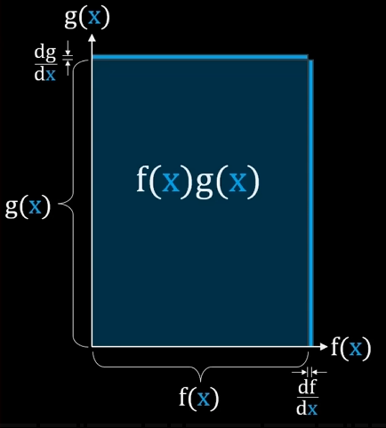
</div>

Here, $\frac{df}{dx}$ is used to represent a change of length, $df$, but by definition the derivative is a rate of change. In this example, the input increases by some amount $dx$. This means as the input $x$ increases by some amount $dx$, the function $f(x)$ increases by an amount $df$.


<div align='center'>
    <h1> Differentiation Rules </h1>
</div>

While the definition of the derivative comes directly from the limit process,

```math
f'(x) = \lim_{h \rightarrow 0} \frac{f(x + h) - f(x)}{h}
```

in practice, most derivatives are not computed directly from this expression. Instead, calculus develops a set of differentiation rules that allow derivatives to be calculated efficiently without repeatedly expanding limits. These rules are not new definitions of differentiations. Rather, they are logical consequences of the limit definition, derived once and then used as general tools. They allow complex functions to be differentiated through structured patterns rather than first principles each time.

## Constant Rule

If we have a function 

```math
f(x) = 3
```

or any function with a constant. It's graph would be a horizontal line.

<div align='center'>
    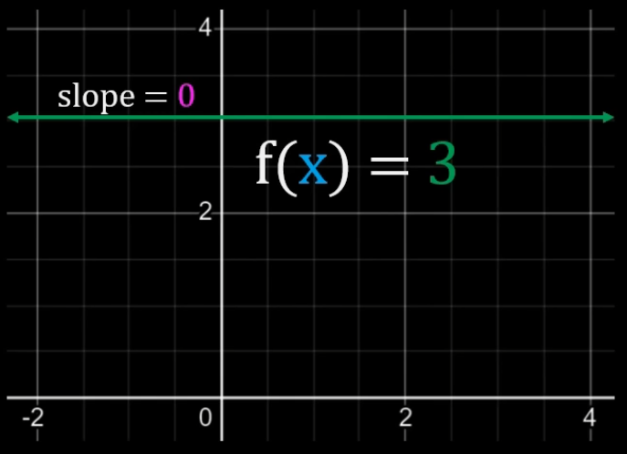
</div>

Taking any two points,

```math
\frac{\Delta y}{\Delta x} = \frac{0}{\Delta x} = 0
```

For this reason, the slope is always $0$ and therefore the derivative is always $0$. We write the generalization as the following,

```math
\frac{d}{dx} C = 0
```

or using a more rigorous definition,

```math
\frac{d}{dx} (C) = \lim_{\Delta x \to 0} \frac{f(x + \Delta x) - f(x)}{\Delta x} = \frac{C - C}{\Delta x} = 0
```

## Power Rule — $\frac{d}{dx}(x^n)$

One of the most fundamental rules in calculus is the power rule. It is written as,

```math
\frac{d}{dx} (x^n) = nx^{n-1}
```

This rule states that when differentiating a power of $x$, the exponent is brought down as a multiplier and the exponent is reduced by $1$.

```math
\begin{aligned}
\frac{d}{dx}(x^3) &= 3x^2 \\
\frac{d}{dx}(x^5) &= 5x^4
\end{aligned}
```

The power rule is significant because it reveals a consistent pattern in how polynomial functions change. Each increase in $x$ produces a predictable change in slope and differentiation systematically reduces the degree of the function while preserving its structure.

A common misunderstanding in early calculus comes from interpreting notation such as

```math
f(x) = x^4 + x^x
```

as meaning the entire function must match a derivative rule exactly before the rule can be used. Since the power rule is written as,

```math
\frac{d}{dx}(x^n) = nx^{n-1}
```

it may seem that the rule only applies when the whole function is a single power such as $x^5$ or $x^{10}$. However, this interpretation overlooks an important fact, derivative rules are not only rules about whole functions, but also rules about how derivatives interact with algebraic operations such as addition.

The expression

```math
x^4 + x^3
```

is not a single object of the form $x^n$. It is an addition operation joining two separate functions together.

```math
x^4 + x^3 = f(x) + g(x)
```

where

```math
f(x) = x^4 \qquad \text{and} \qquad g(x) = x^3
```

The derivative operator $\frac{d}{dx}$ has a special property called linearity. One consequence of linearity is the sum rule.

```math
\frac{d}{dx}(f(x) + g(x)) = \frac{d}{dx}f(x) + \frac{d}{dx}g(x)
```

This rule is logically separate from the power rule. The sum rule says that the differentiation passes through addition. In effect, the derivative operator distributes over sums in the same way multiplication distributes over addition in algebra. So when differentiating

```math
\frac{d}{dx} (x^4 + x^3)
```

the first step is not applying the power rule. The first step is applying the sum rule.

```math
\frac{d}{dx}(x^4 + x^3) = \frac{d}{dx}(x^4) + \frac{d}{dx}(x^3)
```

Only after the expression has been separated into individual pieces does the power rule become applicable, because each separate term now matches the structure $x^n$.

Then

```math
\frac{d}{dx}(x^4) = 4x^3
```

and

```math
\frac{d}{dx}(x^3) = 3x^2
```

giving

```math
\frac{d}{dx}(x^4 + x^3) = 4x^3 + 3x^2
```

The important conceptual distinction is that $f(x)$ names the entire function, but derivative rules act according to the internal algebraic structure of that function.

#### Power Rule Visualized - 3D

Suppose we have a cube with side length $x$. The volume of the cube is given by

```math
y = V = x^3
```

where $V$ represents the volume.

<div align='center'>
    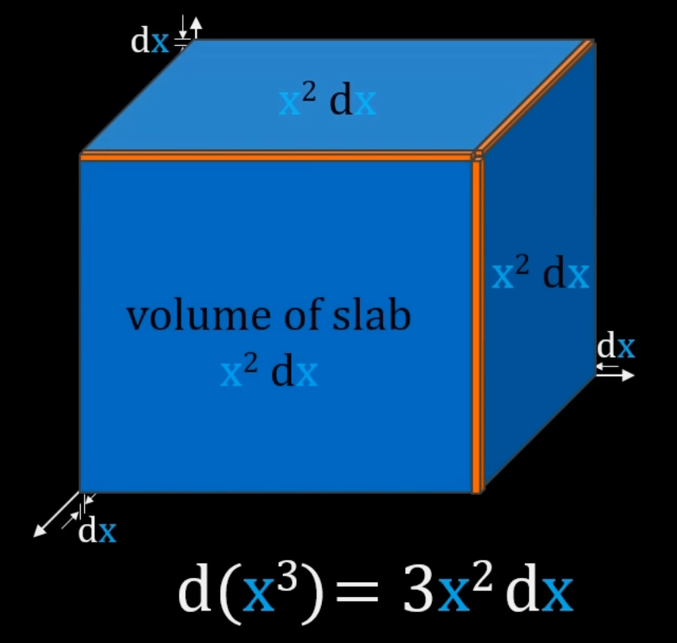
</div>

If the side length is increased by an infinitesimal amount $dx$, then additional volume is created around the existing cube. The 3 largest contributions come from the 3 new rectangular prisms attached to the faces of the cube. Each has volume

```math
x^2 dx
```

giving a total contribution of

```math
x^2dx + x^2xdx + x^2x = 3x^2 dx
```

Additionally, there are three smaller edge prisms and one corner cube, highlighted in orange. Their combined volume is

```math
3(dx \cdot dx \ \cdot x) + dx^3 = 3 x dx^2 + dx^3
```

Since $dx^2$ and $dx^3$ are higher-order infinitesimals, they become negligible compared to $dx$ as $dx \to 0$. This gives

```math
d(x^3) = 3x^3dx
```

Therefore,

```math
\begin{aligned}
dy &= dV = d(x^3) = 3x^2\,dx \\
\frac{dy}{dx} &= \frac{dV}{dx} = \frac{d(x^3)}{dx} = 3x^2
\end{aligned}
```

This states that the derivative of $x^3$ is $3x^2$, and that the differential change in volume is obtained by multiplying the differential change in side length, $dx$, by the derivative.

In other words,

```math
dV = dy = 3x^2dx
```

states that a small change in side length $dx$ produces an approximately linear change in volume $dV$. The derivative $3x^2$ acts as the scaling factor that converts changes in side length inot changes in volume.

The derivative

```math
\frac{dV}{dx} = 3x^2
```

describes how rapidly the volume changes with respect to the side length at a particular value of $x$.

For example, when $x=2$ the derivative

```math
\frac{dV}{dx} = 3x^2 = 3(2)^2 = 12
```

Thus,

```math
dV = 12dx
```

This means that near a cube with side length $2$, an infinitesimal increase in side length produces approximately $12$ times that amount of change in volume.

Similarly, when $x = 4$ the derivative is

```math
\frac{dV}{dx} = 3(4)^2 = 48
```

Thus,

```math
dV = 48 dx
```

This means that near a cube with side length $4$, the same infinitesimal increase in side length produces approximately $48$ times that amount of change in volume.

A larger cube has much larger faces. Since the new volume is formed by extending those faces outward, the same increase in side length sweeps out a greater amount of volume when the cube is already large. For this reason, volume does not grow at a constant rate. As the cube becomes larger, each additional increase in side length creates increasingly more volume. The derivative

```math
\frac{dV}{dx} =3x^2
```

captures this behaviour precisely, showing that the rate of volume growth is proportional to the square of the side length.

## Linearity Rules — Addition and Constant Multiplication

Differentiation also respects basic algebraic structure. Two key properties are linearity rules.

```math
\frac{d}{dx}[f(x) + g(x)] = f'(x) + g'(x)
```

and

```math
\frac{d}{dx}[c \cdot f(x)] = c \cdot f'(x)
```

where $c$ is a constant.

These rules state that differentiation distributes across addition and factors through constants. In other words, each part of a function can be differentiated independently before being combined. For example

```math
\frac{d}{dx} (x^2 + x^3) = 2x + 3x^2
```

These properties are essential because they allow complex espressions to be broken into simpler components. Without linearity, differentiation would require full limit expansion for every expression, making calculus far less practical. We can try to visualize this by observing the behaviour in

```math
\begin{aligned}

\frac{d}{dx}(g(x) + h(x))
&= \frac{dg}{dx} + \frac{dh}{dx}

\\

\frac{d}{dx}(\sin(x) + x^2)
&= \cos(x) + 2x
\end{aligned}
```

<div align='center'>
    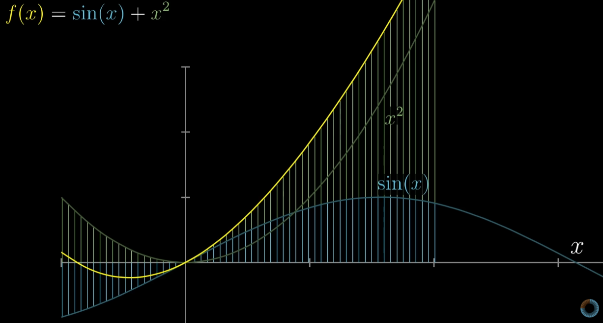
</div>

Now, if we zoom in and take the point at $x = 0.5$, we create a new variable $df$ where

```math
df = d(\sin(x)) + d(x^2)
```

In this example $d$ means "differential" or "the tiny change". So $d(\sin(x))$ means "the tiny change in the quantity $\sin(x)$". Because $y = \sin(x)$, this is exactly the same as writing $dy$. Therefore,

```math
\begin{aligned}
dy &= d(\sin(x)) = \cos(x) \ dx
\\

dy &= d(x^2) = 2x \ dx
\end{aligned}
```

<div align='center'>
    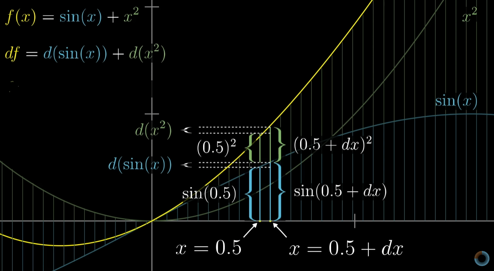
</div>

We know that,

```math
\begin{aligned}
y &= \sin(x)
\\

\frac{dy}{dx} &= \cos(x)
\\

dy &= \cos(x)\,dx
\end{aligned}
```
Additionally,

```math
\begin{aligned}
y &= x^2
\\

\frac{dy}{dx} &= 2x
\\

dy &= 2x\,dx
\end{aligned}
```

It therefores follows,

```math
\begin{aligned}
df &= \cos(x)\,dx + 2x\,dx
\\

\frac{df}{dx} &= \cos(x) + 2x
\end{aligned}
```

This now suggests

```math
\frac{d}{dx} (g(x) + h(x)) = \frac{dg}{dx} + \frac{dh}{dx}
```

which the sum of derivatives of its part. This is also called the sum rule.

## Product Rule — Differentiating Multiplication

When two functions are multiplied, differentiation becomes more structured. The product rule states,

```math
\frac{d}{dx}[f(x)g(x)] = f'(x)g(x) + f(x)g'(x)
```

This rule shows that the derivative of a product is not simply the product of the derivatives.

Take $x^2, \cdot x^5$. For each function we can observe

```math
f(x) = x^2 \qquad g(x) = x^5
```

Then,

```math
f'(x) = 2x \qquad g'(x) = 5x^4
```

Now apply the product rule,

```math
\frac{d}{dx}[x^2 \cdot x^5] = (2x)(x^5) + (x^2)(5x^4)
```

Simplifying each term,

```math
\begin{aligned}
&= 2x^6 + 5x^6 \\
&= 7x^6
\end{aligned}
```

This matches the direct simplification approach,

```math
x^2 \cdot x^7 = x^7 \Rightarrow \frac{d}{dx}(x^7) = 7x^6
```

#### Product Rule - Visualized

Often, it is very difficult to visualize the behaviour of 2 functions multiplying, instead it is conceptually more intuitive to instead visualize it geometrically.

Let,

```math
f(x) = \sin(x) \cdot x^2
```

Now, consider $\sin(x)$ as the width and $x^2$ as the height. Therefore $\sin(x) \cdot x^2 = \text{Area}$. Below is a visualization of what is occurring geometrically when introducing $dx$, from here we attempt to calculate the newly added area $df$.

<div align='center'>
    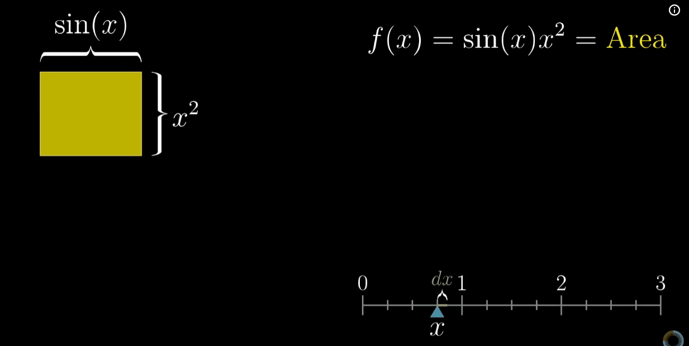
</div>

As illustrated above where $df$ represents the new area by the introduced $dx$,

<div align='center'>
    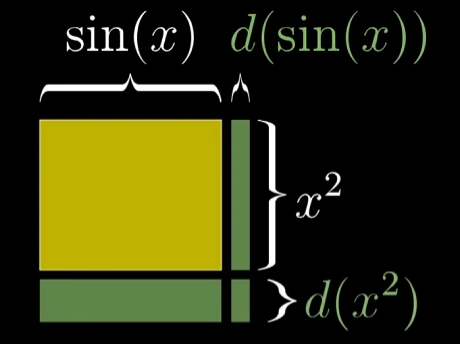
</div>

```math
df = d(\sin(x)) x^2 + \sin(x) d(x^2) + d(x^2)
```

Because

```math
\lim_{x \to 0} d(x^2) = 0
```

The expression is simplified to

```math
df = d(\sin(x)) x^2 + \sin(x) d(x^2)
```

Now we use the differential identities

```math
\begin{aligned}
d(\sin(x)) &= \cos(x)\,dx = \frac{dy}{dx}\,dx \\
d(x^2) &= 2x\,dx = \frac{dy}{dx}\,dx
\end{aligned}
```

Substituting gives

```math
\begin{aligned}
df &= (\cos(x)\,dx)x^2 + \sin(x)(2x\,dx) \\
df &= \cos(x)\,x^2\,dx + \sin(x)\,2x\,dx \\
f'(x) = \frac{df}{dx} &= \cos(x)\,x^2 + \sin(x)\,2x
\end{aligned}
```

Another visual interpretation of the product rule is directing labelling the derivatives.

<div align='center'>
    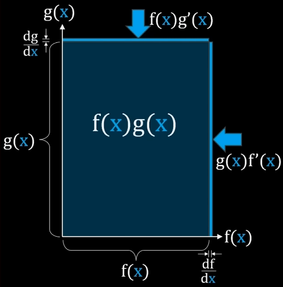
</div>

Here, we label the derivative $\frac{df}{dx}$ as the width increase $df$ because the input has increased by an amount $dx$, which represents the function output increase $df$.


#### Product Rule - Algebraic Proof

Here, we will prove the product rule algebraically which is a more rigorous proof than the conceptual geometric approach.

```math
\frac{d}{dx}[f(x)g(x)] = f'(x)g(x) + f(x)g'(x)
```

Let,

```math
F(x) = f(x) \cdot g(x)
```

According to the definition,

```math
f'(x) = \lim_{h \to 0} \frac{f(x + h) - f(x)}{h}
```

Therefore,

```math
F'(x) = \lim_{h \to 0} \frac{F(x + h) - F(x)}{h}
```

Which follows,

```math
F'(x) = \lim_{h \to 0} \frac{f(x+h) \cdot g(x+h) - f(x) \cdot g(x)}{h}
```

Now, we're going to subtract and add $f(x + h) \cdot g(x)$ to the numerator. This is a completely valid operation as it is equivalent to adding $0$ on the numerator.

```math
\begin{aligned}
F'(x)
&= \lim_{h \to 0}
\frac{
f(x+h)g(x+h) - f(x)g(x)
\boxed{+\, f(x+h)g(x) - f(x+h)g(x)}
}{h}
\\

&= \lim_{h \to 0}
\frac{
f(x+h)g(x+h)
\boxed{-\, f(x+h)g(x)}
}{h}
+
\lim_{h \to 0}
\frac{
\boxed{f(x+h)g(x)}
- f(x)g(x)
}{h}
\\

&= \lim_{h \to 0}
f(x+h)
\frac{g(x+h)-g(x)}{h}
+
\lim_{h \to 0}
g(x)
\frac{f(x+h)-f(x)}{h}
\end{aligned}
```

Because,

```math
\lim_{h \to 0} f(x + h) = f(x)
```

and multiplying the limit by a constant $g(x)$ can be factored out. It follows,

```math
F'(x) = f(x) \cdot \lim_{h \to 0} \frac{g(x + h) -g(x) }{h} + g(x) \cdot \lim_{h \to 0} \frac{f(x+h) -f(x)}{h}
```

These two terms follow the definition of derivatives. It follows,

```math
F'(x) = f(x) \cdot g'(x) + g(x) \cdot f'(x)
```

## Chain Rule — Differentiating Composite Functions

Many functions are not formed from a single operation, but instead contain multiple layers of functions nested insde one another. These are known as **composite functions**. A composite function occurs when the output of one function becomes the input of another function. A general composite function is written as

```math
f(g(x))
```

where,

- $g(x)$ is called the inner function
- $f(x)$ is called the outer function

Examples can include,

1. $f(x) = \sin(2x)$. Where $\sin$ is the outer function and $2x$ is the inner function.

2. $f(x) = (3x + 1^5$. Where $u^5$ is the outer function and $3x +1$ is the inner function.

3. $f(x) = \sqrt{1 + x^3}$. First rewrite as $f(x) = (1 + x^3)^{\frac{1}{2}}$. The outer function is now $u^{\frac{1}{2}}$ and the inner function is $1 + x^3$.

The chain rule describes how derivatives behave when functions are composted together. It is written as

```math
\frac{d}{dx} f(g(x)) = f'(g(x)) \cdot g'(x))
```

<div align='center'>
    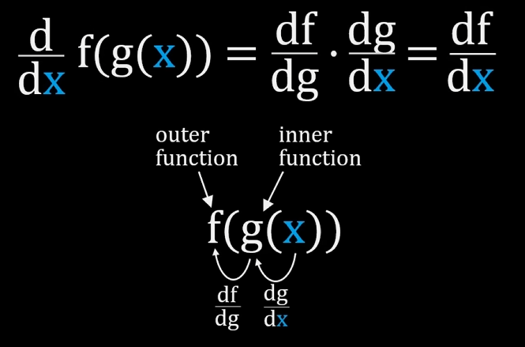
</div>

This multiplication may appear confusing because function composition itself is not multiplication. When functions are composed, the output of one function is substituted into another function. However, derivatives do not describe the functions themselves. Instead, derivatives describe how small changes propagate through the functions.

When performing the chain rule it is common to introduce an intermediate variable such as $u$. Suppose we have,

```math
y = (x^2 + 3x)^8
```

This means,

- $x$ is the horizontal axis
- $y$ is the vertical axis

The graph itself only contains these two axes. However, the internal structure of the function may be decomposed into stages by introducing an intermediate quantity.

Define,

```math
\begin{aligned}
u &= x^2 + 3x \\
y &= u^8
\end{aligned}
```

This decomposition creates the dependency chain,

```math
x \to u \to y
```

It is important to understand that $u$ is not a new graph axis. The graph is still entirely determined by the relationship between $x$ and $y$. The variable $u$ is an intermediate quantity used to describe how changes propagate internally through the composite function. Changing $x$ changes $u$, and changing $u$ then changes $y$. The chain rule therefore studies how change cascades through these intermediate changes.

Differentiating both stages gives,

```math
\begin{aligned}
\frac{du}{dx} &= 2x + 3 \\
\frac{dy}{du} &= 8u^7
\end{aligned}
```

Now suppose $x = 1$, then

```math
u = 1^2 + 3(1) = 4
```

This means that at the point where $x = 1$, the corresponding intermediate value is $u = 4$. Now evaluate the derivatives at this point. First,

```math
\frac{du}{dx} = 2(1) + 3 = 5
```

This means that near $x = 1$, a small change in $x$ produces a change in $u$ that is approximately $5$ times as large. Symbolically,

```math
du = 5 dx
```

Next,

```math
\frac{dy}{du} = 8u^7
```

At the point where $u=4$

```math
\frac{dy}{du} = 8(4)^7
```

This means that near $u=4$, a small change in $u$ produces a change in $y$ that is approximately $8(4)^7$ times as large. Symbolically,

```math
dy = 8(4)^7 du
```

The important conceptual step is that the change produced by the first stage becomes the input change for the second stage. Since,

```math
\begin{aligned}
du &= 5 \, dx \\
dy &= 8(4)^7 \, du \\
dy &= 8(4)^7 \cdot 5 \, dx
\end{aligned}
```

Therefore,

```math
\frac{dy}{dx} = 8(4)^7 \cdot 5
```

<div align='center'>
    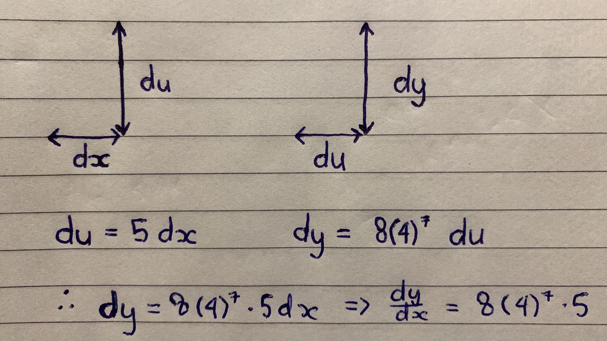
</div>

The first derivative,

```math
\frac{du}{dx}
```

describes how changes in $x$ cascades changes in $u$. The second derivative,

```math
\frac{dy}{du}
```

describes how changes in $u$ scale into changes in $y$.  Because the output change from the first derivative stage becomes the input for the second stage, the scaling factors multiply together. This produces the chain rule relationship.

```math
\frac{dy}{dx} = \frac{dy}{dy} \cdot \frac{du}{dx}
```

This relationship occurs because any small changes in $x$, increases $u$ which increases $y$.


#### Multiple Functions

This can also expand to more complicated scenarios where we get more terms, but the idea remains the same.

<div align='center'>
    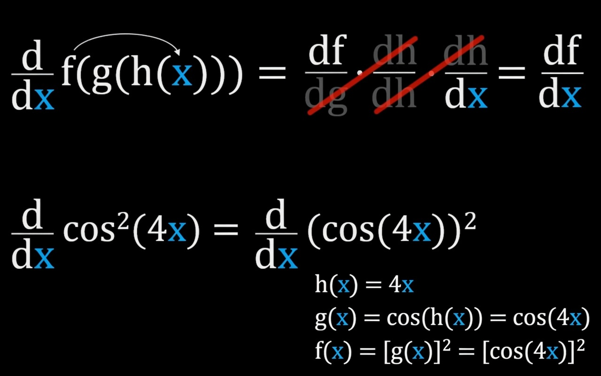
</div>

Consider the function

```math
y = \cos^2(4x)
```

Now, break it down into separate variables.

```math
\begin{aligned}
h(x) &= 4x \\
g(u) &= \cos(u) \\
f(v) &= v^2
\end{aligned}
```

which gives

```math
f(g(h(x))) = \cos^2(4x)
```

This notation explicitly separates the function into a sequence of individual operations. Beginning with an input $x$,

```math
h(x) = 4x
```

multiplies the input by $4$. The result is then passed into,

```math
g(u) = \cos(u)
```

which applies the cosine function. Finally,

```math
f(v) = v^2
```

squares the result. The complete process can therefore be visualized as,

```math
x \to u \to v \to y
```

where

```math
\begin{aligned}
u &= h(x) \\
v &= g(u) \\
y &= f(v)
\end{aligned}
```

The important observation is that each stage produces a new quantity which becomes the input of the next stage. This interpretation is often the most natural way to understand the chain rule because it exposes every intermediate step. Each quantity depends only on the quantity immediately before it. We may therefore ask three independent questions,

First,

```math
u = 4x
```

How rapidly does $u$ change with respect to $x$?

```math
\frac{du}{dx} = 4
```

Second,

```math
v = \cos(u)
```

How rapidly does $v$ change with respect to $u$?

```math
\frac{dv}{du} = -\sin(u)
```

Third,

```math
y = v^2
```

How rapidly does $y$ change with respect to $v$?

```math
\frac{dy}{dv} = 2v
```

Notice that these derivatives are not introduced arbitrarily. Each one simply measures the rate of change between two neighbouring stages of the composition. The chain rule states that the overall rate of change from $x$ to $y$ is obtained by multiplying the rates of change at each stage.

```math
\frac{dy}{dx} = \frac{dy}{dv} \cdot \frac{dv}{du} \cdot \frac{du}{dx}
```

Substituting the derivatives gives,

```math
\frac{dy}{dx} (2v)(-\sin(u))(4)
```

which produces

```math
\frac{dy}{dx} = 2\cos(4x)(-\sin(4x))(4) = -8\cos(4x)\sin(4x)
```

#### Example 1 - Function Composite View

Let,

```math
y = (x^2 + 1)^3
```

Observing the expression, it appears that the power rule could potentially be used because their is an exponent of $3$. But the subtle issue is that the thing being cubed is not simply $x$. This is where the chain rule is used.

This expression contains two nested functions. Define the inner function as

```math
g(x) = x^2 + 1
```

and define the outer function as

```math
f(u) = u^3
```

The original function can now be viewed as,

```math
y = f(g(x))
```

The chain rule now be easier to apply. First, differentiate both equations.

```math
\begin{aligned}
g'(x) &= 2x \\
f'(u) &= 3u^2
\end{aligned}
```

The chainrule therefore states,

```math
\begin{aligned}
\frac{d}{dx} f(g(x))
&= 3(x^2 + 1)^2 \cdot 2x \\
\\
\frac{d}{dx} f(g(x))
&= 6x(x^2 + 1)^2
\end{aligned}
```

#### Example 2 - Function Composite View with Leibniz Notation

Let,

```math
y = (x^2 + 3x)^8
```

First perform a substitution,

```math
\begin{aligned}
u &= x^2 + 3x
\\

\frac{du}{dx} &= 2x + 3
\end{aligned}
```

Which follows,

```math
\begin{aligned}
y &= u^8
\\

\frac{dy}{du} &= 8u^7
\end{aligned}
```

Therefore,

```math
\frac{dy}{dx} = \frac{dy}{du} \cdot \frac{du}{dx} = 8u^7 \cdot (2x + 3) = 8(x^2 + 3x)^7 (2x + 3)
```

#### Example 3 - Substitution and the Power Rule

As an illustrative example, we can perform substitution to use the power rule and compare this to using the chain rule.

Given,

```math
y = (x^2 + 1)^3
```

we define a temporary variable,

```math
z = x^2 + 1
```

The function now becomes $y = z^3$. At this stage, the ordinary power rule can be applied directly.

```math
\begin{aligned}
y &= z^3 \\
\frac{dy}{dz} &= 3z^2
\end{aligned}
```

Differentiating $z = x^2 + 1$ gives

```math
\frac{dz}{dx} = 2x
```

The total rate of change of $y$ with respect to $x$ must therefore include both stages of change.

1. How $y$ changes with respect to $z$
2. How $z$ changes with respect to $x$

The chain rule combines these together.

```math
\frac{dy}{dx} = \frac{dy}{dz} \cdot \frac{dz}{dx}
```

It therefore follows,

```math
\begin{aligned}
3z^2 \cdot 2x \,
\frac{dy}{dz}
\cdot
\frac{dz}{dx}
\\

3z^2 \cdot 2x \,
\frac{dy}{\cancel{dz}}
\cdot
\frac{\cancel{dz}}{dx}
\\

3z^2 \cdot 2x \,
\frac{dy}{dx}
\\

3(x^2 + 1)^2 \cdot 2x \,
\frac{dy}{dx}
\\

6x(x^2 + 1)^2 \,
\frac{dy}{dx}
\end{aligned}
```

## Chain Rule Proof

Given $y = f(g(x))$

```math
\begin{aligned}
\frac{dy}{dx}

&= \lim_{h \rightarrow 0} \frac{f(x + h) - f(x)}{h} \\

&= \lim_{h \to 0} \frac{f(g(x + h)) - f(g(x))}{h} \\

&= \lim_{h \to 0}
\frac{f(g(x + h)) - f(g(x))}{h}
\cdot
\frac{g(x+h) - g(x)}{g(x+h) - g(x)} \\

&= \lim_{h \to 0}
\frac{f(g(x + h)) - f(g(x))}{g(x+h) - g(x)}
\cdot
\frac{g(x+h) - g(x)}{h} \\

&= \left(
\lim_{h \to 0}
\frac{f(g(x + h)) - f(g(x))}{g(x+h) - g(x)}
\right)
\cdot
\left(
\lim_{h \to 0}
\frac{g(x+h) - g(x)}{h}
\right) \\

&=
\lim_{h \to 0}
\frac{f(g(x + h)) - f(g(x))}{g(x+h) - g(x)}
\cdot g'(x)
\end{aligned}
```

Now, we introduce a new variable.

```math
\begin{aligned}
k &= g(x+h) - g(x) \\
g(x+h) &= g(x) + k
\end{aligned}
```

When I write $k = g(x + h) - g(x)$, the value of $k$ depends on whatever value of $h$ you choose (with $x$ fixed). So more formally, $k$ is not an independent variable. Instead, it is a function of $h$,

```math
k(h) = g(x + h) - g(x)
```

Because $g$ is differentiable, it is continuous, so as $h \to 0$, we have $k \to 0$. 

```math
\lim_{h \to 0} k = \lim_{h \to 0} g(x + h) - g(x) = 0
```

Because every value of $k$ near $0$ corresponds to some $h$ near $0$, the limit of $h$ approaches $0$ is the same limit as $k$ approaches $0$ of the new expression.

```math
\lim_{h \to 0} \frac{f(g(x+h)) - f(g(x))}{g(x+h)-g(x)} = \lim_{k \to 0} \frac{f(g(x)+k) - f(g(x))}{k}
```

It therefore follows,

```math
\begin{aligned}
\frac{dy}{dx}


&=
\lim_{h \to 0}
\frac{f(g(x + h)) - f(g(x))}{g(x+h) - g(x)}
\cdot g'(x) \\

&= \lim_{k \to 0} \frac{f(g(x) + k) - f(g(x))}{k} \cdot g'(x) \\

&= f'(g(x)) \cdot g'(x) \\

\end{aligned}
```

In a complete form this is written as,

```math
\frac{dy}{dx} = \lim_{k \to 0} \frac{f(g(x) + k) - f(g(x))}{k} \cdot \lim_{h \to 0}
\frac{g(x+h) - g(x)}{h}
```

<div align='center'>
    <h1> Maximization and Minimization Problems </h1>
</div>

Calculus can be used to solve optimization problems. They involve finding the local minimum and maximum values for a function. We use the word "local" to describe the behaviour of the point, comparing to the nearest two points

- If it is higher that than the two closest points, it is a local maximum

- If it is lower than the two closest points, it is a local minimum

<div align='center'>
    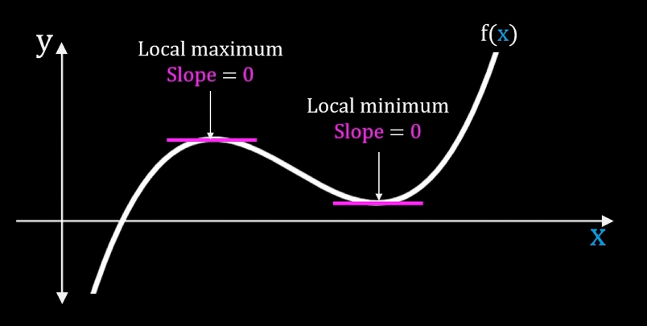
</div>

When we set the derivative to $0$ and solve for $x$, we would obtain 2 $x$ values. This would represent both the local maximum and minimum. For this reason, when calculating the derivative and solving for $f'(x) = 0$, it's important to distinguish between them both. To visualize the behaviour, we will colour code the function slope behaviour.

<div align='center'>
    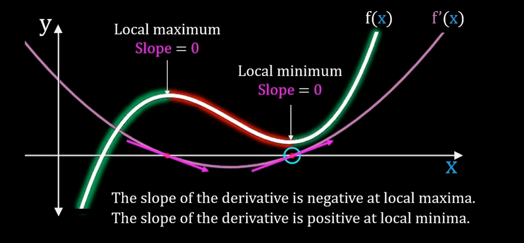
</div>

- For the local maximum behaviour the slope changes from positive to negative. Additionally, the slope of the derivative is negative at local maximum.
- For the local minimum behaviour the slope changes from negative to positive. Additionally, the slope of the derivative is positive at a local minimum.

Below is an illustration describing common scenarios where the second derivative can be visually understood. It's very useful because it describes the behaviour of functions.

<div align='center'>
    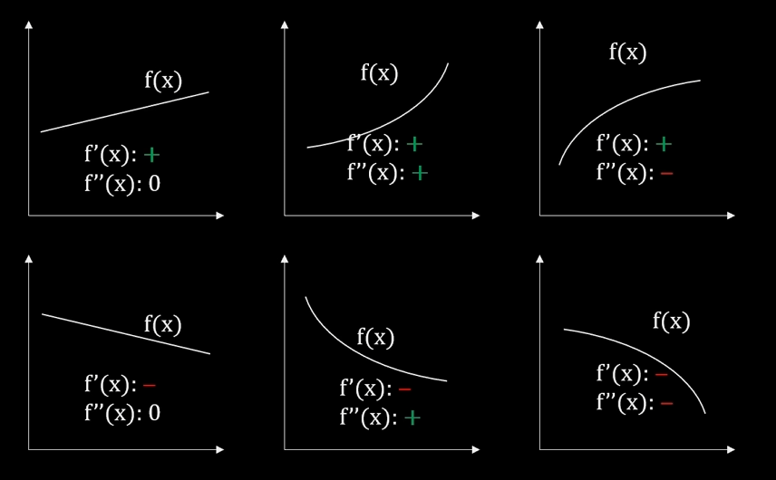
</div>

It therefore follows, where $f'(x) = 0$

- It is a local maximum if $f''(x) < 0$
- It is a local minimum if $f''(x) > 0$

#### Maximum Profit Optimization

Suppose this graph represents the profit our company would make by manufacturing and selling $x$ number of a particular item.

- If we make and sell too few, our profit will be limited by the low number.
- If we make and sell too many, our supply might exceed the demand and extra cost for running more machines and hiring more people won't be offset by the higher volume.

<div align='center'>
    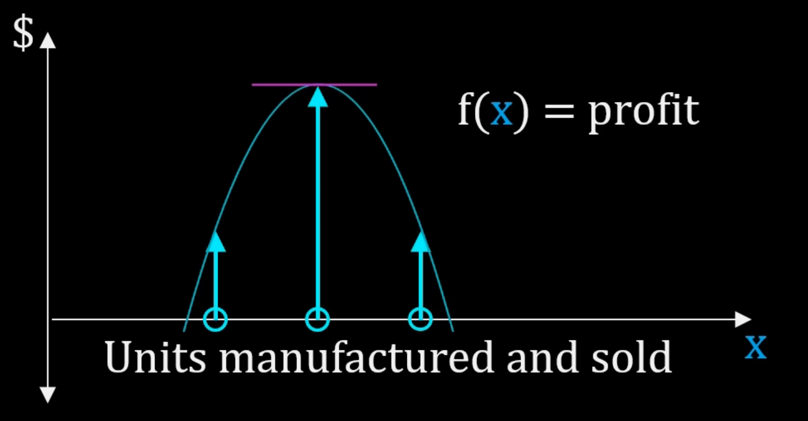
</div>

We can use calculus to solve this problem. The optimal number $x$ is precisely when the slope is equal to $0$. Suppose

```math
\begin{aligned}
f(x) &= \text{profit}\;(\$1000\text{s}) \\
     &= -0.012x^2 + 9.8x - 1500 \\
f'(x) &= -0.024x + 9.8
\end{aligned}
```

Now, we set the derivative $f'(x) = 0$ and solve for $x$.

```math
\begin{aligned}
f'(x) &= -0.024x + 9.8 = 0 \\
0.024x &= 9.8 \\
x &= \frac{9.8}{0.024} \\
x &\approx 408.3
\end{aligned}
```

This means, we should make 408 units to maximize our profit. If the problem statement also asks for the profit amount, plug this **into the original profit function**.

```math
\begin{aligned}
f(408) &= -0.012(408)^2 + 9.8 \cdot 408 - 1500 \\
       &= 500.8
\end{aligned}
```

This means, the maximum profit amount will be $500,800 by producing 408 units.

#### Minimum Usage Optimization

Given a plain sheet of metal, we want to cut 4 squares around the edges with the goal of maximizing the volume of the box. The box will have no lid.

<div align='center'>
    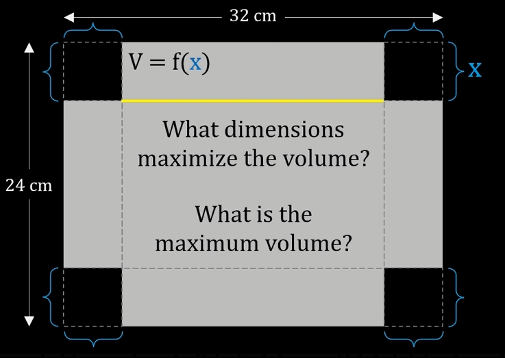
</div>

The 4 boxes will all have equal length $x$. The first thing to do is create a function $f(x)$ to represent the volume $V$.

- The width has a length $32 - 2x$
- The length has a length $24 -2x$
- The height has a length of $x$

We can create a function to represent the volume from the removal of squares as a function of $x$,

```math
\begin{aligned}
V = f(x) &= (32 - 2x)(24 - 2x)x \\
         &= (32 \cdot 24 - 64x - 48x + 4x^2)x \\
         &= (768 - 112x + 4x^2)x \\
         &= 768x - 112x^2 + 4x^3
\end{aligned}
```

This function is used to represent the volume as $x$ changes, therefore

```math
\frac{dV}{dx} = f'(x) = 768 -224x + 12x^2
```

Now, we want to make the derivative equal to $0$ to solve for the maximum. This will represent the maximum volume.

```math
f'(x) = 768 - 224x + 12x^3 = 0
```

We will use the quadratic formula here to solve for $x$, working will not be shown.

```math
x = \frac{-b \pm \sqrt{b^2 - 4ac}}{2a}
```

This will solve for 2 $x$ values, $14.1$ and $4.53$. However, the first $14.1$ can be ignored. This is because $2 * 14.1 > 24$, therefore it has no practical application here we it is not possible to remove squares with the value $x = 14.1$. Therefore, this means the correct solution is $4.53$.

The question specifically asked for maximum dimension, this occurs when $x = 4.53$. Therefore, the total maximum dimension is

```math
V = f(x) = (32 - 2(4.53))(24 - 2(4.53)) * 4.53 = 1552\text{cm}^3
```

<div align='center'>
    <h1> Finding the Tangent Line and Normal Line </h1>
</div>

When studying curves, two of the most important lines are the **tangent** and the **normal**. Below, we will explain the process for solving both for the curve

```math
y = x^2
```

at the point where

```math
x = 3
```

We will therefore be studying the behaviour at the point

```math
(3, 9)
```

#### Tangent Line

The tangent line touches the curve at a single point and has the **same gradient as the curve at that point**. To find the tangent line, we first need its gradient. The derivative of the function gives the gradient of the curve at every value of $x$

```math
\frac{dy}{dx} = 2x
```

At $x=3$,

```math
\frac{dy}{dx} = 2(3) = 6
```

Therefore, the tangent line has gradient

```math
m = 6
```

The equation of a straight line can be written as

```math
y - y_1 = m(x - x_1)
```

- The point $(x_1, y_1)$ is simply a known point on the line.
- The symbols $(x, y)$ represent any other point on the line.

For our equation,

```math
(x_1, y_1) = (3, 9)
```

The expression $y - y_1$ represents the vertical displacement from the known point to another point on the line. Likewise, $x - x_1$ represents the horizontal displacement. This means, we need to create an equation such that for every $x$ value, when comparing it to our point, it must have the same gradient value of $6$. Therefore, the equation becomes

```math
\begin{aligned}
y - y_1 &= m(x - x_1) \\
y - 9 &= 6(x - 3) \\
y - 9 &= 6x - 18 \\
y &= 6x - 9
\end{aligned}
```

<div align='center'>
    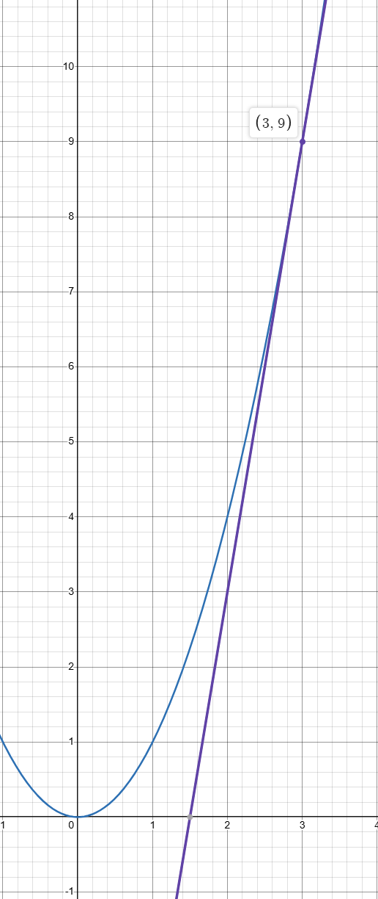
</div>

#### Normal Line

The normal line is **perpendicular** to the tangent line and also passes through the same point on the curve. This occurs when the two lines meet and create a $90^\circ$ angle.

Suppose we have a linear graph with a $\Delta y = a$ and $\Delta x = b$, therefore $m = \frac{\Delta y}{\Delta x} = \frac{a}{b}.$

<div align='center'>
    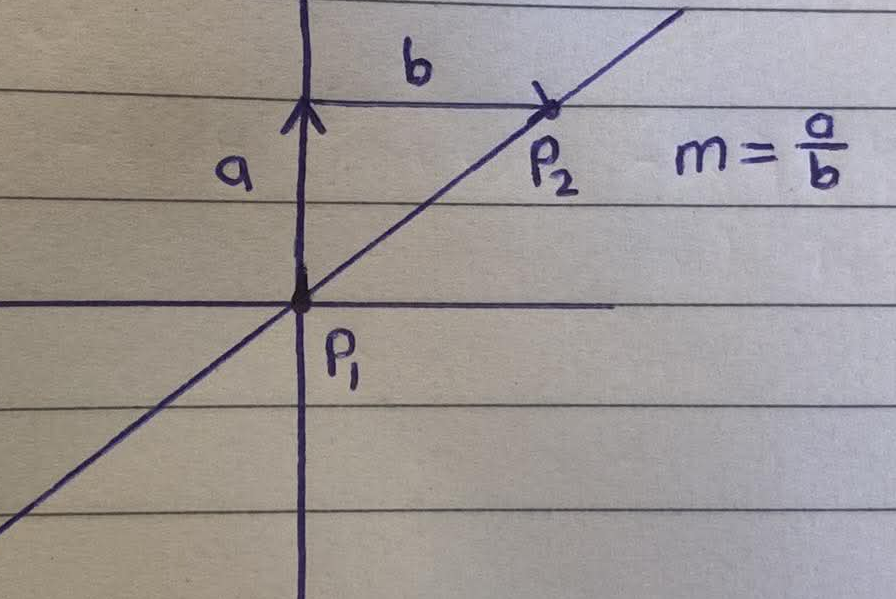
</div>

A perpendicular line is a line that meets at $90^\circ$. It's best to visualize this with an example, so we will simply rotate the current linear graph by $90^\circ$.

<div align='center'>
    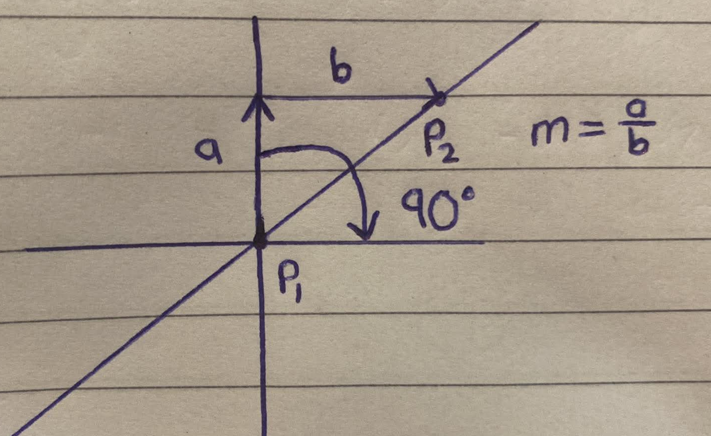
</div>

<div align='center'>
    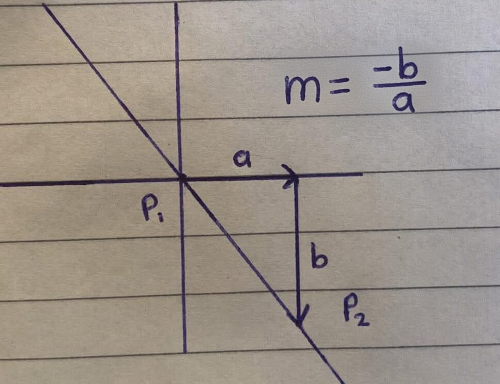
</div>

Now, we can observe the behaviour of both gradients. The tangent line has a gradient $\frac{a}{b}$ and our normal line has a gradient $\frac{-b}{a}$. It therefore follows,

```math
m_{\text{tan}} \cdot m_{\text{norm}} = \frac{a}{b} \cdot \frac{-b}{a} = \frac{-ab}{ba} = -1
```

<div align='center'>
    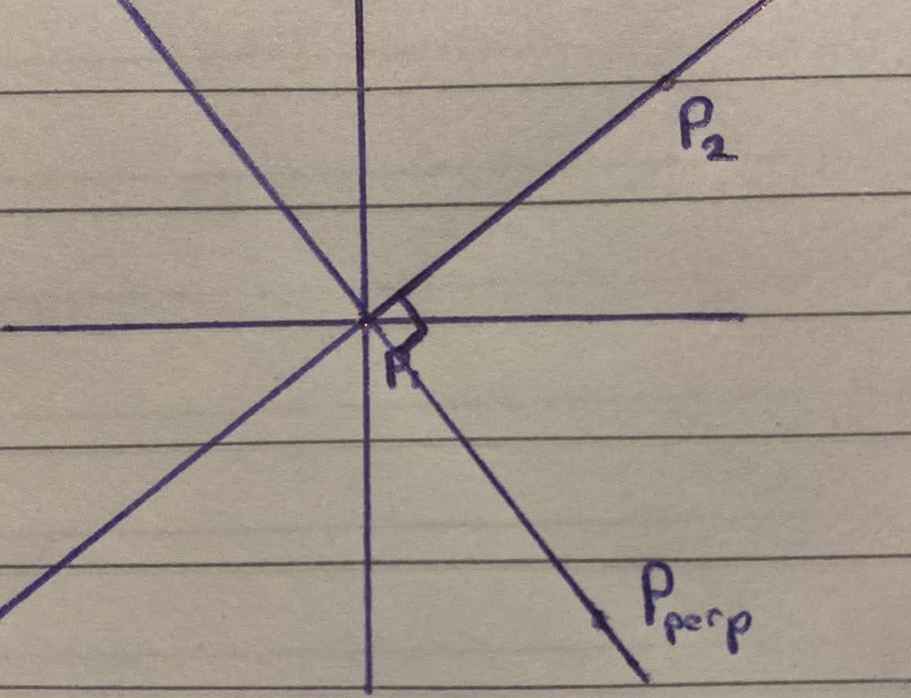
</div>

This tells us crucial information. If we created a linear graph tangent to the curve with gradient $m$, the normal graph of our linear graph must have a gradient of $-\frac{1}{m} = -\frac{1}{6}$. Using the previous line equation at point $(3, 9)$,

```math
\begin{aligned}
y - y_1 &= m(x - x_1) \\
y - 9 &= -\frac{1}{6}(x - 3) \\
y - 9 &= -\frac{x}{6} + \frac{3}{6} \\
y &= -\frac{x}{6} + \frac{3}{6} + 9 \\
y &= -\frac{x}{6} + \frac{1}{2} + 9 \\
y &= -\frac{x}{6} + \frac{19}{2}
\end{aligned}
```

<div align='center'>
    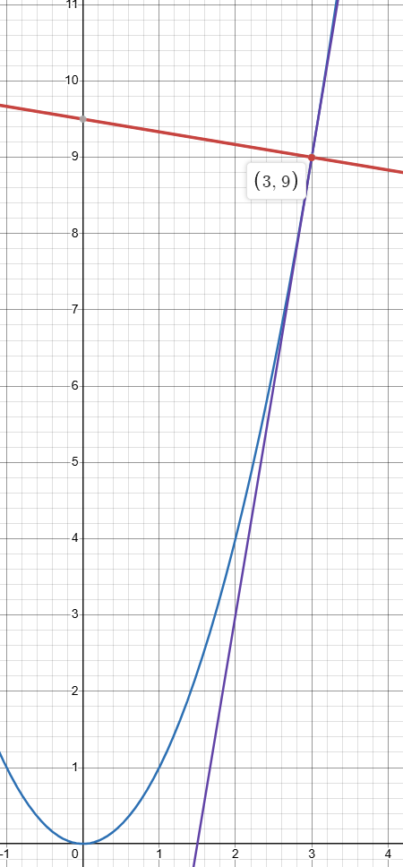
</div>