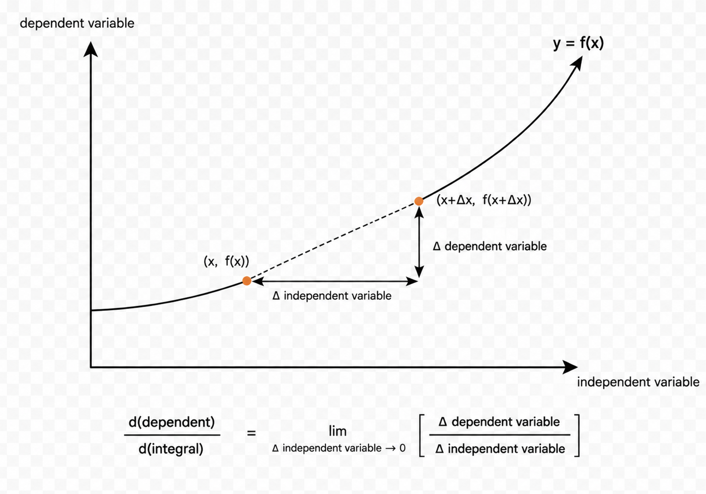

<div align='center'>
    <h1> Derivatives Notation </h1>
</div>

One of the most distinctive features of calculus is its symbolic language. Even within the topic of derivatives alone, several forms of notation are commonly used.

```math
\frac{dy}{dx}
\qquad
f'(x)
\qquad
\frac{d}{dx}f(x)
```

These are different notational systems describing the same mathematical object. The distinction between them lies not in meaning, but in emphasis. Each notation highlights a different perspective on differentiation and serves a different stylistic or conceptual purpose within mathematics.

The development of multiple derivative notations reflects the historical growth of calculus itself. Different mathematicians approached differentiation through different ways of thinking. Some emphasized changing quantities, other emphasized functions, while others viewed differentiation as an operation applied to an expression. Over time, these approaches evolved into the notation systems still used today.

Understanding derivative notation therefore involves more than simply learning how to read symbols. It involves understanding the mathematical perspective encoded within each notation. Some notations are especially useful in physics, others in pure mathematics and others in formal manipulation or computation. Together, they form a flexible symbolic language for expressing differentiation in a wide variety of contexts.

## Leibniz Notation — $\frac{dy}{dx}$

The notation,

```math
\frac{dy}{dx}
```

is known as Leibniz notation, named after Gottfried Wilhelm Leibniz, one of the founders of calculus. It is one of the most recognizable forms of derivative notation and remains especially common in physics, engineering and applied mathematics. This notation is read as "The derivative of $y$ with respect to $x$" or informally "d y by d x". Where the "d" means differential. Alternatively it can be meaning the differential (or change, represented by $d$) of the quantity in the numerator, with respect to the variable in the denominator.

In plain words "How $y$ changes as $x$ changes" or more generally "Rate of change of the numerator with respect to the denominator variable".

- **Numerator** - What is changing, $y$, $f(x)$, etc. This is the **dependent variable**.

- **Denominator** - What the dependent variable is changing with respect to, $x$, $t$, etc. This is the **independent variable, what you change**.

<div align='center'>
    
</div>

One of the defining characteristics of Leibniz notation is that it explicitly displays the relationship between variables. The numerator indicates the quantity being differentiated, while the denominator indicates the variable with respect to which the differentiation occurs. In this way, the notation naturally communicates dependency. For example,

```math
\frac{dy}{dt}
```

immediately indicates differentiation with respect to time, while

```math
\frac{dP}{dr}
```

indicates differentiation with respect to radius. The notation therefore embeds interpretation directly into the symbols themselves.

Historically, Leibniz developed this notation from the idea of infinitesimal changes. Although modern calculus defines derivatives rigorously through limits, the notation preserves the intuitive appearance of a ratio between tiny changes. That is, $dy$ represents the "infinitesimal" change in $y$ and $dx$ represents the "infinitesimal" change in $x$. Therefore, $\frac{dy}{dx}$ can be conceptually thought of as the ratio of these two infinitesimal variables which is represented in the notation.

If 

```math
y = f(x)
```

then $y$ and $f(x)$ represent the same quantity. Consequently,

```math
dy = d(f(x))
```

and therefore

```math
\frac{dy}{dx} = \frac{d(f(x))}{dx}
```

Similarly,

```math
y = g(h)
```

then

```math
\frac{dy}{dh} = \frac{d(g(h))}{dh} = \frac{dg}{dh}
```

This demonstrates that the numerator may be a variable or an entire expression. In both cases it identifies the quantity whose rate of change is being analyzed. A crucial point to understand is that $y$ and $x$ are frequently used for graphing, but are not special because they're axes, they're just names.

In $y = f(x)$, you happen to be using graphing convention where

- $x$ is the input, a horizontal axis.
- $y$ is the output, a vertical axis.

but calculus doesn't depend on that visual choice. If we were to instead have,

```math
h = j(z) = z^2
```

Nothing structurally changes. It is the same idea.

- $j$ is a function.
- $z$ is the input, independent variable.
- $h$ is the output, dependent variable.

So it just means "Take a number $z$, square it and call it $h$". So think of this as,

```math
\text{input} \to \text{function} \to \text{output}
```

So if,

```math
\begin{aligned}
h &= j(z) = z^2 \\
\frac{dh}{dz} &= 2z
\end{aligned}
```

So this means identically, "How the output $h$ changes when the input $z$ changes". So to generalize this notation, it's read as, **change in output quantity per change in input quantity**. The thinking for these should be "There is a relationship between two quantities, and one depends on the other".

Another important feature of Leibniz notation is its adaptability to higher derivatives. The second derivative may be written as,

```math
\frac{d^2y}{dx^2}
```

or generally

```math
\frac{d^ny}{dx^n}
```

This structure preserves the relationship between the variables while clearly indicating repeated differentiation.

### Fraction-Like Behaviour

One of the most distinctive features of Leibniz notation is that it often behaves as though it were an ordinary fraction. Let's take,

```math
\frac{dy}{dx} = f(x)
```

It is common to write

```math
dy = f(x) \ dx
```

or to apply symbolic manipulations that resemble multiplying or dividing by $dx$. Similar behaviour appears in the chain rule.

```math
\frac{dy}{dx} = \frac{dy}{du} \cdot \frac{du}{dx}
```

Where the factor $du$ appears to "cancel", leaving the derivative of $y$ with respect to $x$. At first glance, this may seem surprising because the derivative is not formally defined as a quotient of two quantities. Rather, the derivative is defined through a limit of difference quotients,

```math
\frac{dy}{dx} = \lim_{\Delta x \to 0} \frac{\Delta y}{\Delta x}
```

From this definition alone, $dy$ and $dx$ **are not independent algebraic quantities** that may simply be cancelled like ordinary fraction behaviour. The symbol $\frac{dy}{dx}$ represents **a single mathematical object**, the derivative. Nevertheless, Leibniz deliberately designed his notation to reflect the idea of infinitesimal changes. In Leibniz's original conception, $dy$ and $dx$ represented infinitesimally small changes in the variables $y$ and $x$, and the derivatives was viewed as the ratio between them. Although modern calculus no longer defines derivatives in this way, the notation preserves this intuition.

A subtle but important distinction should also be made between the derivative and the differential. Although it is common to write

```math
\frac{dy}{dx} = f'(x)
```

and then "multiply" by $dx$ to obtain

```math
dy = f'(x) \ dx
```

**this is not how the equation is justified normally**. Since the derivative is not defined as fractions, the equation cannot be rigorously derived through ordinary algebraic multiplication. Instead, the differential $dy$ is defined in terms of the derivative. If $y = f(x)$, then the differential of $y$ is defined by

```math
\begin{aligned}

\frac{dy}{dx} &= f'(x) \\
dy &= \left( \frac{dy}{dx} \right)dx

\end{aligned}
```

where $dx$ is an independently chosen differential of the variable $x$. Consequently, the equation is true by definition rather than by multiplication of the derivative notation.

As calculus developed, mathematicians discovered that many of the symbolic suggested by Leibniz notation could be justified rigorously. In modern differential calculus, $dx$ and $dy$ are mathematical objects in their own right and the equations such as

```math
dy = f'(x) \ dx
```

are genuine mathematical statements. Consequently, many calculations that appear to involve multiplying, dividing or cancelling $dx$ and $dy$ and be understood within a precise mathematical framework.

## Prime Notation — $f'(x)$

Prime notation is written as

```math
f'(x)
```

and was introduced by Joseph-Louis Language. This notation is read as "f prime of x". Where Leibnzi notation emphasizes variables and relationships, prime notation emphasizes the function itself. The prime symbol marks the function as having been differentiated. For example, if

```math
f(x) = x^3
```

then its derivative is written as

```math
f'(x) = 3x^2
```

The notation presents differentiation as a transformation from one function into another. The original function $f(x)$ and its derivative $f'(x)$ are viewed as related mathematical objects.

One reason prime notation became popular is its simplicity and compactness. It allows derivatives to be written quickly and cleanly without repeatedly specifying variables or operators. This makes it especially useful in contexts where the variable is already understood.

Prime notation is particularly effective when discussing repeated differentiation. Successive derivatives are written using additional primes. 

```math
f(x) \to f'(x) \to f''(x)
```

This creates a concise symbolic hierarchy that is visually easy to follow. In subjects such as differential equations and mathematical analysis, where higher derivatives appear frequently, prime notation becomes more frequently used. Despite its simplicity, prime notation carries a strong conceptual message, differentiation transforms functions into new functions.

## Operator Notation — $\frac{d}{dx} f(x)$

Operator notation is written as

```math
\frac{d}{dx} f(x)
```

and emphasizes differentiation as an operation applied to a function or expression. The symbol

```math
\frac{d}{dx}
```

acts as a mathematical instruction meaning "differentiate with respect to $x$". The phrase with respect to $x$ refers to that fact that,

1. $x$ is the independent variable, i.e. we can have $x$ and $x + h$. We change $x$.
2. The denominator contains the change in $x$, namely $\Delta x$.
3. The limit is taken as $\Delta x \to 0$

In $\frac{dy}{dx}$, the symbol $y$ already names the dependent variable and the expression reads as ratios of two differentials. An infinitesimal change in the already-named output $y$, divided by an infinitesimal change in the independent variable $x$. However, in $\frac{d}{dx} (x^2)$, no dependent variable has been named. Instead, $\frac{d}{dx}$ is an **operator**. A standalone instruction meaning to differentiate with respect to $x$, treating $x$ as the independent variable. This notation doesn't require you to explicitly introduce a function $f$ or dependent variable $y$. When evaluating it on the quotient difference, perform a direct substitution.

```math
\frac{d}{dx}(x^2) = \lim_{h \to 0} \frac{(x + h)^2 -x^2}{h}
```

If we have $y = f(x) = x^2$. All of these are equivalent differentiation notations.

```math
\frac{d}{dx}y = 
\frac{d}{dx}f(x) =
\frac{d}{dx}(x^2) =
\frac{dy}{dx}
```

In this notation, differentiation is treated less as a static relationship and more as an active process. For example,

```math
\frac{d}{dx} (x^2) = 2x
```

means, apply differentiation to the expression $x^2$. This means to apply the function $f(x) = x^2$ in the quotient difference. Although this is what occurs for every differentiation notation, this notation places a larger emphasis on functions.

```math
\frac{d}{dx}(x^2) = \lim_{h \rightarrow 0} \frac{(x + h)^2 - x^2}{h}
```

Operator notation becomes particularly valuable when differentiating large or complicated expressions. 

```math
\frac{d}{dx}[x^2 \sin(x)]
```

The notation makes it immediately clear that the derivative operator acts on the entire product inside the brackets. Another reason operator notation is important is that it encourages viewing differentiation as a mathematical transformation. The derivative operator behaves almost like a machine that accepts a function as input and produces another function as output.


<div align='center'>
    <h1> Differential Notation </h1>
</div>

While differential notation is most commonly encountered through the derivative $\frac{dy}{dx}$, the symbols $dx$, $dy$ and $d(f(x))$ have meanings of their own that are worth understanding. Developing an intuition for these symbols provides a deeper understanding of derivatives and their applications.

The starting point is a finite change in the input $\Delta x$ which produces a corresponding finite change in the output

```math
\Delta y = f(x + \Delta x) - f(x)
```

The ratio

```math
\frac{\Delta y}{\Delta x}
```

represents the average rate of change over the interval. To obtain the instantaneous rate of change, we take the limit.

```math
\frac{dy}{dx} = \lim_{\Delta x \to 0} \frac{\Delta y}{\Delta x}
```

This is the derivative. Notice that the limit is applied to the entire ratio $\frac{dy}{dx}$, not $\Delta x$ or $\Delta y$ individually. This distinction is important. The symbols $dx$ and $dy$ **are introduced after the derivative has been established** and provide a convenient language for **describing infinitesimal change**.

Conceptually,

- $dx$ represents an infinitesimal change in the input variable.

- $dy$ represents the corresponding infinitesimal change in the output variable.

If a point lies on a curve at $(x, y)$, then a tiny movement along the curve can be described by

```math
(x + dx, y + dy)
```

These quantities are not intended to represent finite displacements. Instead, they describe local behaviour at a single point. Once the derivatives exists, we define the differential relationship

```math
dy = \frac{dy}{dx}dx
```

This equation is one of the most important identities in calculus. It states that the infinitesimal change in the output is obtained by multiplying the infinitesimal change in the input by the derivative. In this sense, the derivative acts as a local scaling factor.

Consider the function

```math
y = x^3
```

Its derivative is

```math
\frac{dy}{dx} = 3x^2
```

Therefore,

```math
dy = 3x^2 dx
```

At the point $x = 2$,

```math
dy = 12dx
```

The symbol $dx$ is not a finite input value. It represents an infinitesimal change arising from the limiting process that produced the derivative. Instead, the equation $dy = 12dx$ should be interpreted as "Near $x=2$, the output changes approximately $12$ times as fast as the input". Although $dx$ itself is not a finite value, differentials are often used to approximate finite changes.

Suppose we choose

```math
dx \approx \Delta x = 0.1
```

Since the derivative at $x = 2$ is $12 dx$, we estimate

```math
\Delta y \approx dy = 12(0.1) = 1.2
```

Because we chose $x=2$, its position is $(2, 2^3) = (2, 8)$. Adding the estimated change $\Delta y$ gives $8 + 1.2 = 9.2$. 

```math
(2, 8) \to (2 + \Delta x, 8 + \Delta y) \to (2.1, 9.2)
```

The exact $y$ value is $2.1^3 = 9.261$, so it's close but could be further approximated by decreasing $\Delta x$.  This is one of the primary uses of differentials, they provide local linear approximations.

#### Differential Notation for Functions

Differential notation applies not only to variables such as $y$, but also directly to functions. Consider a function 

```math
y = f(x) = x^3
```

The differential of the function value is written as

```math
dy = d(f(x)) = df = d(x^3)
```

This is read as "The differential of $f(x)$ or the infinitesimal change in $f(x)$". This describes how the value of the function changes when its input changes by an infinitesimal amount. 

Just as

```math
dy = \frac{dy}{dx}dx
```

We have

```math
dy = d(f(x)) = \frac{d(f(x))}{dx}dx = \frac{dy}{dx}dx
```

Because writing $d(f(x))$ repeatedly becomes cumbersome, mathematicians introduce the shorthand notation $df$.

```math
df = d(f(x)) = dy
```

This gives the familiar identity

```math
dy = d(f(x)) = df = \frac{dy}{dx}dx= \frac{df}{dx}dx = \frac{d(f(x))}{dx}dx = f'(x) dx
```
The key distinction is,

- $df$ is a **differential**, an infinitesimal change in $f$
- $\frac{df}{dx}$ is a **derivative**, a rate of change. The derivative determines how large the differential will be for a given infinitesimal input change.
- $f'(x)$ is another notation for a derivative of the function $f$.

The functional representation of derivatives is often used to show change of distance in the context of proofs. Below is an example for the product rule.

<div align='center'>
    
</div>

Here, $\frac{df}{dx}$ is used to represent a change of length $df$, but by definition the derivative is a rate of change. In this example, the input increases by some amount $dx$. This means as the input $x$ increases by some amount $dx$, the function $f(x)$ increases by an amount $df$.