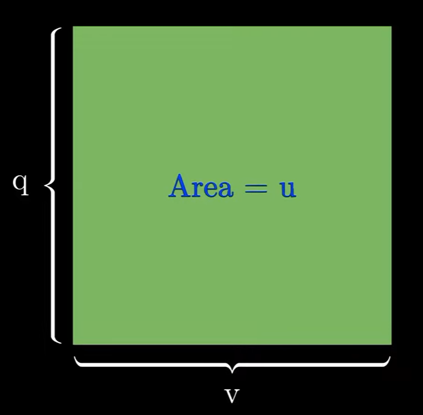
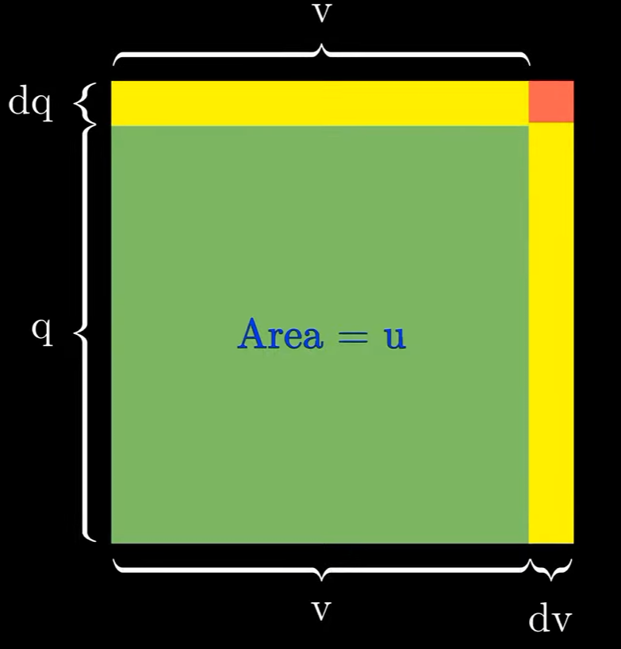

<div align='center'>
    <h1> Quotient Rule </h1>
</div>

When a function is formed by dividing one function by another, the derivative cannot generally be found by differentiating the numerator and denominator independently .The **quotient rule** provides a method for differentiating a quotient of two differentiable functions. The quotient rule is closely related to the **product rule**, which is used when two functions are multiplied together

```math id="q8v2mx"
(fg)'=f'g+fg'
```

While the product rule accounts for the change in each function when they are multiplied, the quotient rule accounts for the change in each function when one is divided by the other. For two functions \(u(x)\) and \(v(x)\), where \(v(x)\neq0\), the quotient rule is

```math id="mq3hbv"
\boxed{
\left(\frac{u}{v}\right)'
=
\frac{u'v-v'u}{v^2}
}
```

For example, consider

```math id="2o8xlq"
f(x)=\frac{x^2}{x+1}
```

Let

```math
\begin{aligned}
u(x) &= x^2 \\
v(x) &= x+1 \\
\end{aligned}
```

Therefore

```math
\begin{aligned}
u'(x) &= 2x \\
v'(x) &= 1 \\
\end{aligned}
```

Applying the quotient rule gives

```math
f'(x)
=
\frac{(x+1)(2x)-x^2(1)}{(x+1)^2}
```

Simplifying gives

```math
\boxed{
f'(x)=\frac{x^2+2x}{(x+1)^2}
}
```

<div align='center'>
    <h1> Algebraic Proof </h1>
</div>

We begin this proof by rewriting the division into powers and use the product rule.

```math
\frac{d}{dx} \frac{f(x)}{g(x)} = \frac{d}{dx} f(x) \cdot g(x)^{-1}
```

This leads us into using the product rule.

```math
\frac{d}{dx} f(x) \cdot g(x)^{-1} =  f(x) \cdot ( g(x) ^{-1})' + g(x)^{-1} \cdot f'(x)
```

Now, we need to perform the derivative of $g(x)^{-1}$ from the equation.

```math
\frac{d}{dx} f(x) \cdot g(x)^{-1} =  f(x) \cdot \boxed{(g(x) ^{-1})'} + g(x)^{-1} \cdot f'(x)
```

The derivative of $g(x)^{-1}$ requires the chain rule. 

```math
\begin{aligned}
u &= g(x)   \\
y &= u^{-1} \\
\end{aligned}
```

Therefore,

```math
\begin{aligned}
\frac{du}{dx} &= g'(x) \\
\frac{dy}{du} &= -u^{-2}
\end{aligned}
```

Finally giving us,

```math
\begin{aligned}
\frac{dy}{dx} &= \frac{dy}{du} \cdot \frac{du}{dx} \\
              &= -u^{-2} \cdot g'(x) \\
              &=  - g(x)^{-2} \cdot g'(x) \\
\end{aligned}
```

Substituting this into the previous equations,

```math
\begin{aligned}
\frac{d}{dx} f(x) \cdot g(x)^{-1} 
&= f(x) \cdot \left( - g(x)^{-2} \cdot g'(x) \right) + g(x)^{-1} \cdot f'(x) \\
&= \frac{-f(x) \cdot g'(x)}{g(x)^2} + g(x)^{-1} \cdot f'(x) \\
&= \frac{-f(x) \cdot g'(x)}{g(x)^2} + \frac{f'(x)}{g(x)} \\
&= \frac{-f(x) \cdot g'(x)}{g(x)^2} + \frac{f'(x)}{g(x)} \cdot \frac{g(x)}{g(x)} \\
&= \frac{-f(x) \cdot g'(x)}{g(x)^2} + \frac{f'(x) \cdot g(x)}{g(x)^2} \\
&= \boxed{\frac{f'(x) \cdot g(x) - f(x) \cdot g'(x)}{g(x)^2}}
\end{aligned}
```

<div align='center'>
    <h1> Geometric Proof </h1>
</div>

```math
\frac{d}{dx} \left( \frac{u}{v} \right) = \frac{uv' - uv'}{v^2}
```

We begin creating a substitution **to turn a problem you don't have a rule for into one you do**. Here, we want to differentiate a quotient $\frac{u}{v}$. So far we only have a rule for differentiating a product, not a quotient. There is no direct tool for "quotient" yet. So, instead of attacking $\frac{u}{v}$ head-on, we give it a name,

```math
\frac{u}{v} = q
```

This is just a label, $q$ is the quotient. The quotient is the result you get when you divide one quantity by another. We now rearrange this to become,

```math
u = qv
```

This now seems familiar. We can create a rectangle where the area is $vq$.

<div align='center'>
    
</div>

The change is area ($u$) is equal to,

```math
du = dq \cdot v + dv \cdot q + dv \cdot dq
```

Here, we illustrate why we remove $dv \cdot dq $

```math
\begin{aligned}
\Delta u &= v\,\Delta q + q\,\Delta v + \Delta v\,\Delta q \\
\frac{\Delta u}{\Delta x} &= v\cdot\frac{\Delta q}{\Delta x} + q\cdot\frac{\Delta v}{\Delta x} + \Delta v\cdot\frac{\Delta q}{\Delta x} \\
\Delta v &= v(x+\Delta x) - v(x) \\
\lim_{\Delta x \to 0} \Delta v &= v(x) - v(x) = 0 \\
\lim_{\Delta x \to 0}\left(\Delta v \cdot \frac{\Delta q}{\Delta x}\right) &= \left(\lim_{\Delta x \to 0}\Delta v\right)\left(\lim_{\Delta x \to 0}\frac{\Delta q}{\Delta x}\right) = 0 \cdot \frac{dq}{dx} = 0 \\
\lim_{\Delta x \to 0}\frac{\Delta u}{\Delta x} &= v\cdot\frac{dq}{dx} + q\cdot\frac{dv}{dx} + 0 \\
\frac{du}{dx} &= v\frac{dq}{dx} + q\frac{dv}{dx} \\
\end{aligned}
```

<div align='center'>
    
</div>

We proceed and define the change in area $du$ as,

```math
\begin{aligned}
du &= dq \cdot v + dv \cdot q \\
du - dv \cdot q &= v \cdot dq \\
v \cdot dq &= du - dv \cdot q \\
v \cdot dq &= du - dv \cdot \frac{u}{v} \qquad \text{Replace with} \frac{u}{v} = q \\
v \cdot dq &= du \cdot \frac{v}{v} - dv \cdot \frac{u}{v} \\
v \cdot dq &= \frac{v \cdot du - u \cdot dv}{v} \\
dq &= \frac{v \cdot du - u \cdot dv}{v^2} \\
\end{aligned}
```

$du$ and $dv$ aren't independent symbols. By definition of a differential,

```math
du = \frac{du}{dx} \cdot dx \qquad \text{and} \qquad dv = \frac{dv}{dx} \cdot dx
```

Substitute this into $du$ and $dv$,

```math
\begin{aligned}
dq &= \frac{v \cdot \frac{du}{dx} dx - u \cdot \frac{dv}{dx} dx}{v^2} \\
dq &= \frac{\left( v \cdot \frac{du}{dx} - u \cdot \frac{dv}{dx} \right) dx}{v^2}\\
\end{aligned}
```

Now divide both sides by $dx$.

```math
\begin{aligned}
\frac{dq}{dx} &= \frac{v \cdot \frac{du}{dx} - u \cdot \frac{dv}{dx}}{v^2}\\
\frac{d\left(\frac{u}{v} \right)}{dx} &= \frac{v \cdot \frac{du}{dx} - u \cdot \frac{dv}{dx}}{v^2}\\
\frac{d\left(\frac{u}{v} \right)}{dx} &= \boxed{\frac{v \cdot u' - u \cdot v'}{v^2}\\}
\end{aligned}
```