<div align='center'>
    <h1> Derivative of Trigonometry Identities </h1>
</div>

We can begin by first graphing

```math
y = \sin(\theta)
```

Firstly, we need to identify the **change of independent variable**. The independent variable is now **the angle, in radians**.

<div align='center'>
    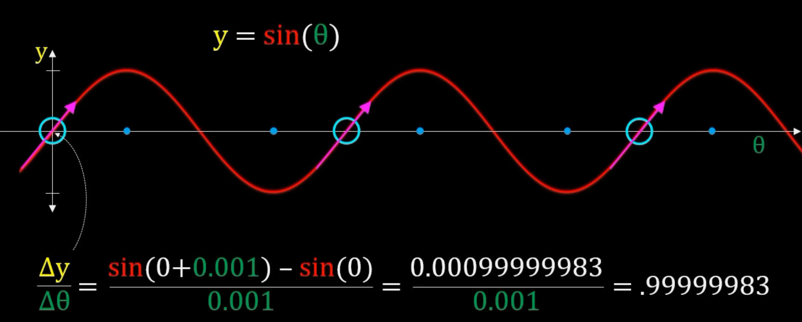
</div>

So, we can plot $\sin(\theta)$ and identify the easy to identify derivative points. These are points where the slope is,

- $0$
- $1$
- $-1$

These are marked by the blue points.

<div align='center'>
    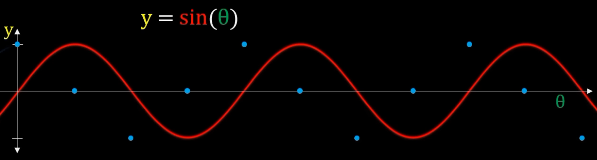
</div>

We could plot a few more points, but we will jump straight to the answer and state that,

```math
\begin{aligned}
y &= \sin(\theta) \\
\frac{dy}{dx} &= \cos(\theta)
\end{aligned}
```

<div align='center'>
    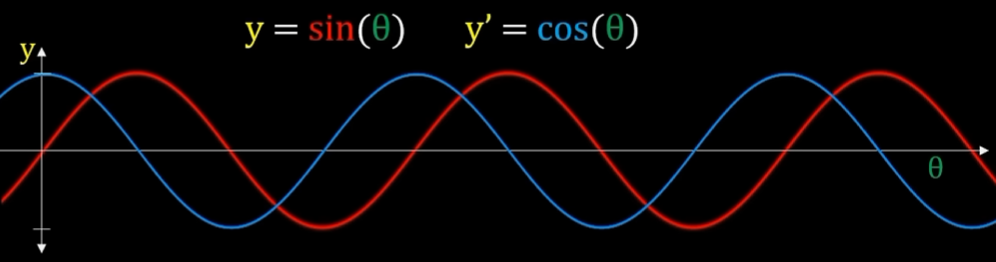
</div>

We can prove this rigorously by first defining a unit circle and focus on the first quadrant.

<div align='center'>
    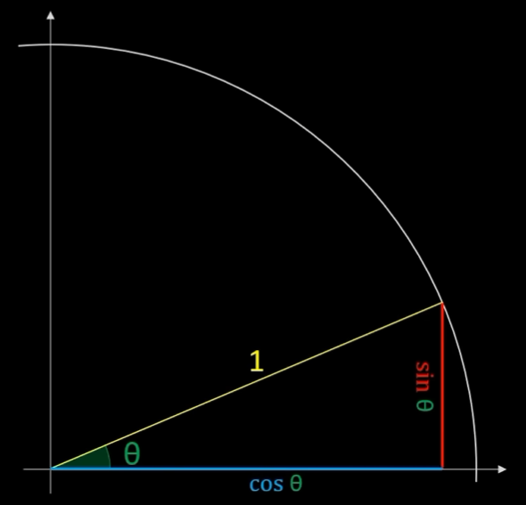
</div>

It is the vertical red length that we're interested in. As $\theta$ changes ever so slightly by $d\theta$, what is the change to the red length $d(\sin(\theta))$ That is, we want to calculate

```math
\frac{d(\sin(\theta))}{d\theta}
```

We can first begin by extending the diagram and include a new purple line. The length is $\theta$ because the angle is in radians which represents the number of radii length.

<div align='center'>
    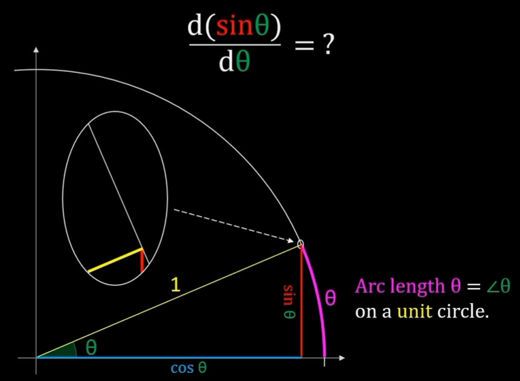
</div>

As we zoom in, the point on the circles circumfrance is nearly a straight line as the focus of attention gets smaller and smaller. The derivative of $\sin(\theta)$ is how much the vertical distance changes as $\theta$ changes by the tiny differential $\theta$, $d(\theta)$. Because pink $\theta$ and green $\theta$ have the same measurement, we can make the $d(\theta)$ green to match the formula.

<div align='center'>
    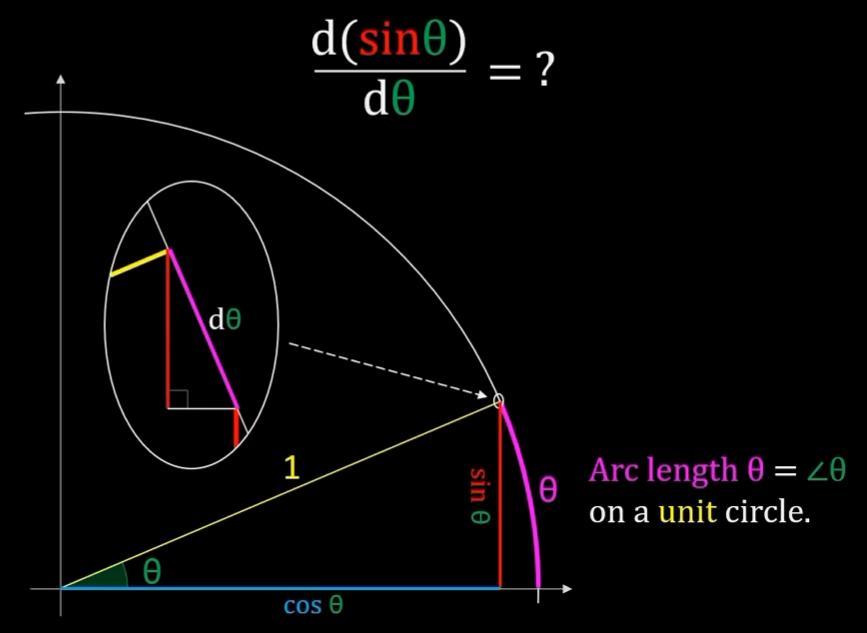
</div>

To find the rate of change, we extend $d(\theta)$ and extend our $d(\sin(\theta))$. This is enough information to create our ratio,

```math
\frac{d(\sin(\theta))}{d\theta}
```

<div align='center'>
    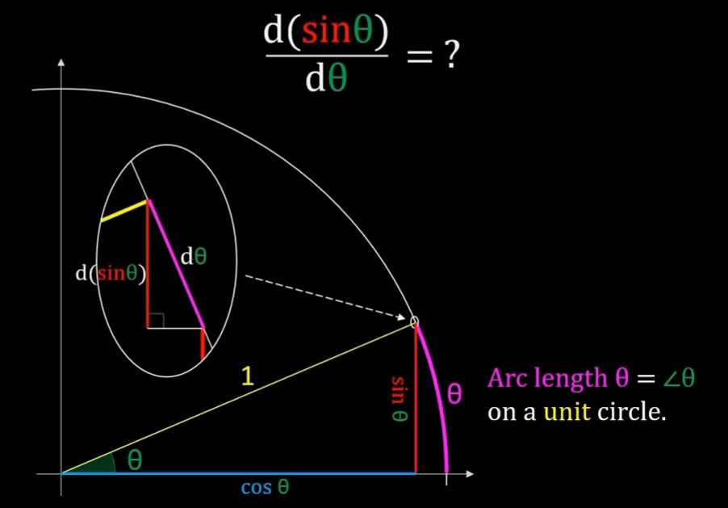
</div>

Without going into the proof, we can extend $\theta$ into our right angled triangle because they're congruent. This allows us to finally our relationship,

```math
\frac{d(\sin(\theta))}{d\theta} = \frac{\text{adj}}{\text{hyp}}
```

Therefore,

```math
\frac{d(\sin(\theta))}{d\theta} = \frac{\text{adj}}{\text{hyp}} = \cos(\theta)
```

<div align='center'>
    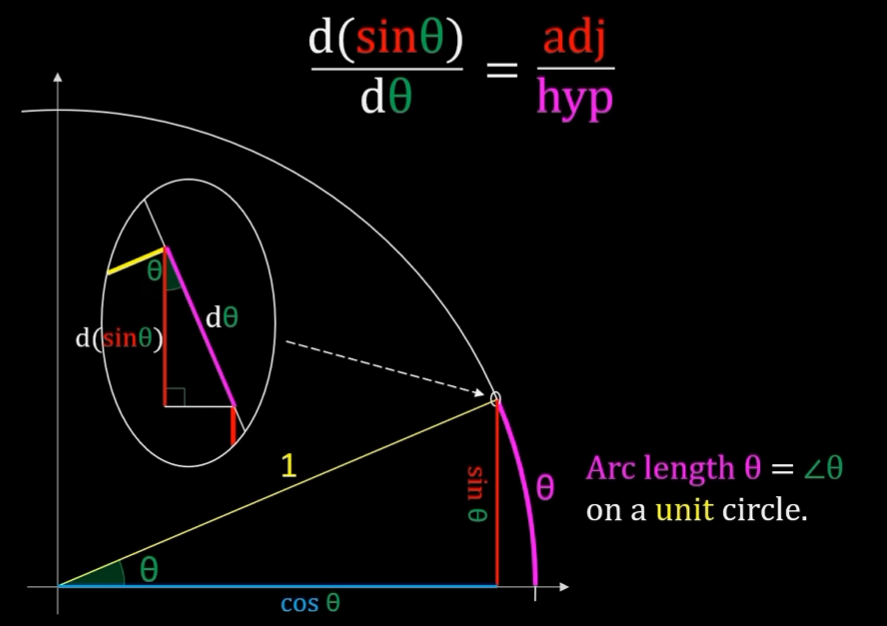
</div>

The previous geometric angle $\theta$ can be shown in 8 steps.

<div align='center'>
    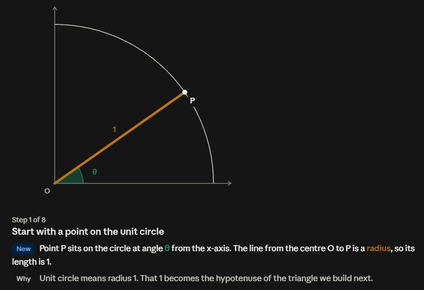
</div>

<div align='center'>
    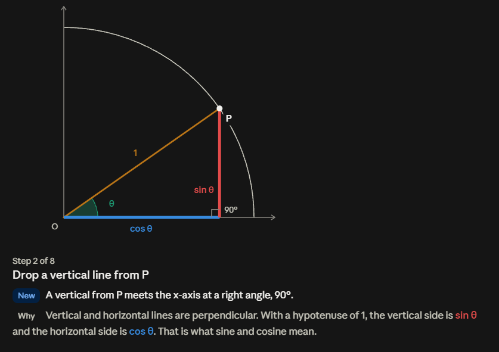
</div>

<div align='center'>
    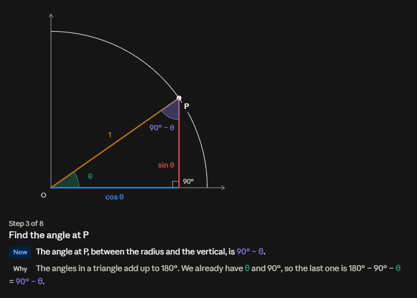
</div>

<div align='center'>
    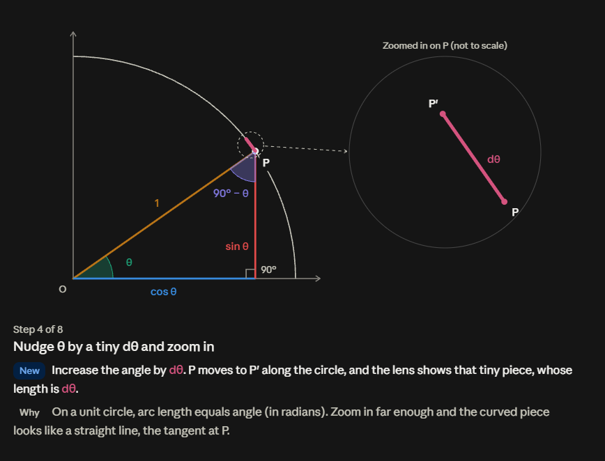
</div>

<div align='center'>
    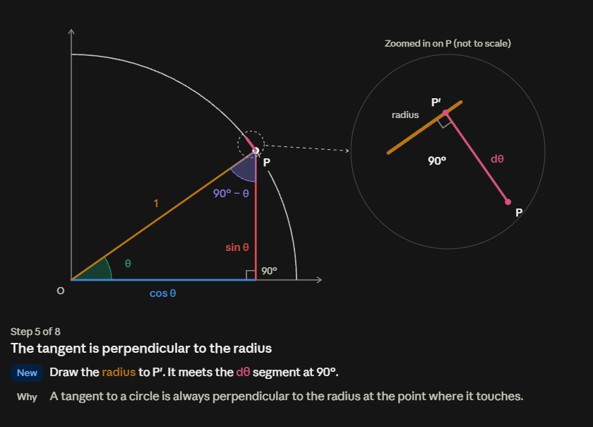
</div>

A real $d\theta$ is vanishingly small and the tiny differences between $\theta$ and $d\theta$ shrink to nothing as $d\theta \rightarrow 0$. This is why "same angles as before" is exact in the limit.

Steps 3 and 7 also show why the small triangle is a copy of the big one. Both have angles $\theta$, $90^\circ$ and $90^\circ - \theta$, but the small one is turned by $90^\circ$ and shrunk. That's why the ratios match and $\cos(\theta)$ is shown.

<div align='center'>
    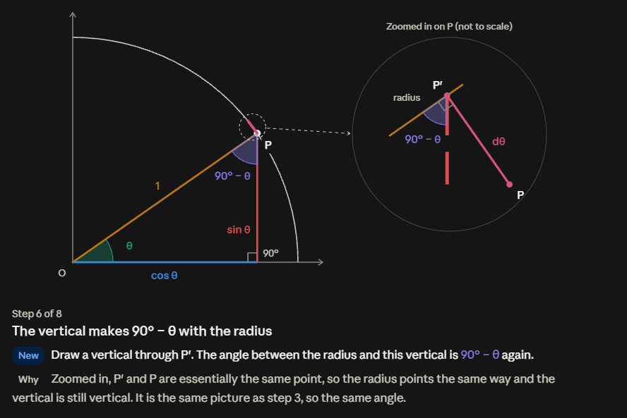
</div>

<div align='center'>
    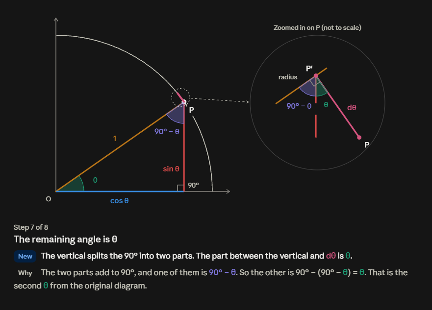
</div>

<div align='center'>
    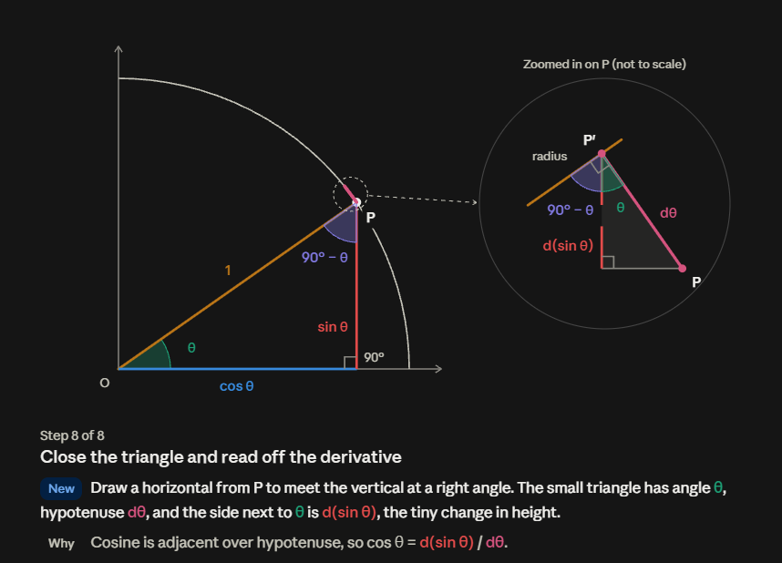
</div>

We can begin to visualize this behaviour by constructing a standard relationship.

<div align='center'>
    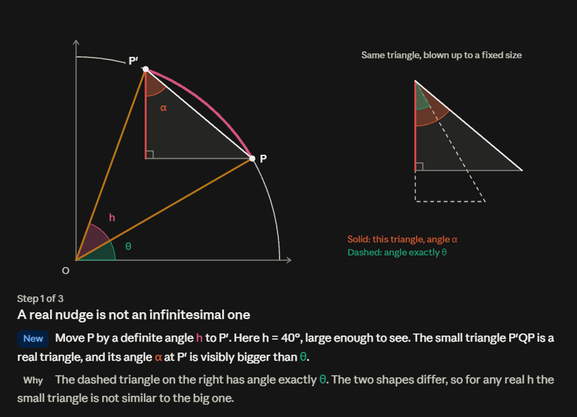
</div>

<div align='center'>
    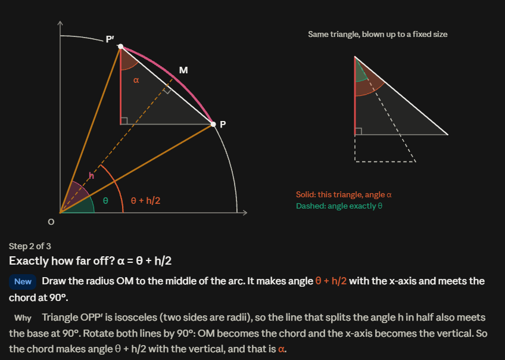
</div>

<div align='center'>
    
</div>

An important conceptual understanding here is that $OM$ is perpendicular to $P'P$. This means that when we rotate $OM$ by $90^\circ$, we create a new line that is parallel to $OM$. Now because both lines are parallel and have a vertical line, their angles must be the same and thus,

```math
\alpha = \theta + \frac{h}{2}
```

<div align='center'>
    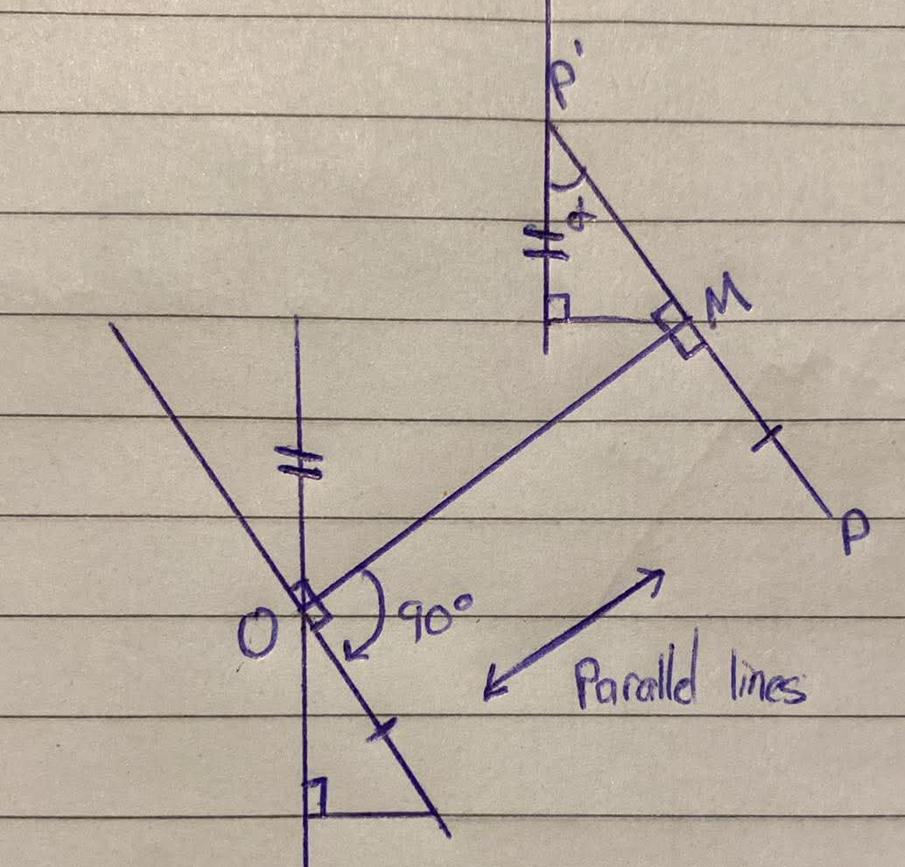
</div>

Finally, we shrink $h$.

<div align='center'>
    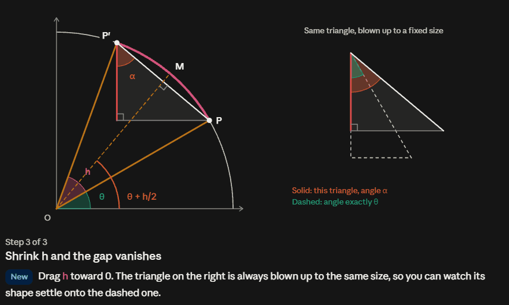
</div>

```math
\begin{aligned}
\frac{d}{d\theta}\sin\theta
&= \lim_{h\to 0}\frac{\sin(\theta+h)-\sin\theta}{h} \\[4pt]
&= \lim_{h\to 0}\ \cos\!\left(\theta+\frac{h}{2}\right)\cdot\frac{\sin(h/2)}{h/2} \\[4pt]
&= \cos\theta\cdot 1 \\[4pt]
&= \cos\theta
\end{aligned}
```

Now proceeding from the algebraic proof approach, we can take a more intuitive visual approach. We can observe than $\sin(\theta)$ is $\frac{\pi}{2}$ ahead of $\cos(\theta)$, easiest observed by comparing peak to peak.

- **Red** = $\sin(\theta)$
- **Blue** = $\cos(\theta)$

```math
\frac{dy}{dx} \sin (\theta) = \cos (\theta)
```

<div align='center'>
    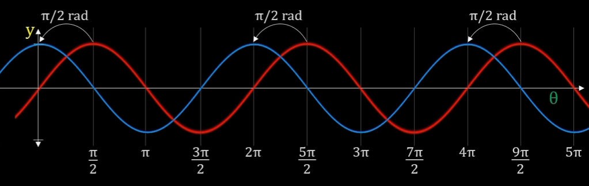
</div>

Because the derivative of $\sin(\theta)$ is out of phase by $\frac{\pi}{2}$, does it make sense that the derivative of $\cos(\theta)$ would be out of phase to it?

<div align='center'>
    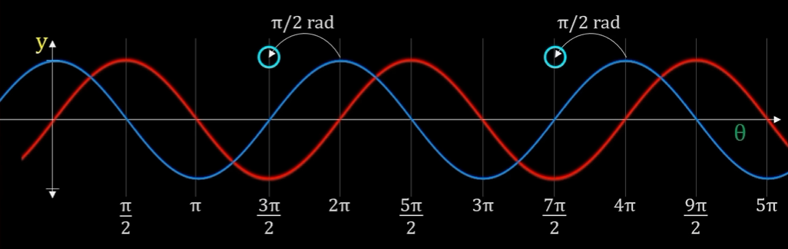
</div>

Yes! However, we do not have a function for this immediately. We can flip the $\sin(\theta)$ curve. Therefore,

```math
\frac{dy}{dx} \cos (\theta) = - \sin (\theta)
```

<div align='center'>
    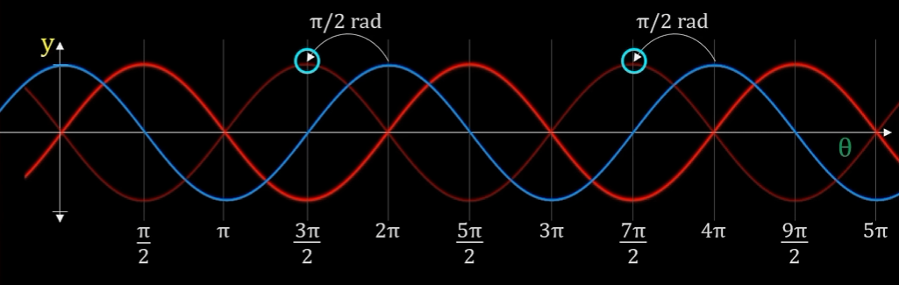
</div>

Finally we can observe,

```math
\frac{dy}{dx} -\sin (\theta) = \cos (\theta)
```

 <div align='center'>
    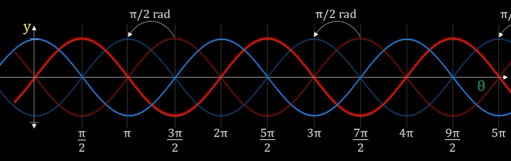
</div>

Finally, we wrap it back for

```math
\frac{dy}{dx} - \cos (\theta) = \sin (\theta)
```

This concludes all visible relationships.

```math
\begin{aligned}
\frac{dy}{dx} \sin (\theta) &= \cos (\theta)    \\
\frac{dy}{dx} \cos (\theta) &= - \sin(\theta)   \\
\frac{dy}{dx} - \sin (\theta) &= - \cos(\theta) \\
\frac{dy}{dx} - \cos(\theta) &= \sin(\theta)    \\
\end{aligned}
```

This can be remembered by,

1. The derivative always flips, i.e. $\sin \rightarrow \cos$ and $\cos \rightarrow \sin$

2. Only **keep** the sign ($-$ or $+$) when changing from $\sin \rightarrow \cos$

3. Only **reverse** the sign ($-$ or $+$) when changing from $\cos \rightarrow \sin$

<div align='center'>
    <h1> Extended using Quotient Rule </h1>
</div>

We can use the quotient rule to extend to additional trigonometry identities,

```math
\begin{aligned}
\frac{\mathrm{d}(\tan\theta)}{\mathrm{d}\theta}
\quad
\tan\theta=\frac{\sin\theta}{\cos\theta}
&=
\frac{\cos\theta\cdot\cos\theta-\sin\theta\cdot(-\sin\theta)}{\cos^{2}\theta}
=
\frac{1}{\cos^{2}\theta}
=
\sec^{2}\theta
\\
\frac{\mathrm{d}(\cot\theta)}{\mathrm{d}\theta}
\quad
\cot\theta=\frac{\cos\theta}{\sin\theta}
&=
\frac{\sin\theta\cdot(-\sin\theta)-\cos\theta\cdot\cos\theta}{\sin^{2}\theta}
=
\frac{-1}{\sin^{2}\theta}
=
-\csc^{2}\theta
\\
\frac{\mathrm{d}(\sec\theta)}{\mathrm{d}\theta}
\quad
\sec\theta=\frac{1}{\cos\theta}
&=
\frac{\cos\theta\cdot(0)-1\cdot(-\sin\theta)}{\cos^{2}\theta}
=
\frac{\sin\theta}{\cos^{2}\theta}
=
\frac{\sin\theta}{\cos\theta}\cdot\frac{1}{\cos\theta}
=
\tan\theta\cdot\sec\theta
\\
\frac{\mathrm{d}(\csc\theta)}{\mathrm{d}\theta}
\quad
\csc\theta=\frac{1}{\sin\theta}
&=
\frac{\sin\theta\cdot(0)-1\cdot(\cos\theta)}{\sin^{2}\theta}
=
\frac{-\cos\theta}{\sin^{2}\theta}
=
\frac{\cos\theta}{\sin\theta}\cdot\frac{-1}{\sin\theta}
=
-\cot\theta\cdot\csc\theta
\end{aligned}
```


Finally, giving us simplified identities.

```math
\begin{aligned}
\frac{\mathrm{d}(\sin\theta)}{\mathrm{d}\theta}&=\cos\theta \\

\frac{\mathrm{d}(\cos\theta)}{\mathrm{d}\theta}&=-\sin\theta \\

\frac{\mathrm{d}(\tan\theta)}{\mathrm{d}\theta}&=\sec^{2}\theta \\ 

\frac{\mathrm{d}(\cot\theta)}{\mathrm{d}\theta}&=-\csc^{2}\theta \\

\frac{\mathrm{d}(\sec\theta)}{\mathrm{d}\theta}&=\tan\theta\cdot\sec\theta \\

\frac{\mathrm{d}(\csc\theta)}{\mathrm{d}\theta}&=-\cot\theta\cdot\csc\theta \\
\end{aligned}
```