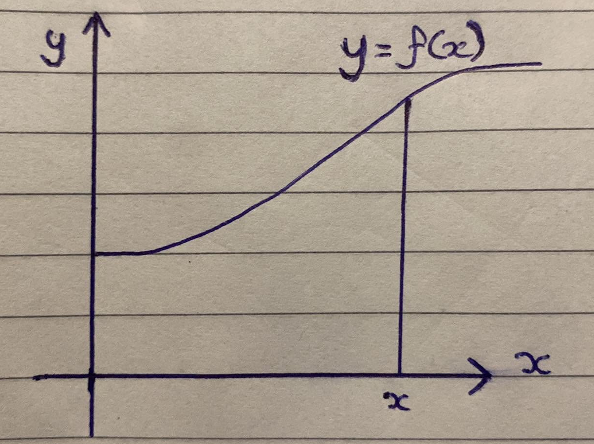
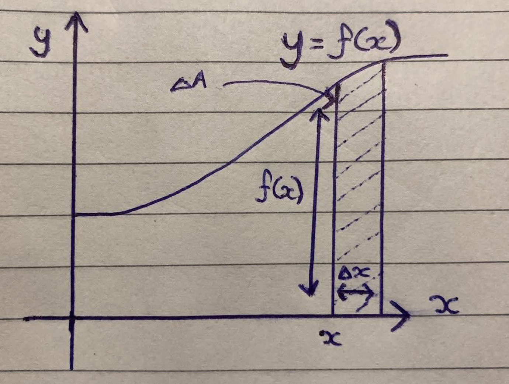
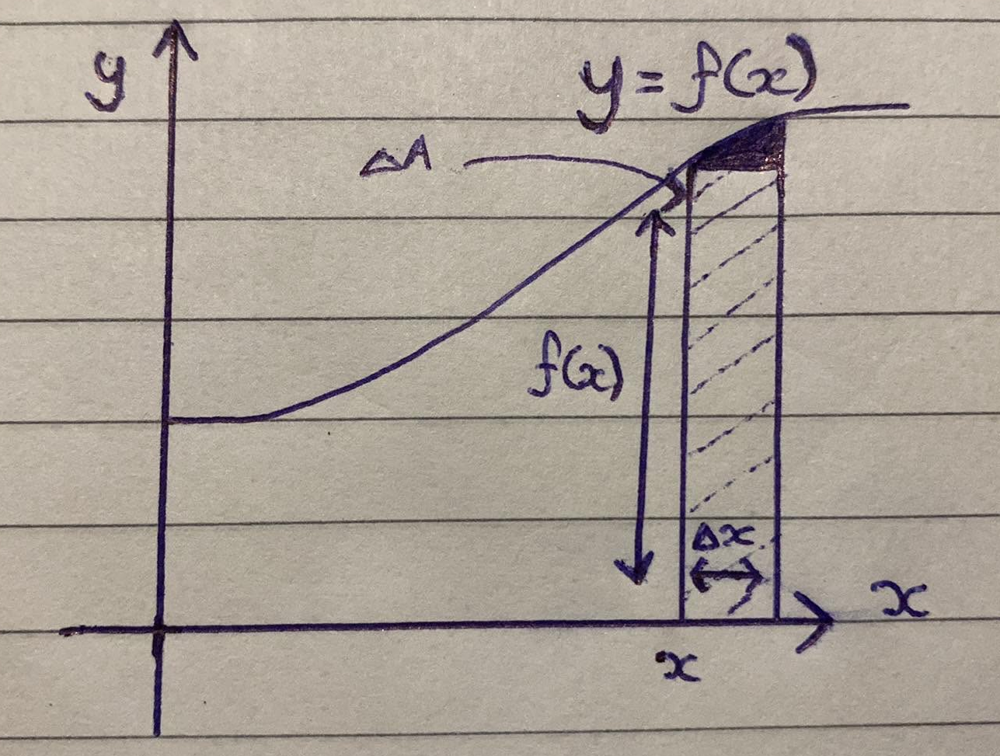
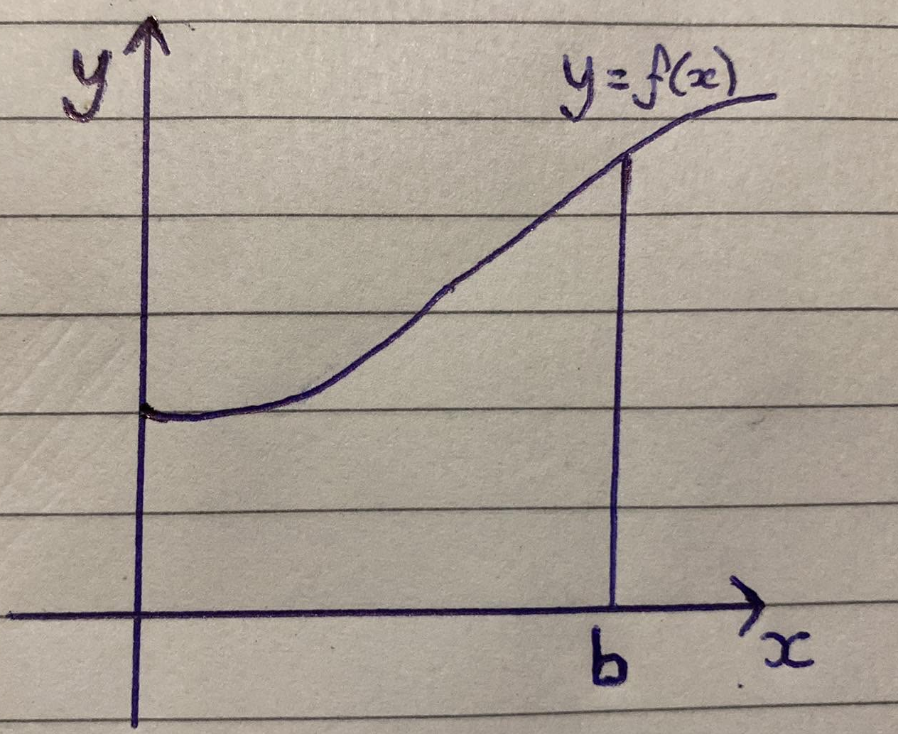
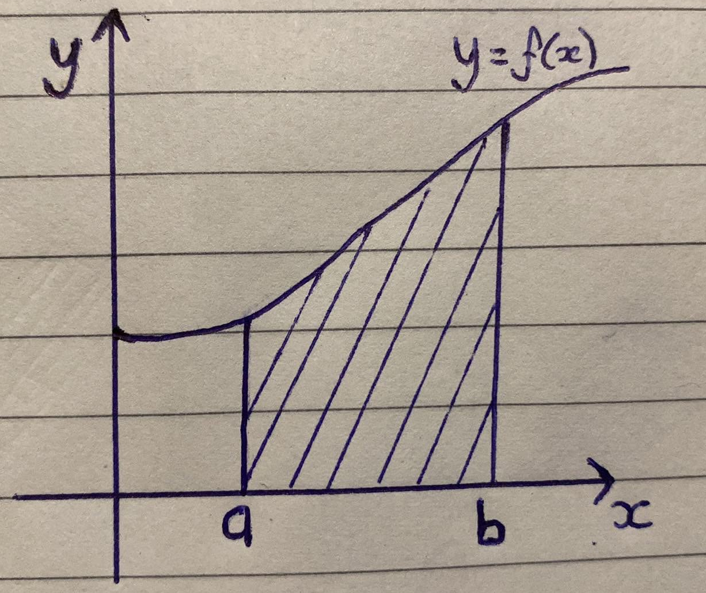
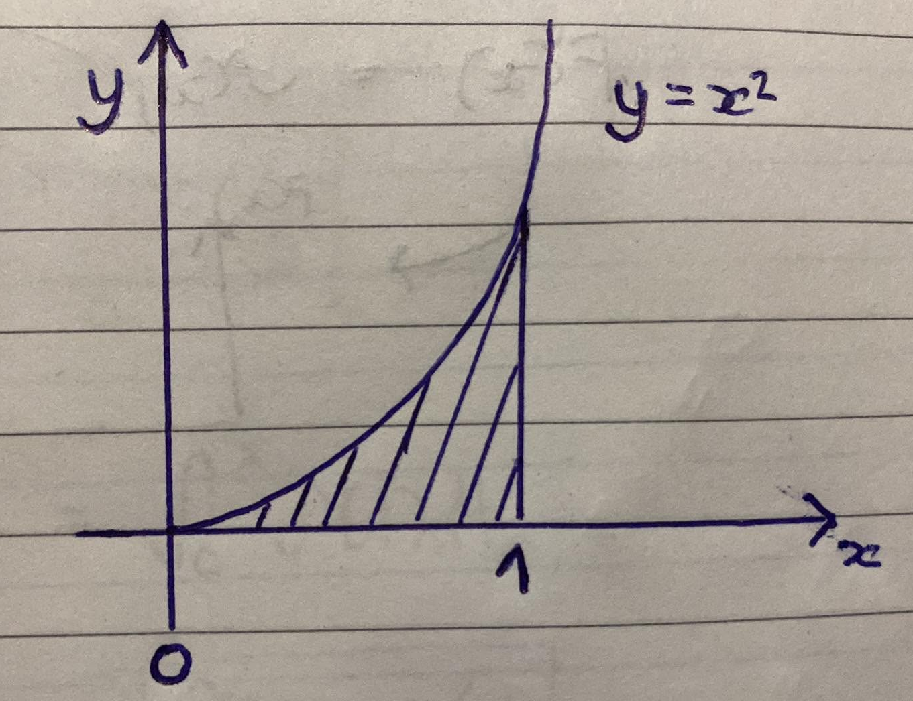

<div align='center'>
    <h1> Fundamental Theorem of Calculus Step by Step </h1>
</div>
 
Before this proof begins, the functions used throughout this proof must be expressed. Where,

- $f(x)$ is the derivative of $F(x)$, where $f(x) = \frac{dF}{dx}$
- $F(x)$ is the antiderivative of $f(x)$

```math
F(x)
\;\xrightleftharpoons[\text{anti-differentiate}]{\text{differentiate}}\;
F'(x)=f(x)
```

Integration is generally introduced as the process of summation of tiny parts. Here, the concept of an integral is defined in terms of the sums of lots of rectangular areas under a curve. To calculate an integral you need to find the limit of a sum. This is a very cumbersome and impractical process. What this approach is defining is the Fundamental Theorem of Calculus where we find the integrals, not by finding the limit of a sum, but instead using anti-derivatives.

Suppose we have a function,

```math
F(x) = 3x^2 + 7x - 2
```

It therefore follows,

```math
F'(x) = f(x) = 6x + 7
```

We are provided $f(x)$ and $F(x)$ is unknown in these situations. If we are to find the antiderivative of $f(x)$, it would be,

```math
F(x) + C
```

This holds because differentiating $F(x)$ removes the constant $-2$. Therefore, any constant $C$ in the equation

```math
F(x) = 3x^2 + 7x + C
```

all differentiate to $f(x)$.

We are going to consider functions which lie entirely above the $x$ axis and also to the right of the $y$ axis. Now, we need to ask ourselves, what is the area under the graph of $y = f(x)$?

<div align='center'>
    
</div>

We define $A$ as the area under the curve $y = f(x)$, when given $x$, will output the area under the curve upto $x$. This is denoted

```math
A = A(x)
```

This shows the dependence of the area upon the value that we choose for $x$. Hence, larger $x$, larger area and smaller $x$, smaller area.


Their are multiple attributes that needed to be understood,

1. **$f(x)$** - Represents the height at point $x$.
2. **$\Delta x$** - Represents a small distance from $x$.
3. **$\Delta A$** - Represents a small change in area, which has been added from $\Delta x$, shown by the shaded area.

<div align='center'>
    
</div>

We will now attempt to write an expression for $\Delta A$ in an attempt to calculate it. **We cannot calculate it exactly**. The height is calculated using $f(x)$ and the width from $\Delta x$. If we treat this as a rectangle, it can be calculated as $f(x) \cdot \Delta x$. This calculation will ignore the area highlighted above rectangle and is therefore, not exact. Because of this, the equality symbol $=$ cannot be used.

<div align='center'>
    
</div>

Calculating $\Delta A$ will give us,

```math
\Delta A \approx f(x) \Delta x
```

This is only an approximation, denoted using $\approx$. Now, divide both sides by $\Delta x$.

```math
\frac{\Delta A}{\Delta x} \approx f(x)
```

To make this more accurate we need to make $\Delta x$ smaller, this will decrease the width of the rectangles and therefore decrease the amount of area that is missed when using rectangles. Hence, what we want to do is make $\Delta x$ smaller and smaller. This is done using limits.

```math
\lim_{\Delta x \to 0} \frac{\Delta A}{\Delta x}
```

When this is done, the approximation becomes exact because we're calculating a limit value. This limit value represents what the function converges to as $\Delta x$ gets closer and closer to $0$.

```math
\lim_{\Delta x \to 0} \frac{\Delta A}{\Delta x} = \lim_{\Delta x \to 0} f(x)
```

Since $f(x)$ does not depend on $\Delta x$, it is treated as a constant with respect to the limit.

```math
\lim_{\Delta x \to 0} f(x) = f(x)
```

When we calculate a limit, we can change our approximation $\approx$ to an exact limit value calculation. This now allows us to use the equality symbol $=$ instead of our approximation symbol $\approx$. What we observe here is the definition of derivatives. That is,

```math
\lim_{\Delta x \to 0} \frac{\Delta A}{\Delta x} = \frac{dA}{dx} = f(x)
```

**This is a very important observation**. This tells us 

1. The rate of which the area changes with respect to $x$ is equal to value at that point $x$ from $f(x)$.
2. The function $f$ is the derivative of the function $A$.
3. $A$ is an antiderivative of $f$.

In other words,

```math
\boxed{A(x) = F(x) + C}
```

This is saying, if we have a function $f(x)$ and we want to find the area under the curve upto $x$, we can complete this calculation by finding an antiderivative of $f(x)$ and providing the input $x$ to $F(x)$. However, we have the problem of having an unknown $C$. We can solve for this by trying to find the area under the curve when $x=0$. This would solve for $C$, because the area would be $0$.

When $x=0$, $A=0$ because there exists no area.

```math
\begin{aligned}
A(x) &= F(x) + C \\
0 &= F(0) + C \\
C &= -F(0)
\end{aligned}
```

This gives us,

```math
A(x) = F(x) - F(0)
```

We can express the area from $0$ to $b$.

```math
A(b) = F(b) - F(0)
```

<div align='center'>
    
</div>

We can now do two things.

1. Add another variable $a$, such that $a < b$
2. We can also calculate the area from $0$ to $a$ using $F(a) - F(0)$

We now have two expressions.

1. The area upto $b$
2. The area upto $a$

We can now calculate the area from $a$ to $b$ by first calculating the area to $b$ and subtracting the area to $a$. Therefore the area under $y = f(x)$ from $x=a$ to $x=b$ is,

```math
F(b) - F(0)- F(a) + F(0) = F(b) - F(a) 
```

This is exactly the definition of integration, finding the area from $a$ to $b$. This is expressed using the notation

```math
\int^b_a f(x) \ dx = F(b) - F(a)
```

Where $F$ is any antiderivative of $f$. This explains why precisely we can use any family of an antiderivative because the constant $F(0)$ is removed.

<div align='center'>
    
</div>

Previously, the area under a curve was expressed as a summation given by

```math
A = \sum_{i=1}^{n} f(x_i^*)\,\Delta x = \int^b_a f(x) \ dx
```

This Riemann sum is a definition of the definite integral. If we wanted to calculate it using this method, we would have go to through the process of finding the limit of a sum. The process of finding the limit of a sum is cumbersome and impractical. What we have learnt now is that **we do not need to find the limit of the sum to find the area, we can use these antiderivatives**. We can pull all of this together to finally create,

```math
\int^b_a f(x) \ dx = F(b) - F(a)
```

This means we can define the definite integral from $a$ to $b$ as evaluating the expression $F(b) - F(a)$ where $F$ is an antiderivative of $f$. This solutions only works if the hypotheses conditions are true, which is that the function $f$ is continuous between $a$ and $b$.

As a quick example, we can graph $y = x^2$ and find the area between $a = 0$ and $b = 1$.

```math
\begin{aligned}
f(x) &= x^2 \\
F(x) &= \frac{x^3}{3} + C \\
F(1) &= \frac{1}{3} + C \\
F(0) &= \frac{0}{3} + C = C \\
\end{aligned}
```

Therefore,

```math
F(1) - F(0) = \frac{1}{3} + C - C = \frac{1}{3}
```

The formal notation for this is,

```math
\int^1_0 x^2 \ dx = \left[ \frac{x^3}{3} \right]^1_0 = \frac{1}{3} - \frac{0}{3} = \frac{1}{3}
```

<div align='center'>
    
</div>