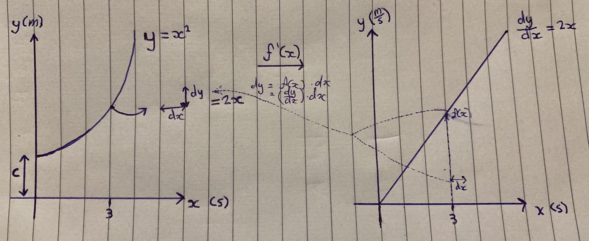

<div align='center'>
    <h1> Definite and Indefinite Integrals </h1>
</div>

The notation for integration consists of two essential components, the integrand $f(x)$ and the differential $dx$. Together, they specify both the quantity being integrated and the variable with respect to which the integration is performed. The expression $\int f(x)$ is incomplete because it does not identify the variable of integration, whereas $\int f(x)\,dx$ is well-defined.

For example,

- The expression $\int 2x$ is **not valid** because it does not specify the variable of integration.

- The **correct form** is $\int 2x\,dx$. The differential $dx$ indicates that the integration is performed with respect to the variable $x$. This distinction becomes particularly important when an expression contains multiple variables. For example,

```math
\int xy\,dx=\frac{x^2y}{2}+C,
```

treats $y$ as a constant, whereas

```math
\int xy\,dy=\frac{xy^2}{2}+C,
```

treats $x$ as a constant.

In a **definite integral**, the product $f(x)\,dx$ represents an infinitesimal contribution to an accumulated quantity, such as the area of a thin rectangle, and the integral sums these contributions over a specified interval. 

In an **indefinite integral**, however, **no summation is taking place**. Instead, $\int f(x)\,dx$ denotes the family of functions whose derivative is $f(x)$. Although these two concepts have **different interpretations, they share the notation** $f(x)\,dx$ because the differential identifies the variable of integration and preserves the close relationship between differentiation and integration established by the Fundamental Theorem of Calculus.

<div align='center'>
    <h1> Indefinite Integrals </h1>
</div>

An indefinite integral reverses differentiation by finding a **general antiderivative** of a function. Since differentiation removes constants, the result of an indefinite integral is not a single function but a family of functions that differ only by an arbitrary constant.

Given a function $f$, finding an indefinite integral means to find all functions that have the derivative $f$. Therefore, the goal is to find a function $F$ where

```math
\int f(x) \ dx = F(x) + C, \quad \text{where } F'(x) = f(x)
```

An indefinite integral evaluates to a **function family**, with no interval and no numerical accumulation involved. The two are connected through the Fundamental Theorem of Calculus, but they answer different questions. One asks, **how much**, the other asks **which function**. The arbitrary constant is essential to the indefinite integral precisely because there are no endpoints available to cancel it.

Although an indefinite integral does not itself compute an accumulated quantity, it **provides the function required to evaluate an indefinite integral**. Once an antiderivative $F(x)$ satisfying $F'(x) = f(x)$ has been found, the Fundamental Theorem of Calculus states that the accumulated quantity over an interval $[a, b]$ is obtained by evaluating the antiderivative at the endpoints.

```math
\int_a^b f(x) \ dx = F(b) - F(a)
```

Therefore, the indefinite integral **is not a process of finding an area**. Rather, it constructs the antiderivative that **later allows the definite integral to evaluate that area efficiently**.

A similar process of reversal can be,

```math
\begin{aligned}
y &= x^2 \\
\frac{dy}{dx} &= 2x \\
dy &= 2x \ dx
\end{aligned}
```

Now reversing this procedure,

```math
\begin{aligned}
\int dy &= \int 2x \ dx \\
\int 1 \ dy &= \int 2x \ dx \\ 
y &= x^2
\end{aligned}
```

### Case 1 - Integrating an Explicit Function

Consider the derivative function

```math
f(x) = 2x
```

##### Step 1 - Identify an antiderivative

Find a function whose derivative is $2x$. Since,

```math
\frac{d}{dx}(x^2) = 2x
```

one antiderivative is $x^2$.

##### Step 2 - Account for all antiderivatives

Differentiation eliminates constants because,

```math
\frac{d}{dx}(C) = 0
```

Therefore,

```math
\frac{d}{dx}(x^2 + C) = 2x
```

for every constant $C$. Hence,

```math
\int 2x \ dx = x^2 + C
```

This is the general antiderivative, since every member of the family has the same derivative $2x$. Here $2x$ is a bare height, and it is only the the product $2x \ dx$, a constructed quantity that is a valid integrand. Notice that this result is still a function, not an area. The indefinite integral has produced an antiderivative, but no interval has been specified, so no numerical accumulation has occurred. However, once an interval is introduced, this antiderivative becomes the tool used to evaluate the corresponding definite integral. For example,

```math
\int_a^b 2x \ dx = \left[ x^2 \right]_a^b = b^2 - a^2
```

The first step therefore constructs the function $x^2 + C$, whereas the second evaluates the change in the function over an interval. Although both use the notation $\int 2x \ dx$, the indefinite integral finds an antiderivative, while the definite integral computes an accumulated quantity.

### Case 2 - Integrating a Bare Differential

A differential such as $dy$ is not built the same way $2x \ dx$ is. It is not a height requiring multiplication by a width to become meaningful, it is, by definition an infinitesimal quantity. It is a small step in $y$ along the graph of $y$ itself, rather than a rectangle formed on some derivative graph.

It is formally correct to write,

```math
\int dy = \int 1 \ dy
```

Therefore,

```math
\begin{aligned}
\frac{d}{dy}(y + C) &= 1 \\
\int dy &= \int 1 \ dy = y + C \\
\int^{y2}_{y1} dy &= [y + C]^{y2}_{y1} = y2 + C - y1 - C = y2 - y1 = \Delta y
\end{aligned}
```

To show that $\int dy = 1 \ dy$, we prove $\frac{d}{dy}(y) = 1$ using the quotient difference.

Let $h(y) = y$. We define $h(y) = y$ because we want to find the derivative of the variable $y$ with respect to itself, the simplest possible case.

Now apply the definition

```math
\frac{d}{dy}(h(y)) = \lim_{\Delta y \to 0} \frac{h(y + \Delta y) - h(y)}{\Delta y}
```

Substitute $h(y) = y$

```math
\frac{d}{dy}(h(y)) = \lim_{\Delta y \to 0} \frac{y + \Delta y - y}{\Delta y} = \lim_{\Delta y \to 0}\frac{\Delta y}{\Delta y} = 1
```

Therefore $\frac{d}{dy}(y) = 1$, so

```math
\int dy = y + C
```

### Case 3 - Separate Differential Equations

Now begin with the derivative itself. Suppose

```math
\frac{dy}{dx} = 2x
```

This states that the unknown function $y$ has instantaneous rate of change $2x$.

##### Step 1 - Form the differential equation

Leibniz notation treats $\frac{dy}{dx}$ formally as a ratio of differentials, so multiplying both sides by $dx$ produces an equation between two differentials.

```math
dy = \frac{dy}{dx}dx = 2x \ dx
```

- $2x \ dx$ is a constructred quantity. $2x$ is the height of the derivative curve at $x$ and $dx$ is the width, so their product is the area of the rectangle on the derivatives graph.

- $dy$ is the corresponding infinitesimal quantity on the original graph, not a rectangle, but a direct rise in $y$.

##### Step 2 - Integrate both sides

Integrating both sides mean applying Case 2 on the left and Case 1 on the right. Two separate integrations, over two separate variables, but are set equal.

```math
\begin{aligned}
\int dy = \int 2x \ dx \\
y + C_1 = x^2 + C_2
\end{aligned}
```

Because $C_1$ and $C_2$ are both arbitrary, they combine into a single constant.

```math
y + x^2 + K
```

### Physical Interpretation

The relationship between graphs provide important information. Consider $x$ as time $t$ in seconds and $y$ as position or distance in metres. Then $\frac{dy}{dt} = 2t$ represents velocity in $\frac{m}{s}$ on the derivative graph.

- On the derivative graph, the height is $\frac{dy}{dt} = 2t$. The rectangles are formed with height $2t$ and width $dt$, so each rectangle has area $2t \ dt$ with units $\frac{m}{s}s= m$.

- Integrating $\int 2t \ dt$ sums these rectangles on the velocity graph.

- The result equals the total change in position $\Delta y$  on the original position graph.

<div align='center'>
    
</div>

In other words, the area under the velocity curve, the sum of $\frac{m}{s}s$ equals the net displacement on the position graph. The $dx$ (or $dt$) is the same horizontal increment on both graphs, but the integral connects the accumulated area on one graph to the net change in the vertical quantity on the other. 

<div align='center'>
    <h1> Definite Integrals </h1>
</div>

A definite integral computes the total accumulation of an infinitesimal quantity over a specified interval. The limits of integration determine where the accumulation begins and ends, so the result is a **single value** rather than a family of functions.

If $f(x)$ represents the value of a quantity at each point $x$, then

```math
\int^b_a f(x) \ dx
```
 
accumulates the infinitesimal quantities $f(x) \ dx$ from $x = a$ to $a = b$. When $f(x)$ is non-negative, this accumulation is the area under the curve between the graph and the $x$-axis. The Fundamental Theorem of Calculus provides an efficient method for evaluating a definite integral. If $F(x)$ is an antiderivative of $f(x)$, meaning,

```math
F'(x) = f(x)
```

then

```math
\int^b_a f(x) \ dx = F(b) - F(a)
```

Although a definite integral represents the accumulation of infinitely many infinitesimal quantities, it can be evaluated by finding an antiderivative and computing the change in that antiderivative between the limits of integration.